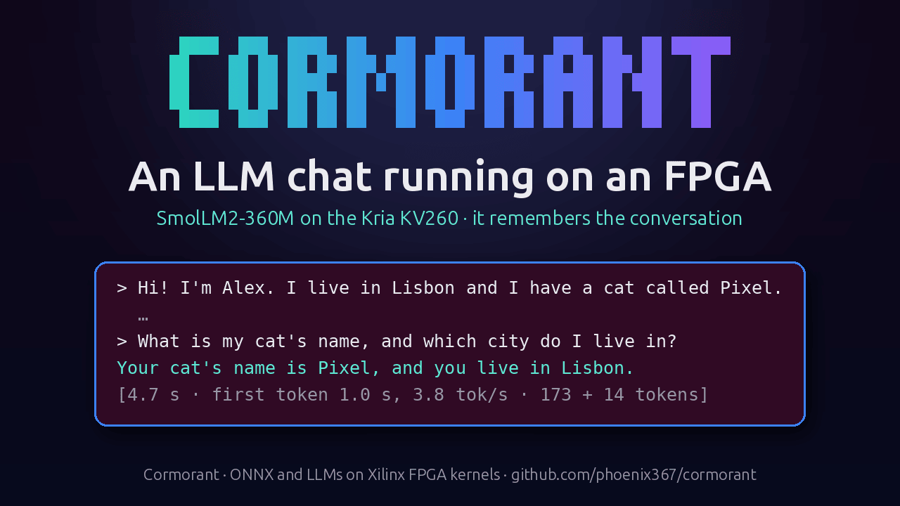
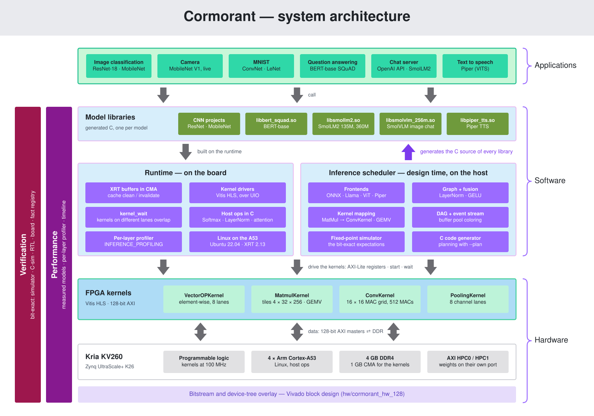

# Cormorant — FPGA Neural-Network Inference on the KV260

<p align="center">
  
</p>

Four kernels for the Xilinx Kria KV260 (Conv, VectorOP, MatMul and Pooling,
all in SystemVerilog) and a Python code generator that compiles
ONNX models — CNN classifiers, the YOLOv5n object detector, BERT-base,
Llama-family decoders, a ViT vision encoder and a VITS text-to-speech model —
into self-contained C projects that drive the
kernels from Linux on the board.  Everything runs in 16-bit fixed point
(`ap_fixed<16,8>`, or per-tensor power-of-two exponents), and the board's
outputs are checked bit for bit against the generator's fixed-point
simulation.  An OpenAI-compatible server on the board serves the chat,
image and speech models.

<p align="center">
  <a href="https://youtu.be/VVS7ExW0XYQ"></a><br/>
  <em>▶ <a href="https://youtu.be/VVS7ExW0XYQ">Watch the demo</a> (1 min): SmolLM2-360M chatting on the KV260, and remembering the conversation</em>
</p>

> **About this fork.**  This repository is an independent fork of Cormorant.
> It is not affiliated with, endorsed by or supported by any company,
> institution or funding programme.  The original Cormorant code was
> developed by GradeBuilder S.L.; its copyright notice is kept in
> [LICENSE](LICENSE) as the Apache License 2.0 requires.

---

## Results on the board

KV260, programmable logic at 250 MHz, 16-bit fixed point.  Measured 2026-10-08 on the
production bitstream `8599aa7a5f12`: the 250 MHz design of
[FMAX_250_PLAN](doc/plans/FMAX_250_PLAN.md) with VectorOPKernel's activation unit
([ACTIVATIONS_PLAN](doc/plans/ACTIVATIONS_PLAN.md)) and softmax unit
([SOFTMAX_PLAN](doc/plans/SOFTMAX_PLAN.md)), and its second read port on a PS port of its
own ([PS_PORTS_PLAN](doc/plans/PS_PORTS_PLAN.md)).  The chat-server Piper figures are from
2026-10-01, at 100 MHz.

| Model | Result | Source |
|---|---|---|
| ResNet-18, 224×224 | **20.2 ms (49.6 FPS)** per image | [FMAX_250_PLAN](doc/plans/FMAX_250_PLAN.md), [PS_PORTS_PLAN](doc/plans/PS_PORTS_PLAN.md) (20.5 ms with VectorOP's two reads on one PS port; 47.4 ms at 100 MHz, [CONV_RTL_PLAN](doc/plans/CONV_RTL_PLAN.md); 59.9 ms on the HLS ConvKernel, [RESNET18_15FPS_PLAN §3.3](doc/plans/RESNET18_15FPS_PLAN.md)) |
| MobileNet V1 / V2, 224×224 | 22.0 / 20.4 ms per image | [FMAX_250_PLAN](doc/plans/FMAX_250_PLAN.md) (41.2 / 38.1 ms at 100 MHz) |
| LightStereo-S stereo depth, 640×480 | **599 ms (1.67 FPS)** per pair, EPE 0.667 px on 42 Middlebury / ETH3D pairs (float 0.650 on the same input); 160 ms at 320×256; RealSense D435 pairs taken on the board: depth within 10 % of the camera's own on 98 % of the pixels (projector on) | [STEREO_PLAN](doc/plans/STEREO_PLAN.md), [demo/stereo_depth](demo/stereo_depth/README.md) |
| YOLOv5n object detection, 640×640 | **63.9 ms (15.6 FPS)** per image (the network on the FPGA; decode + NMS on the host), COCO128 mAP@0.5:0.95 0.343 (float 0.349) | [YOLO_PLAN](doc/plans/YOLO_PLAN.md), [demo/object_detection](demo/object_detection/README.md) |
| MNIST convnet / LeNet | 0.111 / 1.249 ms per image, 98.92 / 97.35 % top-1 (LeNet float 97.37 %) | [LENET_PLAN](doc/plans/LENET_PLAN.md), [demo/mnist](demo/mnist/README.md) |
| BERT-base SQuAD (bertsquad-12, 256 tokens) | **418 ms** per inference (p50 of 50), EM/F1 equal to float32 | [BERT_PLAN](doc/plans/BERT_PLAN.md) status, [PS_PORTS_PLAN](doc/plans/PS_PORTS_PLAN.md) (427 ms with both VectorOP reads on one PS port), [SOFTMAX_PLAN](doc/plans/SOFTMAX_PLAN.md) (525 ms with the softmax on the host), [ACTIVATIONS_PLAN](doc/plans/ACTIVATIONS_PLAN.md) (541 ms with the GELUs on the host too; 839 ms at 100 MHz, [FMAX_250_PLAN](doc/plans/FMAX_250_PLAN.md)) |
| SmolLM2-135M-Instruct | **18.3 tokens/s** decode, 16-token prefill 0.15 s, 256-token prefill 0.74 s | [CHAT_PLAN §19](doc/plans/CHAT_PLAN.md), [FMAX_250_PLAN](doc/plans/FMAX_250_PLAN.md) |
| SmolLM2-360M-Instruct | **7.3 tokens/s** decode, 16-token prefill 0.34 s, 256-token prefill 2.05 s, 740 MiB CMA | [CHAT_PLAN §20](doc/plans/CHAT_PLAN.md), [video](https://youtu.be/VVS7ExW0XYQ) (at 100 MHz) |
| SmolVLM-256M-Instruct (image chat) | **1.9 s** per image for the vision encoder (7.7 s at first), then 54 ms per token decode | [CHAT_PLAN §23, §24](doc/plans/CHAT_PLAN.md), [FMAX_250_PLAN](doc/plans/FMAX_250_PLAN.md), [OFFLOAD_PLAN](doc/plans/OFFLOAD_PLAN.md) |
| Piper en_US-lessac-medium (text to speech, 22 050 Hz) | **0.30 s** per 1.49 s of audio (real-time factor 0.20), text encoder 56 ms and duration predictor 49 ms per 88 phonemes; through the chat server the first sound after 1.0–1.5 s, real-time factor 0.58–0.79 end to end (at 100 MHz); listen: ▶ [hello](demo/tts/samples/hello.mp3), ▶ [paragraph](demo/tts/samples/paragraph.mp3) | [TTS_PLAN §4–§7](doc/plans/TTS_PLAN.md), [OFFLOAD_PLAN](doc/plans/OFFLOAD_PLAN.md), [samples](demo/tts/README.md#samples) |

The BERT, SmolLM2 and SmolVLM logits, the YOLOv5n head maps and the Piper
audio samples are bit-exact with the scheduler's simulation.
The FPGA design (`hw/cormorant_hw_128`, bitstream `8599aa7a5f12`) uses 57 % of the DSPs
(712 / 1248), 53.3 % of the LUTs (62 400 / 117 120), 123 / 144 BRAM and
48 / 64 URAM.

---

## System architecture



The inference scheduler compiles each model into a C library on the host.
On the board, the runtime drives the four FPGA kernels through XRT buffers
and UIO drivers, and the Arm cores run what no kernel implements as host
ops.  Every result is checked bit for bit against the scheduler's
fixed-point simulation.  The diagram is drawn by
[`doc/images/architecture.py`](doc/images/architecture.py).

---

## Hardware kernels

All four kernels are written in SystemVerilog (each a drop-in for the Vitis
HLS kernel it replaced, whose C++ stays as the reference model).  All data
ports are 128-bit AXI masters with 64-bit addresses and 16-byte-aligned
bases, and the control registers are AXI-Lite.  The kernels close timing
at 300 MHz out of context; the board runs them at 250 MHz (an MMCM in the
block design, [FMAX_250_PLAN](doc/plans/FMAX_250_PLAN.md)).  Compile-time
bounds come from [`platforms/kv260.json`](platforms/kv260.json).

| Kernel | ONNX ops | Highlights | Reference |
|---|---|---|---|
| **VectorOPKernel** | `Add`, `Sub`, `Mul`, `Div`, `Relu`, `Clip(0,6)`, `LeakyRelu`, SiLU, `Gelu`, `Softmax` | SystemVerilog: 8 lanes per cycle (`Div`: 1), broadcast / strided operands (`outer` × `size` runs, stride-0 replay), an activation fused after an op; an activation unit (LeakyReLU, SiLU, GELU erf / tanh: the exact function, rounded to nearest) and a softmax unit (rows, or keys-major columns written transposed; within 1 LSB of the exact softmax) | [VECTOROP_RTL_KERNEL](doc/kernels/VECTOROP_RTL_KERNEL.md), [ACTIVATIONS_PLAN](doc/plans/ACTIVATIONS_PLAN.md), [SOFTMAX_PLAN](doc/plans/SOFTMAX_PLAN.md) |
| **MatmulKernel** | `MatMul` | SystemVerilog: 2 × 64 DSP MACs (128 MAC/cycle) on panels of 8 A rows, packed-B weight layout (32-column tiles), K ≤ 4096, batched; image mode reads B in ConvKernel's layout through both read ports, so a weight shared with ConvKernel is stored once | [MATMUL_RTL_KERNEL](doc/kernels/MATMUL_RTL_KERNEL.md) |
| **ConvKernel** | `Conv` (incl. depthwise), `MatMul`s routed here by the cost model | SystemVerilog: 16 × 16 MAC grid, two output pixels per cycle (512 MACs in 32 cascades of 16 DSP48E2), kernels ≤ 7×7, stride / dilation / padding / bias, ≤ 1024 in / 1280 out channels; a chunk's drain overlaps the next one's compute | [CONV_RTL_KERNEL](doc/kernels/CONV_RTL_KERNEL.md) |
| **PoolingKernel** | `MaxPool`, `AveragePool`, `LpPool` and the Global variants | SystemVerilog: 8 channel lanes, windows ≤ 7×7, two output positions per cycle, dilation, `count_include_pad` | [POOL_RTL_KERNEL](doc/kernels/POOL_RTL_KERNEL.md) |

The Vivado block design (a git submodule, `hw/cormorant_hw_128`) streams the
weights — ConvKernel `weight` / `bias` and MatmulKernel's second read port —
and VectorOPKernel's second operand (`b`) through PS port `S_AXI_HPC1_FPD`; the
other data ports share `S_AXI_HPC0_FPD`.  The `b` port's move made binary
VectorOP calls 24–38 % faster ([PS_PORTS_PLAN](doc/plans/PS_PORTS_PLAN.md)).
MatmulKernel reads A and B through both of its read ports.

---

## Inference scheduler

[`inference-scheduler/`](inference-scheduler/) turns an ONNX model into a C
project (`CMakeLists.txt`, `inference.c`, weights in `.dat` files, a test
program) for Linux with XRT buffers or for bare metal:

- **Kernel mapping** — element-wise ops on VectorOP (`LeakyRelu`, SiLU and
  `Gelu` on its activation unit, fused into a producing Add / Mul where they
  can be; `Softmax` rows on its softmax unit), MatMuls on MatmulKernel or,
  where a cost model says it is faster, on ConvKernel with swapped operand
  roles; `Gemm` is decomposed, `Reshape`-class ops and contiguous
  `Split` / `Slice` pieces are free views.
- **Host-CPU ops** for what no kernel implements — `LayerNormalization`,
  `Transpose`, `Concat`, `Resize` (nearest upsampling), `Gather`, `OneHot`,
  `Cast`, `SpaceToDepth`, and `Softmax` / `Gelu` where the VectorOP units do not
  apply — with the LayerNorm / GELU subgraphs of exported BERT models fused into
  single ops, and a host thread pool.
- **Llama-family decoders** — a frontend reads `config.json` + safetensors and
  builds decode / prefill / head graphs with host ops for RMSNorm, RoPE, SiLU
  and a float residual stream; attention reads the KV cache on ConvKernel
  (q·Kᵀ and P·V, prefill and decode), with the prefill's softmax on
  VectorOP's softmax unit.  Per-channel power-of-two exponents fit the model
  into Q8.8.  Several graphs share one library and weight pool (`--entry`).  A
  ViT frontend (SmolVLM's SigLIP-style encoder + connector) adds a `vision`
  entry whose image features feed the decoder's prefill; its attention runs
  on ConvKernel, its softmax and 11 of its 12 GELUs on VectorOP.
- **Text to speech** — a Piper (VITS) frontend writes the flow and the
  HiFi-GAN decoder as one fixed-size chunk (128 frames, 1.49 s of audio):
  66 ConvKernel convolutions with power-of-two exponents per chunk.
  - The text encoder runs as length-bucketed entries, with its projections
    and attention on ConvKernel and its attention softmax on VectorOP's
    softmax unit.
  - The duration predictor runs as C code in the library.
  - 1-D convolutions are folded into rows.
  - Transposed convolutions run polyphase.
  - The decoder's residual sums are VectorOP `Add`s; gates, the other sums,
    LeakyReLU and masks are host ops.
  - Consecutive chunks join into one waveform bit for bit.
- **Scheduling** — kernels on different lanes run concurrently; one weak
  `kernel_wait()` does the synchronisation; intermediate buffers share pool
  slots by event-stream liveness; cache clean / invalidate calls are emitted
  wherever the CPU and the FPGA share a buffer.
- **Planning (optional, `--plan`)** — MatMul tactics and the issue order
  chosen from performance models of the bitstream, measured once on the
  board (`perf_calibrate.py`); results stay bit-identical, and without
  `--plan` nothing changes ([TACTICS_PLAN §9](doc/plans/TACTICS_PLAN.md)).
- **Checking** — a fixed-point simulator produces the expected outputs the
  generated test compares bit for bit; `report.md` summarises the model,
  memory and quantisation error.

Reference (ops, numerics, generated code):
[doc/scheduler/INFERENCE_SCHEDULER.md](doc/scheduler/INFERENCE_SCHEDULER.md); CLI, generated project and C
API: [inference-scheduler/doc/USER_GUIDE.md](inference-scheduler/doc/USER_GUIDE.md).

---

## Demos

Each demo takes a model to a running KV260 program; see
[demo/README.md](demo/README.md).

| Demo | What it runs |
|---|---|
| [`demo/mnist/`](demo/mnist/) | MNIST convnet and LeNet over the 10 000 test images: accuracy and per-image latency |
| [`demo/image_classification/`](demo/image_classification/) | MobileNet V1 / V2 and ResNet-18: top-5 ImageNet predictions for your images |
| [`demo/object_detection/`](demo/object_detection/) | YOLOv5n object detection (COCO's 80 classes): boxes drawn on COCO128 or your pictures, mAP against float |
| [`demo/stereo_depth/`](demo/stereo_depth/) | LightStereo-S stereo depth: disparity maps of Middlebury / ETH3D pairs, your rectified pairs or a RealSense D4xx on the board (`--capture`); EPE against the ground truth, depth against the camera's own |
| [`demo/camera/`](demo/camera/) | MobileNet V1 on live RealSense frames, annotated frames streamed back over SSH |
| [`demo/bert_squad/`](demo/bert_squad/) | BERT-base extractive question answering on SQuAD 1.1 |
| [`demo/chat/`](demo/chat/) | An OpenAI-compatible server on the board, usable from `chat.py` (which can read answers aloud) or any OpenAI client: BERT document QA, SmolLM2-135M / 360M generative chat, SmolVLM-256M chat about images, and Piper text to speech (`/v1/audio/speech`) |
| [`demo/tts/`](demo/tts/) | Piper text to speech: the numeric study, `libpiper_tts.so` and its board gate (audio bit-exact with the specification) |

---

## Quick start

### 1. Clone

```bash
git clone git@github.com:phoenix367/cormorant.git cormorant && cd cormorant
git submodule update --init      # hw/: Vivado block design and RTL test stand (hardware builds only)
```

### 2. C simulation of the kernels (no board needed)

The kernel headers include the Vitis HLS headers, so source Vitis first.

```bash
source <Xilinx>/2025.2/Vitis/settings64.sh
mkdir build && cd build && cmake ..
make -j8     # every C-simulation executable (incl. TestMatmulBlas when a BLAS was found)
ctest
```

Or build them one by one: `make TestSimulation TestConvRef TestConvGrid
TestMatmulRef TestPoolingSim` (the reference models; + `TestMatmulBlas` with a
BLAS) and `TestMatmulRtl TestVectorOpRtl TestPoolRtl TestConvRtl` (the
SystemVerilog kernels, with Verilator 5.x).

### 3. The scheduler and its tests

```bash
cd inference-scheduler
python3 -m venv .venv && .venv/bin/pip install -r requirements.txt
.venv/bin/python test/gen_all_models.py          # the test ONNX models
.venv/bin/python -m pytest test/ -q              # 1754 tests (the first run downloads the 435 MB BERT model)
.venv/bin/python inference_scheduler.py mymodel.onnx --out-dir /tmp/mymodel
python3 ../tools/facts/facts.py install-hook     # optional: git commit checks the facts of facts.yaml it touches
```

### 4. Build the hardware

```bash
cd build
cmake ..
make synthesize_kv260            # IP export + C drivers of all four kernels (Vivado packaging of the RTL)
make build_hw_kv260              # Vivado: bitstream in hw/cormorant_hw_128/.../impl_1/
make dtbo_kv260_cormorant        # device-tree overlay: build/dts/kv260/design_cormorant.dtbo
```

`make build_hw_kv260` packages the four SystemVerilog kernels itself, so
the separate `synthesize_kv260` step is only needed for the C drivers
(used by the board tests and the demos: `build/kernels/<k>_rtl/driver/`;
`make driver_vectorop_rtl driver_conv_rtl driver_matmul_rtl driver_pool_rtl`
writes them alone, with Python and no Vivado) without a bitstream build.
Do not generate demo or test projects while a driver target rewrites its
directory.  `hw/cormorant_hw_128/build.sh` uses the `vivado` that Vitis's
`settings64.sh` put on `PATH`.  Expected warnings: Vivado's `File not found
as '…/utils_1/imports/synth_1/design_cormorant_wrapper.dcp'; using path …`
(the project file carries the maintainer's old incremental-synthesis
checkpoint path; incremental synthesis is off) and `dtc`'s `reg_format` /
`avoid_default_addr_size`.  The build (and the RTL behaviour tests) modify
tracked `.bd` / `.xci` / `.xpr` files in the `hw/` submodules — do not
commit them.

See [doc/build-and-test/BUILD_TARGETS.md](doc/build-and-test/BUILD_TARGETS.md) for every target.

### 5. Prepare the board and load the bitstream

The KV260 runs the Kria Ubuntu 22.04 image (kernel 5.15 `xilinx-zynqmp`) with
XRT 2.13 (`sudo apt install xrt`), gcc and CMake.  For the BERT and chat demos
reserve 1 GB of CMA with `cma=1000M` on the kernel command line.

Keep the cores out of the PSCI core power-down idle state.  With the board's
boot firmware (TF-A v2.8, 2023.2) a core can be parked there for good and
the board hangs ([CHAT_PLAN §18](doc/plans/CHAT_PLAN.md)).  `demo/chat/deploy.py`
installs the rule; by hand:

```bash
# from the host (the checkout)
scp board/kv260/kv260-no-cpu-powerdown.conf root@<board>:/tmp/
# on the board
sudo cp /tmp/kv260-no-cpu-powerdown.conf /etc/tmpfiles.d/
sudo systemd-tmpfiles --create /etc/tmpfiles.d/kv260-no-cpu-powerdown.conf
cat /sys/devices/system/cpu/cpu*/cpuidle/state1/disable    # 1 for every core
```

Then, from the host:

```bash
cd inference-scheduler
cp bitstream_config_kv260.json.example bitstream_config_kv260.json   # set ssh.host and the paths
.venv/bin/python upload_bitstream.py --config bitstream_config_kv260.json
# on the board: cat /sys/class/uio/uio*/name  →  axi-pmon (×4, uio0–3), fabric_vecop fabric_matmul fabric_conv fabric_pool
```

If the same design is already loaded under another overlay name,
`upload_bitstream.py` stops with `Overlay '<name>' did not apply …`; see
[REMOTE_TESTING.md](inference-scheduler/doc/REMOTE_TESTING.md#bitstream-upload-upload_bitstreampy).

### 6. Run on the board

```bash
cp remote_config.json.example remote_config.json                     # set ssh.host and driver dirs
.venv/bin/python run_remote_tests.py --config remote_config.json      # every test model, checked on the board
```

or run a demo: `cd demo/<name>` and follow its README.

---

## Testing

| Layer | Needs | Command |
|---|---|---|
| Scheduler unit tests | Python | `cd inference-scheduler && .venv/bin/python -m pytest test/ -q` (<!-- fact:scheduler.test_count -->1754<!-- /fact --> tests) |
| Chat app tests | Python | `inference-scheduler/.venv/bin/python -m pytest demo/chat/tests -q` (<!-- fact:chat.test_count -->188<!-- /fact --> tests; ~60 skip until `llm_calibrate.py fetch` / `vlm_study.py fetch` have downloaded the tokenizers, `demo/bert_squad/scripts/fetch_assets.py vocab` the BERT vocabulary, and Pillow is installed; the speech tests use numpy, ffmpeg and libespeak-ng when present) |
| Kernel C simulation | Vitis HLS headers, gcc, CMake (Verilator 5.x for the four RTL kernels) | `make -j8 && ctest` in `build/` |
| RTL behaviour tests | Vitis, Vivado, `hw/` submodules | `make behavior_test` |
| On-board correctness | KV260 over SSH, bitstream loaded | `run_remote_tests.py --config remote_config.json` |
| On-board kernel benchmarks | KV260 over SSH, bitstream loaded | `run_remote_perf.py --config perf_config.json` |
| Facts in code and docs | Python, PyYAML | `python3 tools/facts/facts.py check`: the counts, register maps, supported ops, flags, routes, bounds and board results that several files state ([`facts.yaml`](facts.yaml), [tools/facts](tools/facts/README.md)); `install-hook` makes every `git commit` check the ones it touches |
| All host layers, one report | as above | `python3 .claude/agents/run-tests/run_tests.py --suite all` (scheduler, chat, lint, facts, csim, tts-host): pytest, ruff, the fact registry, the kernel C simulation and the Piper host checks, with failures, unexpected skips, warnings and short runs as JSON; in Claude Code, the `run-tests` subagent |

Details: [doc/build-and-test/TESTING.md](doc/build-and-test/TESTING.md),
[inference-scheduler/doc/REMOTE_TESTING.md](inference-scheduler/doc/REMOTE_TESTING.md).

---

## Supported models

Validated end to end (generate → run on the board → compare with the Python
ground truth).  The CNN links are already simplified with
[`simplify_onnx.py`](inference-scheduler/simplify_onnx.py); see
[MODEL_PREPARATION.md](inference-scheduler/doc/MODEL_PREPARATION.md) for your
own models.

| Model | Input | Task |
|---|---|---|
| [ConvMNIST](https://drive.google.com/file/d/1a-A-t2JBC9r5IaEjpWp9915n0wBoIj0y) | `1×1×28×28` | MNIST digit classifier (small convnet) |
| [LeNet](https://drive.google.com/file/d/1tNQe_wDvVzuPnEMJvIzeULMZrUlYS7VF) | `1×1×28×28` | LeNet-5 on MNIST |
| [MobileNet V1](https://drive.google.com/file/d/1PzFSPkXpkIpiKfyo8tORl2AkfXgjdQvw) | `1×3×224×224` | ImageNet classifier (depthwise-separable) |
| [MobileNet V2](https://drive.google.com/file/d/1ti97y2P_Fc8TRUk0oVm_AG7yrmk5Fuw1) | `1×3×224×224` | ImageNet classifier (inverted residuals) |
| [ResNet-18](https://drive.google.com/file/d/1DKyALYam5jAzMSK8ulgFQuSbQ62-EVvr) | `1×3×224×224` | ImageNet classifier (residual blocks) |
| [YOLOv5n](https://github.com/ultralytics/yolov5/releases/tag/v7.0) (Ultralytics v7.0 ONNX; the demo cuts it at its Detect convs) | `1×3×640×640` | object detection, COCO's 80 classes ([demo/object_detection](demo/object_detection/README.md)) |
| [LightStereo-S](https://huggingface.co/XiandaGuo/OpenStereo) (OpenStereo, StereoAnything weights; PyTorch checkpoint, compiled by `src/stereo.py`) | two `1×3×480×640` images | stereo depth: disparity of a rectified pair ([demo/stereo_depth](demo/stereo_depth/README.md)) |
| bertsquad-12 (ONNX model zoo) | 256 tokens | extractive QA ([demo/bert_squad](demo/bert_squad/README.md)) |
| SmolLM2-135M-Instruct (Hugging Face safetensors) | context 1024 | chat ([demo/chat](demo/chat/README.md)) |
| SmolLM2-360M-Instruct (Hugging Face safetensors) | context 1024 | chat ([demo/chat](demo/chat/README.md)) |
| SmolVLM-256M-Instruct (Hugging Face safetensors) | one 512×512 image + text, context 1024 | chat about images ([demo/chat](demo/chat/README.md)) |
| Piper en_US-lessac-medium ([rhasspy/piper-voices](https://huggingface.co/rhasspy/piper-voices) ONNX) | text, up to 4096 characters (espeak-ng phonemes) | text to speech ([demo/tts](demo/tts/README.md), [demo/chat](demo/chat/doc/TEXT_TO_SPEECH.md)) |

---

## Data type

`ap_fixed<16,8>`: 16-bit two's complement with 8 fractional bits
(`1.0 = 0x0100`, range `[−128, 127.996]`), saturating.  The scheduler's
`DataType` abstraction (`inference-scheduler/src/dtype.py`) also supports
`float32`.  For the decoders and Piper's convolutions, per-tensor /
per-channel power-of-two exponents ([CHAT_PLAN §10](doc/plans/CHAT_PLAN.md),
[TTS_PLAN §3](doc/plans/TTS_PLAN.md)) scale each tensor into 16 bits instead
of the fixed 8 fractional bits.

---

## Documentation

**[doc/README.md](doc/README.md)** is the index — a "where do I find…" table
and every document with a one-line summary:

| Folder | Topic |
|---|---|
| [`doc/build-and-test/`](doc/build-and-test/) | build targets, test layers, platform JSON, RTL simulation issues |
| [`doc/kernels/`](doc/kernels/) | per kernel: a reference and an optimisation log |
| [`doc/scheduler/`](doc/scheduler/) | the scheduler reference and the profiler |
| [`inference-scheduler/doc/`](inference-scheduler/doc/) | scheduler user guide, architecture, DAG, model preparation, board testing |
| [`doc/plans/`](doc/plans/) | project plans and their measured results |
| [`demo/`](demo/README.md) | one README per demo |
| [`tools/facts/`](tools/facts/README.md) | the fact registry ([`facts.yaml`](facts.yaml)): facts that code and docs repeat, checked by `facts.py` and a pre-commit hook |

---

## License

Apache License 2.0 — see [LICENSE](LICENSE).  The original Cormorant code is
copyright GradeBuilder S.L. (the notice in LICENSE is kept); changes in this
fork are distributed under the same license.  Third-party code adapted in
this repository keeps its notices in the source files.
