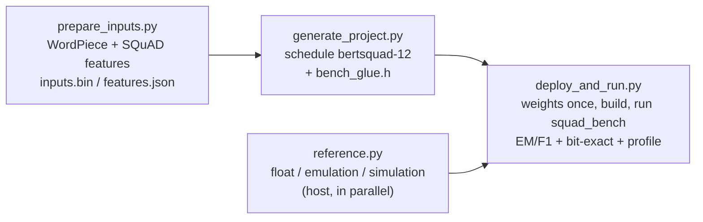

# BERT-SQuAD KV260 demo

Extractive question answering with **BERT-base** (ONNX model zoo
`bertsquad-12`: 12 layers, hidden 768, 12 heads, sequence 256, 108.7 M
parameters, fine-tuned on SQuAD 1.1) running on the KV260's
**MatmulKernel** and **VectorOPKernel**, with LayerNorm / GELU / Softmax /
Transpose / embedding lookup on the A53 host.  The demo

  1. tokenizes SQuAD 1.1 dev questions (WordPiece, one 256-token window),
  2. schedules the model with `inference-scheduler` into a C project,
  3. uploads the 208 MB of weights once to a persistent board directory,
     builds the project on the board and runs every question,
  4. decodes the answer spans on the host and reports SQuAD EM / F1 next to
     the float model and the Q8.8 emulation, compares the board logits
     **bit for bit** with the scheduler's simulation, and prints the latency
     and (optionally) the per-layer time by kind.

Background, numerics and the phase plan: [`doc/BERT_PLAN.md`](../../doc/BERT_PLAN.md).



## Layout

```
demo/bert_squad/
├── README.md
├── bert_squad_config.json.example
├── run_demo.py                     — prepare -> generate -> deploy
├── scripts/
│   ├── prepare_inputs.py           — tokenize the first N single-window dev questions
│   ├── generate_project.py         — schedule the model, drivers, glue, CMake patch
│   ├── reference.py                — host reference logits (float / emulation / simulation)
│   ├── deploy_and_run.py           — upload, build, smoke test, run, score, report
│   ├── _common.py                  — config / paths / input readers
│   ├── bert_study.py               — tokenizer, feature builder, span decoding, EM/F1,
│   │                                 numpy float model + Q8.8 emulation (the study)
│   ├── bert_sched_check.py         — scheduler simulation vs study emulation (gate b)
│   └── bert_schedule_stats.py      — work per engine in the generated schedule
├── src/
│   └── squad_bench.c               — board-side runner (compiled on the board)
├── assets/                         — not in git
│   ├── vocab.txt, dev-v1.1.json
│   ├── models/bertsquad-12-simplified.onnx
│   └── preprocessed/{inputs.bin, features.json}
└── build/                          — not in git
    ├── project/                    — generated CMake project (+ weights/, layers.json)
    ├── project.json                — project summary (roles -> buffers, kernels)
    ├── reference/                  — reference.npz + per-example cache
    ├── logits.bin, results.json
    └── logs/<step>.log
```

## Prerequisites

### Host

* The scheduler's virtualenv (`inference-scheduler/.venv`, see the top-level
  `CLAUDE.md`): numpy, onnx, paramiko.  All commands below use it.
* HLS driver sources for VectorOPKernel and MatmulKernel (from `build/`:
  `make synthesize_vectorop_kv260 synthesize_matmul_kv260`).
* ~6 GB RAM per reference worker (`reference.workers`, default 2) and
  ~3 GB for the project generation.

### KV260 board

* A bitstream whose MatmulKernel has `kernels.matmul.max_k` ≥ 3072 (the FFN
  down-projection has K = 3072; `platforms/kv260.json` has 4096), loaded with
  `fabric_vecop` / `fabric_matmul` UIO devices.
* `gcc`, `cmake ≥ 3.19`, `make`, XRT, root or passwordless `sudo`.
* ~220 MiB of free CMA (the pool BO is 215 MiB) and 210 MB of disk for the
  persistent weights directory.

### Assets

```bash
cd demo/bert_squad
mkdir -p assets/models

# WordPiece vocabulary of bert-base-uncased (30 522 lines, 231 508 bytes)
curl -L -o assets/vocab.txt https://huggingface.co/bert-base-uncased/resolve/main/vocab.txt

# SQuAD 1.1 dev set
curl -L -o assets/dev-v1.1.json https://rajpurkar.github.io/SQuAD-explorer/dataset/dev-v1.1.json

# bertsquad-12 from the ONNX model zoo, input shapes pinned to [1, 256]
curl -L -o assets/models/bertsquad-12.onnx \
  https://github.com/onnx/models/raw/main/validated/text/machine_comprehension/bert-squad/model/bertsquad-12.onnx
../../inference-scheduler/.venv/bin/python ../../inference-scheduler/simplify_onnx.py \
  assets/models/bertsquad-12.onnx -o assets/models/bertsquad-12-simplified.onnx \
  --input-shape input_ids:0=1,256 --input-shape input_mask:0=1,256 \
  --input-shape segment_ids:0=1,256 --input-shape unique_ids_raw_output___9:0=1
```

The download is 435 852 736 bytes; the simplified model (414.8 MB, md5
`f6818d482d18e703fbd8d7c3b609a98a`) is the file the results below were
measured with.  Any other location works — set `model` in the config.

## Run

```bash
cd demo/bert_squad
cp bert_squad_config.json.example bert_squad_config.json
$EDITOR bert_squad_config.json          # ssh.*, local.driver_dirs, remote.uio_devices

PY=../../inference-scheduler/.venv/bin/python
$PY scripts/prepare_inputs.py           # 50 questions -> assets/preprocessed/
$PY scripts/generate_project.py         # -> build/project/ (~30 s, 3 GB RAM)
$PY scripts/deploy_and_run.py --n 20 --profile-layers
$PY scripts/deploy_and_run.py           # all 50, no profiling
# or: $PY run_demo.py [deploy_and_run options]
```

## Sample run

Host `demo/bert_squad`, board at `192.168.100.8` (KV260, Ubuntu 22.04,
MatmulKernel `max_k` 4096 bitstream, 100 MHz), first 50 single-window
questions prepared.  The first run uploaded the weights (76 files, 217 MB,
121 s); this is the second one (`--n 20 --profile-layers`):

```
$ ../../inference-scheduler/.venv/bin/python scripts/deploy_and_run.py --n 20 --profile-layers --top 20

Preflight (local)
    OK      project  .../demo/bert_squad/build/project
    OK      driver/xvectoropkernel.h  VectorOPKernel
    ...
    OK      weights/*.dat  76 files, 217 MB
    OK      inputs.bin  50 examples (first), seq 256
    OK      seq_len matches the model  inputs 256 / model 256
    OK      ssh.host  192.168.100.8

host reference started in the background (log: .../build/logs/reference.log)

Connecting to root@192.168.100.8:22 ...

Preflight (remote)
    OK      cmake                                cmake version 3.22.1
    OK      gcc                                  gcc (Ubuntu 11.4.0-1ubuntu1~22.04.3) 11.4.0
    OK      xrt headers                          xrt via pkg-config
    OK      uio (VectorOPKernel: fabric_vecop)   /dev/uio4
    OK      uio (MatmulKernel: fabric_matmul)    /dev/uio5
    OK      writable /root  4387 MB free
    info    CmaTotal: 1024000 kB CmaFree: 1013620 kB

Deploy (profile=on, smoke test=on)
  weights  -> OK               0.4s  0 uploaded (0 MB), 76 already on the board
  upload   -> OK               1.2s  27 project files + inputs.bin
  cmake    -> OK               0.9s
  make     -> OK              16.6s
  smoke    -> OK              12.7s  test_inference PASSED

squad_bench: 20 examples, warm-up 1
    squad_bench: model=bertsquad-12-simplified examples=20 (of 50) seq_len=256 warmup=1
    squad_bench: inference_init 311 ms
    squad_bench: per-layer profiling ENABLED (386 layers)
    warmup 1/1: 12134.4 ms
    example 1/20: latency=12132.1 ms  argmax start=46 (6.14) end=47 (6.15)  uid=0
    example 2/20: latency=12130.4 ms  argmax start=57 (7.71) end=58 (7.70)  uid=1
    ...
    example 20/20: latency=12133.6 ms  argmax start=58 (3.82) end=60 (4.60)  uid=19
  run      -> OK             255.4s
cleanup /tmp/bert_squad_demo (weights kept in /root/bert_squad_weights)
waiting for the host reference ...

  ── BERT-SQuAD KV260 ──

  examples 20 (warm-up 1), seq 256:  latency mean 12131.8 ms  min 12128.8  max 12134.3  (0.082 inferences/s);  inference_init 0.3 s;  unique_ids passed through 20/20

                   EM     F1   same span as float   EM / F1 vs float answer
  float          90.0   91.7                    -                         -
  emulation      90.0   91.7                19/20               95.0 / 95.0
  board          90.0   91.7                19/20               95.0 / 95.0

  board vs scheduler simulation (first 3): BIT-EXACT  3/3 examples
  board vs emulation (all 20): 20/20 examples bit-exact

  per-layer profile (per inference, warm-up excluded; sum 12140 ms vs wall 12132 ms — kernel windows are issue -> wait and can overlap host work):
    MatMul linear         7661.4 ms   63.1 %   (74 layers)
    MatMul attention       749.7 ms    6.2 %   (24 layers)
    VectorOP                96.5 ms    0.8 %   (126 layers)
    LayerNorm              339.9 ms    2.8 %   (25 layers)
    GELU                  2048.7 ms   16.9 %   (12 layers)
    Softmax               1071.6 ms    8.8 %   (12 layers)
    Transpose              169.4 ms    1.4 %   (49 layers)
    other                    3.0 ms    0.0 %   (5 layers)
  top 20 layers:
    [161] MatMul linear     _gemm_matmul_29                                     217.4 ms  n,k,m,b=[256, 768, 3072, 1]
    [ 41] MatMul linear     _gemm_matmul_5                                      216.9 ms  n,k,m,b=[256, 768, 3072, 1]
    ...
    [ 44] MatMul linear     _gemm_matmul_6                                      204.2 ms  n,k,m,b=[256, 3072, 768, 1]
```

The same run without `--n` / `--profile-layers` (all 50 questions):

```
  examples 50 (warm-up 1), seq 256:  latency mean 12130.9 ms  min 12128.0  max 12134.0  (0.082 inferences/s);  inference_init 0.3 s;  unique_ids passed through 50/50

                   EM     F1   same span as float   EM / F1 vs float answer
  float          88.0   90.3                    -                         -
  emulation      88.0   90.3                49/50               98.0 / 98.0
  board          88.0   90.3                49/50               98.0 / 98.0

  board vs scheduler simulation (first 3): BIT-EXACT  3/3 examples
  board vs emulation (all 50): 50/50 examples bit-exact
```

## Results (2026-09-26)

**Accuracy** — SQuAD 1.1 dev, first N single-window questions (all from the
"Super Bowl 50" article), official EM / F1 normalisation:

| N | model | EM | F1 | same span as float |
|---:|---|---:|---:|---:|
| 20 | float32 (numpy, = onnxruntime to 4e-6) | 90.0 | 91.7 | – |
| 20 | Q8.8 emulation (`bert_study.py` `sched`) | 90.0 | 91.7 | 19/20 |
| 20 | **KV260** | **90.0** | **91.7** | **19/20** |
| 50 | float32 | 88.0 | 90.3 | – |
| 50 | Q8.8 emulation | 88.0 | 90.3 | 49/50 |
| 50 | **KV260** | **88.0** | **90.3** | **49/50** |

The one span that moves (#16, "What year did the Denver Broncos secure a
Super Bowl title for the third time?") answers "2015" instead of the float
model's "2016," — both are gold answers.  The board logits equal the
scheduler simulation bit for bit on the checked examples and the emulation
on all 50, so the board's accuracy *is* the emulation's (the 60-question
study set of `doc/BERT_PLAN.md` §3: float 93.3 / 96.5, emulation
93.3 / 97.1).

**Latency** — 12.13 s per inference (min 12.128 s, max 12.134 s over 50;
profiling adds < 0.1 %), `inference_init` 0.3 s with the weights in the
page cache.  Per-layer profile, per inference:

| kind | layers | ms | share | rate |
|---|---:|---:|---:|---|
| MatMul linears (Q/K/V/O 768², FFN 768×3072, 3072×768, QA head) | 74 | 7661 | 63.1 % | 2.8–3.0 GMAC/s (21.7 GMAC) |
| GELU (tanh form, host, double) | 12 | 2049 | 16.9 % | 217 ns / element |
| Softmax (host, double) | 12 | 1072 | 8.8 % | 114 ns / element |
| attention MatMuls (QKᵀ, P·V, batch 12) | 24 | 750 | 6.2 % | 1.3 (QKᵀ, K = 64) / 2.2 (P·V) GMAC/s |
| LayerNorm (host, double) | 25 | 340 | 2.8 % | 69 ns / element |
| Transpose (host) | 49 | 169 | 1.4 % | 18 ns / element |
| VectorOP (bias / residual / mask adds, scale) | 126 | 97 | 0.8 % | 0.4–0.8 G element/s |
| other (Gather, OneHot, Cast, Slice) | 5 | 3 | 0.0 % | |

## Options (`deploy_and_run.py`)

| Flag | Effect |
|------|--------|
| `--n N` | run the first N prepared examples (default: all) |
| `--profile-layers` | build with `INFERENCE_PROFILING=ON`; per-kind breakdown + top layers |
| `--top K` | layers listed with `--profile-layers` (default 15) |
| `--no-smoke` / `--smoke-only` | skip / only run the generated `test_inference` |
| `--no-reference` | skip the host reference (no bit-exact check, no float / emulation columns) |
| `--board-lock FILE` | hold `flock(FILE)` for the whole board session (shared boards) |
| `--no-cleanup` | keep `remote.work_dir` (the weights directory is always kept) |
| `--check-only` | local + remote preflight only |
| `-v` | print cmake / make / smoke-test output |

Exit code 0 = ran and bit-exact on the checked examples, 3 = ran but the
board logits differ from the simulation, 1 = a step failed.

## Configuration

* **`inputs.num_examples`** / **`inputs.selection`** — `first` takes the
  first N dev questions whose question + context fit one 256-token window
  (in dataset order, so N = 50 are all from the first article, "Super Bowl
  50"); `study` takes `bert_study.py`'s set (N drawn with seed 0 from the
  first 4N, the set of the BERT_PLAN §0 / §3 tables).
* **`io`** — the ONNX tensor of each role (ids, segments, mask, unique id,
  start / end logits).  `generate_project.py` maps them to `inference_run()`
  arguments from the graph, so the C names are never hard-coded.
* **`remote.weights_dir`** — persistent; `weights/*.dat` plus a
  `MANIFEST.json` of sizes and SHA-1s.  A file is uploaded again only when
  its size or checksum changes (e.g. a new MatmulKernel packing).
* **`reference.bitexact_examples`** (K) — the first K board results are
  compared with `CodeGenerator._forward_pass`, the simulation the generated
  `test_inference.c` expectations come from; with `reference.emulation` every
  example is also compared with `bert_study.py`'s `sched` emulation (the two
  references are identical bit for bit — BERT_PLAN gate (b)).
* **`run.smoke_test`** — build and run the generated `test_inference` first
  (fixed ramp inputs, expected outputs from the simulation; prints PASSED).

## How it works

* **Integer inputs.**  `input_ids`, `segment_ids`, `input_mask` and
  `unique_ids` are raw int16 in `inference_buf_t` (`inference.h`); the host
  Gather / OneHot / Cast nodes read them as integers.  `squad_bench` sets
  `unique_ids` to the example index and checks the pass-through output.
* **Logits** are Q8.8: `squad_bench` writes the raw int16 bits
  (`logits.bin`, start[256] then end[256] per example); the host divides by
  256 and decodes the best span (`bert_study.best_span`: top-20 start / end
  candidates inside the context, length ≤ 30).
* **Bit-exactness.**  The host ops compute in double with
  `-ffp-contract=off` and libm's `exp` / `tanh`, round half to even on
  write-back; the scheduler's simulation mirrors that in numpy with Python's
  `math` (the host's glibc).  The kernels are exact integer arithmetic.
* **Weights** stay in `build/project/weights/` locally and are not part of
  the per-run upload; `INFERENCE_WEIGHTS_DIR` points the board build at the
  persistent copy.
