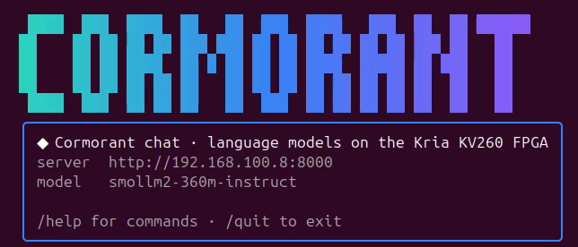
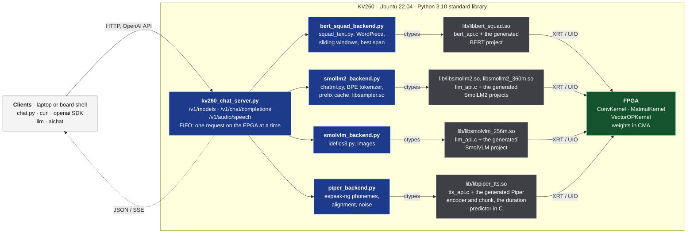

# KV260 chat server

A chat server that runs **on the KV260 board itself** and speaks the OpenAI
API.  The models run on this repo's FPGA kernels; the server is a small
standard-library Python program on the board (`kv260_chat_server.py`).
Because it speaks the OpenAI protocol, ordinary tools work with it unchanged
— `curl`, the `openai` Python SDK, `llm`, `aichat` — and so does the bundled
`chat.py`, which needs nothing but Python.

Plan and design decisions: [`doc/plans/CHAT_PLAN.md`](../../doc/plans/CHAT_PLAN.md)
(text to speech: [`TTS_PLAN.md`](../../doc/plans/TTS_PLAN.md)).



▶ **[Demo video](https://youtu.be/VVS7ExW0XYQ)** (1 min): `chat.py` on a laptop, SmolLM2-360M on the
board, a three-question conversation that the model remembers.

## What it serves

| Model (`model` field) | Backend name in the config | What it does | On the board | Guide |
|---|---|---|---|---|
| `bert-squad` | `bert-squad` | Answers questions about a document you send, by quoting the passage that answers them | ~1 s per 256-token window | [Document Q&A](doc/BERT_QA.md) |
| `smollm2-135m-instruct` | `smollm2` | Multi-turn chat, streamed token by token | ~10 tokens/s; first token after 0.25–1.3 s | [Generative chat](doc/SMOLLM2.md) |
| `smollm2-360m-instruct` | `smollm2-360m` | The same chat with a larger model: better answers, slower | ~3.9 tokens/s; first token after ~1 s | [Generative chat](doc/SMOLLM2.md#smollm2-360m-instruct) |
| `smolvlm-256m-instruct` | `smolvlm` | Answers questions about images | 3.9 s per image, then ~9.5 tokens/s | [Chat about images](doc/SMOLVLM.md) |
| `piper-lessac-medium` | `piper` | Text to speech (`POST /v1/audio/speech`) | first sound after 1.0–1.5 s, faster than real time | [Text to speech](doc/TEXT_TO_SPEECH.md); listen: ▶ [hello](../tts/samples/hello.mp3), ▶ [paragraph](../tts/samples/paragraph.mp3) |

- **Exact results.**  The board reproduces the host reference bit for bit:
  the language models' logits match the scheduler's simulation, and Piper's
  audio samples match its specification.
- **One board, several models.**  The models share the FPGA: one request
  runs at a time, and models that do not fit in memory together are swapped
  in and out on demand ([Deploying](doc/DEPLOY.md#several-models-on-one-fpga)).
- **No FPGA needed for testing.**  An `echo` backend and fake models serve
  the protocol anywhere ([Deploying](doc/DEPLOY.md#without-the-fpga)).



## Quick start

You need:
- a KV260 prepared as in the [repo README](../../README.md#quick-start):
  the bitstream loaded and `cma=1000M` on the kernel command line;
- the BERT demo's config, `../bert_squad/bert_squad_config.json`, with the
  board's ssh address, UIO names and driver paths
  ([bert_squad README](../bert_squad/README.md#run));
- the scheduler's virtualenv, `inference-scheduler/.venv`.

```bash
cd demo/chat
cp chat_config.json.example chat_config.json   # port 8000, no API key, serves bert-squad
PY=../../inference-scheduler/.venv/bin/python
$PY deploy.py                                  # generate, upload, build, start; waits for /health
```

The first deploy downloads the BERT model (435 MB) and its vocabulary,
builds the library on the board and starts the server.  Then ask it something:

```bash
python3 chat.py --url http://<board>:8000/v1 --doc mydoc.txt     # a chat about the document
python3 chat.py --url http://<board>:8000/v1 --doc mydoc.txt -q "Who won?"   # one question
```

- **More models.**  Each other model needs its library built and
  installed on the board once (see its guide).  Then add its backend name
  to `server.backends` in `chat_config.json` and run `deploy.py` again.
- **Stopping.**  The running server owns the FPGA, so stop it with
  `$PY deploy.py --stop` before running other board jobs.

## Talking to it

Any OpenAI-compatible client works.
- **Base URL:** `http://<board>:8000/v1`.
- **API key:** any value, or the key set in `chat_config.json`.

```bash
curl http://<board>:8000/v1/chat/completions -H "Content-Type: application/json" -d '{
  "model": "bert-squad",
  "messages": [{"role": "system", "content": "Super Bowl 50 was won by the Denver Broncos ..."},
               {"role": "user", "content": "Who won Super Bowl 50?"}]}'
```

[Clients](doc/CLIENTS.md) shows `chat.py`, `curl`, the `openai` SDK,
`llm` and `aichat` with real transcripts, and explains what each is good
for.

## Documentation

| Document | Read it to |
|---|---|
| [Deploying](doc/DEPLOY.md) | install, start and stop the server; choose the models; share the FPGA; run without it |
| [Clients](doc/CLIENTS.md) | use the server from `chat.py`, `curl`, the `openai` SDK, `llm` or `aichat` |
| [Document Q&A](doc/BERT_QA.md) | send documents and questions to `bert-squad`; long documents; measurements |
| [Generative chat](doc/SMOLLM2.md) | build and serve SmolLM2-135M / 360M; sampling and repetition control; speed; calibration |
| [Chat about images](doc/SMOLVLM.md) | build and serve SmolVLM-256M; send images |
| [Text to speech](doc/TEXT_TO_SPEECH.md) | build and serve Piper; `/v1/audio/speech` and its options |
| [API reference](doc/API.md) | endpoints, request fields, errors, the `kv260` extension, queueing, logs |
| [Development](doc/DEVELOPMENT.md) | the source files, adding a backend, the tests and the host validation |

## Tests

```bash
cd demo/chat/tests && python3 -m unittest      # 188 tests, ~45 s, no board needed
```

Some tests skip until the tokenizers they read are downloaded; see
[Development](doc/DEVELOPMENT.md#tests) for what each test covers and for
the board gate.
