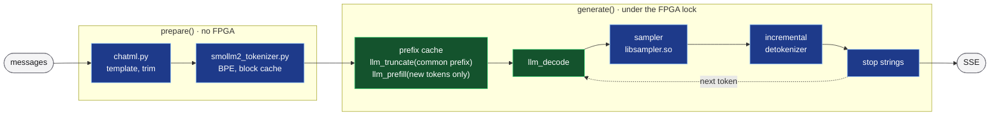

# Generative chat — SmolLM2

Two generative chat models, served token by token like any OpenAI chat
model:

| Model | Backend name | Decode speed | First token | Notes |
|---|---|---|---|---|
| `smollm2-135m-instruct` | `smollm2` | ~18.3 tokens/s | 0.16–0.8 s | fast; fluent but often wrong on facts |
| `smollm2-360m-instruct` | `smollm2-360m` | ~7.3 tokens/s | ~0.4 s | better answers; needs most of the CMA |

Each model runs from its own library, `libsmollm2.so` or
`libsmollm2_360m.so`.  The library runs the transformer on the FPGA kernels
and the board's A53 cores and returns the next-token logits, bit-exact with
the scheduler simulation.  Everything around it runs in the server process:
the chat template, the tokenizer, sampling, stop strings and a prefix cache
that makes multi-turn chats cheap.

**Terms used below.**
- **Prefill:** reading the prompt, many tokens at once.
- **Decode:** producing the answer, one token per step.
- **KV cache:** the per-token state the model keeps from earlier tokens,
  so later steps do not recompute them.
- **CMA:** the contiguous memory that the FPGA kernels read and write.  A
  model's pool of weights and buffers lives there.

**The model.**  SmolLM2-135M-Instruct is Apache-2.0: 30 layers, hidden size
576, a vocabulary of 49 152 tokens, and a 1024-token context here.

**Numbers.**  The FPGA kernels compute in 16-bit fixed point.  The numeric
policy that keeps the answers close to the float model's is
`pow2+sink+p12` (CHAT_PLAN §10 / §16, KV_DECODE_PLAN):
- `pow2`: power-of-two scales per channel, calibrated once per model (see
  [Calibration](#calibration));
- `sink`: position 0, the `<|im_start|>` token that every prompt begins
  with, is precomputed once in float: its activations are far too large
  for the 16-bit format (a residual of ~26 000);
- `p12`: the attention probabilities are stored at 2⁻¹² resolution.  The
  two attention products, q·Kᵀ and P·V, run on ConvKernel in prefill and in
  decode (from position ~130 on that is faster than the exact host attention
  the libraries used before, `pow2+sink+p12+mix`: 135M 72.5 instead of
  81.5 ms per token at position 1000); the softmax between them runs on the
  host.

Greedy answers read like the float model's.

- [Try it](#try-it)
- [Install SmolLM2-135M](#install-smollm2-135m)
- [SmolLM2-360M-Instruct](#smollm2-360m-instruct)
- [How a request runs](#how-a-request-runs)
- [Conversations](#conversations)
- [Sampling](#sampling)
- [Repetition control](#repetition-control)
- [The `kv260` details and the log line](#the-kv260-details-and-the-log-line)
- [Speed and quality](#speed-and-quality)
- [Measured](#measured)
- [Calibration](#calibration)

## Try it

Once the model is installed and enabled (below), chat with it from any
client.  With `chat.py`, `--model` picks it, and `/model` switches between
models in the same chat (the history is kept; `/reset` clears it):

```
$ python3 demo/chat/chat.py --url http://<board>:8000/v1 --model smollm2-135m-instruct --temperature 0
> What is the capital of France?
The capital of France is Paris.
> And of Italy?
...
```

## Install SmolLM2-135M

The library is built on the host, then installed on the board once
(CHAT_PLAN §13.5).  The inputs are not in git:
- the Hugging Face checkpoint `HuggingFaceTB/SmolLM2-135M-Instruct`
  (`config.json`, `model.safetensors`, `tokenizer.json`, ...) and the
  WikiText-2 texts, in `assets/smollm2-135m-instruct/`;
- the calibrated exponents, `assets/study/formats_pow2+sink+p12.json`.

`scripts/llm_calibrate.py` makes them from the inputs pinned in
`scripts/llm_models.json` (revision and SHA-256 of every file) and checks
the result against the recorded hash ([Calibration](#calibration)).

The steps, from the repo root:

1. **Create the study environment**, once.  It is a virtualenv with the
   package versions that reproduce the recorded hashes
   (`scripts/requirements-study.txt`).  Calibration needs only its numpy
   and tokenizers; torch and transformers are for `validate`.

   ```bash
   python3 -m venv .venv-export
   PIP_CONFIG_FILE=/dev/null .venv-export/bin/pip install \
       --extra-index-url https://download.pytorch.org/whl/cpu \
       -r demo/chat/scripts/requirements-study.txt
   ```

2. **Fetch the checkpoint and calibrate**, ~1.5 min.  `llm_calibrate.py`
   itself needs only the standard library; it runs the numeric steps in
   `.venv-export`.

   ```bash
   cd demo/chat
   python3 scripts/llm_calibrate.py all smollm2-135m-instruct
   ```

3. **Generate the library project** with the scheduler's virtualenv:
   about 60 s and 3.1 GiB of RAM, giving `build/llm_project` with 326 MB of
   `weights/*.dat`.

   ```bash
   PY=../../inference-scheduler/.venv/bin/python
   $PY scripts/generate_llm_project.py
   ```

4. **Build and install it on the board.**  Stop the server first, since it
   owns the FPGA.  `llm_board.py --install-only` uploads the project, builds
   it on the board (`-j1`, with a memory guard) and installs
   `<dir>/lib/libsmollm2.so`, with the weights in `/root/smollm2_weights`.

   ```bash
   $PY deploy.py --stop
   $PY scripts/llm_board.py --install-only
   ```

5. **Enable it.**  Add `"smollm2"` to `server.backends` in
   `chat_config.json`, then run `$PY deploy.py`.  The `smollm2` block of
   the config sets the library, weights directory, model id, tokenizer and
   `cma_mb` (330).  It also sets the sampling defaults, which apply to every
   generative model.

Notes on the tools:

- **`generate_llm_project.py`** takes the model name from the checkpoint
  directory (`--assets assets/<model>`, default SmolLM2-135M).  That name
  names the output project, the library and the board's weights directory.
  - A `--model-name` that disagrees with `--assets` is refused.
  - An output directory holding another model's project is not replaced
    without `--force`.
  - It takes the planning options (`--plan`, `--perf-model`,
    `--plan-report`, `--pool-budget-mib`, `--entry-weights`) and passes
    them to every entry.
- **`llm_calibrate.py all`** rewrites the tracked provenance file
  `assets/study/smollm2-135m-instruct/formats_pow2+sink+p12.provenance.json`
  (commit, script hash, date).  Do not commit it unless you recalibrate on
  purpose.
- **`llm_board.py`** takes ssh, the driver directories and the board lock
  from `../bert_squad/bert_squad_config.json`.
  - **Where it installs.**  The library goes to `<dir>/lib/`, where
    `deploy.py` looks for it; `<dir>` is `remote.dir` of `chat_config.json`,
    else `/root/kv260_chat`.  The library is built to read its weights from
    `/root/smollm2_weights` (`/root/<model>_weights` for the other models),
    and they are uploaded there.
  - **Other locations.**  `--remote-dir DIR` overrides where the library
    is installed, `--weights-dir DIR` where the weights go.  Use both for a
    second install beside an existing one.
  - **The board gate.**  Without `--install-only` it also runs the gate:
    logits bit-exact with the scheduler simulation, prefill / decode
    timings, and `llm_lib_check.py`.
  - **Profiles.**  `--profile` adds the per-layer profile.  `--out FILE`
    saves the results JSON, with the per-layer times (`profile_layers`)
    that `inference-scheduler/perf_calibrate.py host / simulate --profile`
    read (TACTICS_PLAN §9).

## SmolLM2-360M-Instruct

The `smollm2-360m` backend serves SmolLM2-360M-Instruct from its own
library, `libsmollm2_360m.so` (CHAT_PLAN §20): bit-exact on the board,
~7.3 tokens/s decode (3.9 at 100 MHz), first token after ~0.4 s, and better answers than the
135M model.  [This video](https://youtu.be/VVS7ExW0XYQ) shows it in a three-question conversation
with `chat.py`: the third answer recalls the name and the city given in the
first message, which the 135M model did not manage on the same questions.

- **Memory.**  Its pool is 740 MiB, so under `--resident auto` it swaps
  with every other FPGA model, the 135M one included; only Piper stays
  loaded beside it.  Both SmolLM2 sizes can still be served side by side:
  they take turns on the FPGA.  A swap takes 1–2 s
  with the weights in the page cache.  The first load from the SD card
  takes 53 s for 360M and 21 s for 135M.
- **Build.**  Generating the project takes ~2.5 min and 7.7 GiB of host
  RAM (CHAT_PLAN §25).

```bash
cd demo/chat
python3 scripts/llm_calibrate.py all smollm2-360m-instruct   # checkpoint (Apache-2.0, 724 MB),
                                          # texts, formats -> assets/study/smollm2-360m-instruct/
$PY scripts/generate_llm_project.py --assets assets/smollm2-360m-instruct \
    --model-name smollm2-360m-instruct   # -> build/llm_project_smollm2_360m (~2.5 min, 7.7 GiB RAM)
$PY deploy.py --stop
$PY scripts/llm_board.py --install-only --project build/llm_project_smollm2_360m
                                          # -> <dir>/lib/libsmollm2_360m.so, /root/smollm2_360m_weights
                                          # (--remote-dir / --weights-dir as above)
```

Then add `"smollm2-360m"` to `server.backends` and run `deploy.py`.  The
`smollm2_360m` block's defaults fit:
- `lib`: `<dir>/lib/libsmollm2_360m.so`;
- `cma_mb`: 760;
- `tokenizer`: `assets/smollm2-360m-instruct/tokenizer.json`.

The server serves the model id that the library reports
(`llm_model_name()`), `smollm2-360m-instruct`.  `smollm2_360m.model_id` (or
`--llm-360m-model-id`) overrides it.  Two backends serving one model id
are refused at startup.

## How a request runs



1. **Prepare, outside the FPGA lock.**  The messages are rendered with the
   chat template, trimmed to fit the context, and tokenized.
2. **Prefill, under the FPGA lock.**  The KV cache is truncated to the
   prefix it shares with the new prompt, and only the new tokens are
   prefilled (`llm_truncate`, `llm_prefill`).
3. **Decode, token by token.**  `llm_decode` returns the logits.  The
   sampler picks a token, the detokenizer turns it into text, and stop
   strings are checked.  Each piece of text goes out as an SSE chunk.

The library's API (`llm_open / llm_prefill / llm_decode / llm_truncate /
...`) is described in CHAT_PLAN §11.

## Conversations

- **Chat template.**  SmolLM2's ChatML, exactly as transformers'
  `apply_chat_template` renders it: `<|im_start|>{role}\n{content}<|im_end|>\n`
  per message, then `<|im_start|>assistant\n` to answer.
  - A conversation without a system message gets the model's default one:
    "You are a helpful AI assistant named SmolLM, trained by Hugging Face".
  - A `developer` message counts as `system`.
  - Special-token text inside messages is parsed as the special token, as
    in transformers.
- **Context and trimming.**  The context is 1024 positions: the prompt
  (its leading `<|im_start|>` included) plus the answer.
  - **Room for the answer.**  The history is trimmed to leave
    `--llm-reserve` (256) tokens for the answer, or `max_tokens` if that is
    smaller.
  - **What is trimmed.**  The oldest turns go first.  The system message and
    the last message always stay (`kv260.trimmed_messages` counts what was
    dropped).
  - **Too long.**  If those two alone do not fit, the request fails with
    400 `context_length_exceeded`.
  - **Where the answer stops.**  At `max_tokens`, or when the context is
    full (`finish_reason: "length"`).
- **Multi-turn is cheap.**
  - **Prefix reuse.**  The server remembers which tokens are in the KV
    cache.  A new request is truncated to the prefix it shares with them,
    and only the rest is prefilled.
  - **What a follow-up costs.**  It prefills just the end of the previous
    answer and the new turn — tens of tokens, not the whole conversation.
  - **The sink.**  Position 0 is the precomputed `<|im_start|>` attention
    sink (CHAT_PLAN §10.3) and is never re-run.
  - **Watching it.**  `kv260.cached_tokens` / `prefill_tokens` show the
    split.
- **Stop.**  Generation ends at any of:
  - `<|im_end|>` (also `<|endoftext|>` or a new `<|im_start|>`);
  - a `stop` string (up to 4), matched across token boundaries; the stop
    string itself is not sent;
  - `max_tokens`.

  `usage.completion_tokens` counts the generated tokens without the final
  `<|im_end|>`.
- **Streaming.**  One SSE chunk per token.  A character split over several
  byte tokens (emoji, CJK) is sent once it is complete.

## Sampling

Every request can set its own sampling; unset fields take the server's
defaults.  Fields marked "extra" are not part of OpenAI's API; OpenAI
clients send them as extra body fields (`extra_body` in the `openai` SDK).
In the formulas, `l` is a token's logit, `r` the repetition_penalty, `a`
the presence_penalty and `f` the frequency_penalty.

| Field | Default | Meaning |
|---|---|---|
| `temperature` | 0.2 | 0 = greedy (argmax) |
| `top_p` | 0.9 | nucleus over the tokens left by top_k |
| `top_k` (extra) | 50 | 0 = off; 1 = greedy |
| `repetition_penalty` (extra) | 1.1 | HF / CTRL: `l > 0 ? l / r : l * r` for recent tokens |
| `presence_penalty`, `frequency_penalty` | 0 | OpenAI: `l -= a + f · count` |
| `repeat_last_n` (extra) | 64 | penalty window over prompt + answer; 0 off, −1 all |
| `dry_multiplier` (extra) | 0.8 | DRY: a token that would extend a run already in the context loses `multiplier · base^(run − allowed_length)`; 0 = off |
| `dry_base`, `dry_allowed_length` (extra) | 1.75, 2 | growth per matched token; runs shorter than allowed_length are free |
| `dry_penalty_last_n` (extra) | −1 | DRY window over prompt + answer; −1 the whole context, 0 off |
| `dry_sequence_breakers` (extra) | `[":", "\"", "*"]` | a token containing one of these (and every special token) cuts a run, so lists, dialogue and markdown are not penalised; newline is deliberately not one (see [Repetition control](#repetition-control)) |
| `loop_guard` (extra) | true | end the answer when it ends in one block repeated verbatim 3 times (≥ 24 tokens): `finish_reason` "stop", `kv260.finish` "loop" |
| `seed` | random | the seed used is returned as `kv260.seed`; same seed + same logits → same answer |

- **Where the defaults come from.**
  - Temperature 0.2 and top_p 0.9 are the model card's.
  - top_k 50 is HF `generate`'s.
  - The repetition penalty is 1.1 over the last 64 tokens.
  - DRY is on at the text-generation-webui / llama.cpp values (0.8 / 1.75
    / 2), but without the newline breaker.
- **Changing them.**  Server-wide with `--llm-temperature`, `--llm-top-p`,
  `--llm-top-k`, `--llm-repetition-penalty`, `--llm-dry-multiplier` … (or
  `smollm2.*` in `chat_config.json`).
- **Order.**  HF's order plus DRY: penalties → DRY → temperature → top-k →
  top-p → draw (details in `src/sampler.h`).

## Repetition control

At the default low temperature the 135M model falls into verbatim loops:
- of sentences: "I think I might have found a cat … But I don't know if I
  can catch it." again and again;
- of short lines: "The cat loves her adventures / This is a short story."
  until `max_tokens`.

Three layers stop them; DRY does most of the work:

1. **DRY** ("Don't Repeat Yourself").  A token that would extend a run
   already present in the context loses `0.8 · 1.75^(run − 2)`.  That
   grows fast enough to leave any loop after a few repeated tokens.
   - **Breakers.**  Tokens containing `:`, `"` or `*` (and every special
     token) cut runs, so lists, dialogue, markdown and code keep their
     structure.
   - **Newline is not a breaker**, unlike the text-generation-webui /
     llama.cpp default.  With it, every run ended at the line break, and a
     loop of short lines only ever met penalties of ~1–4, too weak
     (CHAT_PLAN §15).
2. **repetition_penalty 1.1** over the last 64 tokens (HF / CTRL).
3. **The loop guard.**  If the answer still ends in one block repeated
   verbatim 3 times (≥ 24 tokens), generation stops (`finish_reason`
   "stop", `kv260.finish` "loop").

Measured on the board, on the conversation that looped ("Hi!" / "How are
you?" / "pink" / "Could you write a short story about cat?"; 500-token cap,
seeds 1 and 2):

| Setting | Seed 1 | Seed 2 |
|---|---|---|
| DRY with the newline breaker (the first default) | line loop to the cap, 30 % repeated trigrams | ends, 3 % |
| DRY without the newline breaker | ends, 10 % | ends, 3 % |
| DRY with newline breaker + repetition_penalty 1.1 | ends, 0 % | ends, 3 % |

- **Side effects.**  Dropping the newline breaker left facts, markdown
  lists and code blocks unchanged.
- **Cost.**  The sampler takes ~2.5 ms per token, ≈ 1 % of a decode step.
- **Turning the layers off**, per request: `"dry_multiplier": 0`,
  `"repetition_penalty": 1`, `"loop_guard": false`.

## The `kv260` details and the log line

Every response carries a `kv260` object (on the last chunk when
streaming):

| Field | Meaning |
|---|---|
| `finish` | why generation ended: `eos`, `stop_string`, `loop`, `max_tokens` or `context_full` |
| `cached_tokens`, `prefill_tokens` | prompt tokens reused from the KV cache / prefilled now |
| `prefill_ms`, `ttft_ms` | prefill time, time to the first token |
| `decode_tokens`, `decode_ms`, `decode_tok_s`, `library_decode_ms` | decode count, time and speed; time inside the library |
| `sampler_ms`, `prepare_ms` | time spent sampling, preparing the prompt |
| `trimmed_messages`, `context_size` | messages dropped to fit, the context size |
| `seed`, `sampler` | the seed and the sampling settings used |
| `loop_guard`, `loop_period` | whether the loop guard was on; the period, in tokens, of the repeated block it found (0 when none) |

The server logs one line per request, e.g.
`... reuse=135/152 prefill=17tok/185ms decode=10.9tok/s why=max_tokens ...`.

## Speed and quality

Measured on the board (CHAT_PLAN §13.4, §16.3, §17, §19; the kernels at
250 MHz since FMAX_250_PLAN, the figures at 100 MHz noted):

- **Decode: ~18.3 tokens/s** at short context (54.5 ms per token at 250 MHz,
  bitstream `986cef4866a0`).  At 100 MHz a token took 99 ms at position 32,
  107 ms at 256 and 130 ms at 1000.
  - **Why.**  Decode is bound by weight bandwidth.  MatmulKernel's GEMV
    mode streams the 256 MiB of weights through both read ports (at
    100 MHz ~3.1 GB/s, ~87 ms per token).  The host attention adds the rest, and
    that part grows with the position.
  - **History.**  Decode was ~5 tokens/s before CHAT_PLAN §19.
- **Prefill.**  0.16 / 0.30 / 0.81 s for 16 / 64 / 256 new tokens at 250 MHz
  (0.24 / 0.33 / 1.12 s at 100 MHz), with
  the prefill attention on the FPGA since phase 5 (3.6 s for 256 before;
  16 tokens took 0.34 s until the 16-token bucket's linears moved to the
  SystemVerilog MatmulKernel, MATMUL_RTL_PLAN phase 4; 64 / 256 took
  0.44 / 1.28 s before the SystemVerilog ConvKernel, CONV_RTL_PLAN).
  So the first answer of a chat starts after ~0.16–0.8 s, and a follow-up
  turn of a few tens of new tokens after ~0.3 s.
- **Host overhead per token** on the board's A53: sampling 0.8–2 ms in C
  (greedy / the default settings; ~2.5 ms with DRY); detokenizing 6 µs.
- **Quality.**  A 135M model is fluent but often wrong on facts and
  arithmetic (CHAT_PLAN §10.4).  Temperature 0 gives the most stable
  answers.  The 360M model answers better.

## Measured

The KV260 at 100 MHz.  The measurements follow the optimisation steps of
CHAT_PLAN:
- **§16:** the prefill attention moved to the FPGA;
- **§17:** the decode attention runs on all four A53 cores;
- **§19:** one copy of the weights, with decode reading it through
  MatmulKernel's GEMV mode (matrix × vector on both read ports).  Before,
  there was a second copy for decode, on the ordinary tiled matrix path.

### On the FPGA

2026-09-26 / 27; CHAT_PLAN §16.3, §17, §19.  The test is a 4-turn
conversation through the OpenAI API at temperature 0, with the default
repetition penalty and DRY and both models resident.  It uses the GEMV
decode of CHAT_PLAN §19.  The first turn found 24 tokens in the prefix
cache from an earlier request.

| Turn | Cached / prefilled tokens | Time to first token | Decode |
|---|---|---:|---:|
| "What is the capital of France?" | 24 / 13 | 348 ms | 9.8 tok/s |
| "What is a famous museum there?" | 100 / 19 | 434 ms | 9.6 tok/s |
| "Tell me one more fact about that city." | 182 / 21 | 456 ms | 9.3 tok/s |
| "Thanks! Now summarise our conversation in one sentence." | 266 / 23 | 468 ms | 9.1 tok/s |

- **Before §19** (2026-09-26: two weight copies, decode on the tiled path)
  the same turns ran at 4.9 / 4.8 / 4.6 / 4.5 tok/s, with the first token
  after 457–502 ms.
- **`llm_bench` decode** at positions 32 / 256 / 1000 now takes 99 / 107 /
  130 ms per token, with the logits unchanged bit for bit.  Earlier: 198 /
  204 / 228 ms after §17, and 197 / 214 / 271 ms before it.
- **The library.**
  - Logits are bit-exact with the scheduler simulation (4 prompts × 33
    vectors).
  - `llm_open` takes 0.6–0.7 s with the weights in the page cache.  Cold
    from the SD card it took 35.6 s before §19, when the weight files were
    538 MB; they are now 326 MB.
  - The pool buffer is 286 MiB; before §19 it was 488 MiB, with a second
    copy of the weights.

### Server side

2026-09-26, the board's CPU only, no FPGA.  The host code on the KV260's
Cortex-A53 (Python 3.10.12, one core):

| Step | Time |
|---|---|
| tokenizer load (`tokenizer.json`, once at startup) | 1.45 s |
| encode a 996-token prompt | 39 ms cold (25 k tok/s), 13 ms warm word cache |
| template + trim of a 14-message chat → 557 tokens / next turn (block cache) | 69 ms / 2.7 ms |
| incremental detokenizer | 6 µs per token |
| sampling, `libsampler.so` (greedy / default t 0.2 top-k 50 top-p 0.9 / top-p 0.9 alone / plain t 1.0) | 0.8 / 1.9 / 6.7 / 5.1 ms |
| the same in the pure-Python fallback | 25 / 68 / 170 / 205 ms |

- **Cost per token.**  With the C sampler the host side adds ~2 ms to the
  ~200 ms decode step that was measured then.
- **The Python fallback** is only reasonable for greedy decoding.
- **No tokenizer accelerator** is needed.
- **End to end on the host PC** with the float fake: 9 / 9 answers (6
  one-shot, 3 turns of a REPL chat) were identical to transformers'
  `generate(do_sample=False)`.  The 2nd and 3rd turns prefilled 17 and 23
  new tokens, reusing 135 and 247 positions.

## Calibration

The library's numerics are fixed by one file per model: the calibrated
power-of-two exponents `formats_pow2+sink+p12.json`, and the position-0
sink K / V at those exponents.  `llm_study.py formats` computes them from
the checkpoint and a WikiText-2 calibration text (CHAT_PLAN §10).
`scripts/llm_calibrate.py` reproduces that step from pinned inputs, so
anyone can rebuild a model and get the same file.

**What is pinned.**  `scripts/llm_models.json` (tracked) records:
- the Hugging Face repo at a commit;
- the SHA-256 of each checkpoint file and of both texts;
- the SHA-256 of the expected formats file;
- the shipped policy's study metrics.

```bash
cd demo/chat
python3 scripts/llm_calibrate.py fetch smollm2-360m-instruct      # download at the pinned revision,
                                          # texts via the datasets server; every hash verified
python3 scripts/llm_calibrate.py calibrate smollm2-360m-instruct  # formats; installed only if the
                                          # hash reproduces, + the provenance
python3 scripts/llm_calibrate.py check smollm2-135m-instruct      # recompute, compare, install nothing
python3 scripts/llm_calibrate.py study smollm2-360m-instruct      # bf16 / p12 / p12+mix metrics
                                          # vs the manifest (-> study[/<model>]/shipped/; 360M ~40 min)
python3 scripts/llm_calibrate.py validate smollm2-135m-instruct   # float64 reference vs torch
```

- **The environment.**  The study steps run in `.venv-export`
  (`--study-python` / `STUDY_PYTHON` for another one), created from
  `scripts/requirements-study.txt`.  Those are the versions that reproduced
  the recorded hashes: numpy 2.5.3 with its OpenBLAS 0.3.34, tokenizers
  0.23.2; torch / transformers only for `validate`.
- **Reproducibility.**  Reruns are byte-identical, and a fetch into an
  empty directory reproduced both models' hashes (2026-09-28).
- **Another machine.**  numpy's OpenBLAS selects CPU-specific kernels, so
  on another machine a sink value can round differently.  `calibrate` then
  keeps the installed file, leaves the result as `formats_*.new.json` and
  prints which exponents / sink values differ.  `--force` installs it
  anyway; `--record` also stores its hash.
- **Provenance.**  `assets/study/<model>/formats_<policy>.provenance.json`
  exists for every model; these are the only tracked files under
  `assets/`.  It records the input hashes, the commit, `llm_study.py`'s
  hash, the package versions, the BLAS and the CPU.
- **A mirror.**  `HF_ENDPOINT` selects a Hugging Face mirror.
- **A new checkpoint.**  Pin it with
  `add <name> --repo <org/repo> [--revision <branch|tag|commit>]`, then
  run `fetch`, `calibrate --record` and `study --record`.
