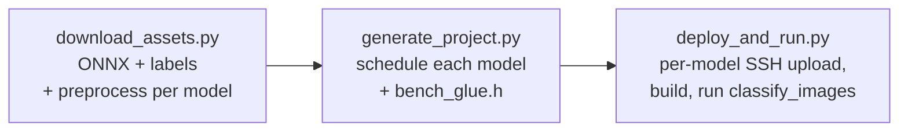

# Image classification KV260 demo

End-to-end ImageNet classification demo for the KV260 FPGA platform.  The
default `image_classification_config.json` runs three pre-trained models —
**MobileNetV1 1.0/224**, **MobileNetV2**, and **ResNet-18** — each with its
own preprocessing recipe and label-offset convention.  Drop a few JPG/PNG
files into `assets/images/`, run the orchestrator, and the demo will

  1. download the ONNX models from a shared Google Drive folder,
  2. fetch the ImageNet 1001-class label list,
  3. preprocess each image to NCHW `ap_fixed<16,8>` on the host, once per
     model's `normalize` recipe (TF / Keras / torchvision),
  4. generate a self-contained KV260 inference project per model with
     `inference-scheduler`,
  5. build each project on the board over SSH,
  6. run `classify_images` per model, which prints the top-5 predictions
     per image and reports per-image latency.



## Layout

```
demo/image_classification/
├── README.md
├── requirements.txt
├── image_classification_config.json.example
├── run_demo.py                             — one-shot orchestrator
├── scripts/
│   ├── download_assets.py                  — fetch ONNX + labels, preprocess images
│   ├── generate_project.py                 — schedule the model into a CMake project
│   └── deploy_and_run.py                   — upload, build, classify on KV260
├── src/
│   └── classify_images.c                   — board-side host (compiled on the board)
├── assets/                                 — populated by you + download_assets.py
│   ├── images/                             — drop JPG/PNG inputs here
│   ├── labels/imagenet_1001_labels.txt     — derived from imagenet_class_index.json
│   ├── models/                             — ONNX downloads
│   └── preprocessed/                       — images.bin + manifest.txt
└── build/
    ├── projects/<model>/                   — generated CMake project per model
    │   ├── driver/                         —   HLS driver sources copied in
    │   └── test/
    │       ├── classify_images.c           —   copied from demo/image_classification/src/
    │       └── bench_glue.h                —   generated; per-model glue + macros
    ├── logs/<model>.<step>.log             — per-step build/run output
    └── results.json                        — final summary (top-5 + latency per image)
```

## Prerequisites

### Host

* Python 3.10+, `pip install -r requirements.txt` (paramiko, gdown, Pillow, numpy, onnx, onnxsim).
* HLS-generated driver sources for the four kernels:

  ```bash
  # from the repo root
  mkdir -p build && cd build
  cmake -DAXI_BUS_WIDTH=32 ..
  make synthesize_kv260
  ```

  `AXI_BUS_WIDTH` must match the AXI master width of the cormorant overlay
  loaded on the board; the sample numbers below were measured at 32-bit.
  Override `local.driver_dirs` if you keep the build tree elsewhere.

### KV260 board

* Linux with the cormorant overlay loaded (so `/dev/uio*` exposes
  `fabric_vecop` / `fabric_matmul` / `fabric_conv` / `fabric_pool`).
* `gcc`, `cmake ≥ 3.19`, `make`.
* XRT runtime via `pkg-config xrt` or `/opt/xilinx/xrt`.
* Passwordless `sudo` for the SSH user (XRT requires root for buffer allocation).

## First-time setup

```bash
cd demo/image_classification
python3 -m venv .venv
.venv/bin/pip install -r requirements.txt

cp image_classification_config.json.example image_classification_config.json
$EDITOR image_classification_config.json    # set ssh.host, key_file, etc.

# Drop a few JPG/PNG files into assets/images/
cp ~/Pictures/cat.jpg assets/images/
cp ~/Pictures/dog.jpg assets/images/
```

## Run the demo

```bash
.venv/bin/python run_demo.py
```

Or step-by-step (lets you iterate without re-downloading):

```bash
.venv/bin/python scripts/download_assets.py
.venv/bin/python scripts/generate_project.py
.venv/bin/python scripts/deploy_and_run.py --verbose
```

Sample output (host `~/projects/axi_demo/demo/image_classification`, board
at `192.168.100.8`, one image: `greyfox-672194.JPEG`):

```
$ ./run_demo.py

=== download_assets ===
ONNX models → demo/image_classification/assets/models
  ✓ mobilenet_v1_1.0_224_no_softmax.onnx  (16,908,384 B)
  ✓ mobilenetv2-12_simplified.onnx        (13,965,766 B)
  ✓ resnet18-simplified-fused.onnx        (46,749,495 B)
  cached imagenet_1001_labels.txt (1001 lines)
  cached assets/preprocessed/mobilenet_v1/images.bin  (1 images, mobilenet_v1, tf)
  cached assets/preprocessed/mobilenet_v2/images.bin  (1 images, mobilenet_v2, imagenet)
  cached assets/preprocessed/resnet18/images.bin      (1 images, resnet18,     imagenet)
done

=== generate_project ===
[mobilenet_v1] scheduling mobilenet_v1_1.0_224_no_softmax.onnx
Model      : assets/models/mobilenet_v1_1.0_224_no_softmax.onnx
Inputs     : ['input:0[1, 3, 224, 224]']
Outputs    : ['MobilenetV1/Logits/SpatialSqueeze:0[1, 1001]']
Nodes      : 58
  [  0] Conv         [1, 3, 224, 224] x [32, 3, 3, 3] x [32] -> [1, 32, 112, 112]
  [  1] Clip         [1, 32, 112, 112] -> [1, 32, 112, 112]
  [  2] Conv         [1, 32, 112, 112] x [32, 1, 3, 3] x [32] -> [1, 32, 112, 112]
  …  (depthwise-separable Conv / Clip blocks repeating to 14×14, 7×7) …
  [ 54] AveragePool  [1, 1024, 7, 7]   -> [1, 1024, 1, 1]
  [ 55] Conv         [1, 1024, 1, 1]   x [1001, 1024, 1, 1] x [1001] -> [1, 1001, 1, 1]
  [ 56] Reshape      [1, 1001, 1, 1]   -> [1, 1, 1, 1001]
  [ 57] Squeeze      [1, 1, 1, 1001]   -> [1, 1001]
Weights    : 20 large weight(s) written to build/projects/mobilenet_v1/weights/
[mobilenet_v1] active kernels: VectorOPKernel, ConvKernel, PoolKernel

[mobilenet_v2] scheduling mobilenetv2-12_simplified.onnx
Inputs     : ['input[1, 3, 224, 224]']
Outputs    : ['output[1, 1000]']
Nodes      : 101
  [  0] Conv         [1, 3, 224, 224] x [32, 3, 3, 3] x [32] -> [1, 32, 112, 112]
  …  (inverted-residual blocks; expansion + depthwise + projection + Add) …
  [ 97] GlobalAveragePool [1, 1280, 7, 7] -> [1, 1280, 1, 1]
  [ 98] Reshape      [1, 1280, 1, 1]   -> [1, 1280]
  [ 99] MatMul       [1, 1280] x [1280, 1000] -> [1, 1000]
  [100] Add          [1, 1000] x [1000] -> [1, 1000]
Weights    : 35 large weight(s) written to build/projects/mobilenet_v2/weights/
[mobilenet_v2] active kernels: VectorOPKernel, MatmulKernel, ConvKernel, PoolKernel

[resnet18] scheduling resnet18-simplified-fused.onnx
Inputs     : ['data[1, 3, 224, 224]']
Outputs    : ['resnetv15_dense0_fwd[1, 1000]']
Nodes      : 50
  [  0] Conv         [1, 3, 224, 224] x [64, 3, 7, 7] x [64] -> [1, 64, 112, 112]
  [  1] Relu
  [  2] MaxPool      [1, 64, 112, 112] -> [1, 64, 56, 56]
  …  (basic-block residuals; Conv→Conv→Add→Relu, two per stage, four stages) …
  [ 46] GlobalAveragePool [1, 512, 7, 7] -> [1, 512, 1, 1]
  [ 47] Flatten      [1, 512, 1, 1]   -> [1, 512]
  [ 48] MatMul       [1, 512] x [512, 1000] -> [1, 1000]
  [ 49] Add          [1, 1000] x [1000] -> [1, 1000]
Weights    : 21 large weight(s) written to build/projects/resnet18/weights/
[resnet18] active kernels: VectorOPKernel, MatmulKernel, ConvKernel, PoolKernel
wrote 3 project(s) under demo/image_classification/build/projects

=== deploy_and_run ===

Preflight (local)
    OK   assets/labels/imagenet_1001_labels.txt       10,484 B
    OK   assets/preprocessed/mobilenet_v1/images.bin  301,056 B
    OK   assets/preprocessed/mobilenet_v2/images.bin  301,056 B
    OK   assets/preprocessed/resnet18/images.bin      301,056 B
    OK   project 'mobilenet_v1' on disk   (3 kernels: VectorOP, Conv, Pool)
    OK   project 'mobilenet_v2' on disk   (4 kernels: VectorOP, Matmul, Conv, Pool)
    OK   project 'resnet18'     on disk   (4 kernels: VectorOP, Matmul, Conv, Pool)

Connecting to root@192.168.100.8:22 …
  connected

Preflight (remote)
    OK   cmake                              cmake version 3.22.1
    OK   gcc                                gcc 11.4.0
    OK   xrt headers                        xrt via pkg-config
    OK   uio (VectorOPKernel: fabric)       /dev/uio4
    OK   uio (MatmulKernel:   fabric_matmul) /dev/uio5
    OK   uio (ConvKernel:     fabric_conv)   /dev/uio6
    OK   uio (PoolKernel:     fabric_pool)   /dev/uio7

Uploading assets → /tmp/image_classification_demo/assets
  assets   → OK       0.2s

mobilenet_v1
  upload   → OK       2.2s
  cmake    → OK       1.0s
  make     → OK       5.2s
    classify_images: model=mobilenet_v1 images=1 classes=1001 warmup=1 top_k=5
    image: greyfox-672194.JPEG  latency=488.692 ms
      1) [ 281] grey_fox                          prob= 69.06%  logit=  3034
      2) [ 278] red_fox                           prob=  4.96%  logit=  2360
      3) [ 264] Pembroke                          prob=  2.83%  logit=  2216
      4) [ 272] red_wolf                          prob=  2.32%  logit=  2165
      5) [ 279] kit_fox                           prob=  2.15%  logit=  2146
  run      → OK       5.3s
    mean = 488.692 ms   throughput = 2.0 img/s

mobilenet_v2
  upload   → OK       2.1s
  cmake    → OK       0.9s
  make     → OK       6.3s
    classify_images: model=mobilenet_v2 images=1 classes=1000 warmup=1 top_k=5
    image: greyfox-672194.JPEG  latency=404.261 ms
      1) [ 280] grey_fox                          prob= 56.47%  logit=  3550
      2) [ 277] red_fox                           prob= 22.73%  logit=  3317
      3) [ 278] kit_fox                           prob= 16.82%  logit=  3240
      4) [ 272] coyote                            prob=  1.23%  logit=  2571
      5) [ 274] dhole                             prob=  0.71%  logit=  2431
  run      → OK       4.0s
    mean = 404.261 ms   throughput = 2.5 img/s

resnet18
  upload   → OK       5.7s
  cmake    → OK       0.9s
  make     → OK       4.0s
    classify_images: model=resnet18 images=1 classes=1000 warmup=1 top_k=5
    image: greyfox-672194.JPEG  latency=373.791 ms
      1) [ 280] grey_fox                          prob= 83.10%  logit=  3057
      2) [ 277] red_fox                           prob=  8.59%  logit=  2476
      3) [ 278] kit_fox                           prob=  3.48%  logit=  2245
      4) [ 279] Arctic_fox                        prob=  0.58%  logit=  1788
      5) [ 272] coyote                            prob=  0.48%  logit=  1738
  run      → OK       5.2s
    mean = 373.791 ms   throughput = 2.7 img/s

  ── IMAGE CLASSIFICATION KV260 ──

  Model         Status   Images   mean(ms)    p50(ms)    p99(ms)        IPS
  ─────────────────────────────────────────────────────────────────────────
  mobilenet_v1  OK           1    488.692    488.692    488.692        2.0
  mobilenet_v2  OK           1    404.261    404.261    404.261        2.5
  resnet18      OK           1    373.791    373.791    373.791        2.7
```

Notable behaviour visible in the run:

- **Per-model preprocessing.**  `download_assets.py` writes one
  `images.bin` per model under `assets/preprocessed/<model>/`, each
  encoded with the model's own `normalize` recipe: `tf` for
  MobileNetV1 (`(p/127.5)-1`), `imagenet` for MobileNetV2 and ResNet-18
  (`p/255` then per-channel `(x-μ)/σ`).  `deploy_and_run.py` swaps the
  right bin onto the board before each model runs.
- **Active-kernel set differs per model.**  `mobilenet_v1` uses only
  three kernels (VectorOP / Conv / Pool) because its `_no_softmax`
  variant ends in a 1×1 `Conv` classifier; `mobilenet_v2` and
  `resnet18` use all four because they end in a `MatMul` (Gemm) +
  `Add` classifier head.  `generate_project.py` emits a per-model
  `bench_glue.h` so `inference_init()` gets the right number of UIO
  arguments.
- **All three models externalise weights to `weights/*.dat`.**  The
  large FC / final-Conv weight tensors exceed the inline-array
  threshold and are loaded at runtime via `fread()`.
- **`resnet18` used to mispredict; it doesn't any more.**  Earlier runs
  of this demo produced garbage top-K for ResNet-18 and blamed the
  BN-fusion of `resnet18-simplified-fused.onnx`.  The actual cause was a
  ConvKernel bug (line-buffer rows overwritten between M-group replays,
  `doc/CONV_OPTIMISATION.md` §2.21) that corrupted 12 of its 20 conv
  layers; MobileNet v1/v2 escaped only because their chunk geometry
  happened to fit.  With the fix the same ONNX file classifies
  correctly (83 % grey_fox above).  The latencies in this transcript are
  from the §2.22–§2.34 ConvKernel (2-D MAC grid, explicit AXI bursts,
  128-bit packed weight path); the previous transcript showed
  2 463 / 1 876 / 2 459 ms.

The full per-image top-K table is also written to `build/results.json`.

## Useful options

| Flag | Effect |
|------|--------|
| `--skip-download` | reuse cached ONNX + preprocessed images |
| `--skip-deploy` | only regenerate the local CMake project |
| `--force-download` | re-fetch ONNX, labels, and rebuild `images.bin` |
| `--check-only` | run preflight checks for every stage and exit |
| `--profile-layers` | enable per-layer wall-clock profiling on the board |
| `--no-cleanup` (deploy) | leave the remote work_dir for inspection |
| `--verbose` | print full build / run output for failed steps |

## Tuning the run

Edit `image_classification_config.json`:

* **`preprocess.normalize`** — default input encoding for every model:
  `tf` for TF-style MobileNet inputs (`(p/127.5)-1`),
  `unit` for Keras-style (`p/255`),
  `imagenet` for the torchvision recipe (`p/255` then per-channel
  `(x − μ)/σ` with `mean=[0.485,0.456,0.406]`, `std=[0.229,0.224,0.225]` —
  required by the ONNX Model Zoo MobileNetV2),
  `none` for raw bytes (`p/256`).
* **Per-model override** — each entry under `models` may carry its own
  `preprocess: { "normalize": ... }` block that overrides specific fields
  (currently `input_size`, `normalize`, `resize`).  The defaults above
  apply to any field a model leaves unset.  `download_assets.py` writes
  one bin per model under `assets/preprocessed/<model>/images.bin`, and
  `deploy_and_run.py` swaps the right one into the canonical
  `preprocessed/images.bin` path before each model runs on the board.
* **`labels.skip_background_class`** (per-model) — set to `true` for
  models whose output has 1000 logits (no synthetic 'background' slot at
  index 0), e.g. the ONNX Model Zoo MobileNetV2 / ResNet.  The host
  rebuilds `classify_images` per model with `-DBENCH_LABEL_OFFSET=1`,
  so the shared 1001-line labels file maps each predicted class index
  `i` to `labels[i+1]` instead of `labels[i]`.  Leave at `false`
  (or omit) for TF MobileNetV1 (1001 logits, slot 0 == `background`).
* **`run.top_k`** — how many predictions to print per image.
* **`run.warmup`** — inferences run before timing starts.

## Troubleshooting

* **`assets/images/` is empty** — drop at least one JPG/PNG into that
  folder before running `download_assets.py`.
* **`gdown failed`** — Google Drive sometimes throttles.  Run
  `python3 -m gdown --folder <url> -O assets/models/` manually, or download
  the `.onnx` file via a browser and place it in `assets/models/`.
* **`Driver file not found: driver/xconvkernel.h`** during cmake — the HLS
  driver sources weren't on this host.  Run `make synthesize_kv260` from
  the repo root, or point `local.driver_dirs` at an existing build output.
* **All images classified as "background", or wildly off top-K** — the input
  encoding is wrong for that model.  TF MobileNetV1 wants
  `normalize: "tf"`; the ONNX Model Zoo MobileNetV2 wants
  `normalize: "imagenet"`.  Set the right value (globally or per-model)
  and re-run the download stage with `--force` to rebuild
  `assets/preprocessed/<model>/images.bin`.
