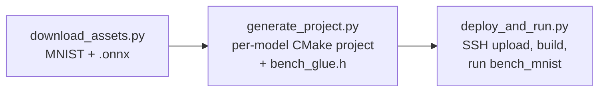

# MNIST KV260 demo

End-to-end MNIST inference demo for the KV260 FPGA platform.  Downloads the
MNIST test split and two pre-trained ONNX models (an MNIST convnet and a
LeNet variant) from a shared Google Drive folder, generates a self-contained
KV260 inference project for each model with `inference-scheduler`, copies
in the HLS driver sources, builds the project on the board over SSH, and
runs a benchmark that reports top-1 accuracy and per-image latency for
each.



## Layout

```
demo/mnist/
├── README.md
├── requirements.txt
├── mnist_config.json.example       — copy to mnist_config.json and edit
├── run_demo.py                     — one-shot orchestrator
├── scripts/
│   ├── download_assets.py          — fetch MNIST IDX + ONNX models
│   ├── generate_project.py         — schedule each ONNX → CMake project
│   └── deploy_and_run.py           — upload, build, run on KV260 over SSH
├── src/
│   └── bench_mnist.c               — benchmark host (compiled on the board)
├── assets/                         — populated by download_assets.py
│   ├── data/                       — MNIST IDX files
│   └── models/                     — ONNX files from Google Drive
└── build/                          — generator output and results.json
    ├── projects/<model>/           — generated CMake project per model
    │   ├── CMakeLists.txt          —   patched to build bench_mnist
    │   ├── include/inference.h     —   from inference-scheduler
    │   ├── src/inference*.c        —   from inference-scheduler
    │   ├── driver/                 —   HLS driver sources copied in
    │   └── test/
    │       ├── bench_mnist.c       —   copied from demo/mnist/src/
    │       └── bench_glue.h        —   generated; per-model glue + macros
    ├── logs/<model>.<step>.log     — per-step build/run output
    └── results.json                — final benchmark summary
```

`test/bench_glue.h` is **generated per model** by `scripts/generate_project.py`
— not committed in the repo.  Each copy bakes in the right
`INFERENCE_<INPUT>_SIZE` / `INFERENCE_<OUTPUT>_SIZE` macros and a
`bench_inference_init()` shim that calls `inference_init()` with the correct
number of UIO arguments for the kernels that model actually uses (e.g. 3 for
LeNet, 4 for the MNIST convnet).  That's why it's generated rather than
static: the I/O names and active-kernel set differ per model.

## Prerequisites

### Host (workstation that orchestrates the demo)

* Python 3.10+
* `pip install -r requirements.txt`
* HLS-generated driver sources for the four kernels.  These are produced by
  the top-level CMake build:

  ```bash
  # from the repo root
  mkdir -p build && cd build
  cmake -DAXI_BUS_WIDTH=32 ..
  make synthesize_kv260
  ```

  `AXI_BUS_WIDTH` must match the AXI master width of the cormorant overlay
  loaded on the board; the sample numbers below were measured at 32-bit.
  The default `mnist_config.json.example` assumes the standard build paths;
  override `local.driver_dirs` if you keep the build elsewhere.

### KV260 board

* Linux with the cormorant overlay loaded (so the four UIO devices appear).
  Verify on the board:

  ```bash
  cat /sys/class/uio/uio*/name
  # → fabric_vecop, fabric_matmul, fabric_conv, fabric_pool
  ```

* `gcc`, `cmake ≥ 3.19`, `make`
* XRT runtime available via `pkg-config xrt` or under `/opt/xilinx/xrt`
* Passwordless `sudo` for the SSH user (XRT requires root for
  buffer allocation).

## First-time setup

```bash
cd demo/mnist
python3 -m venv .venv
.venv/bin/pip install -r requirements.txt

cp mnist_config.json.example mnist_config.json
$EDITOR mnist_config.json          # set ssh.host, key_file, etc.
```

## Run the demo

One-liner that does download → generate → deploy:

```bash
.venv/bin/python run_demo.py
```

Or step-by-step (lets you iterate without re-downloading):

```bash
.venv/bin/python scripts/download_assets.py
.venv/bin/python scripts/generate_project.py
.venv/bin/python scripts/deploy_and_run.py --verbose
```

Sample output (host `~/projects/axi_demo/demo/mnist`, board at
`192.168.100.8`, full 10 000-image MNIST test set):

```
$ ./run_demo.py

=== download_assets ===
MNIST test split → demo/mnist/assets/data
  cached t10k-images-idx3-ubyte.gz (1648877 B)
  cached t10k-labels-idx1-ubyte.gz (4542 B)
  ✓ 10000 test images
ONNX models → demo/mnist/assets/models
  ✓ mnist-simplified.onnx  (25,853 B)
  ✓ lenet_simplified.onnx  (13,100,799 B)
done

=== generate_project ===
[mnist_convnet] scheduling mnist-simplified.onnx
Model      : demo/mnist/assets/models/mnist-simplified.onnx
Inputs     : ['Input3[1, 1, 28, 28]']
Outputs    : ['Plus214_Output_0[1, 10]']
Nodes      : 9
  [  0] Conv         [1, 1, 28, 28] x [8, 1, 5, 5] x [8] -> [1, 8, 28, 28]
  [  1] Relu         [1, 8, 28, 28] -> [1, 8, 28, 28]
  [  2] MaxPool      [1, 8, 28, 28] -> [1, 8, 14, 14]
  [  3] Conv         [1, 8, 14, 14] x [16, 8, 5, 5] x [16] -> [1, 16, 14, 14]
  [  4] Relu         [1, 16, 14, 14] -> [1, 16, 14, 14]
  [  5] MaxPool      [1, 16, 14, 14] -> [1, 16, 4, 4]
  [  6] Reshape      [1, 16, 4, 4] -> [1, 256]
  [  7] MatMul       [1, 256] x [256, 10] -> [1, 10]
  [  8] Add          [1, 10] x [1, 10] -> [1, 10]
[mnist_convnet] active kernels: VectorOPKernel, MatmulKernel, ConvKernel, PoolKernel

[mnist_lenet] scheduling lenet_simplified.onnx
Model      : demo/mnist/assets/models/lenet_simplified.onnx
Inputs     : ['import/Placeholder:0[1, 1, 28, 28]']
Outputs    : ['import/conv4last/BiasAdd:0[1, 10, 1, 1]']
Nodes      : 9
  [  0] Conv         [1, 1, 28, 28] x [32, 1, 5, 5] x [32] -> [1, 32, 28, 28]
  [  1] Relu         [1, 32, 28, 28] -> [1, 32, 28, 28]
  [  2] MaxPool      [1, 32, 28, 28] -> [1, 32, 14, 14]
  [  3] Conv         [1, 32, 14, 14] x [64, 32, 5, 5] x [64] -> [1, 64, 14, 14]
  [  4] Relu         [1, 64, 14, 14] -> [1, 64, 14, 14]
  [  5] MaxPool      [1, 64, 14, 14] -> [1, 64, 7, 7]
  [  6] Conv         [1, 64, 7, 7] x [1024, 64, 7, 7] x [1024] -> [1, 1024, 1, 1]
  [  7] Relu         [1, 1024, 1, 1] -> [1, 1024, 1, 1]
  [  8] Conv         [1, 1024, 1, 1] x [10, 1024, 1, 1] x [10] -> [1, 10, 1, 1]
Weights    : 3 large weight(s) written to build/projects/mnist_lenet/weights/
[mnist_lenet] active kernels: VectorOPKernel, ConvKernel, PoolKernel
wrote 2 project(s) under demo/mnist/build/projects

=== deploy_and_run ===

Preflight (local)
    OK      data/t10k-images-idx3-ubyte  7,840,016 B
    OK      data/t10k-labels-idx1-ubyte  10,008 B
    OK      ssh.host configured  192.168.100.8
    OK      project 'mnist_convnet' on disk
    OK        driver/xvectoropkernel.h  (VectorOPKernel)
    OK        driver/xmatmulkernel.h    (MatmulKernel)
    OK        driver/xconvkernel.h      (ConvKernel)
    OK        driver/xpoolingkernel.h   (PoolKernel)
    OK      project 'mnist_lenet' on disk
    OK        driver/xvectoropkernel.h  (VectorOPKernel)
    OK        driver/xconvkernel.h      (ConvKernel)
    OK        driver/xpoolingkernel.h   (PoolKernel)

Connecting to root@192.168.100.8:22 …
  connected

Preflight (remote)
    OK      cmake                                cmake version 3.22.1
    OK      make                                 GNU Make 4.3
    OK      gcc                                  gcc (Ubuntu 11.4.0-1ubuntu1~22.04.3) 11.4.0
    OK      xrt headers                          xrt via pkg-config
    OK      sudo / root                          passwordless sudo OK
    OK      uio (VectorOPKernel: fabric)         /dev/uio4
    OK      uio (MatmulKernel: fabric_matmul)    /dev/uio5
    OK      uio (ConvKernel:    fabric_conv)     /dev/uio6
    OK      uio (PoolKernel:    fabric_pool)     /dev/uio7
    OK      work_dir parent writable (/tmp)      /tmp/mnist_demo

Uploading dataset → /tmp/mnist_demo/data
  dataset  → OK       2.4s

mnist_convnet
  upload   → OK       0.4s
  cmake    → OK       1.1s
  make     → OK       3.0s
    bench_mnist: dataset=10000 images, iters=10000, warmup=50
                 input_numel=784, output_numel=10, classes=10
    progress: 10000/10000 (100.0%) acc=98.92% mean=4.546ms rate=219.8ips
  run      → OK                9.2s
    accuracy = 98.92%   mean = 0.898 ms   throughput = 1114.0 img/s

mnist_lenet
  upload   → OK       2.0s
  cmake    → OK       0.9s
  make     → OK       2.7s
    bench_mnist: dataset=10000 images, iters=10000, warmup=50
                 input_numel=784, output_numel=10, classes=10
    progress: 10000/10000 (100.0%) acc=97.35% mean=55.503ms rate=18.0ips
  run      → OK               80.2s
    accuracy = 97.35%   mean = 7.996 ms   throughput = 125.1 img/s

cleanup /tmp/mnist_demo
per-step logs written to demo/mnist/build/logs

  ── MNIST KV260 BENCHMARK ──

  Model          Status       Acc   mean(ms)    p50(ms)    p99(ms)        IPS
  ───────────────────────────────────────────────────────────────────────────
  mnist_convnet  OK       98.92%      0.898      0.897      0.904     1114.0
  mnist_lenet    OK       97.35%      7.996      7.994      8.027      125.1
```

Notable behaviour visible in the run:

- **Active-kernel set differs per model.** `mnist_convnet` uses all four
  HLS kernels because of its `MatMul` + `Add` classifier head;
  `mnist_lenet` uses only three (Conv / Pool / VectorOP) because its
  final classifier is a 1×1 `Conv` rather than a fully-connected layer.
  `generate_project.py` emits a different `bench_glue.h` for each so
  `inference_init()` gets the right number of UIO arguments.
- **`mnist_lenet` writes large weights to `weights/`.** The 1024×64×7×7
  fully-connected-equivalent `Conv` weight (~3 MB) and friends exceed
  the inline-array threshold, so they end up as external `.dat` files
  loaded at runtime by `fread()`.
- The full per-image timing series is also written to
  `build/results.json`.

## Useful options

| Flag | Effect |
|------|--------|
| `--models lenet` | restrict generate/deploy to a subset of models |
| `--skip-download` | reuse cached MNIST + ONNX files |
| `--skip-deploy` | only regenerate the local CMake projects |
| `--force-download` | re-fetch all assets |
| `--check-only` | run preflight checks for every stage and exit (no SSH uploads, no inference) |
| `--no-cleanup` (deploy script) | keep the remote work_dir for inspection |
| `--verbose` | print full build / run output for failed steps |

Each script also accepts `--check-only` on its own, useful for quickly
verifying just one stage:

```bash
.venv/bin/python scripts/deploy_and_run.py --check-only
# Preflight (local)
#     OK   data/t10k-images-idx3-ubyte  7,840,016 B
#     OK   project 'mnist_convnet' on disk
#     OK     driver/xconvkernel.h  (ConvKernel)
#     ...
# Preflight (remote)
#     OK   cmake                             cmake version 3.22.1
#     OK   gcc                               gcc (Ubuntu 11.4.0) …
#     OK   xrt headers                       xrt at /opt/xilinx/xrt
#     OK   uio (VectorOPKernel: fabric_vecop) /dev/uio0
#     ...
```

## Tuning the run

Edit `mnist_config.json`:

* **`run.iters`** — number of test images to evaluate.  `0` means the full
  10 000-image test set.
* **`run.warmup`** — how many inferences to discard before the timed window.
* **`run.use_sudo`** — set to `false` if you SSH in directly as root.
* **`remote.cmake_args`** — extra `-D…` flags forwarded to the cross-build,
  e.g. `["-DBENCH_INPUT_BIAS=-128"]` if your model expects centred input.

## Troubleshooting

* **`ImportError: paramiko`** — `pip install -r requirements.txt`.
* **`gdown failed`** — Google Drive sometimes throttles.  Run
  `python3 -m gdown --folder <url> -O assets/models/` manually, or download
  the `.onnx` files via a browser and place them in `assets/models/`.
* **`Driver file not found: driver/xconvkernel.h`** during cmake — the HLS
  driver sources weren't on this host.  Either run `make synthesize_kv260`
  in the repo build, or point `local.driver_dirs` at an existing build
  output.
* **`UIO device 'fabric_pool' not found`** — the loaded overlay does not
  expose all four kernels.  Update `remote.uio_devices` to the names that
  appear in `cat /sys/class/uio/uio*/name`.
* **Accuracy near 10 %** — almost always an input encoding mismatch.  Try
  `BENCH_INPUT_BIAS=-128` in `remote.cmake_args` (centred input) or
  re-train / re-export the model with the expected input range.
