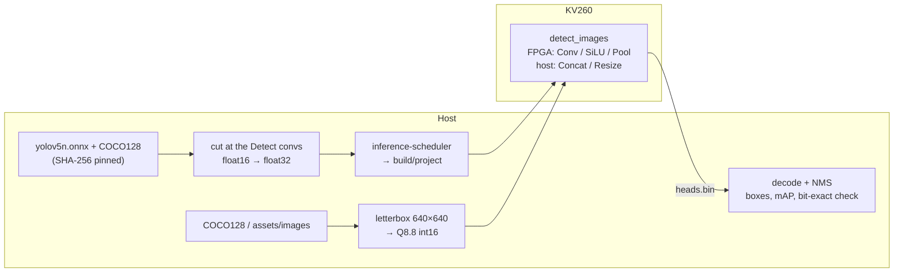

# Object detection KV260 demo (YOLOv5n)

Detects COCO's 80 object classes in still images with **YOLOv5n**
(Ultralytics v7.0, 640 × 640).  The network runs on this repo's own kernels:
ConvKernel for the 60 convolutions, VectorOPKernel for SiLU and the residual
Adds, PoolingKernel for the SPPF max-pools.  No Vitis-AI / DPU is involved.

The FPGA graph ends at the three Detect convolutions.  The decode (sigmoid,
grid, anchors) and NMS run on the host, as detection post-processing
usually does.  The demo draws the boxes on every image, reports latency,
compares mAP on the COCO128 labels with the float model, and checks the
board's head maps bit for bit against the scheduler's simulation.

The study and the numbers are in
[doc/plans/YOLO_PLAN.md](../../doc/plans/YOLO_PLAN.md).



## Quick start

```bash
cd demo/object_detection
cp object_detection_config.json.example object_detection_config.json   # edit ssh and driver_dirs
PY=../../inference-scheduler/.venv/bin/python
$PY run_demo.py --stop-server          # the chat server owns the FPGA: stopped for the run, restarted after
```

`--stop-server` is only needed when the chat server (`demo/chat/`) runs.
`--skip-download` reuses the fetched assets.  Put your own JPG / PNG files in
`assets/images/`: they run after the COCO128 images, without labels.

What it needs:
- the board set up as in the top-level README, with the production bitstream
  loaded;
- the kernels' driver sources: `make driver_vectorop_rtl driver_conv_rtl
  driver_pool_rtl` in `build/`, referenced by `local.driver_dirs`.

## What it does

| step | script | output |
|---|---|---|
| fetch | `scripts/yolo_study.py fetch` | `assets/models/yolov5n.onnx` (v7.0, SHA-256 `04f0e55c…`), `assets/coco128/`, and `yolov5n_raw.onnx`: the graph cut at `/model.24/m.{0,1,2}/Conv`, widened from the release's float16 to float32 (exact) |
| prepare | `scripts/prepare.py` | `build/data/images.bin`: the first `run.images` COCO128 images (default 16) + `assets/images/*`, letterboxed as YOLOv5 does (scale to fit, grey 114 padding) and encoded as raw Q8.8; `manifest.txt`, `meta.json` |
| generate | `scripts/generate_project.py` | `build/project`: the inference project, `test/detect_images.c` and its glue, the drivers |
| board | `scripts/deploy_and_run.py` | upload, `cmake` + `make detect_images` on the board, the run (per-image latency streamed), `build/results/heads.bin` and `run.json`; `--profile` adds per-layer times |
| results | `scripts/postprocess.py` | decode + class-aware NMS (conf 0.25, IoU 0.45) → `build/results/detections.json` and `annotated/*.jpg`; mAP against the labels (val.py's settings) for the board and float; the first `run.check_images` (default 2) head maps against the simulation → `build/results.json` |

## Results (KV260, bitstream `8599aa7a5f12`, 2026-10-08)

**Speed.**  YOLOv5n's FPGA graph takes **63.9 ms per image (15.6 FPS)**.
Per-layer profile (the kernel lanes overlap, so the parts add up to more
than the total):

| part | ms |
|---|---:|
| ConvKernel (60 convs) | 45.1 |
| VectorOPKernel SiLU (57) | 12.5 |
| the stem's SpaceToDepth (host) | 4.9 |
| Concat (host, 13) | 4.2 |
| VectorOPKernel Add (7) | 3.7 |
| Resize (host, 2) | 1.8 |
| PoolingKernel (3) | 1.0 |

**Correctness.**  The board's head maps equal the scheduler's simulation of
the generated C, bit for bit.

**Quality** on all 128 COCO128 images (`scripts/yolo_study.py study`):

| | mAP@0.5 | mAP@0.5:0.95 |
|---|---:|---:|
| float (onnxruntime) | 0.545 | 0.349 |
| **FPGA** (Q8.8 datapath) | **0.543** | **0.343** |

At conf 0.25 the FPGA finds 532 boxes, of which 510 match a float box: 91 %
of float's 561.  COCO128 is COCO train images, so the absolute mAP is
optimistic; the comparison is what counts.

Example: `build/results/annotated/000000000036.jpg` shows a person (0.73)
and an umbrella (0.26).

## Layout

```
demo/object_detection/
├── run_demo.py                         — the steps above, build/results.json
├── object_detection_config.json.example
├── scripts/
│   ├── yolo_post.py      — letterbox, YOLOv5 decode, NMS, val.py's mAP (numpy)
│   ├── yolo_study.py     — fetch / validate / study (the model study, YOLO_PLAN §3)
│   ├── prepare.py        — images -> build/data (Q8.8)
│   ├── generate_project.py
│   ├── deploy_and_run.py
│   └── postprocess.py
└── src/detect_images.c   — the board host: inference_run per image, head maps, latency
```

The assets and `build/` are not tracked.  The model is AGPL-3.0
(Ultralytics); the COCO128 archive ships a GPL-3.0 license; its images are
COCO's, from Flickr under their own licenses.
