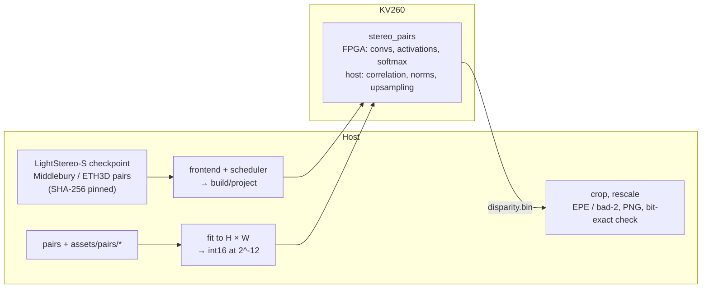

# Stereo depth KV260 demo (LightStereo-S)

Turns a rectified stereo pair into a disparity map with **LightStereo-S**
(OpenStereo, StereoAnything weights).  Depth then follows from the
camera: depth = f · B / disparity.  The network runs on this repo's own
kernels:
- **ConvKernel** runs the MobileNetV2 backbone and FPN, the 2D cost
  aggregation, the stripe attention and the polyphase deconvolutions.
- **VectorOPKernel** runs ReLU6 / LeakyReLU, the residual adds and the
  attention product, and both softmaxes on its softmax unit.
- **MatmulKernel** runs the disparity regression.
- **The host** runs the correlation volume, the instance norms and the
  context upsampling, as C code inside the library.

The network is compiled from the checkpoint by the scheduler's LightStereo
frontend (`inference-scheduler/src/stereo.py`).  Every tensor carries a
power-of-two exponent from the study's calibration, and the board's
disparity maps are bit-exact with the scheduler's simulation.  The study,
the design and the numbers are in
[doc/plans/STEREO_PLAN.md](../../doc/plans/STEREO_PLAN.md).



## Quick start

```bash
cd demo/stereo_depth
cp stereo_depth_config.json.example stereo_depth_config.json   # edit ssh and driver_dirs
PY=../../inference-scheduler/.venv/bin/python
$PY run_demo.py --stop-server          # the chat server owns the FPGA: stopped for the run, restarted after
```

`--stop-server` is only needed when the chat server (`demo/chat/`) runs.
`--skip-download` reuses the fetched assets, `--pairs 0` runs all 42 pairs
with ground truth, and `--profile` adds per-layer times.  Put your own
rectified pairs in `assets/pairs/<name>/left.png` and `right.png`: they
run after the dataset pairs, without ground truth.

What it needs:
- the board set up as in the top-level README, with the production bitstream
  loaded (the softmax unit: `8599aa7a5f12` or later);
- the kernels' driver sources: `make driver_vectorop_rtl driver_matmul_rtl
  driver_conv_rtl` in `build/`, referenced by `local.driver_dirs`.

No torch is needed: the frontend reads the PyTorch checkpoint with the
standard library, and the exponents come from the checked-in
`lightstereo_s_formats.json`.

### A RealSense camera

A D4xx's two infrared cameras are a rectified stereo pair.  `run_demo.py
--capture` takes them on the board (`scripts/capture.py` runs
`src/board/realsense_capture.py` there: infrared 1 and 2, the camera's
depth, the calibration, the emitter on and off), runs only those pairs and
writes `<name>_depth.png`: the left image, the network's depth
(fx · baseline / disparity) and the camera's own depth.  On the board
(2026-10-09, STEREO_PLAN §4.4) a D435 pair took 657 ms (599 with the depthwise slices,
STEREO_PLAN §4.5); with the IR projector on, the network's depth is within 10 % of the camera's own on
98 % of the pixels (median difference 2.4 %), without it on 77 % (4.3 %):
blank walls have no texture to match.

The right camera needs firmware **5.17.3.10** (or a USB 3 link).  librealsense
makes infrared 2 by splitting the interleaved `Y8I` / `Y12I` formats; firmware
5.12.3 offers those on USB 3 only, 5.17.3.10 on USB 2 too.  On the KV260
(kernel 5.15, pyrealsense2 2.56.5) the pair then streams at 640 × 480 at 30 fps over USB 2 (26.5 fps measured, 2026-10-09); on
a laptop with kernel 7.0 the same USB 2 frames arrive cut at 64 KiB
(`uvcvideo`), so capture on the board.  `lsusb -t` shows the link: 480M is
USB 2, 5000M / 10000M is USB 3.

## What it does

| step | script | output |
|---|---|---|
| fetch | `scripts/stereo_assets.py` | `assets/ckpt/StereoAnything-LightStereo_S.pt` (Hugging Face `XiandaGuo/OpenStereo` at a pinned revision), Middlebury MiddEval3 quarter resolution and ETH3D low-res two-view (SHA-256 checked) |
| prepare | `scripts/prepare.py` | `build/data/pairs.bin`: `run.pairs` pairs with ground truth (Middlebury and ETH3D alternating) + `assets/pairs/*`.  Each pair is fitted to `run.height` × `run.width` as OpenStereo evaluates (scaled down when larger, padded at the top and right with edge pixels), ImageNet-normalised and stored as raw int16 at 2^-12.  Also `manifest.txt` and `meta.json` |
| generate | `scripts/generate_project.py` | `build/lightstereo_s.onnx` (the frontend's graph with its exponents) and `build/project`: the inference project, `test/stereo_pairs.c` and its glue, the drivers |
| board | `scripts/deploy_and_run.py` | upload, `cmake` + `make stereo_pairs` on the board, the run (per-pair latency streamed), `build/results/disparity.bin` and `run.json`; `--profile` adds per-layer times |
| results | `scripts/postprocess.py` | per pair the disparity at the pair's resolution: `build/results/disparity/<name>.png` (the left image beside the disparity) and `.pfm`.  EPE and bad-1 / bad-2 against the ground truth.  The first `run.check_pairs` maps bit for bit against the scheduler's simulation → `build/results.json` |

## Results (KV260, bitstream `8599aa7a5f12`, 2026-10-09)

**Speed.**  At 640 × 480 a pair takes **599 ms (1.67 FPS)**.  At 320 × 256
(`run.height` / `run.width`) it takes 160 ms (6.3 FPS), with coarser
disparities.  Most of the time goes to the MobileNetV2-style layers: 1 × 1
convs 165 ms, depthwise convs 176 ms, ReLU6 55 ms (the profile is in
STEREO_PLAN §4.3 and §4.5).  The depthwise convs run as 16- / 32- /
64-channel calls where that is faster (`--dw-slice`, STEREO_PLAN §4.5):
659 ms per pair before.

**Correctness.**  The board's disparity maps equal the scheduler's
simulation of the generated C, bit for bit.

**Quality** on all 42 pairs with ground truth (`--pairs 0`; each pair is
fitted to 640 × 480 and its disparity mapped back to the pair's resolution):

| | EPE (px) | bad-1 | bad-2 |
|---|---:|---:|---:|
| float on the same input (`stereo_study.py study --fit 480 640`) | 0.650 | 11.81 % | 4.87 % |
| **FPGA** | **0.667** | **12.21 %** | **4.94 %** |

At each pair's native resolution the simulation of the graph scores EPE
0.627 px against float's 0.633 (`sim_quality.py`).  Per-channel weight
exponents on 28 convs (`run.per_channel` 0.05) are what bring it to float's
level; with per-tensor exponents only, EPE is 0.705.

Example: `build/results/disparity/middlebury_Adirondack.png` shows the
left image beside its disparity.

## Layout

```
demo/stereo_depth/
├── run_demo.py                     — the steps above, build/results.json
├── stereo_depth_config.json.example
├── lightstereo_s_formats.json      — the exponents (stereo_study.py calibrate)
├── scripts/
│   ├── stereo_assets.py   — pinned downloads, the formats file (standard library)
│   ├── prepare.py         — pairs -> build/data (int16 at 2^-12)
│   ├── generate_project.py
│   ├── deploy_and_run.py
│   ├── postprocess.py     — disparity maps, EPE / bad-2, the bit-exact check
│   ├── capture.py         — RealSense pairs from the board -> assets/pairs (run_demo.py --capture)
│   ├── sim_quality.py     — the implemented graph's quality on the 42 pairs (simulation)
│   ├── stereo_study.py    — the model study (torch; STEREO_PLAN §1–§3)
│   └── stereo_proxy.py    — the study's latency proxy
└── src/
    ├── stereo_pairs.c     — the board host: inference_run per pair, disparity maps, latency
    └── board/realsense_capture.py — runs on the board: a pair per emitter setting + calibration
```

The assets and `build/` are not tracked.  OpenStereo's code is for academic
use only ("people cannot use this code for anything that might be considered
commercial use"), and its weights carry no license of their own: research
and demo use only.  Middlebury and ETH3D have their own terms.
