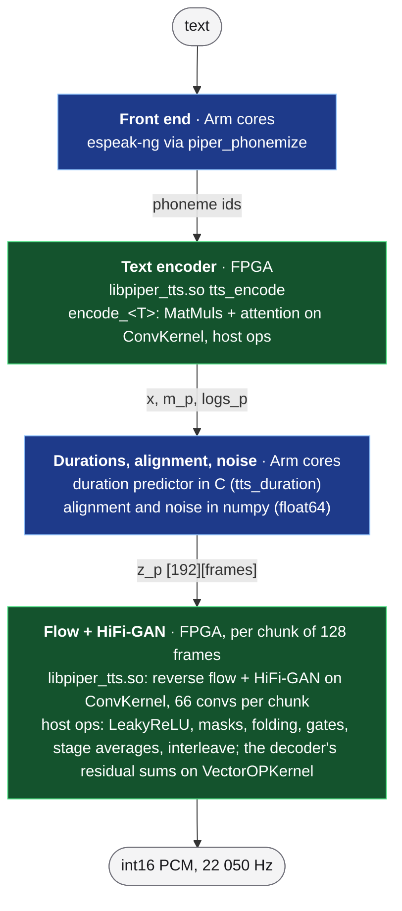

# Text to speech on the KV260 (Piper)

This directory runs Piper (VITS) text to speech with the
[`en_US-lessac-medium`](https://huggingface.co/rhasspy/piper-voices) voice
on this repo's FPGA kernels, and serves it as OpenAI's
`POST /v1/audio/speech` in the [chat server](../chat/doc/TEXT_TO_SPEECH.md).

Plan, study and results: [`doc/plans/TTS_PLAN.md`](../../doc/plans/TTS_PLAN.md).
- §3: the numeric study.
- §4: the library and its board gate.
- §5: the server.
- §6: the text encoder on the FPGA.
- §7: the duration predictor in C.



## Results (2026-09-30)

- **Output:** bit-exact with the specification on the board.
- **Library speed:** about 0.7 s per 1.49 s chunk, an RTF of 0.52 on a
  6.9 s sentence.  Since 2026-10-07 (kernels at 250 MHz, the decoder's
  residual sums on VectorOPKernel — OFFLOAD_PLAN §4.2): 0.27 s per chunk,
  RTF 0.20.
- **Text encoder:** 68 ms for 88 phoneme ids (numpy: 335 ms), bit-exact.
- **Duration predictor:** 49 ms for 88 ids (numpy: ~160 ms), bit-exact.
- **Through the chat server:** first audio after 1.0–1.5 s, RTF 0.58–0.79
  end to end.
- **Memory:** 51 MiB of CMA.
- **Quality:** the int16 datapath is within 0.19 dB log-mel of float (§3);
  with the int16 encoder, 0.37 dB and 0.35% of the durations changed by
  one frame (§6).

## Samples

Listen to the voice, spoken by the board through the chat server
(`/v1/audio/speech`, the deployed `libpiper_tts.so`; mp3, 64 kbps mono,
22 050 Hz), on 2026-10-02:

| Sample | Text | Length |
|---|---|---|
| ▶ [hello.mp3](samples/hello.mp3) | "Hello! This voice comes from a Kria KV260 board. The neural network that speaks runs on its FPGA and its Arm cores, in sixteen-bit fixed point." | 9.3 s |
| ▶ [paragraph.mp3](samples/paragraph.mp3) | "Cormorant turns neural networks into C programs that drive four hardware kernels. On this one board they answer questions about a document, chat with small language models, talk about pictures, and read their answers aloud, like this one." | 12.9 s |
| ▶ [question.mp3](samples/question.mp3) | "Can you tell that this sentence was spoken by a machine? Questions rise at the end. Statements fall." | 5.8 s |
| ▶ [fast.mp3](samples/fast.mp3) | "The same voice at one and a half times the normal speed, for when you are in a hurry." (`speed` 1.5) | 3.6 s |

Every sample spans several 1.49 s chunks, which join bit for bit.
`samples/manifest.json` records each text, speed and length.
`python3 demo/tts/scripts/make_samples.py --url http://<board>:8000` makes
them again from a running server (the default seed 0 makes the same
audio).

## Files

```
demo/tts/
├── src/tts_api.{c,h}          — libpiper_tts.so: tts_open / tts_encode / tts_synthesize_chunk / tts_close
├── src/tts_dp.{c,h}           — the duration predictor in C (float64, 4 threads; tts_duration)
├── src/tts_bench.c            — the board gate's runner (timing, repetitions, re-open, profile)
├── scripts/
│   ├── piper_vits.py          — float reference, the bit-level specifications (chunk_forward,
│   │                            synthesize_chunked; encoder_forward; duration_predictor_seq) and the host front end
│   │                            (front_end); also runs in the server
│   ├── piper_study.py         — fetch / phonemize / validate / calibrate / study / encoder / costs (TTS_PLAN §3, §6)
│   ├── generate_tts_project.py — src/piper.py's chunk + encode_<T> entries -> build/piper_project
│   │                            (+ test/tts_glue.h, weights/dp.dat, weights/voice.json)
│   ├── tts_host_emu.py        — the generated C on the host vs the spec; --lib-check: the chat backend over it
│   ├── tts_board.py           — build / install on the board, board gate (bit-exact, timing, profile)
│   ├── tts_speech_check.py    — /v1/audio/speech on the board vs the same pipeline on the host
│   ├── make_samples.py        — the voice samples of the docs (samples/), from a running chat server
│   ├── audio8_study.py, tts_screen.py — the Audio8 study (NO-GO) and the candidate screen (TTS_PLAN §1–§2)
│   └── requirements-phonemize.txt — phonemizer-fork + espeakng-loader for the study's phonemize step
├── samples/                   — voice samples spoken by the board (mp3) + manifest.json
└── assets/                    — not in git: the voice, texts.json, exponents.json, study WAVs
```

The scheduler parts are in `inference-scheduler/`:
- `src/piper.py`: the frontend.
- `src/tts_nodes.py`: the host ops.
- `src/numeric.py`: Conv weight encoding.
- Tests: `test/test_piper.py`, `test_tts_ops.py`, `test_conv_exp.py`.

## Commands

```bash
PY=inference-scheduler/.venv/bin/python
# 1. the voice and its calibrated exponents (TTS_PLAN §3 "Commands")
$PY demo/tts/scripts/piper_study.py fetch
/mnt/data/tts_venv/bin/python demo/tts/scripts/piper_study.py phonemize    # venv from requirements-phonemize.txt
$PY demo/tts/scripts/piper_study.py calibrate
$PY demo/tts/scripts/piper_study.py encoder          # the text encoder's exponents (TTS_PLAN §6)
# 2. the library project and its host checks
$PY demo/tts/scripts/generate_tts_project.py         # -> demo/tts/build/piper_project, 4 s
$PY demo/tts/scripts/tts_host_emu.py                 # the generated C == the spec on real sentences, 60 s
$PY demo/tts/scripts/tts_host_emu.py --lib-check     # the chat server's backend over a host-built library
# 3. the board (the chat server owns the FPGA: stop it first)
$PY demo/chat/deploy.py --stop
$PY demo/tts/scripts/tts_board.py --profile --reopen # gate + install, ~2 min
$PY demo/chat/deploy.py                              # with "piper" in chat_config.json server.backends
$PY demo/tts/scripts/tts_speech_check.py             # end to end, ~1 min
```

## Notes

- **Chunks.**
  - Each pass computes 256 flow frames and a 192-frame decoder window for
    128 output frames; the 64 frames of context on each side cover the
    receptive field.
  - That context is also the main cost: the ConvKernel spends 0.5 s of
    the 0.7 s per chunk.
  - Larger chunks would cut the overlap, at the price of first-audio
    latency (TTS_PLAN §4, "Levers").
- **The front end on the A53.**
  - The text encoder runs on the FPGA, the duration predictor as C code
    in the library (139 ms for 268 ids; numpy took ~420).
  - Only the length regulator and the noise stay in numpy.
  - History, from when the numpy front end ran on the board (TTS_PLAN §5):
    - numpy falls back to a naive loop for a matmul with a strided
      operand, 145× slower there, so `piper_vits.conv1d` makes its taps
      contiguous;
    - GELU used `erf_fast` with in-place ufuncs instead of `math.erf`
      element by element.

    Both still matter for the float reference and the study on the host.
- **License:** the voice is MIT, but its training data (Blizzard 2013
  Lessac) has its own license.  Check it before shipping.
