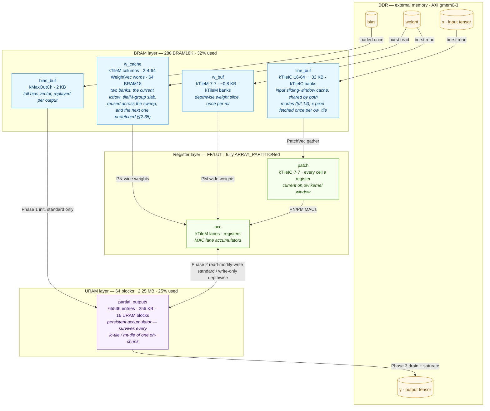

# Convolutional Kernel — Detailed Implementation Description

## Overview

`ConvKernel` is a Vitis HLS kernel implementing ONNX-compliant 2-D convolution on NCHW tensors. It is one of four hardware kernels in the `axi_demo` project, targeting the Xilinx KV260 FPGA. The kernel supports standard convolution (group=1) and depthwise convolution (group=in_ch), optional per-channel bias, padding, stride, and dilation. A two-level channel-tiling strategy (output-channel tile kTileM × input-channel tile kTileIC) enables II=1 throughput via a flat-counter lane-rotation scheme.

---

## 1. AXI Interface

**Memory ports (m_axi):**

| Bundle | Port | Direction | Description |
|--------|------|-----------|-------------|
| `gmem0` | `x` | Read | Input feature map `[batch][in_ch][in_h][in_w]` — `hls::burst_maxi<ap_uint<128>>`, 8 lanes per beat; a (row, channel) run is requested as the whole words that cover it, the out-of-run lanes of its first / last word are dropped (§2.39) |
| `gmem1` | `weight` | Read | Filter weights (layout depends on mode) — 128-bit `burst_maxi` (§2.32) |
| `gmem2` | `bias` | Read | Per-channel bias `[out_ch]` (not accessed when `has_bias=0`) — 128-bit `burst_maxi` |
| `gmem3` | `y` | Write | Output feature map `[batch][out_ch][out_h][out_w]` — `hls::burst_maxi<ap_uint<128>>`; each channel run is re-aligned onto DDR words and its first / last word is written with byte strobes so neighbouring lanes stay intact (§2.38) |

All four buffers must be 16-byte aligned (the scheduler aligns every
buffer to 64 bytes); `y` may be read by the kernel's writer only through
its strobes — lanes past the tensor's end inside the last word are never
written.

**AXI-Lite control registers (`s_axilite bundle=ctrl`) — 21 registers total:**

| Register | Type | Description |
|----------|------|-------------|
| `x`, `weight`, `bias`, `y` | `uint64_t` | Physical DDR base addresses |
| `batch` | `unsigned` | Batch size N |
| `in_ch`, `in_h`, `in_w` | `unsigned` | Input tensor dimensions |
| `out_ch`, `out_h`, `out_w` | `unsigned` | Output tensor dimensions |
| `kh`, `kw` | `unsigned` | Filter kernel size |
| `stride_h`, `stride_w` | `unsigned` | Convolution stride |
| `dilation_h`, `dilation_w` | `unsigned` | Dilation |
| `pad_top`, `pad_left` | `unsigned` | Padding (top row / left column) |
| `has_bias` | `unsigned` | 0 = skip bias; 1 = add per-channel bias |
| `is_depthwise` | `unsigned` | 0 = standard (group=1); 1 = depthwise (group=in_ch) |

64-bit AXI addressing is configured in the synthesis TCL (`config_interface -m_axi_addr64`).

---

## 2. Supported Modes

### Standard Convolution (`is_depthwise=0`)

- Weight layout in DDR (§2.32/§2.34, tile-major, packed by the scheduler): `[out_ch][ceil(in_ch/kTileIC)][kh][kw][lanes]` — the input-channel lanes of one kernel position are adjacent so the 128-bit weight port fills one 256-bit cache word per two beats.  `lanes` is 16 for every tile except the last, which is a half tile of 8 lanes (one beat per position) when it has 8 or fewer valid channels; lanes beyond `in_ch` are zero.  Element index: `m·per_m + ict·kh·kw·16 + (khi·kw + kwi)·lanes(ict) + ic_l` with `per_m = kh·kw·((ic_tiles−1)·16 + last_lanes)` (`conv_weight_index()` / `conv_weight_per_m()` in ConvKernel.h).
- Each output channel is the inner product of the full input-channel stack against the corresponding filter
- Supported: bias, padding, stride, dilation, multi-tile M and IC

### Depthwise Convolution (`is_depthwise=1`)

- Weight layout in DDR (§2.32): `[out_ch][conv_dw_stride(kh,kw)]` with `conv_dw_stride = kh·kw` rounded up to the port's 8 lanes, so every channel starts on a 128-bit word; position index `khi·kw + kwi`.
- Each output channel convolves with exactly one input channel (group=in_ch)
- No IC-tile loop; each tile lane operates on its own input channel slice
- Supported: bias, padding, stride, dilation

**Unsupported:** grouped convolution with 1 < group < in_ch is rejected by the scheduler.

---

## 3. Compile-Time Configuration (`Config.h.in`)

| Constant | Default | Purpose |
|----------|---------|---------|
| `Data_t` | `ap_fixed<16,8>` | Element type (2-byte, range \[-128, 127.996\]) |
| `AccData_t` | `ap_fixed<32,16>` | Accumulator type (wider range, avoids overflow) |
| `kTileM` | 8 | Output-channel tile width; must be a power of 2; also the depthwise PM unroll factor |
| `kTileIC` | 16 | Input-channel tile width; must be a power of 2; also the standard PN unroll factor |
| `kMaxKH` | 7 | Maximum compile-time kernel height |
| `kMaxKW` | 7 | Maximum compile-time kernel width |
| `kMaxInCh` | 1024 | Sizes `bias_buf` (line_buf is IC-tiled, doesn't depend on this) |
| `kMaxOutCh` | 1280 | Sizes `bias_buf` in `bias_producer` |
| `kMaxLineBufCols` | 64 | Column capacity of `line_buf`; power of 2 (used as bitmask). Caps `ow_per_tile`, NOT `in_w` — wider inputs split into multiple `ow_tile`s |
| `kMaxLineBufRows` | 16 | Row capacity of `line_buf`; power of 2 (used as bitmask) |
| `kMaxAccPersistEntries` | 65536 | `partial_outputs[]` buffer size; one output row (`out_w·out_ch`) must fit. Buffer is bound to **URAM** — each 4096 entries spends one URAM block, so this trades URAM, not BRAM |
| `kMaxMperGroup` | 4 | Max number of mt-tiles cached together in the standard path's (ict, M-group) weight slab |

If Vitis HLS headers are unavailable at CMake configure time, both types fall back to `float`.

**Runtime constraints validated by the inference scheduler:**

- `in_ch ≤ kMaxInCh`, `out_ch ≤ kMaxOutCh`
- `(kh-1)·dilation_h + 1 ≤ kMaxLineBufRows` *(one kernel-height window must fit)*
- `(kw-1)·dilation_w + 1 ≤ kMaxLineBufCols` *(one kernel-width window must fit)*
- `out_w · ceil(out_ch/kTileM)·kTileM ≤ kMaxAccPersistEntries` *(one kTileM-padded output row fits; was `out_w · out_ch` before the §2.23 padded layout, and the stricter `out_h · out_w · out_ch ≤ …` before oh-chunking)*

`in_h`, `in_w`, and `out_h` are NOT capped — wider / taller layers are handled by transparent tiling:

- `out_h · out_w · out_ch > kMaxAccPersistEntries` triggers **oh-chunking** (output split into `oh_per_chunk = floor(kMaxAccPersistEntries / (out_w·out_ch))` rows; §5.3).
- `in_w > kMaxLineBufCols` triggers **ow-tiling** (output column axis split so each tile's iw window fits the line buffer; §5.4).
- `m_tiles > kMaxMperGroup` triggers **M-grouping** (weight cache holds one M-group at a time; §5.5).

All three split axes accept duplicate DDR reads at tile/chunk boundaries — the explicit trade-off in exchange for unbounded layer dimensions.

**Chunk-height cap under M-grouping (kernel-internal, not a scheduler constraint).**  With more than one M-group the patch producer replays each chunk's `(oh, ow)` sweep from `line_buf` once per group without touching DDR, so every input row the chunk needs must still be resident when the second group restarts at the chunk's first `oh`.  `line_buf` holds only `kMaxLineBufRows` rows (circular slot `ih & (kMaxLineBufRows-1)`), hence `compute_conv_geometry()` additionally clamps

```
(oh_per_chunk - 1)·stride_h + (kh-1)·dilation_h + 1  ≤  kMaxLineBufRows      (standard path, num_m_groups > 1)
```

i.e. `oh_per_chunk ≤ (kMaxLineBufRows - ((kh-1)·dilation_h + 1)) / stride_h + 1`.  Layers that hit this cap run more, shorter chunks (weights and bias re-streamed per chunk) but keep the read-`x`-once property.  Depthwise runs a single group and is unaffected.  Before this cap existed, any layer with `out_ch > kTileM·kMaxMperGroup` and a chunk spanning more than `kMaxLineBufRows` input rows (e.g. every ResNet-18 stage-1 conv, the 7×7 stem) silently produced wrong outputs for groups ≥ 1; see CONV_OPTIMISATION.md §2.21.

---

## 4. On-Chip Memory

The kernel stages data through **four memory layers** — DDR, URAM, BRAM,
and registers — each a smaller/faster cache of the layer below it.  The
diagram shows every on-chip cache, the layer it is bound to, its
capacity, and what it holds.  Post-§2.14 the design uses **48 % LUT,
32 % BRAM, 25 % URAM** — LUT is the tightest layer; BRAM and URAM both
keep headroom for wider tiling.



The two largest caches are the structural cost of the tiling strategy:
`w_cache` (BRAM) holds one weight slab so DDR weight reads are amortised
across the spatial sweep (§5.5), and `partial_outputs` (URAM) holds one
oh-chunk's accumulators so the input is read once across all ic-tiles
(§5.3).  Sizes scale with the `Config.h` knobs in §3 — `kMaxMperGroup`
sizes `w_cache`, `kMaxAccPersistEntries` sizes `partial_outputs`,
`kMaxLineBufRows/Cols` size `line_buf`.

Buffers are declared inside `process_conv_kernel_tile` (re-allocated per inner
iteration; HLS hoists them to BRAM/registers).

```cpp
// Per-(oh, ow, mt) scratch — a banked register file (§2.18).

Data_t    patch[kTileIC][kMaxKH][kMaxKW];
#pragma HLS ARRAY_PARTITION variable=patch complete dim=1
#pragma HLS BIND_STORAGE variable=patch type=RAM_2P impl=lutram
// Only the bank dim is partitioned → kTileIC independent LUTRAMs, one
// per ic-lane, so the ic_l UNROLL reads every bank in parallel while
// (khi,kwi) addresses the RAM. Fully partitioning all three dims (the
// pre-§2.18 form) made (khi,kwi) drive a wide combinational read mux.
// Standard: patch[ic_l][khi][kwi] for current (oh, ow, ic_tile).
// Depthwise: patch[m1][khi][kwi]  for current (oh, ow, m_tile);
// the [kTileIC] depth covers kTileM lanes (kTileM ≤ kTileIC).

// STANDARD-path weight cache: two (ict, M-group) slabs (ping-pong, §2.35).
WeightVec w_cache[kTileM][kWCacheWords];      // WeightVec = kTileIC lanes (256 bit)
#pragma HLS ARRAY_PARTITION variable=w_cache complete dim=1
#pragma HLS AGGREGATE       variable=w_cache compact=bit
#pragma HLS BIND_STORAGE    variable=w_cache type=RAM_2P impl=BRAM
// One RAM column per m1; the word address is w_cache_addr(bank, tile,
// khi, kwi) = (bank·kMaxMperGroup + tile)·64 + khi·8 + kwi (ConvMacGrid.h,
// power-of-two strides so it is a bit concatenation).  The fused sweep
// reads all kTileM columns of bank wbank at one address per cycle
// (mac_grid_step) while the prefetch writes the NEXT slab into bank
// !wbank — one read + one write port per RAM_2P column.  The store
// selects its column with an explicit unrolled `if (c == m1)`: a runtime
// index into the partitioned dimension makes HLS emit two stores per
// RAM (II=2) or split the bank dimension into a second RAM set.

// DEPTHWISE-path weight buffer (different shape — no in_ch dimension):
Data_t    w_buf[kTileM][kMaxKH][kMaxKW];
#pragma HLS ARRAY_PARTITION variable=w_buf complete dim=1
// dim=1 (m1, PM axis) partitioned complete → kTileM parallel banks.
// accumulate_depthwise reads kTileM weights per cycle along the m1 axis.

AccData_t acc[kTileM];
#pragma HLS ARRAY_PARTITION variable=acc complete dim=0
// All kTileM accumulators in registers (independent).

// Per-(ni, chunk) persistent state — chunk-scoped, lives in the consumer:
AccData_t partial_outputs[kMaxAccPersistEntries];
#pragma HLS bind_storage variable=partial_outputs type=RAM_2P impl=URAM
// Holds chunk_oh_count·out_w·out_ch accumulators that survive across
// ic-tiles (standard) or mt-tiles (depthwise) within a chunk.  Indexed
// by (oh_local·out_w + ow)·out_ch + m_off + m1 where oh_local = oh - oh_start.
// Bound to URAM — the largest on-chip buffer, moved off scarce BRAM
// into the otherwise-idle URAM pool (16 of 64 URAM blocks at the
// 65536-entry default).  RAM_2P: Phase 1/3 use one port, Phase 2's
// read and write are separate II=1 sub-loops, so no port conflict.

// Per-(ni, chunk, ct, ow_tile) line buffer — lives in the unified
// input_patch_producer (§2.14).  Both row and column dims are circular:
//     row_slot = ih & (kMaxLineBufRows - 1)
//     col_slot = iw & (kMaxLineBufCols - 1)
Data_t    line_buf[kTileIC][kMaxLineBufRows][kMaxLineBufCols];
#pragma HLS ARRAY_PARTITION variable=line_buf complete dim=1
// dim=1 partitioned complete → kTileIC independent banks so Phase 2
// can gather a full PatchVec (all kTileIC channel lanes) in one cycle.
// One buffer serves both modes: standard fills all kTileIC banks,
// depthwise fills only banks [0, kTileM) and the gather masks the
// rest to 0.  Within (chunk, ct, ow_tile) each input pixel in the
// tile's iw range is fetched from DDR exactly once; reloaded per
// ow_tile, with the (kw-1)·dilation_w-col overlap re-fetched.
```

**Channel-packed patch stream (§2.12).**  The patch path
(`input_patch_producer → consumer`) carries a
`PatchVec` — a `kTileIC`-lane struct (`Data_t lane[kTileIC]`, 256-bit
at defaults) — instead of one `Data_t` per beat.  The producer gathers
all `kTileIC` channel lanes for a `(khi, kwi)` position into one beat;
the consumer drains one beat per `(khi, kwi)` and UNROLL-unpacks into
the local `patch[][][]` array.  This collapses the consumer's patch
drain from `kTileIC·kh·kw` cycles to `kh·kw`.  The depthwise path packs
its `kTileM` m-lanes into the first `kTileM` PatchVec lanes and
zero-pads the rest.

---

## 5. Loop Structure and HLS Pragmas

The kernel is a top-level `#pragma HLS DATAFLOW` region with six concurrent
sub-functions (see §3 of [CONV_OPTIMISATION.md](CONV_OPTIMISATION.md) for the
dataflow diagram).  Each function owns its own m_axi port (or stream) and
implements one of the six pipeline stages: the input row loader
(`x_row_loader`, owns `gmem0`, emits one 16-channel column per cycle,
§2.39), input patch assembly, weight streaming, bias streaming, the conv
compute consumer, and the re-aligning output writer.

### 5.1 Standard Convolution — consumer loop nest

```
for ni in [0, batch)
  for chunk in [0, num_chunks)                          // §5.3 oh-chunking
    oh_start  = chunk · oh_per_chunk
    oh_end    = min(out_h, oh_start + oh_per_chunk)
    chunk_oh  = oh_end - oh_start

    // PHASE 1: init partial_outputs from bias_stream — PIPELINE II=1
    for oh_local, ow, mt, m1:
      partial_outputs[(oh_local·out_w + ow)·out_ch + m_off + m1]
         = bias_stream.read()

    // PHASE 2a: accumulate
    for ict in [0, ceil(in_ch / kTileIC))
      for ow_tile in [0, num_ow_tiles)                  // §5.4 ow-tiling
        ow_start = ow_tile · ow_per_tile
        ow_end   = min(out_w, ow_start + ow_per_tile)
        for mg in [0, num_m_groups)                     // §5.5 M-grouping
          // The slab's weights are in w_cache bank wbank: the very first
          // slab is loaded blocking here (one WeightVec per cycle); every
          // later slab was prefetched into the other bank during the
          // previous slab's sweep (§2.35).  The sweep below also reads one
          // WeightVec of the NEXT slab per iteration (non-blocking) into
          // bank !wbank; a short blocking tail loop after the sweep takes
          // whatever it did not absorb, then the banks swap.

          for oh_local in [0, chunk_oh)
            for ow in [ow_start, ow_end)
              // Drain kh × kw channel-packed PatchVec beats from
              //   patch_stream (1 beat = kTileIC lanes) — II=1
              for mt_in_group in [0, mt_per_group_actual)
                // acc[0..kTileM-1] := partial_outputs[idx_base + …]    (II=1)
                // accumulate_standard(patch, w_cache[mt_in_group], …):
                //   for ri in [0, kh · kw · kTileM):                   PIPELINE II=1
                //     m1 = ri & (kTileM - 1)                           // lane rotation
                //     lane_sum = Σ_{ic_l = 0..kTileIC-1, UNROLL}
                //                  patch[ic_l][khi][kwi]
                //                · w_cache[mt_in_group][m1][ic_l][khi][kwi]
                //                  // weight masked to 0 for ic_l ≥ ic_valid (X-prop guard)
                //     acc[m1] += lane_sum
                // partial_outputs[idx_base + …] := acc[m1]              (II=1)

    // PHASE 3 (§2.38): transpose + drain, 8 outputs per cycle — PIPELINE II=1
    for mt, segment in (chunk pixels / kDrainSeg):        // step n
      for i in [0, max(fill_len, drain_words)):
        // fill: pixel i of segment n → saturate the 8 lanes of
        //   partial_outputs[(p·m_tiles + mt)·kTileM ..] and scatter them
        //   into 8 LUTRAM banks (bank (m1+p)%8, addr m1·32 + p/8) of buffer n&1
        // drain: word i of segment n-1 from buffer (n-1)&1 — 8 consecutive
        //   pixels of channel m1 read from 8 distinct banks at one address —
        //   acc_stream.write(YWord)     // order (mt, segment, m1, word)
```

**Inner-MAC throughput is `kTileIC` MACs/cycle** (PN-wide adder tree fed by
the unrolled `ic_l` loop).  Loop bound shrinks from
`ic_valid · kh · kw · kTileM` to `kh · kw · kTileM`; lane rotation on `m1`
preserves the kTileM-cycle RAW distance on `acc[m1]`.

**Weight DDR replay is eliminated for `(oh, ow)`** — weights for one
`(ict, ow_tile, M-group)` are loaded once into `w_cache` and reused
across the entire spatial sweep of that ow_tile.  Per `(ni, chunk)` each
weight is read from DDR `num_ow_tiles · num_m_groups` times (both
factors are 1 in the common case).

### 5.2 Depthwise Convolution — consumer loop nest

```
for ni in [0, batch)
  for chunk in [0, num_chunks)
    // NO PHASE 1 (§2.37): every (pixel, mt) word is written exactly once
    // by the sweep below, seeded from the tile's bias register.

    // PHASE 2b: accumulate — one flat II=1 loop per (mt, ow_tile)
    for mt in [0, ceil(out_ch / kTileM))
      bias_reg[0..kTileM-1] := bias_stream.read()      // one BiasVec per (ni, chunk, mt)
      // Load w_buf[kTileM][kh·kw] ONCE per (chunk, mt) — PIPELINE II=1
      //   (lanes m1 ≥ m_valid zero-filled: X-clean padding word)
      for ow_tile in [0, num_ow_tiles)                  // §5.4 ow-tiling
        ow_start = ow_tile · ow_per_tile
        ow_end   = min(out_w, ow_start + ow_per_tile)
        for it in [0, chunk_oh · (ow_end - ow_start) · kh·kw):   PIPELINE II=1
          // counters (oh_local, ow, ri) advance per iteration; the
          // partial_outputs word cursor is incremental (no multiply)
          v = patch_stream.read()                        // one PatchVec per (khi, kwi)
          for m1 in [0, kTileM), UNROLL:
            acc[m1] = (ri == 0) ? bias_reg[m1] : acc[m1]
            acc[m1] += v.lane[m1] · w_buf[m1][ri]        // mac_dw_step
          if ri == kh·kw - 1:
            partial_outputs[word·kTileM + 0..kTileM-1] := acc[]   // full word, write-only

    // PHASE 3: transpose + drain — identical to standard (§2.38)
```

**Inner-MAC throughput is `kTileM` MACs/cycle** (PM-wide channel-parallel
lanes; depthwise has no input-channel reduction).  A pixel costs exactly
`kh · kw` cycles: the accumulator-word load, the per-pixel pipeline ramp
and the store loop of the pre-§2.37 form are gone (one ramp per
`(mt, ow_tile)` instead of one per pixel).  Depthwise weights stay cached
across all ow_tiles within an mt — only patches see the per-ow_tile
re-emission.

### 5.3 oh-chunking

When `out_h · out_w · out_ch > kMaxAccPersistEntries` the persistent
`partial_outputs[]` buffer cannot hold the full output.  Rather than reject
such layers or fall back to a no-persistent-acc mode, the kernel splits the
output along `oh` into chunks that fit:

```
oh_per_chunk = max(1, kMaxAccPersistEntries / (out_w · out_ch))
num_chunks   = ceil(out_h / oh_per_chunk)
```

Each chunk runs the full three-phase pipeline above for its `oh` sub-range.
The chunk loop is placed INNER to `ni` (and outer to everything else) in
all producers + the consumer so the linear stream order seen by
`bias_producer` and `write_output_tile` is the same
`(ni, oh, ow, mt, m1)` as before — those two need no chunk-awareness.

**Duplicate-read overhead** at chunk boundaries:

- Input: `line_buf` is invalidated when `(chunk, ict, ow_tile)` advances; the next chunk re-loads its first kh-row window (`(kh-1)·stride_h` rows × tile_cols re-fetched per chunk transition).
- Weights (standard path): re-emitted per `(chunk, ict, ow_tile, mg)` — `num_chunks` factor in DDR weight reads.
- Weights (depthwise path): the small per-mt slice (`kTileM·kh·kw` values) is reloaded `num_chunks` times per `(ni, mt)`. Negligible.

For the common case (`out_h · out_w · out_ch ≤ kMaxAccPersistEntries`)
`num_chunks = 1` and the chunk loop adds only a few cycles of wrapper
overhead.  See `compute_oh_chunking()` in `ConvKernel.cpp`.

> **Tile geometry is computed once (§2.19).**  `compute_oh_chunking`,
> `compute_m_grouping` and `compute_ow_tiling` each divide by a runtime
> value, so HLS emits a sequential divider per call.  `ConvKernel`
> evaluates all three exactly once via `compute_conv_geometry()` and
> passes the result as a `ConvGeometry` struct to every dataflow stage —
> the stages no longer call the helpers themselves, so the kernel
> synthesises one shared divider set instead of one per stage.

### 5.4 ow-tiling

The line buffer's column capacity `kMaxLineBufCols` (a compile-time
power-of-2 bound) limits how many input columns are simultaneously
resident on-chip.  `in_w` is NOT capped — the patch producers split the
output column axis into `ow_tile`s whose iw window fits the buffer:

```
window_w     = (kw - 1) · dilation_w + 1
ow_per_tile  = max(1, (kMaxLineBufCols - window_w) / stride_w + 1)
num_ow_tiles = ceil(out_w / ow_per_tile)
```

Within an `ow_tile`, `line_buf` indexes both row AND column dims
circularly:

```
row_slot = ih & (kMaxLineBufRows - 1)
col_slot = iw & (kMaxLineBufCols - 1)
```

The `ow_tile` loop is INSIDE `ict` (standard) or `mt` (depthwise) but
OUTSIDE `mg` and `(oh, ow_in_tile)`.  At each `ow_tile` transition the
`(kw-1)·dilation_w-col` overlap is re-fetched from DDR — the duplicate
read accepted in exchange for unbounded `in_w`.  For
`out_w ≤ ow_per_tile` (the common case) `num_ow_tiles = 1` and there is
no overhead.  See `compute_ow_tiling()` in `ConvKernel.cpp`.

### 5.5 M-grouping (weight caching)

To eliminate weight DDR replay across the inner `(oh, ow)` sweep, the
consumer keeps an on-chip weight slab `w_cache` covering one
`(ict, ow_tile, M-group)`:

```
mt_per_group = min(kMaxMperGroup, m_tiles)
num_m_groups = ceil(m_tiles / mt_per_group)
```

When `m_tiles ≤ kMaxMperGroup` the entire ic-tile's weights fit in one
group and each weight is read from DDR exactly once per
`(ni, chunk, ict, ow_tile)`.  Otherwise the M-axis splits into groups,
each loaded fresh from DDR.  Patches are streamed once per
`(ow_tile, mg, oh, ow_in_tile)` and reused across the group's
`mt_in_group` iterations.  See `compute_m_grouping()` in `ConvKernel.cpp`.

This combines with §2.8's PN-wide adder tree to give the inner-MAC its
throughput AND its bandwidth advantage: without M-grouping the inner
reduction would be stream-rate-bound on `weight_stream`.

### 5.6 HLS pragmas

| Pragma | Location | Effect |
|--------|----------|--------|
| `DATAFLOW` | top-level | Six concurrent producers/consumers |
| `BIND_STORAGE variable=tA/tB type=RAM_S2P impl=LUTRAM` + `ARRAY_PARTITION complete dim=1` + `DEPENDENCE inter dependent=false` | Phase-3 transposer buffers (§2.38) | 8-bank ping-pong; within one step a buffer is only written or only read |
| `BIND_STORAGE variable=rowbuf type=RAM_S2P impl=LUTRAM` + `ARRAY_PARTITION complete dim=1` + `DEPENDENCE inter dependent=false` | `x_row_loader` row buffer (§2.39) | per-channel RAM columns, flat `half·16 + word` address, ping-pong between rows |
| `BIND_STORAGE variable=col_stream / acc_stream type=fifo impl=uram` | top-level streams | the 256-bit column FIFO and the chunk-deep 128-bit output FIFO live in the idle URAM pool |
| `INTERFACE m_axi ... bundle=gmem0/1/2/3` | top-level | AXI memory ports |
| `INTERFACE s_axilite ... bundle=ctrl` | every scalar | AXI-Lite register file |
| `STABLE variable=…` | top-level — `x`/`weight`/`bias` pointers + every scalar argument (§2.20) | Invariant for the whole invocation, so HLS forwards each as a stable signal instead of a per-consumer channel FIFO (`y`, the write port, is left unmarked) |
| `ARRAY_PARTITION variable=patch complete dim=1` + `BIND_STORAGE type=RAM_2P impl=lutram` | `patch[kTileIC][kMaxKH][kMaxKW]` | Banked register file: kTileIC LUTRAMs, `(khi,kwi)` is a RAM address (§2.18) |
| `ARRAY_PARTITION variable=w_cache complete dim=3` | standard `w_cache[kMaxMperGroup][kTileM][kTileIC][kMaxKH][kMaxKW]` | kTileIC banks on the ic_l axis for the PN unroll |
| `ARRAY_PARTITION variable=w_buf complete dim=1` | depthwise `w_buf[kTileM][kMaxKH][kMaxKW]` | kTileM banks for the PM unroll |
| `ARRAY_PARTITION variable=acc complete dim=0` | `acc[kTileM]` | All accumulators in registers |
| `PIPELINE II=1` | every load / reduce / drain loop | One iteration per clock |
| `UNROLL` | inner `ic_l` loop (standard) / inner `m1` loop (depthwise) | Replicates MACs across the parallel axis |
| `STREAM depth=…` | every `hls::stream` between dataflow stages | FIFO sizing (e.g. `weight_stream` = `kTileM·kTileIC·kMaxKH·kMaxKW`) |

### 5.7 II=1 achievability in the reduce loops

**Standard (`accumulate_standard`).**  Each PIPELINE iteration fires a
`kTileIC`-wide PN adder tree feeding one `acc[m1] += lane_sum` per cycle.
The lane rotation `m1 = ri & (kTileM-1)` cycles through `kTileM` lanes, so
the RAW distance on any individual `acc[m1]` is `kTileM` cycles — enough to
cover the multiplier latency (1 DSP cycle) + adder-tree depth
`log2(kTileIC) = 4` + final accumulator add.  HLS schedules II=1 without
needing a `DEPENDENCE` escape.

**Depthwise (`accumulate_depthwise`).**  Each PIPELINE iteration writes
*all* `kTileM` accumulators (PM-wide unroll).  The per-lane RAW distance on
`acc[m1]` is 1 cycle.  Because `ap_fixed<32,16>` add is a single-cycle
32-bit integer adder at 300 MHz, the single-cycle recurrence closes
cleanly and HLS schedules II=1.

**X-propagation guard (standard only).**  For partial IC tiles
(`ic_valid < kTileIC`), `w_buf[m1][ic_l ≥ ic_valid][…]` is left
uninitialised — `X` in RTL.  C-sim sees zero (because `patch` is producer-
zero-padded) but RTL `0 · X = X` would propagate to the AXI output.  The
`accumulate_standard` inner loop guards the weight read with
`ic_l < ic_valid ? w_buf[…] : 0`, MUXing the bank output to 0 on invalid
lanes so the product is `0 · 0 = 0`.  Cost: one LUT per PN lane on the
weight input; no DSP impact.

---

## 6. Data Types and Saturation

`saturate_cast<Data_t>(v)` converts an `AccData_t` accumulator back to `Data_t`. It is applied in `process_conv_kernel_tile`'s Phase-3 drain (§2.16), so `acc_stream` is a `Data_t`-wide FIFO and `write_output_tile` copies finished elements straight to `y[]`. For `ap_fixed` the specialization uses `AP_TRN` (truncation toward zero) and `AP_SAT` (saturation clamping), matching ONNX fixed-point semantics. A fallback template handles `float` builds (identity cast).

---

## 7. Test Coverage (`TestConvSim.cpp`)

34 test cases compiled with GCC (no Vitis required). Tolerance: exact match for `ap_fixed`, relative 1e-5 for `float`. The RTL behavior testbench currently uses pre-baked fixtures for 30 of these (the §2.9 chunking, §2.10 M-grouping, and §2.11 wide-input tests are C-sim-only until `make gen_conv_test_data` is re-run).

**Reference implementations:**
- `ref_conv()` — naive 7-nested-loop standard convolution
- `ref_depthwise_conv()` — naive 6-nested-loop depthwise convolution

| Category | Cases |
|----------|-------|
| Standard conv — basic | 1×1 kernel; 3×3 no-pad; 3×3 same-pad; 3×3 stride=2 |
| Standard conv — bias/batch | pad=1 + bias + 2 output channels; batch=2 |
| Standard conv — partial tiles | in_ch = kTileIC+5; out_ch = kTileM+3; 1×1 exact-tile multiples |
| Standard conv — dilation/kernel | dilation=2; 5×5 kernel; 14×14 input multi-tile; non-square 6×8 input 3×5 kernel; 1×5 horizontal |
| Standard conv — asymmetric pad/stride/dilation | 7×7 stride=2 asymmetric pad; 3×3 stride h=2 w=1; 3×3 dilation h=1 w=2 |
| Standard conv — batch + tiling | batch=3 C=TILE_IC M=TILE_M stride=2 (ResNet-style) |
| **Standard conv — oh-chunking** | **out=32×32×32 (2 chunks; exercises §5.3)** |
| **Standard conv — M-grouping** | **out_ch=64 (m_tiles=8, num_m_groups=2; exercises §5.5)** |
| **Standard conv — ow-tiling** | **in_w=128 (3 ow-tiles; exercises §5.4)** |
| Depthwise conv | 3×3 no-bias; 3×3 pad=1+bias; partial TILE_M+3; dilation=2; stride=2 pad=1; batch=2; exact TILE_M×2 + bias; 5×5 kernel; asymmetric stride |
| **Depthwise conv — oh-chunking** | **32 ch / 32×32 out (2 chunks)** |
| Saturation (ap_fixed only) | std positive overflow → AP_MAX; std negative overflow → AP_MIN; DW positive overflow → AP_MAX |

---

## 8. Inference Scheduler Integration

**`ConvNode` (`nodes.py`)** maps ONNX `Conv` operators to `XConvkernel` invocations:
- Validates 4-D NCHW shapes for input, weight, bias, and output
- Parses `group`, `strides`, `dilations`, `pads`, `auto_pad` (NOTSET/VALID/SAME_UPPER/SAME_LOWER)
- Determines `is_depthwise`: group=1 → standard, group=in_ch → depthwise, otherwise rejected
- Enforces `kh ≤ kMaxKH`, `kw ≤ kMaxKW`

**Code-generated `run_conv()` (`_source.py`)** sets all 21 AXI-Lite registers and calls `XConvkernel_Start()` — non-blocking. The `inference_run()` body emits a `kernel_wait(KERNEL_CONV)` later, only when a downstream op needs the Conv output or another op wants to reuse the Conv lane, which lets work on other lanes (e.g. Pool, VectorOP) overlap with the Conv. `bias` may be `NULL` when `has_bias=0`; `gmem2` is not accessed by the kernel in that case.

**Layout constraint (`_core.py`):** `ConvKernel` writes a flat NCHW output. If the output tensor feeds a broadcast `VectorOP` node that requires an advancing-strided layout (`n_chunks > 1`), the scheduler raises a `SchedulerError`. Per-channel bias must be passed as the Conv operator's 3rd input, not as a separate downstream `Add` node.

**Reference simulation (`_simulate.py`):** `_conv2d_ref()` and `_depthwise_conv2d_ref()` implement float64 references matching kernel semantics (same padding, dilation, bias handling) for bit-accurate test comparison. Outputs are quantized via `dtype.truncate()` at node boundaries.

---

## 9. Build Targets

```bash
# C simulation (GCC, no Vitis)
make TestConvRef && ctest

# HLS synthesis + IP export for KV260
make synthesize_conv_kv260
```

The synthesis target reads `kernels/conv/platforms/kv260.json` (specifies part, optional board and clock) and invokes Vitis HLS via `Synthesis.tcl.in`, which configures the project, sets 64-bit AXI and bus width, runs `csynth_design`, and exports an IP catalog archive.

---

## 10. Key Source Files

| File | Purpose |
|------|---------|
| `kernels/conv/kernel/ConvKernel.cpp` | HLS kernel implementation |
| `kernels/conv/include/ConvKernel.h` | Kernel declaration, `saturate_cast<T>` |
| `kernels/conv/include/Config.h.in` | CMake template → `Config.h` (Data_t, AccData_t, tile constants) |
| `kernels/conv/test/TestConvSim.cpp` | C simulation tests (GCC) |
| `kernels/conv/scripts/Synthesis.tcl.in` | Vitis HLS TCL template |
| `kernels/conv/platforms/kv260.json` | KV260 platform config |
| `inference-scheduler/src/nodes.py` | `ConvNode` class (ONNX → kernel params) |
| `inference-scheduler/src/codegen/_source.py` | `run_conv()` code generation |
| `inference-scheduler/src/codegen/_core.py` | Conv node detection, layout validation |
| `inference-scheduler/src/codegen/_simulate.py` | Float64 reference simulation |

---

## 11. Summary

| Aspect | Details |
|--------|---------|
| **Supported ONNX op** | `Conv` (2-D, NCHW layout) |
| **Modes** | Standard (group=1), Depthwise (group=in_ch) |
| **Data type** | `ap_fixed<16,8>` (default) or `float` |
| **Accumulator type** | `ap_fixed<32,16>` (default) or `float` |
| **MAC operand width** | `Data_t × Data_t` 16×16 multiply → single DSP48 per lane; operands are *not* pre-widened to `AccData_t` (§2.17) |
| **Tiling** | kTileM=8 output channels × kTileIC=16 input channels |
| **Inner-MAC parallelism (standard)** | PN-wide adder tree: kTileIC=16 MACs/cycle, lane-rotated on m1 |
| **Inner-MAC parallelism (depthwise)** | PM-wide channel-parallel: kTileM=8 MACs/cycle |
| **Initiation interval** | II=1 (all pipelined inner loops; see §5.5) |
| **Dataflow stages** | 6 (x_row_loader, input_patch_producer, bias_producer, stream_load_weights, process_conv_kernel_tile, write_output_tile) |
| **Weight caching (M-grouping)** | One `(ict, ow_tile, M-group)` weight slab is loaded once into w_cache and reused across the spatial sweep; weight DDR replay across (oh, ow) eliminated |
| **Channel-packed patch stream** | `PatchVec` carries kTileIC lanes per beat; consumer patch drain is `kh·kw` beats instead of `kTileIC·kh·kw` |
| **Patch buffer storage** | `patch[kTileIC][kMaxKH][kMaxKW]` is a banked register file — kTileIC LUTRAMs partitioned on the bank dim, `(khi,kwi)` as RAM address (§2.18) |
| **Accumulator stream** | `acc_stream` carries 128-bit words of 8 saturated outputs of one channel (§2.38); `saturate_cast` applied at the Phase-3 drain, not the writer (§2.16) |
| **Output drain rate** | 8 outputs per cycle: Phase 3 reads one 8-channel URAM word per cycle through a segmented 8×8 bank-rotated LUTRAM transposer (§2.38) |
| **Input fill rate** | 16 (standard) / 8 (depthwise) elements per cycle: `x_row_loader` drains 128-bit words into a ping-pong row buffer and emits one column of all channels per cycle (§2.39) |
| **oh-chunking** | Auto-splits output along oh when `out_h·out_w·out_ch > kMaxAccPersistEntries`; (kh-1)·stride_h rows re-fetched at chunk boundaries |
| **ow-tiling** | Auto-splits output along ow when `in_w > kMaxLineBufCols`; (kw-1)·dilation_w cols re-fetched at tile boundaries |
| **Tile geometry** | oh-chunking / M-grouping / ow-tiling resolved once by `compute_conv_geometry()` and passed to every stage as a `ConvGeometry` struct — one shared divider set, not one per stage (§2.19) |
| **AXI master ports** | 4 (gmem0 input, gmem1 weight, gmem2 bias, gmem3 output) |
| **AXI-Lite registers** | 21 scalars |
| **Padding** | Implicit zero-pad (out-of-bounds reads return 0) |
| **Kernel size limit** | kMaxKH=7, kMaxKW=7 (compile-time) |
| **Persistent acc constraint** | `out_w·out_ch ≤ kMaxAccPersistEntries` *(larger outputs auto-chunked along oh)* |
| **Persistent acc storage** | `partial_outputs[]` bound to URAM (`bind_storage impl=URAM`) — off BRAM, into the idle URAM pool |
| **Line-buffer column constraint** | `(kw-1)·dilation_w + 1 ≤ kMaxLineBufCols` *(in_w no longer capped — wider inputs auto-tiled along ow)* |
| **Bias** | Optional 3rd DDR input; guarded by `has_bias` flag; padded to `roundup(out_ch, 8)` elements (whole 128-bit words) |
| **Weight layout (standard)** | `[out_ch][ceil(in_ch/16)][kh][kw][16]` tile-major, 16-byte aligned (§2.32); last tile is 8 lanes when ≤ 8 channels remain (§2.34) |
| **Weight layout (depthwise)** | `[out_ch][roundup(kh·kw, 8)]` (§2.32) |
| **Weight / bias ports** | `hls::burst_maxi<ap_uint<128>>` — 8 lanes per beat (§2.32) |
| **x / y ports** | `hls::burst_maxi<ap_uint<128>>` too (§2.38 / §2.39): NCHW layout unchanged, runs re-aligned in the kernel, y run ends written with byte strobes; buffers 16-byte aligned |
| **AXI-Lite base address** | `0xA002_0000` |
| **Driver prefix** | `xconvkernel` |
| **UIO device name** | `ConvKernel_0` |
| **Test coverage** | 34 C-sim cases (30 covered by RTL fixtures; 4 newer §2.9–§2.11 tests are C-sim-only pending fixture regen) |
