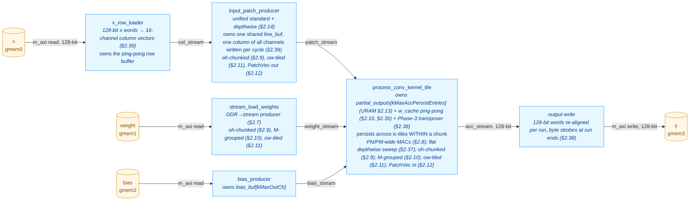

# ConvKernel — Optimization Log

This document records the structural and performance optimizations applied to
`kernels/conv/kernel/ConvKernel.cpp` after the initial scalar implementation
shipped. Each section describes one change, the rationale, and the measured
HW behavior simulation (`make behavior_test_conv`) impact on the kv260 RTL.

For the high-level kernel description see [CONV_KERNEL.md](CONV_KERNEL.md);
this file is a complement focused on the optimization arc and the current
final architecture.

> **Status (2026-05-16).**  §2.7 (weight streaming), §2.8 (PN/PM
> parallel MACs + X-prop guard), §2.9 (oh-chunking), §2.10 (weight
> caching + M-grouping), §2.11 (ow-tiling — lifted the in_w cap),
> §2.12 (channel-packed patch stream), §2.13 (URAM accumulator),
> §2.14 (unified patch producer), §2.15 (broadcast_patches
> removal), §2.16 (`saturate_cast` moved to the writer), §2.17
> (16×16 MAC operands), §2.18 (patch register file), §2.19
> (tile-geometry hoist), and §2.20 (STABLE arguments) are written
> up against measured `conv-verify` snapshots.
> §2.1–§2.6
> still have TODO cells — structural outlines reflect the optimisation
> passes visible in the current source (dataflow stages in
> `csynth.rpt`, the Option-A IC-tiling design in `Config.h.in`, the
> existing branch history `conv_optimisation_1..3`); per-step numbers
> and rationale for those earlier steps need to come from the commit
> history and the original author's notes.  The URAM
> *double-buffer* rework (CONV_DOUBLE_BUFFER_PLAN.md) is dropped — its
> goals were met by §2.10/§2.12/§2.13 (see §6.2).

---

## 1. Performance progression at a glance

All numbers are total `sim_time_ns` reported by the kv260 behavior testbench
after running the full TestConvRef case list.

> Latest baseline (branch `conv_optimisation_3`, 30 RTL tests, post-§2.13):
> **sim_time_ns = 1,869,385 ns** (sum of per-test `duration_ns` =
> 1,867,185 ns).  Captured by `conv-verify` Gate 4 on **2026-05-15** —
> see `build/kernels/conv/kv260/conv_timing_last.json`.

| Stage | Tests | sim_time_ns | Δ vs prior | Δ vs §2.7 |
|---|---:|---:|---:|---:|
| Baseline — single fused loop, no caching | TODO | TODO | — | — |
| + Dataflow restructuring (producer/consumer/writer) | TODO | TODO | TODO | — |
| + Line buffer (rows persistent across `oh`) | TODO | TODO | TODO | — |
| + Option-A IC-tiling + persistent partial-output accumulator | TODO | TODO | TODO | — |
| + Depthwise / standard producer split | TODO | TODO | TODO | — |
| + Broadcast patches (`broadcast_patches` stage) | TODO | TODO | TODO | — |
| + Bias producer fused with replay (`bias_producer`) | TODO | TODO | TODO | — |
| Snapshot post-§2.6 (captured 2026-05-12) | 30 | 5,204,375 | — | — |
| + Weight streaming (`stream_load_weights`, §2.7) | 30 | 4,913,835 | **-5.6 %** | — |
| **Snapshot post-§2.7 (captured 2026-05-12)** | **30** | **4,913,835** | — | reference |
| + PN/PM parallel MACs (§2.8) | 30 | 3,844,095 | **-21.8 %** | -21.8 % |
| + oh-chunking (§2.9) | 30 | 3,861,515 | +0.5 % | -21.4 % |
| + Weight caching + M-grouping (§2.10) | 30 | 2,636,945 | **-31.7 %** | -46.3 % |
| + ow-tiling (§2.11) | 30 | 2,673,625 | +1.4 % | -45.6 % |
| + Channel-packed patch stream (§2.12) | 30 | 1,866,425 | **-30.2 %** | -62.0 % |
| + URAM accumulator (§2.13) | 30 | 1,869,385 | +0.2 % | -62.0 % |
| + Unified patch producer (§2.14) | 30 | 1,869,385 | +0.0 % | -62.0 % |
| + `broadcast_patches` removal (§2.15) | 30 | 1,869,385 | +0.0 % | -62.0 % |
| + `saturate_cast` to writer, narrow `acc_stream` (§2.16) | 30 | 1,869,385 | +0.0 % | -62.0 % |
| + 16×16 MAC operands (§2.17) | 30 | 1,787,105 | **-4.4 %** | -63.6 % |
| + patch register file (§2.18) | 30 | 1,783,075 | -0.2 % | -63.7 % |
| + tile-geometry hoist (§2.19) | 30 | 1,775,995 | -0.4 % | -63.9 % |
| + STABLE arguments (§2.20, this snapshot) | 30 | 1,775,775 | -0.0 % | **-63.9 %** |
| **Current state (post-§2.20, captured 2026-05-16)** | **30** | **1,775,775** | — | **-63.9 %** |
| Snapshot post-§2.36 (40 tests, captured 2026-09-25 on `perf/dwconv`) | 40 | 7,982,735 | — | — |
| + flat depthwise sweep (§2.37) | 40 | 7,666,615 | **-4.0 %** | — |
| + 8-lane drain, 128-bit y with byte strobes (§2.38) | 43 (39 common) | 6,093,330 (common) | **-20.4 %** | — |
| + 128-bit x, `x_row_loader` split (§2.39) | 43 (39 common) | 5,537,890 (common; 7,744,540 all 43) | **-9.1 %** (-10.0 % on the 42 common with §2.38) | -30.5 % vs the §2.36 snapshot |

**Net result vs §2.7 snapshot: 2.77× faster across 30 RTL tests; 63.9 %
reduction in total HW sim time.  Net result vs original baseline: TODO
(needs `conv_optimisation_1` re-run for the pre-§2.1 column).**

---

## 2. Optimization steps

> Numbering and step boundaries should follow the commit history on
> `conv_optimisation_1/2/3`.  Below is a sketch of the passes I can identify
> from the current source — adjust ordering and split/merge to match what
> actually happened.

### 2.1. Dataflow restructuring (HLS DATAFLOW)

**Problem.** TODO — describe the original monolithic loop, the m_axi
read/write serialization, and why it dominated end-to-end latency.

**Change.** Split the body into N dataflow sub-functions wired by
`hls::stream`.  Current top-level stages (visible in `csynth.rpt`):
`entry_proc`, `Block_entry_proc`, `input_patch_producer`,
`bias_producer`, `stream_load_weights`, `process_conv_kernel_tile`
(`broadcast_patches` was removed in §2.15).

**Result.** TODO — quote the prior-vs-now sim_time_ns and the per-test
pattern that dropped most.

### 2.2. Line buffer with row-incremental loading

**Problem.** TODO — adjacent `(oh, ow)` and `(oh, ow+stride_w)` windows
re-read the same `x[]` rows, multiplying DDR fetches by `kh × kw`.

**Change.** TODO — describe the line buffer (`line_buf[kTileIC]
[kMaxLineBufRows][kMaxInW]`), the row-incremental load schedule, the
`ih & (kMaxLineBufRows-1)` slot mapping.

**Result.** TODO.

### 2.3. Option-A IC-tiling + persistent partial-output accumulator

**Problem.** TODO — describe why a `kMaxInCh`-deep line buffer was
infeasible at the target channel counts (mobilenet, etc.).

**Change.** The current design (Config.h.in §"Option-A IC-tiling")
shrinks the per-channel buffers (`line_buf`, broadcast `local_buf`,
`w_buf`) from `kMaxInCh` to `kTileIC` channels.  In exchange, a
`partial_outputs[kMaxAccPersistEntries]` buffer of `AccData_t`
accumulators survives across ic-tiles in the consumer, initialised from
bias once per `ni` and drained to `acc_stream` after the `ict` loop.

**Result.** TODO — buffer-size deltas, sim_time_ns impact.

### 2.4. Depthwise / standard producer split

**Problem.** TODO — the standard-conv patch producer and the
depthwise-conv patch producer have different IC iteration shapes; sharing
a single function blocked II=1 for both.

**Change.** Split `input_patch_producer` into
`input_patch_producer_standard` (visible in `csynth.rpt` at
`VITIS_LOOP_385_*` / `VITIS_LOOP_416_*` etc.) and
`input_patch_producer_depthwise` (`VITIS_LOOP_587_*` /
`VITIS_LOOP_614_*` etc.), dispatched via the `is_depthwise` runtime flag.

**Result.** TODO.

### 2.5. `broadcast_patches` stage

**Problem.** TODO — describe the IC×M broadcast inefficiency the stage was
added to amortize.

**Change.** New `broadcast_patches` dataflow stage between the patch
producer and the conv tile consumer.

**Result.** TODO.

> **Superseded.**  §2.10 made the producer re-emit patches per
> M-group itself, leaving `broadcast_patches` a 1:1 passthrough;
> §2.15 removed the dead stage entirely.

### 2.6. `bias_producer` and bias-replay restructure

**Problem.** TODO.

**Change.** Bias load split into its own `bias_producer` dataflow stage
that loads `bias_buf[kMaxOutCh]` once per `ni` and replays it in
`(r, mt, m1)` order into the persistent accumulator init.

**Result.** TODO.

### 2.7. Weight streaming via dedicated DDR producer

**Problem.** Before this change, `process_conv_kernel_tile` called
`load_standard_weights(weight, ...)` inline once per
`(ict, oh, ow, mt)` iteration in Phase 2a, and
`load_depthwise_weights(weight, ...)` once per `mt` in Phase 2b.  The
`gmem1` DDR transfer was serialised with the patch read, the
partial-accumulator read/write, and the accumulate loop — every inner
iteration paid the full weight-load latency before MACs could start.
This was "Bottleneck A" of [CONV_DOUBLE_BUFFER_PLAN.md](CONV_DOUBLE_BUFFER_PLAN.md)
§1, but achievable without the URAM rework.

**Change.**

- Added a new `stream_load_weights` dataflow producer that owns the
  `gmem1` AXI master and pushes one `Data_t` per cycle to a
  `weight_stream` FIFO.  Iteration order matches the consumer's read
  pattern exactly:
  - Standard (`is_depthwise=0`): per `(ni, ict, oh, ow, mt)` emit
    `m_valid × ic_valid × kh × kw` values in `(m1, ic_l, khi, kwi)`
    order — same DDR bandwidth as the old inline replay, just
    overlapped.
  - Depthwise (`is_depthwise=1`): per `(ni, mt)` emit
    `m_valid × kh × kw` values in `(m1, khi, kwi)` order — no spatial
    replay, matching the consumer's existing once-per-`mt` hoist.
- `process_conv_kernel_tile` signature: `const Data_t* weight` →
  `hls::stream<Data_t>& weight_stream`.  Both inline
  `load_*_weights(...)` call sites replaced with II=1 stream-read
  loops into the existing `w_buf`.
- `weight_stream` depth = `kTileM × kTileIC × kMaxKH × kMaxKW` = 6,272
  at defaults — one full max-tile, large enough for the producer to
  pre-fetch the next iteration's slice during the consumer's
  accumulate.
- Removed the now-unused `load_standard_weights` /
  `load_depthwise_weights` helpers.

**Result.** **-5.6 % sim_time_ns** (5,204,375 → 4,913,835).  Wins
concentrated on the 1×1 and large-spatial layers where weight DDR
loads dominated the inner iteration:

| Test | Δ% |
|---|---:|
| `1x1 IC=TILE_IC*2 M=TILE_M*2 bias exact tiles` (was #2 heaviest) | **-19.8 %** |
| `partial_M_tile out_ch=TILE_M+3` | **-18.1 %** |
| `1x1_kernel 1ch no_bias` | -17.3 % |
| `saturation +/- overflow` (both STD variants) | -15.8 % |
| `batch_3 ResNet-style 7x7 stride=2` (heaviest test overall) | **-9.2 %** |

Five small-spatial 3×3 tests regressed +2–7 % (largest absolute
regression: `partial_IC_tile in_ch=TILE_IC+5` at +6.7 %, +34 k ns;
largest relative: `3x3_input_3x3_kernel → 1x1_out` at +23.0 %, +8 k ns)
— the new dataflow stage's prologue overhead doesn't amortise on tiny
iteration counts (single-output tiles, few channels).  Aggregate
regression across the 6 worst movers is ~+25 k ns; the savings on the
five biggest tests alone are -347 k ns.

**Synthesis impact.** Top-level slack on `ConvKernel*` improved
slightly: -0.93 → **-0.90 ns**.  No new II violations.  Resources
grew modestly (the new producer's address arithmetic):
BRAM 72 (25 %) → 80 (27 %); DSP 113 (9 %) → **151 (12 %, +34 %)**;
FF 46,086 → 51,052 (+11 %); LUT 37,948 (32 %) → 42,541 (36 %, +12 %).
m_axi data widths unchanged at 16 → 16 on all four ports — `gmem1`
widening still blocked by ap_fixed alignment; potential follow-up
optimisation (manual pack into `ap_uint<128>`).

### 2.8. PN/PM parallel MACs

**Problem.** After §2.7 the consumer's MAC reduction
(`accumulate_standard` / `accumulate_depthwise`) ran one MAC per cycle via
the lane-rotation trick (`m1 = ri & (kTileM-1)`), which only spaces
accumulator writes apart — it doesn't actually parallelise the multiplies.
On `batch_3 ResNet-style` (the heaviest test) the inner reduction
`ic_valid · kh · kw · kTileM = 16·9·8 = 1152` cycles per `(oh, ow, mt)`
dominated the consumer's pipeline.  At only 1 DSP busy per cycle out of
the ~178 on the device, the kernel was DSP-starved.

**Change.**

- **`accumulate_standard` → PN-wide adder tree.**  Inside the existing
  lane-rotated outer (`ri` from 0 to `kh·kw·kTileM-1`), the `ic_l` loop
  is `#pragma HLS UNROLL`ed across `kTileIC = 16` lanes.  Each PIPELINE
  iteration fires 16 parallel multiplies whose outputs reduce through a
  4-level adder tree, then add into the lane-rotated `acc[m1]` once per
  cycle.  Loop bound shrinks from `ic_valid · kh · kw · kTileM` to
  `kh · kw · kTileM` (≈ 16× faster inner reduction).  The lane-rotation
  RAW distance on `acc[m1]` is still `kTileM` cycles, so the multi-cycle
  MAC pipeline (multiply + tree + accumulate) closes without an II bump.
- **`accumulate_depthwise` → PM-wide channel-parallel lanes.**  Depthwise
  has no input-channel reduction, so the inner `m1` loop is unrolled
  across `kTileM = 8` lanes inside a flat `(khi, kwi)` outer PIPELINE.
  Loop bound shrinks from `kh · kw · kTileM` to `kh · kw` (kTileM× faster).
  Per-lane RAW distance on `acc[m1]` is 1 cycle; the `ap_fixed<32,16>`
  add is a single-cycle 32-bit integer adder at 300 MHz, so the
  recurrence closes at II=1 without `DEPENDENCE` or lane rotation.
- **`w_buf` partitioning** required to feed the parallel reads:
  - Standard: `#pragma HLS ARRAY_PARTITION variable=w_buf complete dim=2`
    (kTileIC parallel banks along the ic_l axis).
  - Depthwise: `#pragma HLS ARRAY_PARTITION variable=w_buf complete dim=1`
    (kTileM parallel banks along the m1 axis).
- **X-propagation guard (standard only).**  Catching this fix took a
  Gate-3 round trip.  For partial IC tiles (`ic_valid < kTileIC`),
  `stream_load_weights` emits only `m_valid · ic_valid · kh · kw` values,
  so `w_buf[m1][ic_l ≥ ic_valid][…]` is left uninitialised — `X` in RTL.
  C-sim treats these as 0 because `patch[ic_l ≥ ic_valid][…]` is
  producer-zero-padded and `0 · garbage = 0` in C; RTL `0 · X = X`
  propagates through the adder tree, into `acc[m1]`, and out to the AXI
  output (Test 1: `1x1_kernel__1ch__no_bias` triggered
  `AXI4_ERRM_WDATA_X` on `gmem3`).  Fix: gate the BRAM read so invalid
  lanes return `Data_t(0)` directly:
  ```cpp
  const Data_t w_val = (ic_l < ic_valid)
      ? w_buf[m1][ic_l][khi_cnt][kwi_cnt]
      : Data_t(0);
  ```
  Cost: one LUT per PN lane on the weight input; no DSP impact.

**Result.** **-21.8 % sim_time_ns** vs §2.7 (4,913,835 → 3,844,095).
Wins concentrate on tests where the inner reduction dominated:

| Test | Δ% | Δns |
|---|---:|---:|
| `partial_IC_tile in_ch=TILE_IC+5` | **-62.7 %** | -339,010 |
| `batch_3 ResNet-style 7×7 stride=2` (heaviest) | **-37.4 %** | -472,290 |
| `DW 5×5 kernel, 4ch` | **-30.1 %** | -42,000 |
| `DW batch_2, 4ch, pad=1` | -26.5 % | -47,500 |
| `DW 3×3, 4ch, pad=1+bias` | -26.1 % | -42,230 |

Small-spatial 3×3 standard tests showed +1–2 % regressions from the
extra LUT in the X-prop MUX (single LUT on every PN lane); aggregate
regression: < 5 k ns vs. -1,069 k ns aggregate gain.

**Synthesis impact.** No II violations; top-level slack on `ConvKernel*`
unchanged at **-0.90 ns**.  Resources:
BRAM 80 (27 %) → 94 (32 %);
DSP 151 (12 %) → **178 (14 %)** (+18 %);
FF 51,052 → 56,018 (+10 %);
LUT 42,541 (36 %) → 45,412 (38 %).
m_axi data widths unchanged at 16 → 16 on all four ports.

### 2.9. oh-chunking (relaxed persistent-accumulator constraint)

**Problem.** The Option-A persistent accumulator (§2.3) imposed
`out_h · out_w · out_ch ≤ kMaxAccPersistEntries` (16,384 at the
§2.9-era default; raised to 65,536 by §2.13).
Larger output tensors — common in early layers of high-resolution
networks (e.g. 224×224 with even modest channel counts) — were rejected
by the scheduler.  The alternative of degrading to a no-persistent-acc
mode would re-read every input pixel `ic_tiles · m_tiles` times per
`(oh, ow)` — a bandwidth catastrophe.

**Change.**  Split the output along the `oh` axis into chunks whose
footprint fits the buffer.  A `compute_oh_chunking()` helper computes:

```
oh_per_chunk = max(1, kMaxAccPersistEntries / (out_w · out_ch))
num_chunks   = ceil(out_h / oh_per_chunk)
```

Each chunk runs the full three-phase Option-A pipeline for its `oh`
sub-range; `partial_outputs[]` is reused per chunk, indexed by
`oh_local = oh - oh_start`.  A chunk loop is added INNER to `ni` (and
outer to everything else) in four functions:

- `input_patch_producer_standard`
- `input_patch_producer_depthwise`
- `stream_load_weights`
- `process_conv_kernel_tile`

The chunk loop is placed INNER to `ni` so the linear `(ni, oh, ow, mt, m1)`
order seen by `bias_producer`, `broadcast_patches`, and
`write_output_tile` is preserved — those three need no chunk-awareness.

At a chunk transition the patch producer's `line_buf` is invalidated;
`last_loaded_row` is reset to `(oh_start · stride_h - pad_top) - 1` so
the next chunk's first `oh` triggers a fresh kh-row load.  The
`(kh-1)·stride_h`-row overlap between chunks is re-fetched from DDR —
this is the "duplicated reading" the user accepted in exchange for
supporting larger layers.

**Relaxed constraint.**
- Was: `out_h · out_w · out_ch ≤ kMaxAccPersistEntries`
- Now: `out_w · out_ch ≤ kMaxAccPersistEntries`  *(one output row must fit)*

**Result.** **+0.5 % sim_time_ns** vs §2.8 (3,844,095 → 3,861,515).
All 30 existing RTL tests have `num_chunks = 1` (their full output fits
the buffer), so they pay only the per-(ni) wrapper-loop overhead — a few
cycles of `oh_start` / `oh_end` arithmetic per chunk-loop iteration,
distributed uniformly across all tests (+500–700 ns each, no outlier).
Two new C-sim tests exercise the multi-chunk path:

| Test | num_chunks | Notes |
|---|---:|---|
| `oh-chunking standard (out=32×32×32)` | 2 | row_size = 1024; oh_per_chunk = 16 |
| `DW oh-chunking (32 ch, 32×32 out)` | 2 | same chunking, depthwise path |

RTL fixtures haven't been regenerated, so the new tests are C-sim-only
for now (running `make gen_conv_test_data` would update the fixtures).

**Synthesis impact.** No II violations; top-level slack unchanged at
**-0.90 ns**.  Resources:
BRAM 94 (32 %) → 87 (30 %);
DSP 178 (14 %) → 178 (14 %) unchanged;
FF 56,018 → 62,195 (+11 %);
LUT 45,412 (38 %) → 52,492 (44 %) (+15 %).
The FF/LUT growth covers the chunk loop counters (`chunk`, `oh_start`,
`oh_end`, `chunk_oh_count`) and the `oh_local` arithmetic in the
consumer's three phases.

**Documentation.**  Constraint and chunking rationale moved into
`kernels/conv/include/Config.h.in` (header block on
`kMaxAccPersistEntries`) and `kernels/conv/kernel/ConvKernel.cpp`
(`compute_oh_chunking()` helper).

### 2.10. Weight caching + M-grouping

**Problem.**  After §2.7–§2.9 the consumer's MAC reduction was no longer
the long pole — the `weight_stream` drain was.  `stream_load_weights`
replayed the full `(ic_valid · kh · kw)` weight slab per `(oh, ow, mt)`
iteration, so every DDR weight was read `out_h · out_w` times per
`(ni, chunk, ict)`.  On `batch_3 ResNet-style` (the heaviest test) this
came to ~7M DDR weight reads for what is actually a 9 KB filter.

**Change.**  Hoist the weight load out of `(oh, ow)`.  The consumer now
caches one `(ict, M-group)` slab on-chip and reuses it across the chunk's
spatial sweep.  When `m_tiles` exceeds the cache capacity, M-axis splits
into groups of `mt_per_group` mt-tiles; each group's slab is loaded
fresh from DDR.

- **`compute_m_grouping()` helper:**
  ```
  mt_per_group = min(kMaxMperGroup, m_tiles)
  num_m_groups = ceil(m_tiles / mt_per_group)
  ```
  New CMake var `CONV_MAX_M_PER_GROUP` (default 4, = up to 32 channels
  per group at kTileM=8).
- **`stream_load_weights` standard path:** rewritten as
  `(ni, chunk, ict, mg, mt_in_group)` — weights emitted ONCE per
  `(ni, chunk, ict, mg)`, no per-spatial replay.
- **`process_conv_kernel_tile` Phase 2a:** added `mg` loop inside `ict`.
  New `w_cache[kMaxMperGroup][kTileM][kTileIC][kMaxKH][kMaxKW]` with
  `#pragma HLS ARRAY_PARTITION variable=w_cache complete dim=3` (kTileIC
  banks on the ic_l axis to feed the §2.8 PN-wide adder tree).  Per
  `(ict, mg)`: load `w_cache` once from `weight_stream`, then sweep
  `(oh_local, ow, mt_in_group)` reusing cached weights.  Patches read
  once per `(mg, oh_local, ow)` and reused across `mt_in_group`.
- **`input_patch_producer_standard`:** added `mg` loop OUTER of
  `(oh, ow)` inside `(chunk, ict)`.  line_buf retained across m_groups
  so patches are re-emitted from on-chip BRAM without DDR re-read.
- **`ConvKernel` top:** `broadcast_iters` multiplies by `num_m_groups`
  for standard; `broadcast_factor = 1u` (the producer handles the
  m_group replay so `broadcast_patches` is a passthrough).

**Result.** **-31.7 % sim_time_ns** vs §2.9 (3,861,515 → 2,636,945).
Wins concentrated on tests where the weight DDR replay dominated:

| Test | Δ% | Δns |
|---|---:|---:|
| `1x1 IC=TILE_IC*2 M=TILE_M*2 bias exact tiles` | **-79.7 %** | -501,020 |
| `batch_3 ResNet-style 7×7 stride=2` (heaviest) | **-69.7 %** | -550,930 |
| `partial_M_tile out_ch=TILE_M+3` | **-37.1 %** | -84,490 |
| `partial_IC_tile in_ch=TILE_IC+5` | -23.6 % | -47,810 |
| `3×3 → 1×1 out` | -22.2 % | -7,560 |

The 11 depthwise tests move ≤ ±60 ns (≤ 0.1 %) — depthwise already
loaded weights once per `(chunk, mt)` so the caching has no effect
there.  New C-sim test `M-grouping standard (out_ch=64, 2 M-groups)`
exercises `num_m_groups = 2` (m_tiles=8, kMaxMperGroup=4) and validates
the multi-group path.

**Synthesis impact.** No II violations; top-level slack unchanged at
**-0.90 ns**.  Resources:
BRAM 87 (30 %) → 102 (35 %) — the new w_cache slab;
DSP 178 → 191 (+7 %);
FF 62,195 → 66,606 (+7 %);
LUT 52,492 (44 %) → 55,938 (47 %, +7 %).

### 2.11. ow-tiling — lift the in_w cap

**Problem.**  `line_buf` was sized `[…][kMaxLineBufRows][kMaxInW]` and
the runtime invariant required `in_w ≤ kMaxInW` (= 64 by default), which
ruled out a lot of real-world layers (any 128- or 224-column input
needed at minimum).  The Python scheduler validated the bound and
rejected oversized layers up-front.

**Change.**  Rename `CONV_MAX_IN_W` → `CONV_MAX_LINE_BUF_COLS`: the
constant now bounds the line-buffer column dim, NOT `in_w`.  Wider
inputs are handled by tiling the output column axis.

- **`compute_ow_tiling()` helper:**
  ```
  window_w     = (kw - 1) · dilation_w + 1
  ow_per_tile  = max(1, (kMaxLineBufCols - window_w) / stride_w + 1)
  num_ow_tiles = ceil(out_w / ow_per_tile)
  ```
  Relaxed constraint: `(kw-1)·dilation_w + 1 ≤ kMaxLineBufCols`
  (one kernel-width window must fit) — versus the old `in_w ≤ kMaxInW`.
- **`line_buf` reshape:** `[…][kMaxLineBufRows][kMaxLineBufCols]` with
  CIRCULAR indexing on both dims now:
  ```
  row_slot = ih & (kMaxLineBufRows - 1)
  col_slot = iw & (kMaxLineBufCols - 1)
  ```
  Both `kMaxLineBufRows` and `kMaxLineBufCols` are static_assert'd as
  powers of 2.
- **Both patch producers:** ow_tile loop INSIDE `ict` (standard) /
  `mt` (depthwise), OUTSIDE `mg` (standard) / `(oh, ow)` (depthwise).
  `last_loaded_row` resets per `(chunk, ict|mt, ow_tile)`.  Phase 1
  clips iw to `[max(0, iw_load_start), min(in_w-1, iw_load_last)]`,
  loading only the tile's iw range.  Phase 2 reads via
  `col_slot = iw & (kMaxLineBufCols-1)`.
- **`stream_load_weights` standard path:** ow_tile loop INSIDE `ict`,
  OUTSIDE `mg`.  Weights re-emitted per `(ict, ow_tile, mg)` —
  multi-tile layers pay an `num_ow_tiles ×` weight DDR replay.  New
  signature: takes `stride_w` and `dilation_w` so it can call
  `compute_ow_tiling()`.
- **`process_conv_kernel_tile`:**
  - Phase 2a (standard): `(ict, ow_tile, mg, oh_local, ow_in_tile, mt_in_group)` nest.
  - Phase 2b (depthwise): `(mt, ow_tile, oh_local, ow_in_tile)` — `w_buf` stays cached across all ow_tiles for the mt (depthwise weights are tiny, no need to re-load per tile).

**Result.** **+1.4 % sim_time_ns** vs §2.10 (2,636,945 → 2,673,625).
All 30 RTL tests have `in_w ≤ 64` so `num_ow_tiles = 1` for all of
them; the +1.4 % is the wrapper-loop overhead (ow_start/ow_end
arithmetic + clipped-iw range computation in Phase 1).  New C-sim test
`wide input ow-tiling (in_w=128, 3 ow-tiles)` exercises the multi-tile
path (default `kMaxLineBufCols=64`, kw=3, stride=1 →
`ow_per_tile = 62`, `out_w=128 → num_ow_tiles=3`).

**Synthesis impact.** No II violations; top-level slack unchanged at
**-0.90 ns**.  Resources:
BRAM 102 (35 %) → 102 (35 %) — unchanged (line_buf shape changed but
total cells unchanged at the default kMaxLineBufCols=64);
DSP 191 → 188;
FF 66,606 → 74,726 (+12 %) — ow_tile counters, iw clipping state;
LUT 55,938 (47 %) → 66,802 (57 %, +19 %) — Phase 1 clipped-iw range
arithmetic + circular col-slot computation.  LUT is now the tightest
resource; further optimisation here (e.g. shifting line_buf cols across
tiles instead of reloading) could trim the LUT growth back.

**Documentation.**  Constraint summary in `kernels/conv/include/Config.h.in`
fully rewritten — `in_h`, `in_w`, and `out_h` are now ALL handled by
transparent tiling (oh-chunking, ow-tiling); only the kernel-window
fits and `out_w·out_ch ≤ kMaxAccPersistEntries` remain as hard
constraints.

### 2.12. Channel-packed patch stream

**Problem.**  After §2.10 hoisted the weight load out of the spatial
sweep, the consumer's inner hot loop was dominated by the
**patch-stream drain**: `kTileIC·kh·kw` single-`Data_t` beats per
`(oh, ow)` for standard, `kTileM·kh·kw` for depthwise.  At
kTileIC=16, kh=kw=3 that is 144 cycles per `(oh, ow)` standard —
~29 % of the inner loop — and ~80 % of the depthwise inner loop
(which has no input-channel reduction so its accumulate is cheap).

**Change.**  Pack a full channel column into one stream beat so the
drain collapses from `kTileIC·kh·kw` to `kh·kw` beats.

- **New `PatchVec` struct** — `Data_t lane[kTileIC]`, a channel-packed
  stream element (256-bit at defaults).  `patch_pipe` and
  `patch_stream` retyped `hls::stream<Data_t>` → `hls::stream<PatchVec>`.
- **`input_patch_producer_standard`:** `line_buf` partitioned
  `complete dim=1` (kTileIC ic banks).  Phase 2 gathers all kTileIC
  lanes (UNROLL) for a `(khi, kwi)` position into one `PatchVec` and
  writes a single beat — `kTileIC·kh·kw` writes → `kh·kw`.
- **`input_patch_producer_depthwise`:** `line_buf` partitioned
  `complete dim=1` (kTileM m banks).  Phase 2 fills the first kTileM
  PatchVec lanes (the depthwise parallel axis) and zero-pads lanes
  `kTileM..kTileIC-1`; the `lane < kTileM` guard is compile-time so
  there is no OOB read on the kTileM-deep line_buf.
- **`broadcast_patches`:** retyped to `PatchVec`; `local_buf` sized
  `kMaxKH·kMaxKW`.
- **`process_conv_kernel_tile`:** both patch-read loops drain one
  `PatchVec` per `(khi, kwi)` and UNROLL-unpack into the local
  `patch[][khi][kwi]` array.  `accumulate_standard` /
  `accumulate_depthwise` are unchanged — they still read the
  fully-partitioned local `patch`.
- **`ConvKernel`:** `input_per_iter = kh·kw` for both paths.

`weight_stream` was deliberately left at one `Data_t`/beat: its DDR
layout is contiguous in `(ic_l, khi, kwi)` order, so channel-packing
it would force a strided gather and break m_axi burst inference; and
§2.10 already amortised the weight load across the spatial sweep so
it is no longer the bottleneck.

**Result.** **-30.2 % sim_time_ns** vs §2.11 (2,673,625 → 1,866,425).
**Every one of the 30 RTL tests improved** (3.7 % – 47.2 %).  Wins
scale with `kh·kw` (more single-Data_t beats collapsed) and are
largest on depthwise (patch read was ~80 % of its inner loop):

| Test | Δ% | Δns |
|---|---:|---:|
| `5x5 kernel → 3x3 out` | **-47.2 %** | -33,760 |
| `DW 5x5 kernel 4ch` | **-44.1 %** | -43,680 |
| `non-square 6x8 3x5` | -43.8 % | -35,990 |
| `partial_IC_tile in_ch=TILE_IC+5` | -43.1 % | -67,510 |
| `batch_2 3x3 pad_1` | -42.0 % | -67,490 |

Cumulative vs the §2.7 snapshot: **-62.0 %**, 2.63× faster.

**Synthesis impact.** No II violations; top-level slack unchanged at
**-0.90 ns**.  Resources:
BRAM 102 (35 %) → **131 (45 %)** — the `line_buf complete dim=1`
partition turns it into kTileIC / kTileM banks (which pack less
densely than the prior monolithic array) plus the 256-bit PatchVec
FIFOs; still within the 288-BRAM budget but now the second-tightest
resource after LUT;
DSP 188 → 172;
FF 74,726 → 72,883;
LUT 66,802 (57 %) → 66,344 (56 %) — essentially flat.

### 2.13. URAM accumulator

**Problem.**  After §2.12 the design was **BRAM-bound** — BRAM 131 (45 %)
was the second-tightest resource after LUT, while the kv260's XCK26
carries **64 URAM blocks (288 Kbit each, ~2.25 MB) that the design
used zero of**.  The single largest on-chip buffer is the persistent
partial-output accumulator `partial_outputs[kMaxAccPersistEntries]`
(16384 × `AccData_t` = 512 Kbit ≈ 16 BRAM).  Two things were
greedy about it: it sat in scarce BRAM, and the
`out_w · out_ch ≤ kMaxAccPersistEntries` constraint coupled *both*
output dimensions onto one 16384-entry budget — a layer that is wide
*or* deep (rarely both) still had to fit the product.

**Change.**  Relocate the accumulator to the idle URAM pool and grow
the budget into it.

- **`process_conv_kernel_tile`:** one pragma on the `partial_outputs`
  declaration —
  `#pragma HLS bind_storage variable=partial_outputs type=RAM_2P impl=URAM`.
  `RAM_2P` is sufficient: Phase 1 / Phase 3 each touch a single port
  (write-only / read-only) and Phase 2a's read and write run in
  separate `II=1` sub-loops, so there is no tight RAW recurrence that
  URAM's extra read-latency cycle could stall.
- **`CONV_MAX_ACC_PERSIST_ENTRIES`** raised 16384 → **65536** (CMake
  cache var).  65536 × `AccData_t` = 16 of the 64 URAM blocks (25 %);
  the `out_w · out_ch` constraint relaxes 4× so deeper layers fit
  one chunk without oh-chunking.
- No loop restructure, no duplicated reads — the accumulator is
  simply moved and enlarged.

This was chosen over the alternative *M-group accumulator tiling*
(hoist the `mg` loop outside `ict` so the buffer holds only one
M-group's channels): that shrinks the buffer but pays duplicated
input DDR reads per M-group.  URAM gives the capacity for free from
an otherwise-empty resource pool, so there is nothing to trade.

**Result.** **+0.2 % sim_time_ns** vs §2.12 (1,866,425 → 1,869,385) —
a uniform +0.0 % – +0.7 % across all 30 RTL tests, no outliers.  That
is the URAM read-latency cycle; it is within run-to-run noise and not
a regression worth chasing.  The change is a **resource** win, not a
throughput one:

**Synthesis impact.** No II violations; top-level slack unchanged at
**-0.90 ns**.  Resources:
BRAM **131 (45 %) → 101 (35 %)** — `partial_outputs` left BRAM
entirely, freeing ~30 blocks;
URAM **0 → 16 (25 %)** — the relocated, enlarged accumulator;
DSP 172 → 168;
FF 72,883 → 72,901 (flat);
LUT 66,344 → 66,426 (flat).
BRAM is no longer the second-tightest resource — LUT (56 %) now
stands alone as the constraint.

**Coverage note.**  Raising the cap to 65536 means the two
`oh-chunking` tests (`out = 32×32×32` = 32768 ≤ 65536) now run
`num_chunks = 1` — they still pass but no longer exercise the
multi-chunk path.  Restoring that coverage needs larger test
dimensions (`out_h·out_w·out_ch > 65536`) or a reduced-cap config.

### 2.14. Unified patch producer

**Problem.**  Standard and depthwise convolution had **two separate
patch producers** — `input_patch_producer_standard` and
`input_patch_producer_depthwise` — selected by a runtime
`if (is_depthwise)` in a dispatch wrapper.  Because the selector is a
runtime argument, **both functions synthesise into silicon**, even
though only one runs per kernel invocation.  The two were near-
identical: same `line_buf` management, same Phase-1 DDR loads, same
Phase-2 `PatchVec` gather — differing only in (a) the channel-
parallelism axis (`kTileIC` input-channel banks vs `kTileM` channel
banks) and (b) the M-group patch re-emission (standard replays per
`num_m_groups`; depthwise does not).  The duplication cost a second
`line_buf` and a second copy of all the producer control logic.

This is the deduplication half of the "depthwise and standard are
special cases of one convolution" observation — the *compute*
datapaths (`accumulate_standard` PN-tree vs `accumulate_depthwise`
PM-lanes) genuinely differ by parallelism axis and are **kept
separate**; only the patch-assembly glue is shared.

**Change.**  Fold the two producers and the wrapper into one
`input_patch_producer(... , is_depthwise)`:

- **Channel-tile geometry is runtime-derived:** `ct_width =
  is_depthwise ? kTileM : kTileIC`, `total_ch = is_depthwise ? out_ch
  : in_ch`, `ct_tiles = ceil(total_ch / ct_width)`.
- **Group replay is runtime-derived:** `num_groups = is_depthwise ? 1
  : num_m_groups`.
- **One `line_buf[kTileIC][…][…]`** serves both modes (was one
  `[kTileIC]` + one `[kTileM]`).  Depthwise uses banks `[0, kTileM)`;
  the Phase-2 gather masks lanes `≥ ch_valid` to 0 — the same
  X-clean mask the standard partial-IC tail already relies on, so
  reading the never-written `[kTileM, kTileIC)` banks is safe (the
  mux selects 0, the X never reaches an output).
- `stream_load_weights`, the two `accumulate_*` datapaths, and the
  consumer's Phase 2a/2b are **unchanged** — only the producer merged.

**Result.** **0 ns** — the merged producer emits the identical
`PatchVec` stream in the identical order, so all 30 RTL tests are
bit-identical to §2.13 (Gate 4 reported a flat `+0.0 %`).  This is a
pure resource win:

**Synthesis impact.** No II violations; top-level slack unchanged at
**-0.90 ns**.  Resources:
LUT **66,426 (56 %) → 56,856 (48 %)** — −9,570, the headline win;
LUT was the single tightest resource.
BRAM **101 → 93** — the depthwise `line_buf` is gone.
FF **72,901 → 66,137** (−6,764);
DSP 168 → 158;
URAM 16 unchanged.
The kernel source shrank 201 lines (79 added, 280 deleted).

### 2.15. `broadcast_patches` removal

**Problem.**  `broadcast_patches` was a DATAFLOW stage between the
patch producer and the consumer.  It was introduced (§2.5) to replay
each patch `broadcast_factor` times so one DDR patch read could feed
multiple output-channel tiles.  Since §2.10 the producer re-emits
patches per M-group *itself*, so the caller hardwired
`broadcast_factor = 1` — the stage degenerated to a 1:1
`patch_pipe → patch_stream` copy and its `local_buf` re-emission loop
became dead code.  It was kept only "for dataflow-graph stability",
i.e. for no functional reason — pure overhead: an extra DATAFLOW
stage, the `patch_pipe` FIFO, and a `kMaxKH·kMaxKW`-entry `local_buf`.

**Change.**  Delete the stage.  `input_patch_producer` now writes
`patch_stream` directly; the `broadcast_patches` function, the
`patch_pipe` stream, and the `broadcast_iters` / `input_per_iter` /
`broadcast_factor` plumbing in `ConvKernel` are removed.  The DATAFLOW
region drops from **6 stages to 5**.

**Result.** **0 ns** — removing an II=1 pass-through trims one stream
hop of latency but leaves throughput untouched, so all 30 RTL tests
are bit-identical to §2.14.

**Synthesis impact.** No II violations; top-level slack unchanged at
**-0.90 ns**.  Resources:
BRAM **93 → 78** — bigger than expected: both the `patch_pipe` FIFO
and the dead `local_buf` were BRAM-mapped.
DSP 158 → 139;
FF 66,137 → 62,987;
LUT 56,856 → 54,867 (46 %).
The kernel source shrank 63 lines (19 added, 82 deleted).

### 2.16. `saturate_cast` moved to the writer

**Problem.**  `write_output_tile` read `AccData_t`
(`ap_fixed<32,16>`) accumulators from `acc_stream` and applied
`saturate_cast<Data_t>` while writing each element to `y[]`.  So
`acc_stream` carried the 32-bit accumulator type — twice the final
element width — and the saturation logic lived in the writer stage,
one hop downstream of where the accumulator value is actually
finalised.

**Change.**  Move the `saturate_cast` into
`process_conv_kernel_tile`'s Phase-3 drain: `partial_outputs[idx]` is
cast to `Data_t` *before* it is pushed to `acc_stream`.  The stream is
retyped `hls::stream<AccData_t>` → `hls::stream<Data_t>` and
`write_output_tile` now copies a finished `Data_t` straight to `y[]`.

**Result.** **0 ns** — the saturation is the same operation on the
same value, only relocated one dataflow stage upstream, so all 30 RTL
tests are bit-identical to §2.15.

**Synthesis impact.**  The `acc_stream` FIFO is halved in width
(32 → 16 bit, depth `kTileM`).  The FIFO is tiny, so the resource
saving is within synthesis noise of §2.15 (BRAM 78, DSP 139, FF
≈63 k, LUT ≈54.9 k) — the change is a correctness/clarity cleanup:
the inter-stage stream now carries the final element type rather than
the wide accumulator.

### 2.17. 16×16 MAC operands

**Problem.**  `accumulate_standard` and `accumulate_depthwise` both
widened the two multiply operands to `AccData_t` (`ap_fixed<32,16>`)
*before* forming the product — `AccData_t(patch) * AccData_t(w)`.
HLS synthesised that as a **32×32 multiply**, which on the DSP48E2
needs a cascade of partial-product DSPs and a longer combinational
path.  The routed-timing analysis of the cormorant block design
(see §"frequency" notes) pointed at the MAC as a critical path, and
`csynth.rpt` had the worst sub-block slack pinned at **-0.90 ns**
unchanged since §2.8.  The widening is unnecessary: the `ap_fixed`
product of two `ap_fixed<16,8>` values is natively `ap_fixed<32,16>`
= `AccData_t` and represents `patch·w` exactly with no rounding.

**Change.**  Multiply `Data_t × Data_t` directly —
`lane_sum += patch[ic_l][khi][kwi] * w_val` in `accumulate_standard`,
`acc[m1] += patch[m1][khi][kwi] * w_buf[m1][khi][kwi]` in
`accumulate_depthwise`.  The 16×16 product maps to a **single
DSP48**.

**Result.** **-82,280 ns (-4.4 %)** — the shorter MAC let HLS
schedule the consumer pipeline tighter, so per-test latency dropped
across all 30 RTL tests; output is bit-identical.

**Synthesis impact.**  Top-level slack **-0.90 → 0.00 ns** — the
32×32 cascade *was* the worst-slack path.  No II violations.
Resources:
FF **62,987 → 51,176** (-19 %);
LUT **54,867 → 50,376**;
DSP **139 → 146** — the single-DSP 16×16 form lets HLS bind every
multiply to a DSP48 rather than splitting wide products across LUT
logic, so DSP rises slightly while FF/LUT fall;
BRAM 78, URAM 16 unchanged.

### 2.18. Patch buffer as a banked register file

**Problem.**  The per-output-pixel patch buffer
`Data_t patch[kTileIC][kMaxKH][kMaxKW]` in `process_conv_kernel_tile`
(Phase 2a standard, Phase 2b depthwise) was declared
`ARRAY_PARTITION complete dim=0` — fully scalarised into
`kTileIC·kMaxKH·kMaxKW` flip-flops.  Every accumulate iteration reads
`patch[ic_l][khi][kwi]` with the loop counters `khi`/`kwi` as runtime
indices; against a fully-partitioned array that read becomes a
combinational **mux tree** over all `kMaxKH·kMaxKW` positions,
replicated `kTileIC` times.  The DAC'20 implicit-broadcast analysis
([csl.cornell.edu hls-timing](https://www.csl.cornell.edu/~zhiruz/pdfs/hls-timing-dac2020.pdf))
classifies exactly this — a counter fanned out to a wide read mux —
as a **control broadcast**, and the routed cormorant build showed the
corresponding `MUXF8` net on the critical path with the HLS scheduler
under-estimating its delay.

**Change.**  Partition only `dim=1` (the `kTileIC` bank axis) and
`BIND_STORAGE type=RAM_2P impl=lutram`.  `patch` becomes a **banked
register file**: `kTileIC` independent LUTRAMs, one per ic-lane, so
the `ic_l` UNROLL still reads all banks in parallel, while
`(khi,kwi)` addresses the RAM rather than driving a combinational
mux.  The same change is applied to both `patch` declarations.

**Result.** **-4,030 ns (-0.2 %)** — throughput is unchanged (the RAM
read is still single-cycle inside the II=1 pipeline); the small drop
is the tighter consumer schedule.  Output bit-identical, 30/30 RTL
PASS.

**Synthesis impact.**  No II violations; slack stays **0.00 ns**.
Resources:
FF **51,176 → 32,089** (-37 %) and LUT **50,376 → 44,081** (-12.5 %)
— the scalarised FF array and its replicated read-mux trees are gone,
replaced by LUTRAM;
DSP 146, BRAM 78, URAM 16 unchanged.

### 2.19. Tile-geometry hoist

**Problem.**  oh-chunking, M-grouping and ow-tiling each need an
integer division by a **runtime divisor** (`kMaxAccPersistEntries /
(out_w·out_ch)`, `m_tiles / mt_per_group`, `… / stride_w`, …), and HLS
synthesises each as a multi-cycle **sequential divider** (`udiv_*_seq`,
≈394 FF + 238 LUT apiece).  The three `compute_oh_chunking` /
`compute_m_grouping` / `compute_ow_tiling` helpers were called
*independently inside* `input_patch_producer`, `stream_load_weights`
and `process_conv_kernel_tile` — and since each stage is a separate
DATAFLOW process, the same ~5 dividers were instantiated **once per
stage**.  Synthesis showed **16 dividers** across the kernel
(5 + 5 + 6), ≈6.3 k FF and ≈3.8 k LUT spent on division — for a result
that is *invariant* for the whole invocation.

**Change.**  Compute the geometry **once**.  A new `ConvGeometry`
struct (`oh_per_chunk`, `num_chunks`, `mt_per_group`, `num_m_groups`,
`ow_per_tile`, `num_ow_tiles`) is filled by a single
`compute_conv_geometry()` call in `ConvKernel`, and passed by value to
each of the three stages — they read `geom.*` instead of calling the
`compute_*` helpers themselves.  HLS keeps `compute_conv_geometry` as
one one-shot dataflow process (`compute_conv_geometry_U0`, ~129-cycle
latency, runs once before the stages spin up).

> A `#pragma HLS DATAFLOW` *inside* `compute_conv_geometry` (to overlap
> the three independent divider chains) was tried and dropped — the
> canonical form segfaults Vitis HLS 2025.2's scalar-propagation pass,
> the non-canonical form draws "region may not be handled correctly"
> warnings, and the prize is only ~64 one-time cycles.  A code comment
> records this so it isn't re-attempted.

**Result.** **-7,080 ns (-0.4 %)** — the geometry resolves before the
stages start rather than inside each; output bit-identical, 30/30 RTL
PASS.

**Synthesis impact.**  The three stages now synthesise **0 dividers
each**; the 16 dividers collapse into the single
`compute_conv_geometry` block (FF 2,812 / LUT 2,972 / DSP 3).  No II
violations; slack stays **0.00 ns**.  Resources:
FF **32,089 → 29,810** (-7.1 %);
LUT **44,081 → 39,105** (-11.3 %) — LUT, the tightest resource, drops
from 37 % to **33 %**;
DSP 146 → 155 (+9 — `compute_conv_geometry`'s 3 DSP plus minor
rebalancing; DSP utilisation 12 %);
BRAM 78, URAM 16 unchanged.

### 2.20. STABLE kernel arguments

**Problem.**  Every scalar argument of `ConvKernel` (`batch`,
`in_ch/h/w`, `out_ch/h/w`, `kh`, `kw`, `stride_*`, `dilation_*`,
`pad_*`, `has_bias`, `is_depthwise`) is invariant for the whole kernel
invocation.  But under DATAFLOW each stage is a separate process, and
HLS synchronises every argument a process reads through its own
**depth-2 channel FIFO**.  An argument used by N stages becomes N
FIFOs — `out_ch` alone was replicated into **5**.  Synthesis showed
**62 FIFOs**, ~60 of them scalar channels at 99 FF / ~69 LUT each:
≈5.9 k FF and ≈4.1 k LUT spent purely on argument plumbing.  Only the
`x` / `weight` / `bias` base pointers were marked `STABLE`; the
scalars were not.

**Change.**  Add `#pragma HLS STABLE variable=…` for every scalar
argument and the read-only `x` / `weight` / `bias` pointers.  `y` —
the **write** port — is deliberately left unmarked.  `STABLE` tells
HLS the value does not change across the dataflow region, so it
forwards each as a stable signal shared by all consumers instead of a
per-consumer FIFO.

**Result.** **-220 ns (-0.0 %)** — STABLE removes synchronisation
hardware, not work; throughput is unchanged, output bit-identical,
30/30 RTL PASS.

**Synthesis impact.**  FIFO count **62 → 26** (the 2 real stream
FIFOs `patch_stream` / `weight_stream` and the §2.19 `geom`-field
channels remain; 36 scalar FIFOs are gone).  No II violations; slack
stays **0.00 ns**.  Resources:
FF **29,810 → 27,487** (-7.8 %);
LUT **39,105 → 36,341** (-7.1 %) — LUT down from 33 % to **31 %**;
the FIFO category alone dropped FF 6,257 → 2,693 and LUT
4,126 → 1,714 (part of that re-appears as stable registers inside the
consuming instances, hence the smaller net top-level delta);
DSP 155, BRAM 78, URAM 16 unchanged.

---

### 2.21. M-group line_buf residency cap (correctness fix)

**Problem.**  §2.10 M-grouping made the patch producer replay a
chunk's whole `(oh, ow)` sweep from `line_buf` once per M-group with
no DDR re-read (`last_loaded_row` is kept across the `grp` loop, so
Phase 1 loads nothing for `grp > 0`).  That silently assumed
`line_buf` holds the entire chunk.  It holds only `kMaxLineBufRows`
(16) rows, circularly indexed by `ih & 15`, so whenever a chunk's
input-row span exceeded 16 the rows the first `oh` needs were already
overwritten by the time group 1 re-read them — groups ≥ 1 of the
affected output rows were computed from the wrong input rows.
Trigger: standard path, `out_ch > kTileM·kMaxMperGroup = 32`, and
`(oh_per_chunk-1)·stride_h + (kh-1)·dilation_h + 1 > 16`.  With
`kMaxAccPersistEntries = 65536` the uncapped `oh_per_chunk` is
typically 9–18 rows, so any stride or kernel taller than 1 tripped
it.  12 of ResNet-18's 20 convs (stem + all of stage 1/2) were
affected; MobileNet v1/v2 and the MNIST models escaped only because
their chunks happen to be short.  The C-sim M-grouping case (test 28)
used `in_h = 16` — exactly the buffer depth, where the `in_h-1` clamp
keeps every row resident — so it could not see the overwrite.

**Change.**  `compute_conv_geometry()` now takes `kh`, `stride_h`,
`dilation_h`, `is_depthwise` and, when `!is_depthwise &&
num_m_groups > 1`, clamps
`oh_per_chunk ≤ (kMaxLineBufRows - ((kh-1)·dilation_h + 1)) / stride_h + 1`
and recomputes `num_chunks`.  The alternative — resetting
`last_loaded_row` per `grp` and re-reading `x` per M-group — was
verified to fix the same cases but gives up the read-`x`-once
property the grouping exists for.  Three regression cases added to
`TestConvSim.cpp` (`in_h = 17` 3×3, ResNet-style 7×7 s2 stem with
40 ch on 32×32, batch 2 dilation 2 stride 2); all three FAIL on the
pre-§2.21 kernel and PASS after.

**Result.**  Correctness fix; throughput on layers that were already
correct is unchanged (the cap only binds where the old code produced
garbage).  The checked-in RTL fixtures under `hw/test_data/conv_test_data/`
were regenerated (`make gen_conv_test_data`) from 30 to 39 cases so the
RTL run now covers oh-chunking, M-grouping, ow-tiling and the three
§2.21 regression cases.  The larger fixtures made simulated time the
bottleneck (the old 30-case set ran 1.8 ms of sim time; the ResNet-18
stem at 64 ch / 64×64 alone needed >40 ms), so the two biggest
regression cases were shrunk to the smallest geometry that still trips
the cap, and the test stand gained a batch mode (no `add_wave /`
waveform logging; testbench per-beat AXI/DDR monitors behind
`+VERBOSE`; `TS_WAVES=1` / `TS_VERBOSE=1` restore the old behaviour).
`--debug off` elaboration was tried too and dropped: no measurable
gain, and it breaks any .wcfg attached to the project.  Regenerated-fixture RTL run: **39/39 PASS**, 42.16 ms of
simulated time (was 1.78 ms for the 30-case set), 35 min wall-clock.
The 30 pre-existing cases' per-test durations are unchanged (sum
1,775,995 → 1,773,810 ns, -0.1 %) — the cap only binds on the new
cases, which were previously computing garbage.  Measured batch-mode
gain was modest (~1.1–1.3× per simulated ns): xsim is CPU-bound in
the design itself (Zynq VIP + interconnect + kernel), not in log or
waveform I/O, so the wall-clock reduction came mostly from shrinking
the two biggest regression fixtures.  Further RTL speed-up would need
sharded parallel xsim runs, not less logging.

**Synthesis impact.**  No II violations; top-level slack stays
**0.00 ns**.  `compute_conv_geometry` latency 129 → **201 cycles**
(one more divider chain, once per invocation).  Resources:
FF **27,487 → 28,638** (+4.2 %); LUT **36,341 → 37,656** (+3.6 %,
still 32 %); DSP 155, URAM 16 unchanged; BRAM 78 → 79.

---

### 2.22. Channel-major output drain → write bursts

**Problem.**  The 39-case RTL timing (§2.21) checked against the
ideal-II cycle model (CONV_2D_GRID_PLAN.md §2) showed the OUTPUT WRITE
PATH, not the MAC array, as the first wall: `write_output_tile` strode
`y_addr += out_h·out_w` between consecutive stores, so every 16-bit
output was a lone single-beat AXI transaction (all 133 896 `gmem3`
writes in the verbose log had `LEN=0`; `gmem3` was absent from the
csynth burst table).  Measured cost 11.7 cycles per element — 45 % of
the `M-grouping 64ch 16x16` case, 50 % of the 32×32×32 chunking case —
and serialised with compute because Phase 3 and the writer run per
chunk with an 8-deep FIFO between them.

**Change.**  Phase 3 drains `partial_outputs` in channel-major order
`(mt, m1, oh_local, ow)` and `write_output_tile` mirrors it
`(ni, chunk, mt, m1, run)`, so each `(chunk, channel)` is one
contiguous run of `chunk_oh_count·out_w` elements in NCHW `y`.
`write_output_tile` takes the `ConvGeometry` to know the chunk bounds.
The URAM reads become `out_ch`-strided, which is free on-chip.

**Result.** **-14 701 470 ns (-34.9 %)** over the 39 cases, 39/39 RTL
PASS, bit-exact (39 named + 300-case sweep).  Biggest movers:
`DW oh-chunking 32ch 32x32` **-52.5 %**, `oh-chunking standard 32x32x32`
**-39.9 %**, `M-grouping in_h=17` -38.5 %, `M-grouping 64ch` -38.4 %
(434 k → 267 k cycles), `1x1 IC*2 M*2` -32.9 %.  The 30 pre-§2.21 cases
moved 0–20 % (their outputs are small).

**Synthesis impact.**  `gmem3` now appears in the burst table as a
variable-length write burst on `VITIS_LOOP_471_5`.  No II violations;
slack 0.00 ns.  FF 28 638 → 29 986, LUT 37 656 → 39 531 (33 %), DSP
155 → 168 (chunk/run address arithmetic), BRAM 79, URAM 16.

**Also in this step (test net, CONV_2D_GRID_PLAN.md §6):**
`TestConvSim.cpp --sweep N [--seed S]` draws N random scheduler-admissible
geometries and checks them bit-exact against the oracle (300 cases in
10 s; registered as ctest `TestConvSweep`).  Against the pre-§2.21
kernel it fails 99/300 — it would have caught that bug on the first run.
C-sim-only invariants: a line_buf residency tag asserts that every
Phase-2 read returns the pixel it expects (the §2.21 bug class becomes an
assert), and ConvKernel asserts all four streams are empty on return
(producer/consumer beat-count mismatches surface as an assert instead of
an RTL hang).  The debug duplicate-read report is now opt-in via
`CONV_DEBUG_READS=1`.

---

### 2.23. Padded accumulator layout — one word per m-tile

**Problem.**  With the grid about to cut the reduction 8×, the per-mt
accumulator load and writeback loops (`m_valid` cycles each at one
element per cycle from `partial_outputs`) would dominate: for a 1×1
they were already 16 of 24 cycles per tile.  A vector access needs the
tile's `kTileM` lanes in one aligned word, but the flat
`(pixel·out_ch + m)` layout is aligned only when `out_ch % kTileM == 0`.

**Change.**  `partial_outputs` is laid out `[pixel][m_tile][kTileM]`
(`word = (oh_local·out_w + ow)·m_tiles + mt`, entry `word·kTileM + m1`)
and `ARRAY_RESHAPE cyclic factor=kTileM dim=1` (still URAM), so Phase 2
loads and stores a whole tile in one access; lanes `m1 ≥ m_valid` of the
last tile are padding (zero at init, never drained).  Phase 1 writes
whole words, Phase 3 reads single lanes.  `compute_oh_chunking` uses the
padded row `out_w · m_tiles·kTileM`; the scheduler validator mirrors it
(`_conv_hw_config.py` now exports `CONV_TILE_M`, `nodes.py` checks
`out_w · ceil(out_ch/kTileM)·kTileM ≤ kMaxAccPersistEntries`; the
overflow test's expected product updated; 1300/1300 scheduler tests).
Also extracted the two accumulate functions into
`include/ConvMacGrid.h` (§2.24's plan step 3) with a dedicated unit test
`TestConvGrid` (ctest; 12 642 tile cases, every `(kh, kw, ic_valid,
m_valid)`, bit-exact vs a scalar loop).

**Result.**  Gated together with §2.24/§2.25 below (one synthesis + RTL
run; each step was verified bit-exact in C-sim on its own — 39 named +
300-sweep — before the next was applied).

### 2.24. 16 × 8 MAC grid (IC × M) — plan CONV_2D_GRID_PLAN.md §4

**Problem.**  The standard-conv MAC array was 16 × 1: input channels
spatial (16 DSPs), output channels rotated over TIME (`m1 = ri &
(kTileM-1)`) purely to give `acc[m1]` a RAW distance ≥ MAC latency.
One output tile cost `kh·kw·kTileM` cycles per ic-tile.

**Change.**  `accumulate_standard` fires all `kTileM × kTileIC = 128`
products per kernel position: the patch column is read once and
broadcast across 8 output-channel columns, each with a private 16-input
adder tree feeding `acc[m1] += tree` (distance-1 recurrence, closes at
II=1 exactly as the depthwise grid already did).  Loop bound
`kh·kw·kTileM → kh·kw`.  Weight masks on both `ic_l ≥ ic_valid` and the
new `m1 ≥ m_valid` keep RTL 'X' out of the padded word.  `w_cache` is
banked `ARRAY_PARTITION complete dim=2` (m) + `ARRAY_RESHAPE complete
dim=3` (ic → 256-bit words): 128 values/cycle from 8 ports; the
ic-serial fill loop kept II=1 on the reshaped words (plan §5.1 option 1
held, no LUTRAM fallback needed).  Broadcast grid, not a systolic array
— see plan §3 for why at this scale.

### 2.25. BiasVec — one accumulator word per bias beat

Phase 1 read `bias_stream` one `AccData_t` per lane; with §2.23 it wants
one padded word per `(pixel, mt)`.  `bias_producer` now emits a
`BiasVec{AccData_t lane[kTileM]}` per `(pixel, mt)` (`bias_buf`
partitioned `cyclic factor=kTileM`; padding lanes zero) and Phase 1
writes it as one word at II=1 — 8× fewer cycles.

**Result (§2.23–§2.25 together).** **-17 267 060 ns (-63.0 %)** vs
§2.22, **-75.9 % cumulative** vs the §2.21 snapshot; 39/39 RTL PASS
(753 s wall vs 1 448 s), bit-exact.  Per case:
`7x7 s2 stem` **-76.3 %**, `oh-chunking 32x32x32` **-73.1 %**,
`M-grouping in_h=17` -69.8 %, `M-grouping 64ch` -69.3 %
(267 k → **82 k cycles**; 434 k at §2.21 → 5.3×; plan projected ~70 k),
`14x14 multi-tile` -64.1 %, `ow-tiling` -61.0 %,
`partial_M_tile` -53.5 %.  Depthwise cases moved only 8–25 %: the
depthwise grid is unchanged and its chunking case is now write-bound
(§2.26).  `batch_3 ResNet-style` -4.7 % and `1x1 IC*2 M*2` -3.5 % are
tiny layers dominated by weight fill and DDR latency.

**Synthesis impact.**  Grid loop (`ConvMacGrid.h:68`) iteration
latency 5, **II=1**; no II violations anywhere; slack 0.00 ns
(process_conv_kernel_tile 0.26).  DSP **168 → 278** (22 %; the grid's
128 plus address arithmetic), BRAM **79 → 132** (45 %; `w_cache` as
8 × 256-bit-word RAMs — the plan's ~24 BRAM36 estimate), URAM
**16 → 8** (the reshaped 256-bit accumulator words pack 4× denser),
FF 29 986 → 30 581, LUT 39 531 → 44 735 (38 %; the 8 adder trees).

---

### 2.26. Chunk-deep URAM output FIFO (write overlap) — small win, kept

**Problem.**  After §2.25 the cycle model puts the 64-ch case at
compute 42 k + fill 4.6 k + Phase 1 2 k + Phase 3/write 38 k (measured
82 k): the writer is ~2.3 cycles/element and its time is serial with
compute because `acc_stream` was 8 deep — Phase 3 blocks on it and the
consumer cannot start the next chunk until the writer has drained.

**Change.**  `acc_stream` depth `kTileM → kMaxAccPersistEntries`
(65 536) with `BIND_STORAGE type=fifo impl=uram` (UG1399 chunk `…_chunk_3/4`:
FIFO type, URAM impl): the FIFO absorbs a whole chunk, so Phase 3 never
blocks and `write_output_tile` bursts chunk *c* to DDR while the
consumer computes chunk *c+1*.

**Result.** **-174 510 ns (-1.7 %)**, 39/39 RTL PASS.  Only multi-chunk
layers move (`M-grouping batch=2 dil=2` -5.0 %, `in_h=17` -4.3 %,
`64ch` -4.4 %, `stem` -3.3 %); the 32×32×32 chunking cases are
single-chunk at `kMaxAccPersistEntries = 65536` and move 0.0 % — with
nothing to overlap, the write phase still costs 2.3 cycles/element
after compute.  Kept because the URAM was idle (**8 → 24 of 64**, no
other resource change, no II change) and because it is the
prerequisite for a min-chunks policy (force ≥ N chunks per layer so
single-chunk layers overlap too — only worth it once `w_cache` is
ping-ponged, since each extra chunk re-streams the group's weights:
4.6 k cycles per chunk on the 64-ch case).  The lever that matters
first is the writer's 2.3 cycles/element itself — investigated next.

---

### 2.27. Explicit write bursts (hls::burst_maxi on y)

**Problem.**  A per-beat RTL trace of the `gmem3` write channel on the
64-ch case (testbench `+VERBOSE` W/AW/B probes, added this step) showed
the write phase at 1.9 cycles/element although both the Phase-3 drain
and the writer loop schedule at II=1.  Findings, in the order they were
ruled out:

* The port options documented in the pragma comment
  (`max_write_burst_length=256`, `num_write_outstanding=8`) had never
  been on the pragmas — csynth showed the defaults (16-beat bursts).
* With the writer's `m1` loop flattened into the run loop, HLS deferred
  the LAST 16-beat burst of every channel run and flushed all 64 of them
  after an ~8 k-cycle pause at the end of the kernel (visible as a
  back-jump in the DDR write-address trace).
* With `LOOP_FLATTEN off` and 256-beat bursts, the m_axi adapter
  buffered a WHOLE burst at the 1-element/cycle drain rate before
  transmitting it at 1 beat/cycle (32-bit beats, 2 elements each) —
  drain and transfer never overlapped.  A constant-trip inner loop
  (manual-burst shape) was re-merged by burst inference; 16-beat bursts
  brought the deferral back.
* Moving `acc_stream` from URAM to BRAM changed nothing (not the FIFO).

**Change.**  `y` becomes `hls::burst_maxi<Data_t>`: `write_output_tile`
issues `write_request(base, run_len)` per contiguous channel run,
streams `write()`s behind it, and collects `write_response()`s in a
sliding window of 8 (≤ `num_write_outstanding=16`).  Ports carry
explicit `max_*_burst_length=256`, `num_*_outstanding=16` (VectorOP's
settings).  The pointer constructor makes the C-sim / cosim harnesses'
`Data_t*` convert implicitly; the C model also asserts request/response
pairing.

**Result.**  Internal FIFO probe: the drain and the writer both run at
1.0 element/cycle; the remaining "stall" in the single-case trace turned
out to be chunk 1's compute (the §2.21 residency cap splits this
16-row layer into 14 + 2 rows) with the writer draining chunk 0
underneath it — i.e. §2.26 working as designed.  64-ch case
82 k → 77.2 k cycles (-6 %).

### 2.28. Explicit read bursts (hls::burst_maxi on x)

**Problem.**  The same trace on `gmem0`: every (row, channel) run of the
patch producer's Phase 1 was one inferred 16-element burst issued only
after the previous one completed — 69 cycles per burst (the VIP's
38-cycle read latency + 16 beats + overhead) with ONE read in flight,
4.3 cycles/element.  The cycle model put the depthwise chunking case
(32 ch, 32×32, 23 % of the suite's simulated time) at ~141 k of its
233 k cycles in input loads.

**Change.**  `x` becomes `hls::burst_maxi<Data_t>`; Phase 1 issues
`read_request`s for ALL `ch_valid` channel runs of a row (II=1, up to
16 in flight) before draining any of them with `read()`.

**Result (single-case traces).**  AR-to-AR spacing 690 → **30 ns**
between a row's channel runs; `DW oh-chunking 32ch` 232.8 k →
**181.5 k cycles (-22 %)**, now compute + write bound; 64-ch case
77.2 k → 76.0 k.  Synthesis: no II violations, slack 0.00; DSP 278 →
256, BRAM 132 → 151 (the deeper AXI adapter buffers), LUT 44.7 k →
43.6 k, URAM 24.

**Result (§2.27 + §2.28, full suite).** **-1 304 780 ns (-13.1 %)** vs
§2.26, **-79.4 % cumulative** vs the §2.21 snapshot (42.1 M → 8.68 M ns);
39/39 RTL PASS in 662 s.  Read-bound cases moved most:
`partial_IC_tile` **-40.7 %**, `batch_3 ResNet-style` **-39.6 %**,
`DW_ch_TILE_M*2` -33.4 %, `14x14 multi-tile` -25.7 %,
`DW oh-chunking 32ch` -22.0 %; the compute-bound M-grouping cases
-0.8…-3.4 %.

---

### 2.29. Fused (tile, khi, kwi) loop — drain folded into the grid sweep

**Problem.**  After §2.24 a standard-conv pixel still ran as 1 + 3·G
separately pipelined loops: a kh·kw patch drain, then per tile an
accumulator-word load, the kh·kw grid loop (iteration latency 5) and a
store — each paying its own pipeline ramp.  Cycle model per pixel per
group at G = 4, 3×3: 9 + 2 + 4·(2 + 14 + 2) = 83 cycles for 36
MAC-cycles of work (43 % utilisation).  Depthwise likewise: 9 drain +
14 + 4 = 27 per pixel for 9.

**Change.**  `ConvMacGrid.h` exposes the per-position PE step
(`mac_grid_step`, `mac_dw_step`; the whole-window functions remain as
the `TestConvGrid` surface).  The consumer runs ONE II=1 loop per pixel
over `(g, khi, kwi)` with counters: tile 0 consumes each PatchVec beat
straight from the stream and parks it in `patch`, tiles 1..G-1 replay
it from `patch`; all G tiles' accumulators (`acc[kMaxMperGroup][kTileM]`,
32 registers) are loaded before and stored after the sweep.  The
patch write (g = 0) → read (g ≥ 1) RAW distance is kh·kw ≥ 1
iterations; HLS scheduled it at II=1 without a DEPENDENCE pragma
(iteration latency 6).  Depthwise has one tile, so it consumes the
beats directly — no patch buffer at all (II=1, latency 5).

**Result.** **-1 487 650 ns (-17.1 %)** vs §2.28, **-82.9 %
cumulative** vs the §2.21 snapshot (42.1 M → 7.19 M ns); 39/39 RTL PASS
in 608 s; bit-exact (grid 12 642 / named 39 / sweep 2×300).
`14x14 multi-tile` -20.8 %, `7x7 stem` -20.3 %, `oh-chunking
32x32x32` -20.1 %, `DW oh-chunking` -18.5 %, `M-grouping 64ch` -16.9 %
(76 k → **63 k cycles**; **6.9×** vs the 434 k at §2.21).  Tiny layers
(`batch_3 ResNet-style` -1.0 %) are weight-fill / latency bound.

**Synthesis impact.**  No II violations; slack 0.00 ns.  DSP 256 →
259, FF 29 467 → 33 087 (the 32 accumulator registers and their
G-way muxes), LUT 43.6 k → 44.8 k (38 %), BRAM 151, URAM 24 unchanged.

---

### 2.30. On-board hang: bounded write requests (correctness fix)

**Problem.**  First on-board run of the §2.29 bitstream: all 126
scheduler models passed, MobileNet v1 classified correctly at 736 ms
(README: 2 463 ms), but MobileNet v2 hung in ConvKernel (ctrl idle=0,
done=0 read over /dev/mem) on its first 1×1 projection, 32 → 16 ch on
112×112.  That layer chunks into 36 rows, so each channel's Phase-3 run
is 4 032 elements = 16 max-length AXI bursts, and §2.27's
`write_request(base, run_len)` issued the WHOLE run as one request
while collecting responses only every 8 requests.  The m_axi adapter's
response FIFO (`num_write_outstanding=16`) filled before the run's data
was written; the writer, still inside the run, blocked on `write()`
and never reached `write_response()` — deadlock.  MobileNet v1's longest
runs were 8 bursts, which is why it passed.  Reproduced in the RTL test
stand with a scaled fixture (1×1 32 → 16 on 40×64, 2 560-element runs):
the AXI VIP's forward-progress watchdog fired on a pending AW with no
data, and no report was written.

**Change.**  `write_output_tile` splits every run into requests of at
most `kWriteReqElems = 256` elements (one burst at the 16-bit
burst_maxi width) and keeps `kWriteInFlight = 8` unacknowledged
requests, so unacknowledged bursts never exceed 8 < 16.  New named C-sim
case 28e ("1x1 32->16 on 40x64: 2560-element output runs") is also an
RTL fixture (40 cases now).

**Result.**  The scaled fixture passes in RTL (1.62 ms simulated);
full suite 40/40 RTL PASS with the 39 previous cases unchanged
(≤ +0.6 %, the split requests cost nothing measurable).  ResNet-18 had
hung on the same bitstream too — on its 7×7 stem (1 008-element runs =
4 bursts × 8 pending = 32 > 16).  Synthesis: no II change, slack 0.00,
LUT +390.  On-board re-run recorded in §2.31.

**Lesson for the test net.**  The C-sim burst_maxi model checks
request/response pairing but not the adapter's outstanding limits, and
the 39 RTL fixtures all had runs ≤ 256 elements.  Any future change to
the AXI request pattern needs a fixture whose run length exceeds
`num_write_outstanding × max_write_burst_length`.

---

### 2.31. On-board verification (KV260, 128-bit design) + upload-tool fix

Bitstream: `build_hw128` (`-DAXI_BUS_WIDTH=128`), all four kernels
re-synthesised, Vivado synth + impl 30 min, WNS +1.78 ns, 0 failing
endpoints.  Post-synthesis utilisation: LUT 41.5 %, FF 25 %, BRAM
60.8 % (ConvKernel 56.5 of 87.5 tiles), URAM 37.5 % (all ConvKernel),
DSP 40.3 % (ConvKernel 293 of 503).

**Results (§2.30 kernel):**
* `run_remote_tests.py`, all **126 scheduler models: 126/126 PASS**
  against the numpy oracle (9 min end to end).
* Image-classification demo, grey-fox image, top-1 / latency:
  MobileNet v1 **grey_fox 69 %**, 737 ms (README before: 2 463 ms);
  MobileNet v2 **grey_fox 56 %**, 539 ms (1 876 ms);
  ResNet-18 **grey_fox 83 %**, 567 ms (2 459 ms — and it mispredicted
  before; the README's BN-fusion explanation was wrong, §2.21 was the
  cause).  3.3× / 3.5× / 4.3× end-to-end, the rest of each pipeline
  (matmul, pool, vectorop, host) unchanged.

**Board-setup bug found on the way (not a kernel bug).**  After a clean
reboot the same bitstream failed every model and mispredicted all
three demos.  The AFIFM width registers read 0 on every PS slave port
(0 = 128-bit in the AFIFM encoding, 1 = 64, 2 = 32 — the design's
`S_AXI_HPC0_FPD` was in fact still 32 bits wide at the time, see
§2.36, so 0 mismatched it): `dts/kv260/pl.dtbo`'s `afi0`
node (`xlnx,afi-fpga`, all-zero `config-afi`) is applied by the kernel
AFI driver and resets the widths, and `upload_bitstream.py` wrote the
HWH-derived widths BEFORE applying the overlay.  It had worked on the
long-running board only because the stale boot-time `pynq` overlay
already owned the `afi0` node.  Fix: `src/bitstream/loader.py` now
writes the widths as the last step (after the overlay is verified).
Also: after killing a hung inference, reload the PL only after a
reboot — reprogramming under in-flight AXI transactions wedged HPC0
and the next kernel to use it (VectorOP) hung.  Local configs updated
to the overlay's UIO name `fabric_vecop`.

---

### 2.32. Weight / bias path widening — 128-bit ports, tile-major layout

**Problem.**  After §2.29 the cycle model (CONV_2D_GRID_PLAN.md §2)
put the weight FILL — `weight_stream` → `w_cache`, one Data_t per cycle,
serial with compute — at 18 % (MobileNet v1), 11 % (v2) and 33 %
(ResNet-18) of conv time, and at 65 % of ResNet-18's stage-4 layers.
The fill was bound by a 16-bit port delivering one element per cycle
(~300 MB/s); w_cache already stores one 256-bit word (all kTileIC
ic-lanes of a kernel position) per entry, but those lanes sit kh·kw
apart in the ONNX `[M][C][kH][kW]` layout, so no wider read could feed
a word.

**Change.**  Weight and bias become `hls::burst_maxi<ap_uint<128>>`
ports (8 lanes per beat; `x`/`y` stay 16-bit).  The DDR layout is now
kernel-defined (ConvKernel.h "Weight / bias port width and DDR
layout"): standard `[M][ceil(C/16)][kH][kW][16]` tile-major with zero
lanes past C, depthwise `[M][roundup(kH·kW, 8)]`, bias
`[roundup(M, 8)]`.  `stream_load_weights` requests one contiguous
(m, ic-tile) slab per m1 (up to 8 in flight) and assembles a
16-lane `WeightVec` from every two beats; the consumer fill writes one
reshaped w_cache word per cycle (16× fewer fill iterations).  Depthwise
`w_buf` is flat over the window (`mac_dw_step(pos)`), filled 16
positions per beat; the bias buffer is filled 8 lanes per beat.  The
scheduler packs the layouts at ConvNode construction
(`nodes.py::_pack_conv_weight/_pad_conv_bias` → `TensorInfo.packed_data`;
logical `data`/`shape` untouched for the simulator; `numel`, ROM, .dat
and DMA sizes follow the packed image; `CONV_TILE_IC` and
`CONV_WEIGHT_PORT_ELEMS` exported).  `TestConvSim.cpp` packs every case
(`pack_conv_weights`, `pad_conv_bias`, `to_weight_words`) and dumps the
packed fixtures; `conv_tb.sv` sizes w/b with the same formulas.  Port
adapter buffers trimmed (weight 128×8, bias 256×2) after a first
synthesis at 256×16 cost 51 BRAM.

**Result.** **-277 630 ns (-3.1 %)** over the 40-case suite, 40/40 RTL
PASS, bit-exact (grid / named / 2×300 sweep); scheduler 1301/1301.
Fill-bound cases: `1x1 IC*2 M*2` **-31.1 %**, `batch_3 ResNet-style`
-18.9 %, `M-grouping 64ch` **-16.3 %** (63 k → 52.7 k cycles; 434 k at
§2.21 → **8.2×**), `batch=2 dil=2` -14.2 %, `in_h=17` -13.8 %,
`14x14 multi-tile` -11.8 %.  Compute- or write-bound cases ±3 %.
`7x7 s2 stem` **+16.3 %**: with in_ch = 3 the single ic-tile is padded
to 16 lanes, so the stem moves 5.3× the weight bytes it used to; for
the real networks that is one layer.  A half-word mode for
`ic_valid <= 8` (one beat per position) would recover it — noted, not
done.  Synthesis: gmem1/gmem2 `128 -> 128`, no II violations, slack
0.00; BRAM 151 → 158, DSP 259 → 245, FF 33.1 k → 34.7 k, LUT 44.8 k →
46.4 k (39 %).  On-board run in §2.33.

---

### 2.33. On-board verification of §2.32 (KV260)

Bitstream rebuilt (30 min, WNS +1.81 ns; placed BRAM 81 tiles = 56 %,
down from 87.5 with the trimmed adapters, DSP 491, LUT 40 %), loaded
with the §2.31 loader (HPC0 width fields read 2/2 afterwards).
Demo projects regenerated so the .dat / ROM weights carry the packed
layout.

* `run_remote_tests.py`: **126/126 PASS** (9.5 min).
* Demo, grey-fox image, top-1 unchanged and bit-identical logits to
  §2.31; latency: MobileNet v1 737 → **495 ms** (-33 %), MobileNet v2
  539 → **434 ms** (-19 %), ResNet-18 567 → **411 ms** (-28 %).
  Against the README before this work (2 463 / 1 876 / 2 459 ms) that is
  **5.0× / 4.3× / 6.0×** end to end, with matmul, pool, vectorop and the
  host code untouched.

---

### 2.34. Half-tile weight mode for the last ic-tile (≤ 8 lanes)

**Problem.**  §2.32 padded every ic-tile to 16 lanes in DDR.  For the
3-channel stems that is 5.3× the weight bytes of the logical tensor and
the `7x7 s2 stem` case got 16 % slower than before the widening; layers
with `in_ch % 16 ∈ 1..8` (MobileNet v2's 24-channel blocks) paid a
smaller tax on their last tile.

**Change.**  Only the LAST ic-tile can be a half tile: when its valid
lane count is ≤ kWeightPortElems (8) it stores 8 lanes per kernel
position — one port beat — instead of 16 (`conv_last_tile_lanes`,
`conv_tile_lanes`, `conv_weight_per_m` in ConvKernel.h; every slab base
stays 16-byte aligned).  `stream_load_weights` derives words-per-position
(1 or 2) per tile and zeroes the WeightVec's upper lanes for half tiles;
the consumer is untouched (its ic_valid mask already ignores those
lanes).  Scheduler packer, C-sim packer and `conv_tb.sv` follow the same
formula; scheduler 1302/1302 (new full-tile lane-order test).

**Result.** **-302 800 ns (-3.5 %)** over the suite, 40/40 RTL PASS,
bit-exact.  `7x7 s2 stem` **-17.1 %** (1.309 M → 1.085 M ns — now 3.5 %
faster than before §2.32 instead of 16 % slower); everything else
within ±4 %.  Synthesis: no II violations, slack 0.00, BRAM 158, DSP
248, FF 34.9 k, LUT 47.3 k (+0.9 k for the per-tile word counters).

**On board** (bitstream rebuilt, WNS +1.58 ns): **126/126** scheduler
models PASS; demo top-1 and logits unchanged; ResNet-18 411 → **402 ms**
(its 7×7 stem is the one layer this touches), MobileNet v1/v2 unchanged
at 495 / 434 ms (their stems are a small share).  Cumulative vs the
original README: **5.0× / 4.3× / 6.1×**.  MNIST demo on the same
bitstream: convnet 98.92 % at **1.06 ms** (README before: 4.55 ms,
4.3×), LeNet 97.35 % at **20.6 ms** (55.5 ms, 2.7×); accuracies
identical.

---

### 2.35. w_cache ping-pong: prefetch the next weight slab under the sweep

**Problem.**  After §2.32/§2.34 the weight fill of a slab
(`G · m_valid · kh · kw` WeightVecs, one per cycle plus the producer's
DDR latency per `(tile, m1)` request) still ran strictly before that
slab's spatial sweep; on M-grouped and multi-ic-tile layers the MAC grid
idled for every slab switch (the `7x7 s2 stem` case spent ~14 % of its
time there).

**Change.**  `w_cache` is two banks.  The fused `(tile, khi, kwi)` sweep
loop reads bank `wbank` and, in the same II=1 iteration, does one
non-blocking `weight_stream` read into bank `!wbank` at the position of
the NEXT slab (`f_t / f_m1 / f_khi / f_kwi` cursors, `f_total` derived
from the producer's emission order across `(ni, chunk, ict, owt, mg)`);
whatever the sweep did not absorb is read blocking in a short tail
loop, then the banks swap.  Only the very first slab of an invocation is
loaded by the old blocking fill.  Bit-exact; the C-sim stream-token
assert (§2.22) still holds — the prefetch drains exactly the words the
producer emits.

**Getting HLS to II=1 without doubling BRAM** took seven synthesis
rounds; the dead ends are recorded so nobody repeats them:

| Form | Result |
|---|---|
| two arrays `w_a/w_b` + bank MUX in `mac_grid_step` | II=2 (both RAMs read every cycle), BRAM 222 |
| + `DEPENDENCE inter dependent=false` | II=1 but HLS duplicated the RAMs: BRAM **334 (115 %)**, slack -0.01 |
| one array `[2][G][kTileM][kH][kW]`, partition dim 3 | BRAM 158, II=2: "Inferring partial write operation" on the prefetch stores (16 lane stores into a reshaped word) |
| element = `struct WeightVec` + `AGGREGATE compact=bit` | still partial writes, II=2 |
| `ap_uint<1>` bank + `ap_uint<3/4>` cursors | no partial writes, but HLS split the bank dimension into a second RAM set (16 RAMs, BRAM 222) and emitted **two** stores per RAM (II=2) |
| **`w_cache[kTileM][kWCacheWords]`: one RAM column per m1, flat `(bank, tile, khi, kwi)` address, explicit unrolled `if (c == f_m1)` column select** | II=1, BRAM 158 — but pipeline depth 7 → 9: the `× 49` (`kMaxKH·kMaxKW`) in the address became a 3-cycle DSP multiply ahead of the RAM read (+4 % on 1x1 / small cases) |
| **+ power-of-two strides** (`kWCacheRowStride = 8`, `kWCachePos = 64`; `w_cache_addr()` in ConvMacGrid.h) | **II=1, depth 7, BRAM 158, DSP 248** — shipped |

The lesson: for a runtime-indexed store into a partitioned RAM, give
HLS one column per partition, one flat power-of-two address, and select
the column with an explicit compare; never a runtime index into the
partitioned dimension.

**Result.** **-187 670 ns (-2.3 %)** over the suite (8.260 M → 8.073 M
ns), 40/40 RTL PASS, bit-exact.  `7x7 s2 stem` **-14.1 %** (1.085 M →
0.932 M ns), `batch_2 dil_2 s_h_2` -3.3 %, `in_h 17` -1.5 %,
`out_ch 64 2 M-groups` -1.4 %; every single-slab case within ±1 %
(unchanged pipeline depth).  Synthesis: II=1 on every loop, slack 0.00,
BRAM 158 (54 %), DSP 248, FF 35.9 k, LUT 50.4 k (+3.1 k for the
prefetch cursors and the column select).  Cycle model: the fill term now
counts only the un-absorbed part (`max(0, f - sweep/2)`, first slab
fully); validation 6.2 % mean error, the M-grouped cases are
under-predicted by ~5 % (a residual per-slab cost the model does not
place — the producer's per-request DDR latency when the FIFO is empty at
a slab start is the likely candidate).

**On board** (bitstream rebuilt, WNS +1.74 ns): **126/126** scheduler
models PASS; demo top-1 and logits unchanged; ResNet-18 402 → **388 ms**
(-3.5 %, its 7×7 stem and 3×3 M-grouped layers), MobileNet v1 495 →
**490 ms**, MobileNet v2 434 → **432 ms** (their depthwise / 1×1 layers
have nothing to prefetch across).  Cumulative vs the original README:
**5.0× / 4.3× / 6.3×**.  MNIST: convnet 1.055 ms unchanged, LeNet
20.6 → **20.5 ms**; accuracies identical.

### 2.36. Board: the "128-bit" design was 32-bit end to end (LeNet 20.5 → 8.3 ms)

**Symptom.**  The MNIST LeNet demo took 20.5 ms; per-layer profiling
(`-DINFERENCE_PROFILING=ON`) put 16.4 ms in `conv3`, a 3136→1024
fully-connected layer written as a 7×7 valid conv with 6.4 MB of
weights.  Five synthetic variants on the board (same layer with 9× the
MACs, a quarter of the M-groups, one ic-tile, a 3×3 kernel with the
same request count) showed the time is a pure **4.0 cycles per 128-bit
weight word** — neither compute nor request latency.  The MatmulKernel
is no alternative for such layers (16-bit ports, ~45 ns/element ≈
145 ms), and no scheduler rewrite reduces the 6.4 MB.

**Cause.**  In `hw/cormorant_hw_128` every kernel instance carried
`C_M_AXI_*_DATA_WIDTH = 32` (stale from before §2.32; an IP upgrade
keeps user-set values), `S_AXI_HPC0_FPD` was 32 bits
(`PSU__SAXIGP0__DATA_WIDTH`) and the interconnect crossbar was 32 bits.
The conv kernel's native 128-bit weight port was narrowed 4:1 by its own
HLS adapter.  The AFIFM width field the loader writes had been read
with an inverted legend (0 = 128-bit, 2 = 32-bit in the AFIFM/PYNQ
encoding), so the §2.31 "reset to 32-bit" note was backwards: the
overlay resets it to 128, which mismatched the then-32-bit fabric.

**Two wrong fixes, recorded so they are not retried.**
1. Widening `C_M_AXI_*_DATA_WIDTH` on the instances in IP integrator:
   the HLS wrapper hard-codes `C_M_AXI_*_WSTRB_WIDTH = (32 / 8)` as a
   literal that is not a model parameter, so WSTRB stays 4 bits
   (`0xzzzf` in the test stand) and only the low 4 bytes of every beat
   reach DDR — every model fails with outputs [0],[1] right, rest 0.
2. `config_interface -m_axi_min_bitwidth 128` at export: the wrapper is
   then consistent and the PS VIP passes 61/61, but the 16-bit ports
   emit one single-beat partial-strobe write per element (8 AWs per
   16 B) and the real PS kept only lane-0 beats (every 8th output right).

**Fix.**  `S_AXI_HPC0_FPD` and the crossbar at 128 bits; every instance
parameter equal to the exported IP default (32 for the 16-bit element
ports, 128 for conv weight/bias, which are `ap_uint<128>` in C++); the
interconnect upsizes the 32-bit ports.  Also in the loader: the `pynq`
overlay that appears during the xclbin load on PYNQ images leaves a
`fabric@A0000000` UIO device that outlives the overlay and holds
IRQ 61, so our `fabric_vecop` node failed to probe (EBUSY) after a
reboot; `upload_bitstream.py` now removes that overlay and unbinds any
foreign UIO device at a kernel address before applying ours.

**Result (board).**  126/126 models PASS, demo predictions and logits
unchanged.  `conv3` **16.44 → 4.38 ms** (weight words now ~1.1
cycles each), LeNet **20.5 → 8.28 ms** (2.5×; 6.7× vs the original
README's 55.5 ms), convnet 1.06 ms unchanged.  Image classification
unchanged within noise (489 / 435 / 386 ms): their weight fills are
already hidden under the spatial sweep by the §2.35 prefetch, so the
port speed only shows on 1-pixel (fully-connected) layers.  Matmul and
Pooling keep their 16-bit ports and are unaffected either way; making
them faster needs native wide ports in their C++, as MATMUL_OPTIMISATION
§3 already lists.  Bitstream WNS +1.85 ns.

---

### 2.37. Flat depthwise sweep — one II=1 loop per (mt, ow_tile), no Phase 1

**Problem.**  The depthwise consumer (§2.29) ran, per pixel and tile, a
1-cycle `partial_outputs` word load, a `kh·kw`-iteration II=1 loop with a
5-deep ramp, and a word store: ~15 cycles per 8-lane pixel for 9 MACs on
a 3×3 (the cycle model's `kh·kw + 6`), plus Phase 1's
`chunk_rows·out_w·m_tiles` cycles of bias init.  On the board's dw-3×3
64-ch 56×56 layer that sweep was 44 % of the time
(THROUGHPUT_PLAN.md §3).

**Change.**  Depthwise visits each `(pixel, mt)` accumulator word exactly
once (no ic-tile reduction), so the sweep needs neither the load nor
Phase 1: per `(mt, ow_tile)` the consumer runs ONE II=1 loop over
`(oh_local, ow_in_tile, ri)` with running counters; at `ri == 0` the lane
accumulators are seeded from a per-tile bias register (`acc = first ?
bias_reg : acc` in front of `mac_dw_step`), at `ri == kh·kw-1` the whole
kTileM-lane word is stored write-only through an incremental word cursor
(no multiply in the loop).  `bias_producer` emits one BiasVec per
`(ni, chunk, mt)` for depthwise (`reps = batch·num_chunks`) instead of
one per `(pixel, mt)`; Phase 1 is skipped when `is_depthwise`.  The
`w_buf` fill zeroes lanes `m1 ≥ m_valid` so the padding lanes of the last
tile's word are X-free (Phase 3 reads whole words from §2.38 on).  The
patch producer and `mac_dw_step` are untouched.

**Traps.**  None this time: the `first ? bias : acc` mux sits in front of
the distance-1 `acc += p·w` recurrence and HLS closed it at II=1 with the
same 5-stage iteration latency as the old per-pixel loop.

**Result.**  **-316 120 ns (-4.0 %)** over the 40-case suite (7 982 735 →
7 666 615 ns), 40/40 RTL PASS, bit-exact (grid 18 963 / named 40 / sweep
2×300).  `DW oh-chunking 32ch 32x32` **-21.5 %** (145.7 k → 114.4 k
cycles — the plan projected -20 %), every other depthwise case -1.5…-6.2 %
(they are tiny: one ramp per tile is most of their sweep), every standard
case within ±0.5 % (noise: the standard path is untouched).  Synthesis:
II=1 on every loop, the flat loop at iteration latency 5, slack 0.00,
BRAM 158, DSP 248, FF 36.9 k, LUT 51.7 k (+1.3 k for the counters and the
bias mux).  Cycle model: depthwise sweep = `rows·tw·kh·kw + 10` per
`(mt, ow_tile)`, no Phase 1 for depthwise; validation 6.0 % mean error,
DW cases -3…-9 %.

---

---

### 2.38. 8-lane Phase-3 drain and 128-bit `y` writes with byte strobes

**Problem.**  Phase 3 read one `AccData_t` lane per cycle from the
`[pixel][mt][kTileM]` URAM word and the writer pushed one 16-bit beat
per cycle: outputs cost one cycle each on both sides, 24 % of the
dw-64ch-56×56 layer and 11–23 % of the 1×1 layers (plan §3), and the
adapter's 32-bit beats used a quarter of the 128-bit fabric.

**Change.**  `y` becomes `hls::burst_maxi<YWord>` (`ap_uint<128>`, 8
lanes; NCHW layout unchanged).  Phase 3 transposes in segments of
`kDrainSeg = 256` pixels through two LUTRAM ping-pong buffers of 8 banks:
while segment *n* of a tile is read from the URAM one word (8 channels of
one pixel) per cycle and scattered into buffer *n&1*, segment *n−1* is
gathered from the other buffer one word (8 pixels of one channel) per
cycle onto a 128-bit `acc_stream`.  Bank rotation — pixel *p* of channel
*m1* in bank `(m1+p)%8` at address `m1·32 + p/8` — makes a pixel's 8
channels land in 8 distinct banks and a channel's 8 consecutive pixels
come from 8 distinct banks at ONE shared address.  Stream order is
`(ni, chunk, mt, segment, m1, word)`.  The writer re-aligns each
`(channel, segment)` run (start = `m·out_h·out_w + chunk offset`, any lane)
with a 2-word barrel shift, issues one `write_request(start/8,
conv_y_words_for(start, len))` per run (≤ 33 beats, one burst) and writes
the run's first / last DDR words with `write(word, byte_enable_mask)`
covering only the run's own lanes — a neighbouring channel's lanes in the
same word and the pad lanes past the tensor's end are never touched (the
masked lanes are also zeroed in WDATA so no X leaves the kernel).  Port
options `max_write_burst_length=64 num_write_outstanding=8`, sliding
response window `kWriteInFlight = 4` (§2.30 rule).  `acc_stream` keeps
its chunk-deep capacity in 8× fewer, 8× wider URAM entries (URAM 24 → 12).
C-sim: `y` is a `YWord` buffer pre-filled with a 0xDEAD sentinel and the
pad lanes are checked after every case; the RTL bench checks the poisoned
tail lanes of the y region the same way.  New fixtures: `1x1 8->8 on
121x75` (every channel run starts at a different lane, chunks of 8175 /
900 elements = 32 + 4 segment requests per channel, > 8·64 words per
run) and two odd-geometry depthwise cases (§2.39).

**Traps.**  (1) The stream order: Phase 3 emits a tile's segment for all
its channels before the next segment — a writer walking `(m1, segment)`
mismatched from element 256 on (caught by C-sim).  (2) `ap_uint<1> pp ^=
1` draws "Bitsize mismatch" warnings from the ap_int library in C-sim —
write `pp = (ap_uint<1>)(pp ^ 1)`.  (3) The two transposer buffers are
separate arrays with the ping-pong side chosen by an explicit compare
(`if (pp == 0) tA[b][adr] = v; else tB[b][adr] = v`), never a runtime
index into a partitioned dimension (§2.35), and carry `DEPENDENCE inter
dependent=false` because within one execution of the step loop each
buffer is either only written or only read — HLS scheduled the merged
fill/drain loop at II=1 (iteration latency 2) and the writer at II=1
(latency 6) on the first synthesis.

**Board-verification item.**  Partial-strobe 128-bit beats are standard
AXI4 and the crossbar is a 128-bit pass-through (unlike the §2.36 narrow
adapter case), but the KV260 PS has not yet seen them from this kernel:
the first bitstream with this kernel must be checked on runs that start
and end mid-word (the 121×75 and 33×37 fixtures' geometries, and every
model whose `out_h·out_w % 8 ≠ 0`, e.g. the 7×7 / 14×14 / 28×28 layers).

**Result.**  **-1 557 460 ns (-20.4 %)** on the 39 cases common with §2.37
(7 650 790 → 6 093 330 ns; -23.5 % vs the §2.36 snapshot), 43/43 RTL
PASS (the three new fixtures included; a first run flagged one case
because the bench's pad read started on an 8-byte boundary — a VIP
artefact, fixed in the bench, the case re-proven alone), bit-exact
(grid / named 43 / sweep 2×300 with the y sentinel check).  Every case
with a long output run moved: `oh-chunking standard 32x32x32` **-28.3 %**,
`M-grouping 64ch` / `in_h=17` **-27.9 %**, `batch=2 dil=2` -24.9 %,
`DW oh-chunking 32ch` **-24.7 %** (114.4 k → 86.1 k cycles), `1x1 32->16
on 40x64` -22.0 %, `ow-tiling` -15.8 %, `7x7 stem` -9.5 %, the small cases
-5…-12 %.  New cases: `1x1 8->8 on 121x75` 1.84 M ns, `DW 12ch 33x37`
453 k ns, `DW s2 16ch 27x29` 219 k ns.  Synthesis: II=1 on every loop
(transposer inner loop latency 2, writer 6), slack 0.00, gmem3
`128 -> 128`, BRAM 158 → 165 (the wider y adapter: 8 BRAM18), DSP 251,
FF 38.2 k, LUT 57.8 k (+6.1 k: the two 8-bank LUTRAM buffers, the
barrel shifter and the strobe logic), URAM 24 → 12.  Cycle model: Phase 3
= `m_tiles·L + min(L, 256) + 6·steps` per chunk; validation 7.3 % mean
(`--arch 38`), DW cases -2…-11 %, the 1×1 40×64 case is over-predicted
by 26 % (its input loads overlap more than the serial model assumes —
resolved by §2.39's loader split).

---

---

### 2.39. 128-bit `x` port, `x_row_loader` split, LUTRAM line buffer

**Problem.**  Phase 1 of the patch producer read `x` one 16-bit element
per cycle AND did so serially with its own patch emission (the same
process), so a depthwise layer spent 28 % of its time (60 % for stride-2
layers) waiting for rows it could have prefetched (plan §3).

**Change.**  `x` becomes `hls::burst_maxi<XWord>` (`ap_uint<128>`).  A new
DATAFLOW process `x_row_loader` owns the port: it walks the producer's
`(ni, chunk, ct, ow_tile, grp, oh)` schedule with the same
`row_load_descriptor()` (shared inline helper, so both sides count the
same words), requests all `ch_valid` channel runs of a row first (≤ 16 in
flight, §2.28) and drains their whole words onto a 512-deep 128-bit
`row_stream`.  The producer's Phase 1 pops one word per cycle and writes
its 8 lanes into `line_buf` re-banked as
`[channel][column bank][row_slot·8 + column word]` — 16 × 8 = 128 LUTRAMs
of 128 entries (`RAM_S2P impl=LUTRAM`): the lanes are rotated by the
word's first column so bank *b* takes the lane whose column ≡ *b* (mod 8),
out-of-run lanes of the first / last word are dropped by a per-lane
enable, and the channel is selected by an unrolled 16-way compare so every
RAM sees exactly one conditional store (§2.35's rule).  Phase 2 reads one
column of all 16 channels per cycle — 16 RAMs, bank = `col_slot & 7`,
address `slot·8 + col_slot/8`.  Port options `max_read_burst_length=16
num_read_outstanding=16` (a run is ≤ 64 columns + 7 = 9 words).  The
loader runs ahead of the producer by the FIFO depth, so the DDR latency
and most of the word traffic overlap the MAC sweep.  x is packed by the
C-sim bench with the same `to_weight_words` (NCHW order, 8 lanes per
word); the RTL fixtures are unchanged (x.hex is element order at an
aligned base).  New fixtures: `DW 3x3 12ch 33x37` (in_w % 8 = 5, every x
row starts mid-word, output runs of 1221) and `DW 3x3 s2 16ch 27x29`
(stride 2, unaligned odd-length rows).

**Traps.**  (1) A `word.range(hi, lo)` with a RUNTIME lane index is a
128-bit barrel shifter per use — the first loader synthesised sixteen of
them at 423 LUT each (9.7 k LUT in one loop); split the word into lanes
with constant ranges first and select with an 8:1 16-bit mux.
(2) **Tried and rejected — line_buf as 128 LUTRAM column banks** (the
plan's `cyclic factor=8 dim=3` form, one RAM per (channel, column
bank), 8 lanes written per cycle with an explicit rotate + 16-way
channel compare): II=1 and BRAM 157 (the 16 line_buf BRAM18 freed), but
LUT 71.0 k (+13 k over §2.38: the 128 RAMs are 4 k LUT of memory plus
their write/read muxing) — LUT is the design's tight resource.  The
column-vector loader above keeps line_buf in its 16 BRAM18 channel
banks, needs only a 32-word-per-channel LUTRAM row buffer, and is FASTER
on standard tiles (16 elements per cycle instead of 8).
(3) `col_stream` (256 beats × 256 bits) in BRAM cost 15 BRAM18 —
`BIND_STORAGE type=fifo impl=uram` puts it in the idle URAM pool for
4 blocks.
(4) **A variable-trip subloop silently un-pipelines its parent.**  The
first merged drain/emit loop skipped zero-word channels with a
`while (d_q >= nw[d_ch]) { d_ch++; ... }`; HLS reported
`WARNING: [SCHED 204-65] Unable to satisfy pipeline directive ...
contains subloop(s) that are not unrolled or flattened`, left the loop
as plain FSM states (5.5 cycles per word — an FSM-state trace of the
loader in the RTL bench showed states 16→20 cycling once per word), and
the csynth summary showed it only as `Pipelined = no` with no II entry,
so a scan for II violations missed it.  The stride-2 depthwise case was
loader-bound at 220 cycles per input row.  Fix: one compare per word
(every channel of a non-empty row has ≥ 1 word).  Lesson for
`conv-verify`: grep the synthesis log for `SCHED 204-65` / `Unable to
satisfy pipeline directive`, and check every `PIPELINE` loop's
`Pipelined` column, not only the II column.

**Result.**  **-859 740 ns (-10.0 %)** on the 42 cases common with
§2.38 (8 604 280 → 7 744 540 ns), **-30.5 %** vs the §2.36 snapshot on its
39 cases (7 966 950 → 5 537 890 ns), **43/43 RTL PASS** with the
tail-pad strobe check on every case, bit-exact (grid / named 43 / sweep
2×300).  The depthwise layers are where the input loads were:
`DW oh-chunking 32ch 32x32` **-42.9 %** (86.1 k → 49.1 k cycles;
**-66 %** since the §2.36 snapshot, 145.7 k → 49.1 k), `DW s2 16ch 27x29`
**-64.5 %** (stride 2 loads two rows per output row), `DW 12ch 33x37`
**-36.0 %**, the small depthwise cases -16…-25 %; `ow-tiling in_w=128`
-17.8 % (per-tile row reloads), `batch_3 ResNet-style s2` -19.7 %,
`partial_IC_tile` -7.5 %, `14x14 multi-tile` -2.4 %, the M-grouped 3×3
cases -0.6…-2.5 % and `1x1 32->16 40x64` -3.3 % (their loads were a
small share and now overlap the sweep); the 1-channel 25-output cases
±5 %.  Synthesis: II=1 on every PIPELINE loop (merged loader loop
latency 5, `Pipelined = yes` verified for all), slack 0.00, all four
ports `128 -> 128`, BRAM 165 (unchanged: the 16 line_buf BRAM18 stay,
the column FIFO is in URAM), DSP 262, FF 46.1 k, LUT 68.4 k (+10.6 k over
§2.38: the row buffer, its 16 lane muxes twice — merged loop and flush —
and the per-row descriptors), URAM 16.  Cycle model: loads = producer
fill (`cols + 12` per row) + the loader's excess over `sweep + fill`
with `loader_row = ch·(words + 1) + ch + 64` (request loop, ~49 cycles
of DDR latency, ramp); the standard per-pixel overhead constant raised
6 → 12 (the three per-pixel loop ramps were under-counted since §2.29);
validation 6.2 % mean over all 43 cases, 4.1 % on the > 20 k-cycle
cases, every DW_* case within 10 % except the 1–2 k-cycle stubs.

**Bench.**  The first suite run flagged one case on the new tail-pad
check although the kernel's beat carried `WSTRB = 0x00ff` (probe): the
PS VIP's racing DDRC write had deposited the line's pre-poison contents
(a previous case's outputs at the same DDR line) into the unstrobed
bytes.  `conv_tb.sv` now restores unstrobed bytes from a shadow of
every byte the bench or a strobed beat wrote (`ddrc_wr_fix`), so the
check is a true test of the kernel's strobes; a +VERBOSE FSM-state
trace of `x_row_loader` was added (it located trap 4).

**Board-verification items.**  Partial-strobe 128-bit beats on runs
that start / end mid-word (§2.38), and the 128-bit `x` reads with
unaligned row starts (`in_w % 8 ≠ 0`, `in_h·in_w % 8 ≠ 0`); the
`hw/cormorant_hw_128` `ConvKernel_0` instance must carry
`C_M_AXI_GMEM0_DATA_WIDTH = 128` and `C_M_AXI_GMEM3_DATA_WIDTH = 128`
(all four ports at the IP default) — see §2.36 for why a stale 32 would
still "work" slowly with partial strobes the PS may drop.

**Not done (next levers, model-based).**  A §2.37-style flat sweep for
the standard path with `G = 1` (1×1 layers: ~20 cycles per pixel of
which 1 is a MAC — 44 % of MobileNet v2's conv time), and issuing row
r+1's requests before draining row r in the loader (the ~49-cycle DDR
latency is paid once per input row).

---

## 3. Current architecture (post-§2.39)



> Verify against `csynth.rpt`: the top-level `ConvKernel*` row reports
> `Pipelined = dataflow` and the immediate children are `entry_proc`,
> `Block_entry_proc`, `x_row_loader`, `input_patch_producer`,
> `bias_producer`, `stream_load_weights`, `process_conv_kernel_tile`,
> `write_output_tile`.

**Six dataflow stages** (five from §2.15 to §2.38; §2.39 split the DDR
reader out of the patch producer), all running concurrently:

0. **`x_row_loader`** (§2.39) — owns `gmem0` (128-bit
   `hls::burst_maxi<XWord>`).  Walks the producer's row schedule, requests
   all `ch_valid` channel runs of a row up front, drains their words into
   a ping-pong LUTRAM row buffer and emits the row as one 16-channel
   column vector per cycle on `col_stream` (URAM FIFO, 4 rows deep).
1. **`input_patch_producer`** — one assembler for both modes (§2.14).
   Owns a single `line_buf[kTileIC][kMaxLineBufRows][kMaxLineBufCols]`
   partitioned `complete dim=1` (§2.12) with circular indexing on row
   and column dims; reads `x[]` from `gmem0`.  Iterates
   `(ni, chunk, ct, ow_tile, grp, oh, ow_in_tile, khi, kwi)` and emits
   one channel-packed `PatchVec` per `(khi, kwi)`.  The channel-tile
   axis is runtime-selected — `ct` spans `ic_tiles` of `kTileIC`
   channels for standard, `m_tiles` of `kTileM` for depthwise (which
   uses only `line_buf` banks `[0, kTileM)`); `grp` spans
   `num_m_groups` for standard (§2.10 patch re-emission) and 1 for
   depthwise.  Within a `(chunk, ct, ow_tile)` each x pixel in the
   tile's iw range is fetched from DDR exactly once per `(ni, c)`; the
   `(kh-1)·stride_h`-row overlap is re-fetched at chunk transitions and
   the `(kw-1)·dilation_w`-col overlap at ow_tile transitions.  Emits
   `PatchVec`s straight to `patch_stream` (§2.15 removed the
   intermediate `broadcast_patches` hop).
2. **`bias_producer`** — loads `bias_buf[kMaxOutCh]` once from `gmem2`
   and replays it `batch × out_h × out_w × m_tiles` times in
   `(r, mt, m1)` order to match the consumer's Phase-1 init pattern.
   Chunk-/tile-agnostic.
3. **`stream_load_weights`** (§2.7, restructured by §2.9/§2.10/§2.11)
   — owns the `gmem1` AXI master.  Standard path emits weights in
   `(ni, chunk, ict, ow_tile, mg, mt_in_group, m1, ic_l, khi, kwi)`
   order — ONCE per `(ict, ow_tile, mg)`, no per-spatial replay
   (§2.10).  Depthwise path emits `m_valid × kh × kw` once per
   `(ni, chunk, mt)`.  Emits to `weight_stream` (depth 6,272).
4. **`process_conv_kernel_tile`** — owns
   `partial_outputs[kMaxAccPersistEntries]` (URAM since §2.13 —
   `bind_storage impl=URAM`, 256 KB / 16 URAM blocks at the 65536-entry
   default) AND
   `w_cache[kTileM][kWCacheWords]` — one RAM column per m1 holding two
   banks of `kMaxMperGroup` tiles' `WeightVec`s (§2.10, §2.32, §2.35).
   Per `(ni, chunk)`: Phase 1 inits the chunk's
   `chunk_oh_count·out_w·out_ch` accumulators from `bias_stream`;
   Phase 2a/2b accumulates with `oh_local = oh - oh_start` indexing,
   the inner loop reading patch from `patch_stream` and weights from
   `w_cache` (one slab per `(ict, ow_tile, mg)`, the next slab
   prefetched into the other bank under the sweep since §2.35) and running:
   - Standard: an II=1 lane-rotated reduce with a `kTileIC`-wide PN
     adder tree (§2.8) → **kTileIC MACs/cycle**.
   - Depthwise: an II=1 PM-wide channel-parallel reduce (§2.8) →
     **kTileM MACs/cycle**.
   Phase 3 drains the chunk's `partial_outputs` to `acc_stream`.
5. **`write_output_tile`** — saturates `AccData_t → Data_t` and writes
   to `gmem3` in `(ni, oh, ow, mt, m1)` order.  Chunk-/tile-agnostic —
   the consumer's drain phase concatenates the per-chunk sub-ranges
   into the linear stream order this stage expects.

**Loop nest** (consumer, standard path, post-§2.11):
`(ni, chunk, ict, ow_tile, mg, oh_in_chunk, ow_in_tile, mt_in_group)`
with a PN-wide lane-rotated inner reduction reading from `w_cache`.
Depthwise consumer: `(ni, chunk, mt, ow_tile, oh_in_chunk, ow_in_tile)`
with a PM-wide parallel reduce and `w_buf` cached across all ow_tiles.

**Cycle counts per `(oh, ow)` iteration** at the consumer's hot loop
(standard path, post-§2.12):

| Loop body | II | Cycles per iteration | Δ vs §2.7 |
|---|---:|---:|---|
| Patch read (`patch_stream` drain) | 1 | `kh × kw` PatchVec beats | **÷ `kTileIC` (§2.12)** |
| Weight read (`weight_stream` drain) | 1 | **hoisted out of (oh, ow)** (§2.10) — amortised across the chunk's spatial sweep |
| `accumulate_standard` MAC reduction (×mt_in_group) | 1 | `kh × kw × kTileM` | **÷ `ic_valid` (§2.8)** |
| Partial accumulator read/write (×mt_in_group) | 1 | `2 × m_valid` | unchanged |

Depthwise hot loop, per `(oh, ow)`:

| Loop body | II | Cycles per iteration | Δ vs §2.7 |
|---|---:|---:|---|
| Patch read | 1 | `kh × kw` PatchVec beats | **÷ `kTileM` (§2.12)** |
| `accumulate_depthwise` MAC reduction | 1 | `kh × kw` | **÷ `kTileM` (§2.8)** |
| Partial accumulator read/write | 1 | `2 × m_valid` | unchanged |

**Current bottleneck.**  After §2.12 the patch read is `kh·kw` beats,
the same class as the MAC reduce, so no single phase dominates the
inner loop.  For standard the cost is spread across the `kh·kw`-beat
patch read, the per-`mt_in_group` accumulate, and the `2·m_valid`
partial-accumulator read/write.  For depthwise the inner loop is now
`~kh·kw` (patch) + `kh·kw` (accumulate) + `2·m_valid` (acc r/w) — the
acc r/w is a relatively larger share.  Remaining throughput paths:

- **Partial-accumulator r/w fusion.**  The `2·m_valid` acc load+store
  bracketing each accumulate is now a visible fraction of the inner
  loop; keeping the accumulator in registers across `mt_in_group`
  would remove most of it.
- **`weight_stream` widening.**  Still one `Data_t`/beat — awkward to
  pack (DDR layout is contiguous in `(ic_l, khi, kwi)`, a channel
  gather would be strided and break burst inference), and §2.10
  amortised the weight load, so this is low priority.

§2.13 moved `partial_outputs` to URAM — a resource win, not a
throughput one — so the inner-loop balance above is unchanged from
§2.12.

---

## 4. Knobs

### 4.1. Source of truth — platform JSON `kernels.conv`

Conv's compile-time bounds live under `kernels.conv` in
`platforms/<name>.json` — the same single-source-of-truth model
`kernels/pool` uses.  There are no CMake `CACHE STRING` defaults; the
JSON is authoritative and a missing field is a hard configure error.
See [`PLATFORM_CONFIGURATION.md`](PLATFORM_CONFIGURATION.md) for the
schema and the add-a-new-platform workflow.

| JSON field | C++ name (Config.h) | Python name | kv260 | Hard constraint | Notes |
|---|---|---|---:|---|---|
| `tile_m` | `kTileM` | (not validated) | 8 | power of 2; ≥ MAC latency (~3 cyc) | Output channel tile; II=1 lane rotation depth. |
| `tile_ic` | `kTileIC` | (not validated) | 16 | power of 2 | Input channel tile; sets `w_buf` and patch-buffer IC depth. |
| `max_kh` | `kMaxKH` | (not validated; kh checked vs weight rank) | 7 | `kh ≤ this` | Compile-time kernel-height bound. |
| `max_kw` | `kMaxKW` | (not validated; kw checked vs weight rank) | 7 | `kw ≤ this` | Compile-time kernel-width bound. |
| `max_in_ch` | `kMaxInCh` | `CONV_MAX_IN_CH` | 1024 | `in_ch ≤ this` | Sizes `bias_buf` only — line_buf is IC-tiled. |
| `max_out_ch` | `kMaxOutCh` | `CONV_MAX_OUT_CH` | 1280 | `out_ch ≤ this` | Sizes `bias_buf` in `bias_producer`. |
| `max_line_buf_cols` | `kMaxLineBufCols` | `CONV_MAX_LINE_BUF_COLS` | 64 | power of 2; `(kw-1)*dil_w + 1 ≤ this` *(was `in_w ≤ this` pre-§2.11)* | Column capacity of `line_buf`; bitmask for col-slot wrapping.  Wider inputs auto-split along `ow` — see §2.11 / `compute_ow_tiling()`. |
| `max_line_buf_rows` | `kMaxLineBufRows` | `CONV_MAX_LINE_BUF_ROWS` | 16 | power of 2; `(kh-1)*dil_h + 1 ≤ this` | Circular row capacity. |
| `max_acc_persist_entries` | `kMaxAccPersistEntries` | `CONV_MAX_ACC_PERSIST_ENTRIES` | 65536 *(was 16384 pre-§2.13)* | `out_w*out_ch ≤ this`  *(was `out_h*out_w*out_ch ≤ this` pre-§2.9)* | Persistent accumulator (Option-A) size; sized to hold one output chunk.  Larger outputs auto-split along `oh` — see §2.9 / `compute_oh_chunking()`.  Bound to **URAM** since §2.13 — each 4096 entries spends one URAM block, so raising this trades URAM (64 on the XCK26), not BRAM. |
| `max_m_per_group` | `kMaxMperGroup` | (not validated) | 4 | none (runtime clamped to `m_tiles`) | Max mt-tiles cached together in the standard path's `(ict, M-group)` weight slab.  Sizes `w_cache` in `process_conv_kernel_tile`.  Larger values eliminate weight DDR replay for more layers in one group; smaller saves BRAM/LUT.  See §2.10 / `compute_m_grouping()`. |

`tile_m`, `tile_ic`, `max_kh`, `max_kw`, `max_m_per_group` are read by
the C++ build but **not** exported to the Python validator: `kTileM`/
`kTileIC` are pure unrolling factors (any out_ch/in_ch is
residual-padded), the kernel-size bounds are already validated against
weight tensor rank earlier in `ConvNode`, and `kMaxMperGroup` is
runtime-clamped to the actual `m_tiles`.  The five fields with Python
names above gate model acceptance: `ConvNode.from_onnx_node` raises
`SchedulerError` naming the violated bound.

### 4.2. How CMake reads the JSON

`kernels/conv/CMakeLists.txt::conv_load_constants(platform_json prefix)`
calls `string(JSON … GET … kernels conv <field>)` for each required
key, sets `${prefix}_<UPPER_FIELD>` in the parent scope, and errors
out (`FATAL_ERROR`) on any missing field.  The default-platform
constants drive `Config.h` for the C-sim build; the per-platform
synthesis loop calls the function again per platform JSON so each
synthesised IP gets its own bounds.

`CMAKE_CONFIGURE_DEPENDS` is set on every platform JSON so subsequent
`make` invocations auto-rerun configure when the JSON changes.

### 4.3. How the Python scheduler reads the JSON

`inference-scheduler/src/_conv_hw_config.py::resolve(platform_name)`
reads the same `kernels.conv` block.  `platform_name=None` falls back
to the `AXI_PLATFORM` env var, then to the built-in default `kv260`,
mirroring the CMake cache variable of the same name so CLI invocations
targeting a non-default board stay in sync with `cmake -DAXI_PLATFORM=<name>`.
Missing file / missing field / wrong field type each raise
`ConvHwConfigError` — no silent fallback to defaults.

Bumping any `max_*` bound requires re-running
`inference-scheduler/test/gen_conv_models.py` (with
`AXI_PLATFORM=<name>` set if non-default) so the hardware-bound
"must raise" / "at limit" boundary fixtures re-derive their
geometries from the new JSON.

### 4.4. Test predictor and cache-extreme verification

TODO — does `TestConvSim.cpp` have a cache-aware `dup_reads` predictor
like `TestPoolingSim.cpp`?  If yes, document the cache-extreme matrix;
if not, mark as a deferred TODO.

---

## 5. Per-test progression highlights

All 30 RTL tests, six timing snapshots: post-§2.7 (2026-05-12),
post-§2.8 (2026-05-13), post-§2.9 (2026-05-14), post-§2.10
(2026-05-14), post-§2.11 (2026-05-15), post-§2.12 (2026-05-15).
Sorted by `§2.7` descending so the cumulative drop is easy to read
off.  Source: `build/kernels/conv/kv260/conv_timing_last.json`.

§2.13 (URAM accumulator) and §2.14 (unified patch producer) add no
per-test column — both are resource changes.  §2.13 cost a uniform
+0.0 % – +0.7 % (TOTAL `duration_ns` 1,864,225 → 1,867,185 ns); §2.14
is bit-identical (0 ns, the merged producer emits the same stream).
The §2.12 column below is therefore still the last meaningful timing
movement.  The `Baseline (pre-§2.1)` column is TODO.

| Test | §2.7 | §2.8 | §2.9 | §2.10 | §2.11 | §2.12 | Δ§2.12 |
|---|---:|---:|---:|---:|---:|---:|---:|
| `batch_3 ResNet-style` | 1,262,520 | 790,230 | 790,930 | 240,000 | 243,680 | 180,810 | **-25.8 %** |
| `1x1 IC*2 M*2 bias exact tiles` | 629,550 | 628,390 | 628,980 | 127,960 | 129,680 | 122,220 | -5.8 % |
| `partial_IC_tile in_ch=TILE_IC+5` | 540,890 | 201,880 | 202,510 | 154,700 | 156,640 | 89,130 | **-43.1 %** |
| `partial_M_tile out_ch=TILE_M+3` | 227,080 | 227,220 | 227,850 | 143,360 | 144,690 | 110,930 | **-23.3 %** |
| `DW_ch=TILE_M*2 exact bias` | 211,900 | 167,310 | 168,090 | 168,150 | 169,080 | 126,120 | **-25.4 %** |
| `DW_partial_M ch=TILE_M+3` | 192,610 | 145,170 | 145,810 | 145,870 | 146,720 | 101,780 | **-30.6 %** |
| `DW_batch_2 4ch pad=1` | 179,020 | 131,520 | 132,110 | 132,150 | 133,710 | 88,360 | **-33.9 %** |
| `DW_3x3 4ch pad bias` | 161,550 | 119,320 | 119,310 | 119,290 | 120,090 | 80,950 | **-32.6 %** |
| `batch_2 3x3 pad_1` | 158,880 | 161,910 | 162,510 | 158,180 | 160,750 | 93,260 | **-42.0 %** |
| `DW_5x5 4ch` | 139,500 | 97,500 | 98,130 | 98,100 | 99,010 | 55,330 | **-44.1 %** |
| `DW_asym stride 8ch` | 109,170 | 103,950 | 104,570 | 104,580 | 105,370 | 85,230 | **-19.1 %** |
| `1x5 horizontal pad=2` | 95,620 | 98,000 | 98,560 | 94,780 | 96,340 | 66,420 | **-31.1 %** |
| `DW_3x3 4ch no_pad` | 96,220 | 77,950 | 78,650 | 78,640 | 79,490 | 56,810 | **-28.5 %** |
| `3x3 pad_1 bias 2 outch` | 88,760 | 90,300 | 90,280 | 86,190 | 87,500 | 53,760 | **-38.6 %** |
| `3x3 dilation=2` | 85,340 | 86,870 | 87,490 | 84,840 | 86,110 | 52,370 | **-39.2 %** |
| `3x3 asym dilation h=1 w=2` | 84,190 | 85,720 | 86,310 | 84,140 | 85,380 | 51,680 | **-39.5 %** |
| `3x3 pad_1 same` | 84,290 | 85,790 | 86,380 | 84,210 | 85,440 | 51,760 | **-39.4 %** |
| `non-square 6x8 3x5` | 83,970 | 84,890 | 85,540 | 81,110 | 82,230 | 46,240 | **-43.8 %** |
| `DW_stride_2 8ch pad=1` | 77,900 | 75,250 | 75,910 | 75,900 | 76,720 | 66,600 | -13.2 % |
| `DW_3x3 dilation=2 4ch` | 74,980 | 64,130 | 64,790 | 64,770 | 65,620 | 49,880 | **-24.0 %** |
| `5x5 kernel` | 71,670 | 72,130 | 72,770 | 70,520 | 71,490 | 37,730 | **-47.2 %** |
| `3x3 → 1x1 out` | 44,090 | 33,390 | 34,020 | 26,460 | 27,220 | 25,820 | -5.1 % |
| `1x1 kernel 1ch` | 38,545 | 38,615 | 39,245 | 36,725 | 37,995 | 34,275 | -9.8 % |
| `3x3 no_pad no_bias` | 35,030 | 35,590 | 36,150 | 35,310 | 36,250 | 24,120 | **-33.5 %** |
| `7x7 stride_2 asym pad` | 34,640 | 35,160 | 35,740 | 35,340 | 36,340 | 24,150 | **-33.5 %** |
| `3x3 asym stride h=2 w=1` | 33,140 | 33,670 | 34,230 | 32,830 | 33,770 | 23,030 | **-31.8 %** |
| `3x3 stride_2` | 19,790 | 20,020 | 20,640 | 20,340 | 21,170 | 15,750 | **-25.6 %** |
| `saturation positive AP_MAX` | 17,920 | 17,990 | 18,600 | 17,850 | 18,760 | 17,430 | -7.1 % |
| `saturation negative AP_MIN` | 17,880 | 17,950 | 18,550 | 17,780 | 18,710 | 17,390 | -7.1 % |
| `DW saturation AP_MAX` | 14,990 | 14,080 | 14,660 | 14,670 | 15,470 | 14,890 | -3.7 % |
| **TOTAL** | **4,911,635** | **3,841,895** | **3,859,315** | **2,634,745** | **2,671,425** | **1,864,225** | **-30.2 %** |

Observations on the post-§2.12 snapshot:

- `batch_3 ResNet-style` (0.18 ms) — was 1.26 ms at §2.7 (7.0× faster
  cumulative).  §2.8 PN/PM unroll cut the MAC reduction; §2.10 weight
  caching eliminated the `out_h·out_w` weight DDR replay; §2.12 cut the
  patch-stream drain from `kTileIC·kh·kw` beats to `kh·kw` PatchVec
  beats.  Now **10 %** of total sim time.
- §2.12 is broad: every one of the 30 RTL tests improved, by 3.7–47.2 %.
  The biggest movers are the patch-drain-bound layers — `5x5 kernel`
  (-47.2 %), `DW_5x5 4ch` (-44.1 %), `non-square 6x8 3x5` (-43.8 %),
  `partial_IC_tile` (-43.1 %), `batch_2 3x3` (-42.0 %) — where the
  `kTileIC`-deep gather collapses to a single channel-packed beat.
- Smallest movers are the saturation micro-tests (-3.7 to -7.1 %) and
  the 1×1 layers (`1x1 IC*2 M*2` -5.8 %, `3x3 → 1x1 out` -5.1 %),
  where `kw=kh=1` or `out_ch` is tiny so the patch drain was never the
  bottleneck — those stay bound by the MAC reduce and stream latency.
- The 10 depthwise tests collectively: 0.73 ms (**39 %** of total).
  Depthwise still doesn't benefit from §2.10 weight caching, but §2.12
  packs its patch stream over `kTileM` (the depthwise consumer is
  PM-wide), so the larger DW kernels (`DW_5x5`, `DW_3x3 pad bias`)
  picked up 32–44 %.

TODO: backfill the `Baseline (pre-§2.1)` column from a
`conv_optimisation_1`-tag re-run.

---

## 6. Where the floor is now

After §2.20 the total across 30 RTL tests is **1.78 ms** — 2.77×
faster than at §2.7.  §2.13–§2.15 rebalanced resources at zero
throughput cost: §2.13 moved `partial_outputs` to URAM (BRAM
131 → 101, URAM 0 → 16), §2.14 merged the two patch producers (LUT
66,426 → 56,856, BRAM 101 → 93), and §2.15 deleted the dead
`broadcast_patches` stage (BRAM 93 → **78**, LUT 56,856 → **54,867**,
FF → **62,987**).  Then §2.17/§2.18 closed the long-standing timing
gap: the worst-slack sub-block had sat at **-0.90 ns** unchanged
across §2.8 → §2.16 — the MAC pipeline — and §2.17's 16×16 multiply
fix took it to **0.00 ns**, while §2.18's patch register file removed
the broadcast read-mux trees (FF 62,987 → 32,089, LUT
54,867 → 44,081).  Finally §2.19 hoisted the tile-geometry dividers
out of the per-stage bodies (FF → 29,810, LUT → 39,105) and §2.20
marked the invariant arguments STABLE, dropping 36 scalar channel
FIFOs (FF → **27,487**, LUT → **36,341**).
Current utilisation: **LUT 31 %, BRAM 27 %, FF 11 %, URAM 25 %,
DSP 12 %**.  LUT is still the tightest resource, but the §2.13–§2.20
arc more than halved both the FF and LUT footprint and cleared the
timing deficit.

Distribution of the remaining work (§2.12 timing snapshot; §2.13–§2.16
left it unchanged, §2.17 cut every test ≈ -4.4 % so the proportions
below still hold):

- 10 depthwise tests: 0.73 ms / 1.86 ms (**39 %**) — depthwise didn't
  benefit from §2.10 weight caching; §2.12 packed its `kTileM`-wide
  patch stream, so the gap to standard narrowed.
- 20 standard tests: 1.14 ms / 1.86 ms (**61 %**) — wide spread, with
  `batch_3 ResNet-style` (181 k ns) and `1x1 IC*2 M*2 bias exact tiles`
  (122 k ns) the dominant contributors.

Remaining throughput paths:

- **Stream-rate-matched accumulator.**  After §2.12 the patch read is
  `kh · kw` PatchVec beats and the PN/PM MAC reduce consumes one
  PatchVec per beat — the two stages are now close to balanced.  The
  next gain is overlapping the patch read of `(oh, ow+1)` with the MAC
  of `(oh, ow)` so neither stage idles at tile edges.
- **Weight-stream widening.**  The patch stream is channel-packed but
  `weight_stream` still carries one `Data_t` per beat; packing it to
  match PatchVec would shorten the consumer's weight-load Phase 2a.
- **m_axi data-width widening.**  `gmem0/1/2/3` adapters still read/
  write `Data_t`-sized (16-bit) cells.  Bursting wider DDR words
  (`ap_uint<128>`) would cut the DDR-side beat count — most relevant
  for the 1×1 layers, which are now DDR-latency-bound rather than
  compute-bound (`1x1 IC*2 M*2` moved only -5.8 % under §2.12).
- **LUT optimisation.**  The §2.11 ow-tiling added ~10 % LUT.  Some
  could be reclaimed by simplifying the iw-clipping arithmetic
  (currently sign-aware int math); switching to unsigned with a
  pre-padded virtual range might be cleaner.

### 6.1. Tried and rejected: TODO

TODO — list speculative changes that were tried and discarded, with the
measurement that ruled them out.

### 6.2. Dropped: double-buffered URAM weight slab

See [CONV_DOUBLE_BUFFER_PLAN.md](CONV_DOUBLE_BUFFER_PLAN.md).  The
plan's headline goals have already been met by other steps: §2.7
captured the *overlap* portion of "Bottleneck A", §2.8 captured the
inner-MAC parallelism, §2.9 relaxed the output-buffer constraint,
§2.10 eliminated the spatial weight replay (via the (ict, ow_tile,
M-group) cache), §2.11 lifted the in_w cap, §2.12 collapsed the
patch-stream drain, and §2.13 moved the accumulator to URAM (the
plan's "free BRAM" goal, achieved on the accumulator rather than the
weight slab).  The only residual wins of the weight-slab rework are
(a) larger ic-tiles per outer iteration for higher arithmetic
intensity and (b) bulk weight loads benefiting from m_axi widening —
both better addressed directly (see the "weight-stream widening" and
"m_axi data-width widening" paths above) without the URAM-slab
complexity.  **Status:** dropped — superseded, not worth the rework.

---

## 7. Verification matrix

| Configuration | C-sim (TestConvRef) | RTL sim (behavior_test_conv) |
|---|---|---|
| Default (kMaxLineBufCols=64, kMaxLineBufRows=16, kMaxAccPersistEntries=65536, kMaxMperGroup=4) | 34/34 PASS | 30/30 PASS |
| Reduced cache (TODO) | TODO | (not run) |
| Increased cache (TODO) | TODO | (not run) |

**C-sim (34) vs RTL (30) delta:** four C-sim tests added in §2.9–§2.11
exercise the new tiling/grouping paths but the HDL fixtures under
`build/kernels/conv/kv260/conv_test_data/` are still the 30-test set
captured before §2.9:

| Test | Section | num_chunks | num_m_groups | num_ow_tiles |
|---|---|---:|---:|---:|
| `oh-chunking standard (out=32×32×32)` | §2.9 | 1 † | 1 | 1 |
| `DW oh-chunking (32ch, 32×32 out)` | §2.9 | 1 † | n/a | 1 |
| `M-grouping standard (out_ch=64)` | §2.10 | 1 | 2 | 1 |
| `wide input ow-tiling (in_w=128)` | §2.11 | 1 | 1 | 3 |

† **Coverage gap from §2.13.**  Both oh-chunking tests have
`out_h·out_w·out_ch = 32 768`, which fit one chunk now that
`kMaxAccPersistEntries = 65 536` — so they no longer exercise the
multi-chunk path (they did at the §2.9-era 16 384 cap).  Correctness
still holds; restoring chunk coverage needs test dims with
`out_h·out_w·out_ch > 65 536`, or running them under a reduced-cap
config.

Regenerating with `make gen_conv_test_data` + re-running
`make behavior_test_conv` would extend RTL coverage to 34/34.  Deferred
until the next behavior-test sweep.

---

## 8. Related files

| File | What changed |
|---|---|
| `kernels/conv/kernel/ConvKernel.cpp` | TODO — list the dataflow split, line_buf, IC-tiling Option-A persistent accumulator, depthwise/standard producer split, broadcast_patches, bias_producer (one bullet per §2.1–§2.6).  **§2.7:** new `stream_load_weights` dataflow producer owning `gmem1`; `process_conv_kernel_tile` reads from `weight_stream` instead of `const Data_t* weight`; deleted `load_standard_weights` / `load_depthwise_weights` helpers.  **§2.8:** `accumulate_standard` PN-wide adder tree over `ic_l` (UNROLL kTileIC); `accumulate_depthwise` PM-wide UNROLL over `m1`; X-prop guard on the weight read for `ic_l ≥ ic_valid`.  **§2.9:** new `compute_oh_chunking()` helper; chunk loop INNER to `ni` in both producers + `stream_load_weights` + consumer; `last_loaded_row` per-chunk init; `partial_outputs` indexed by `oh_local`.  **§2.10:** new `compute_m_grouping()` helper; mg loop in standard producer (patch re-emission), in `stream_load_weights` standard path (once per (ict, mg)), and in consumer Phase 2a; `w_cache[kMaxMperGroup][kTileM][kTileIC][kMaxKH][kMaxKW]` with `ARRAY_PARTITION complete dim=3`; `broadcast_factor` reduced to 1.  **§2.11:** new `compute_ow_tiling()` helper; ow_tile loop in both producers + `stream_load_weights` standard path + consumer Phase 2a/2b; `line_buf` reshaped to `[…][kMaxLineBufRows][kMaxLineBufCols]` with circular indexing on BOTH dims; Phase 1 iw clipping.  **§2.12:** new `struct PatchVec { Data_t lane[kTileIC]; }`; `line_buf` in both producers partitioned `ARRAY_PARTITION complete dim=1` so the Phase-2 gather of all `kTileIC` lanes into one `PatchVec` per `(khi,kwi)` is single-cycle; `broadcast_patches` and `process_conv_kernel_tile` retyped to `hls::stream<PatchVec>`; consumer drains one `PatchVec` per `(khi,kwi)` and UNROLL-unpacks the lanes; `input_per_iter = kh·kw` (was `kh·kw·kTileIC`); `patch_pipe`/`patch_stream` depth reduced to `kMaxKH·kMaxKW`.  **§2.13:** `#pragma HLS bind_storage variable=partial_outputs type=RAM_2P impl=URAM` on the accumulator declaration in `process_conv_kernel_tile` — one pragma, no loop or index change.  **§2.14:** `input_patch_producer_standard` + `input_patch_producer_depthwise` + the dispatch wrapper collapsed into one `input_patch_producer(…, is_depthwise)`; channel-tile width (`ct_width`), tile count (`ct_tiles`), and group count (`num_groups`) runtime-derived from `is_depthwise`; one shared `line_buf[kTileIC][…][…]` (depthwise uses banks `[0,kTileM)`); −201 lines net.  **§2.15:** deleted the `broadcast_patches` function, the `patch_pipe` stream, and the `broadcast_iters`/`input_per_iter`/`broadcast_factor` plumbing; `input_patch_producer` writes `patch_stream` directly; DATAFLOW region 6 → 5 stages; −63 lines net.  **§2.16:** `acc_stream` retyped `hls::stream<AccData_t>` → `hls::stream<Data_t>`; `saturate_cast<Data_t>` moved from `write_output_tile`'s `y[]` write into `process_conv_kernel_tile`'s Phase-3 drain.  **§2.17:** `accumulate_standard` / `accumulate_depthwise` multiply `Data_t × Data_t` directly instead of widening both operands to `AccData_t` — 16×16 single-DSP MAC instead of a 32×32 DSP cascade.  **§2.18:** both `patch[kTileIC][kMaxKH][kMaxKW]` declarations in `process_conv_kernel_tile` changed from `ARRAY_PARTITION complete dim=0` to `complete dim=1` + `BIND_STORAGE type=RAM_2P impl=lutram` — banked LUTRAM register file.  **§2.19:** new `struct ConvGeometry` + `compute_conv_geometry()` helper; the per-stage `compute_oh_chunking` / `compute_m_grouping` / `compute_ow_tiling` calls inside `input_patch_producer` / `stream_load_weights` / `process_conv_kernel_tile` deleted — each stage takes a `ConvGeometry geom` arg instead; `ConvKernel` computes the geometry once and passes it to all three stages.  **§2.20:** added `#pragma HLS STABLE` for every scalar argument of `ConvKernel` (`batch`, `in_ch/h/w`, `out_ch/h/w`, `kh`, `kw`, `stride_*`, `dilation_*`, `pad_*`, `has_bias`, `is_depthwise`) alongside the existing `x`/`weight`/`bias` STABLE pragmas; `y` (write port) deliberately left unmarked. |
| `kernels/conv/include/Config.h.in` | Templates `kTileM`, `kTileIC`, `kMaxKH`, `kMaxKW`, `kMaxInCh`, `kMaxOutCh`, `kMaxLineBufCols`, `kMaxLineBufRows`, `kMaxAccPersistEntries`, `kMaxMperGroup` from CMake-side variables.  **§2.9:** documented `out_w·out_ch ≤ kMaxAccPersistEntries` relaxed constraint.  **§2.10:** added `kMaxMperGroup` constant + doc block.  **§2.11:** renamed `kMaxInW` → `kMaxLineBufCols`; doc block fully rewritten — `in_h`/`in_w`/`out_h` no longer capped, only kernel-window-fits and `out_w·out_ch ≤ kMaxAccPersistEntries` remain.  Added `static_assert((kMaxLineBufCols & …) == 0)`.  **§2.12:** unchanged — `PatchVec` is sized from the existing `kTileIC` constant.  **§2.13:** `partial_outputs` doc bullet notes the URAM binding. |
| `kernels/conv/CMakeLists.txt` | TODO — currently CMake `CACHE STRING`s; migrate to `kernels.conv` block in `platforms/<name>.json` to match pool (§4.1).  **§2.10:** added `CONV_MAX_M_PER_GROUP` cache var.  **§2.11:** renamed `CONV_MAX_IN_W` → `CONV_MAX_LINE_BUF_COLS`.  **§2.12:** unchanged.  **§2.13:** `CONV_MAX_ACC_PERSIST_ENTRIES` default raised 16384 → 65536; comment notes the value now spends URAM, not BRAM. |
| `platforms/<name>.json` | TODO — add `kernels.conv` section once the migration lands. |
| `inference-scheduler/src/_conv_hw_config.py` | TODO — does not yet exist; create when the JSON migration lands.  Mirror `_pool_hw_config.py::resolve(platform_name)`. |
| `inference-scheduler/src/nodes.py` | TODO — `ConvNode.from_onnx_node` validation against compile-time bounds.  **§2.9:** persistent-accumulator constraint relaxed to `out_w·out_ch ≤ kMaxAccPersistEntries`.  **§2.11:** `in_w ≤ kMaxInW` constraint REMOVED — replaced by `(kw-1)·dil_w + 1 ≤ kMaxLineBufCols`.  Scheduler validator should be updated to match. |
| `kernels/conv/test/TestConvSim.cpp` | 34 tests (was 30 pre-§2.9).  **§2.9:** + `oh-chunking standard` + `DW oh-chunking`.  **§2.10:** + `M-grouping standard (out_ch=64)`.  **§2.11:** + `wide input ow-tiling (in_w=128)`.  **§2.12:** unchanged — channel-packing is transparent to the reference test.  **§2.13:** unchanged, but the two oh-chunking tests no longer chunk at the raised cap (see §7 †) — dims should grow to restore multi-chunk coverage. |
| `hw/test_data/conv_test_data/` | 30-test fixtures for kv260 RTL sim.  Four §2.9–§2.11 tests not yet captured; regenerate via `make gen_conv_test_data` to extend RTL coverage to 34/34. |
| `doc/CONV_KERNEL.md` | Implementation reference — kept in sync with §2.8 (PN/PM unroll), §2.9 (oh-chunking), §2.10 (M-grouping + w_cache), §2.11 (ow-tiling, kMaxLineBufCols rename, relaxed constraint set), §2.12 (PatchVec channel-packed patch stream — §4 line_buf partition, §5.1/§5.2 patch-read pseudo-code, §11 summary row), §2.13 (URAM accumulator — §3 knob table, §4 `bind_storage` pragma, §11 summary row), §2.14 (unified patch producer — §4 single shared `line_buf`, memory-hierarchy diagram), §2.15 (`broadcast_patches` removal — §4 patch-path text, §5 stage count 6→5, §11 dataflow-stages row), §2.16 (`saturate_cast` at the Phase-3 drain — §5.1 drain pseudo-code, §6 saturation text, §11 accumulator-stream row), §2.17 (16×16 MAC operands — §11 MAC-operand-width row), §2.18 (patch register file — §4 `patch` declaration, §5.6 pragma table, §11 patch-buffer-storage row), §2.19 (tile-geometry hoist — §5 dataflow-stage notes on the `ConvGeometry` arg, §11 tile-geometry row), §2.20 (STABLE arguments — §5.6 pragma table row). |
