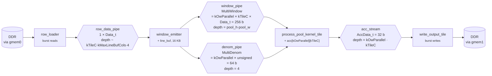
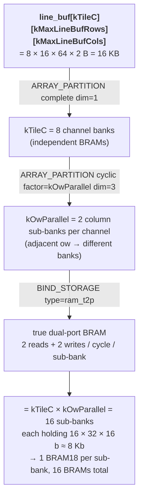
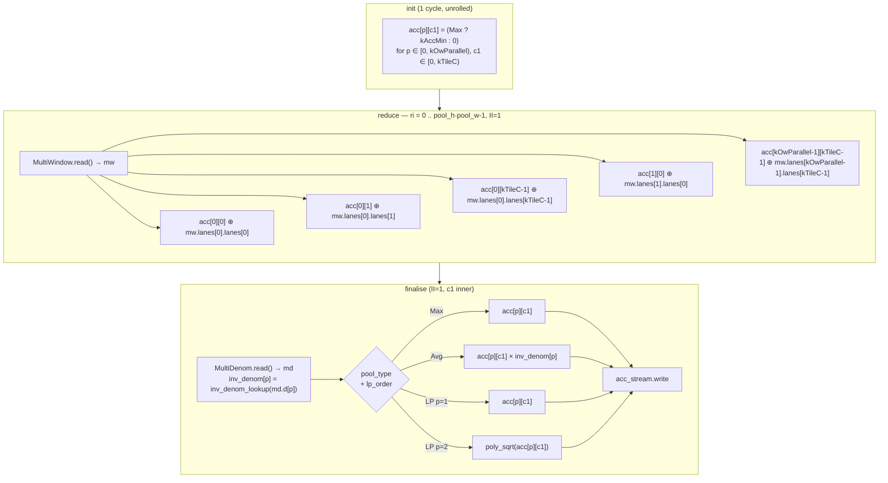
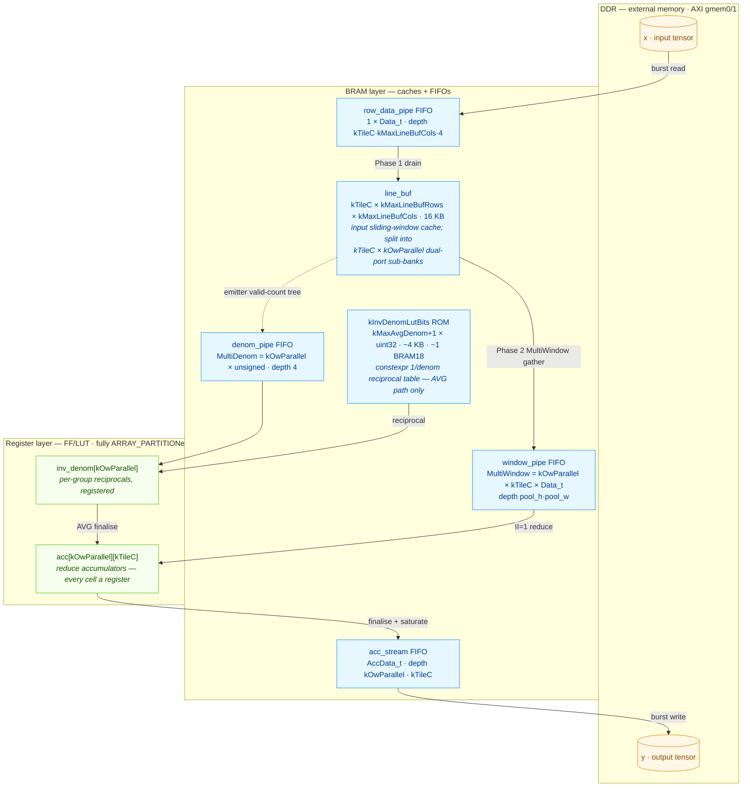

# Pooling Kernel — Detailed Implementation Description

## Overview

`PoolingKernel` is a Vitis HLS kernel implementing ONNX-compliant 2-D
spatial pooling on NCHW tensors. It is one of four hardware kernels in
the `axi_demo` project, targeting the Xilinx KV260 FPGA. The kernel
supports three pooling families (Max, Average, Lp) including their
global variants, dilation, padding, and a tunable channel/output-column
parallelism strategy for II=1 throughput.

Compared with a naïve element-at-a-time reference, the on-board kernel
combines six independent optimisations: a producer/consumer DATAFLOW
split with row caching, channel-parallel reduce, a kOwParallel-wide
output-position vector axis, cyclic-banked dual-port line buffer,
fixed-point AVG reciprocal LUT, and a polynomial fixed-point sqrt for
LP-pool. All six are folded into the architecture described below; the
full optimisation log with measured timings lives in
[POOL_OPTIMIZATION.md](POOL_OPTIMIZATION.md).

---

## 1. AXI Interface

**Memory ports (m_axi):**

| Bundle | Port | Direction | Description |
|--------|------|-----------|-------------|
| `gmem0` | `x` | Read | Input feature map (NCHW) — `hls::burst_maxi<ap_uint<128>>`, 8 elements per beat (POOL_OPTIMIZATION §2.13); base must be 16-byte aligned |
| `gmem1` | `y` | Write | Output feature map (NCHW) |

**AXI-Lite control registers (`s_axilite bundle=ctrl`) — 19 scalars + return:**

| Register | Type | Description |
|----------|------|-------------|
| `x`, `y` | `uint64_t` | Physical DDR base addresses |
| `batch`, `channels` | `unsigned` | Tensor outer dimensions |
| `in_h`, `in_w` | `unsigned` | Input spatial size |
| `out_h`, `out_w` | `unsigned` | Output spatial size |
| `pool_h`, `pool_w` | `unsigned` | Pool window size |
| `stride_h`, `stride_w` | `unsigned` | Stride |
| `pad_top`, `pad_left` | `unsigned` | Padding |
| `dil_h`, `dil_w` | `unsigned` | Dilation |
| `pool_type` | `unsigned` | 0=MaxPool, 1=AveragePool, 2=LpPool |
| `lp_order` | `unsigned` | 1 or 2 (only for LpPool) |
| `count_include_pad` | `unsigned` | 0 or 1 (only for AveragePool) |

64-bit AXI addressing is configured in the synthesis TCL
(`config_interface -m_axi_addr64`) and the bus data width is exposed
through `AXI_BUS_WIDTH` (CMake cache var) which also drives the m_axi
widening and base-alignment hints via `config_interface
-m_axi_max_widen_bitwidth` and `-m_axi_alignment_byte_size`.

---

## 2. Supported Operations

| `pool_type` | Name | Pad fill | Accumulation | Finalisation |
|-------------|------|----------|--------------|--------------|
| 0 | MaxPool | `kAccMin` (identity) | `acc = max(acc, x[i])` | `saturate_cast<Data_t>(acc)` |
| 1 | AveragePool | 0 | `acc += x[i]` | `acc × inv_denom_lookup(denom)` — fixed-point reciprocal LUT, then cast |
| 2 | LpPool (p=1) | 0 | `acc += abs(x[i])` | cast |
| 2 | LpPool (p=2) | 0 | `acc += x[i]²` | `poly_sqrt(acc)` — fixed-point polynomial sqrt, then cast |

Two finalisation changes vs the naïve reference:

- **AVG reciprocal is a LUT**, not a runtime divide. `denom` ranges
  over `[1 … kMaxLineBufRows × kMaxLineBufCols]`, indexes a constexpr
  ROM that stores `1/denom` as `ap_ufixed<24,1>`, and the consumer's
  finalise multiplies by it. Eliminates the FP divider unit and
  associated 35-cycle sequential latency.
- **LP-p=2 sqrt is polynomial**, not `sqrtf()`. A degree-2 Chebyshev
  approximation in `ap_fixed<32,16>` arithmetic replaces the
  HLS-instantiated FP square-root core. Saves the DSP slices and ~12-
  cycle latency that the FP unit costs.

Global variants (`GlobalMaxPool`, `GlobalAveragePool`, `GlobalLpPool`)
are handled by the caller passing `pool_h=in_h`, `pool_w=in_w`,
`stride=1`, `pad=0` — the kernel sees no special case.

---

## 3. Compile-Time Configuration

The kernel's per-platform compile-time bounds live in
`platforms/<name>.json` (e.g. `platforms/kv260.json`) under
`kernels.pool`, which is the single source of truth for both the C++
build and the Python validator in `inference-scheduler`. CMake reads
the JSON via `string(JSON …)` and emits `Config.h` from
`Config.h.in`.

**Per-platform tunables** (read from `platforms/<name>.json`):

| Constant | KV260 value | Purpose |
|----------|------------:|---------|
| `kTileC` | 8 | Channel tile width; pool_h × pool_w channel lanes updated per cycle. Power of 2. |
| `kOwParallel` | 2 | Output-column lanes per cycle; adjacent ow positions processed together. Power of 2. |
| `kMaxPoolH` | 7 | Maximum compile-time pool window height. |
| `kMaxPoolW` | 7 | Maximum compile-time pool window width. |
| `kMaxLineBufRows` | 16 | Line-buffer row capacity; power of 2; bounds `(pool_h-1)·dil_h + 1`. |
| `kMaxLineBufCols` | 64 | Line-buffer column capacity; W-tiling activates when `in_w` exceeds it. |

**Fixed kernel-level constants** (in `Config.h`):

| Constant | Default | Purpose |
|----------|---------|---------|
| `Data_t` | `ap_fixed<16,8>` | Element type (2-byte) |
| `AccData_t` | `ap_fixed<32,16>` | Accumulator type — wider range for sum/sum-of-squares |
| `InvDenom_t` | `ap_ufixed<24,1>` | Reciprocal LUT entry — 23 fractional bits |
| `kMaxAvgDenom` | `kMaxLineBufRows × kMaxLineBufCols` | Upper bound of `denom`, drives LUT size |
| `kDataMin` | `-128.0f` | `MaxPool` pad-fill / identity (Data_t min) |
| `kAccMin` | `-32768.0f` | Sentinel in `AccData_t` range |

The same JSON keys are validated by `PoolNode.from_onnx_node` in the
inference scheduler before any kernel call is emitted; any ONNX op
that would overflow `kMaxPoolH/W` or the dilated-window line-buffer
extents is rejected at codegen time with an error that names the bound
and the JSON field to bump. See
[inference-scheduler/src/\_pool\_hw\_config.py](../inference-scheduler/src/_pool_hw_config.py).

---

## 4. Loop Structure and DATAFLOW Architecture

> The kernel has been substantially restructured from a single nested
> loop into a four-stage DATAFLOW pipeline. The optimisation log with
> per-step timings lives in
> [POOL_OPTIMIZATION.md](POOL_OPTIMIZATION.md); this section describes
> the *current* architecture.

### 4.1 Top-level DATAFLOW pipeline



Each box is an HLS subfunction; each arrow is an `hls::stream` FIFO
sized by an explicit `#pragma HLS STREAM depth=…`. Single
`#pragma HLS DATAFLOW` at the top of `PoolingKernel` runs all four
stages concurrently — the row loader pre-fetches rows for `oh+1`
while the consumer reduces over `oh`, and the writer drains lanes
into DDR while the consumer is producing the next group.

### 4.2 Loop nest

All four stages walk the same `(ni, ct, owt, oh, g)` nest in
lockstep so the streams stay aligned without inter-stage
synchronisation pragmas:

```
for ni  in [0, batch):                            // batch
  for ct  in [0, ceil(channels/kTileC)):          // channel tile (outer of oh)
    for owt in [0, ow_tiles_w):                   // W-tile (handles in_w > kMaxLineBufCols)
      for oh  in [0, out_h):                      // output row
        for g   in [0, ceil(ow_span/kOwParallel)):// kOwParallel adjacent ow positions per group
          // window_emitter  : pool_h·pool_w MultiWindow + 1 MultiDenom
          // process_pool... : reduce (II=1) + finalise (II=1)
          // write_output... : drain kOwParallel · c_valid lanes to y[]
```

`ct` outside `oh` is what enables the line buffer to be reused across
all `oh` of a channel tile — every input pixel is read from DDR at
most once per `(ni, ct)` when `in_w ≤ kMaxLineBufCols`. Wider inputs
fall into bounded re-read territory via the `owt` W-tile loop (see
§4.6).

### 4.3 Stage 1 — `row_loader`

Pulls input rows from DDR into `row_data_pipe` in the order the
`window_emitter` will consume them. Reads the union of new rows for
the current `oh` (rows already loaded for prior `oh` are skipped via
`last_loaded_row`), iterating `(ih, c_l, iw)` per channel-tile lane.
Inner `iw` loop is pipelined `II=1` so HLS infers a sequential burst
on `gmem0`.

### 4.4 Stage 2 — `window_emitter`

Owns the line buffer, drains `row_data_pipe`, and emits one
`MultiWindow` per `(khi, kwi)` and one `MultiDenom` per group.

**Line buffer layout** (16 KB total at default constants):



The cyclic split on `dim=3` (column axis) is the key to letting the
consumer read `kOwParallel` adjacent ow positions in the same cycle:
when `stride_w=1` those columns hit `kOwParallel` distinct banks
naturally; when `stride_w=2` colliding columns share a bank but the
two read ports of `ram_t2p` deliver both reads. The combination
covers every `stride_w` with `gcd(stride_w, kOwParallel) ≤ 2`.

**Phase 1 (drain) — `row_data_pipe → line_buf`:**
For each new `ih` in `[last_loaded_row+1, ih_window_max]`, write
`c_valid × iw_load_width` pixels into `line_buf[c_l][slot][local_iw]`
at `slot = ih & (kMaxLineBufRows - 1)` (line-buffer wrap-around).

**Phase 2 (emit) — `line_buf → window_pipe + denom_pipe`:**
For each ow-group (`kOwParallel` adjacent positions), emit:
1. One `MultiDenom` with `kOwParallel` valid-pixel counts (fully
   unrolled `kOwParallel × kMaxPoolH × kMaxPoolW` adder tree — one
   cycle).
2. `pool_h × pool_w` `MultiWindow` packets, each carrying
   `kOwParallel × kTileC` pixels read in parallel from line_buf, with
   pad-fill (`kAccMin` for Max, `0` for Avg/LP) when the window
   extends outside the input.

The inner `(khi, kwi)` loop is pipelined `II=1`, so window emission
runs at one `MultiWindow` per cycle.

### 4.5 Stage 3 — `process_pool_kernel_tile`

Drains `MultiWindow` + `MultiDenom`, runs the vectorised reduce, and
emits the finalised result to `acc_stream`.



The `⊕` operator is `max` for MaxPool, `+=` for AvgPool, `+= |x|` for
LP-p=1, `+= x²` for LP-p=2. All `kOwParallel × kTileC = 16` lanes
update in the same cycle (unrolled inner double loop). Per-lane RAW
distance is one cycle so the reduce loop schedules at II=1 for MAX
and at II≈L for AVG/LP (`L =` ap_fixed<32,16> add latency, typically
2–3 cycles).

`acc[kOwParallel][kTileC]` is fully partitioned with `ARRAY_PARTITION
complete dim=0` so every lane is a register, not a memory port.

### 4.6 Stage 4 — `write_output_tile`

Drains `acc_stream` in `(p outer, c1 inner)` order per ow-group, with
the inner pipelined loop running at `II=1`. Saturates `AccData_t →
Data_t` via `saturate_cast` at the boundary. Residual lanes
(`ow_g + p ≥ ow_hi` in the last ow-group when `ow_span` is not a
multiple of `kOwParallel`) read from `acc_stream` to keep the stream
in lockstep but are masked from the `y[]` write — those padded
positions never reach DDR.

### 4.7 W-tiling for wide inputs

`compute_ow_tile(out_w, pool_w, stride_w, dil_w)` returns the
W-tile size such that the dilated input span fits in
`kMaxLineBufCols`. The kernel loops over `owt ∈ [0, ow_tiles_w)`
in every stage in lockstep; when `in_w ≤ kMaxLineBufCols` the
formula collapses to `ow_tile = out_w` and `ow_tiles_w = 1`
(zero-duplication path). For wider inputs, boundary input columns
overlap between adjacent W-tiles and get re-read once per
transition — the documented bounded relaxation, accounted for by
the dup-read predictor in `TestPoolingSim.cpp`.

### 4.8 HLS pragmas applied

| Pragma | Location | Effect |
|--------|----------|--------|
| `INTERFACE m_axi … bundle=gmem0/1` | top-level | AXI master memory ports |
| `INTERFACE s_axilite … bundle=ctrl` | every scalar | AXI-Lite control register file |
| `STABLE variable=…` | every read-only input | Suppresses synthetic DATAFLOW sync stages |
| `DATAFLOW` | top-level | Concurrent execution of the four stages |
| `STREAM variable=… depth=…` | each `hls::stream` | Sizes the inferred FIFO |
| `ARRAY_PARTITION variable=line_buf complete dim=1` | `window_emitter` | kTileC independent BRAM banks |
| `ARRAY_PARTITION variable=line_buf cyclic factor=kOwParallel dim=3` | `window_emitter` | kOwParallel column sub-banks per channel |
| `BIND_STORAGE variable=line_buf type=ram_t2p` | `window_emitter` | True dual-port BRAM for each sub-bank |
| `ARRAY_PARTITION variable=acc complete dim=0` | `process_pool_kernel_tile` | kOwParallel × kTileC parallel update lanes |
| `PIPELINE II=1` | row load, drain, emit, reduce, finalise, write | One element per clock at every stage |
| `UNROLL` | per-lane `c1`/`p` updates, valid_count adder tree | Spatial parallelism |

### 4.9 Throughput model

Each ow-group of `kOwParallel` adjacent output positions costs:

```
T_group ≈ max(  pool_h × pool_w  ,   kOwParallel × c_valid  )  cycles
                ────────────────       ─────────────────────
                  reduce (Stage 3)        writer drain (Stage 4)
```

The reduce trip count dropped by a factor of `kOwParallel` vs the
pre-§2.9 element-at-a-time consumer. For typical 3×3 pad1 layers
with `c_valid = kTileC = 8` and `kOwParallel = 2`, the writer
drain (16 cycles) is the larger term — and that's the bottleneck
called out in [POOL_OPTIMIZATION.md §6](POOL_OPTIMIZATION.md).

---

## 5. On-Chip Memory

The kernel stages data through **three memory layers** — DDR, BRAM, and
registers — each a smaller/faster cache of the layer below it. Unlike
ConvKernel, PoolingKernel needs **no URAM**: its only sizeable cache is the
16 KB line buffer, which fits comfortably in BRAM, so the entire URAM pool
is left free. Post-§2.11 synthesis (KV260, kv260.json constants) reports
**27 % LUT, 13 % BRAM, 10 % DSP, 7 % FF, 0 % URAM** — LUT is the tightest
layer; BRAM and URAM keep ample headroom for wider tiling.



**`line_buf`** is the one structural cache. Owned by `window_emitter`, it
holds the input sliding window so each input pixel is fetched from DDR at
most once per `(ni, ct)` channel tile — or once per W-tile for inputs wider
than `kMaxLineBufCols` (§4.7). Its three-axis layout — `ARRAY_PARTITION
complete dim=1` (one bank per channel), `ARRAY_PARTITION cyclic
factor=kOwParallel dim=3` (column sub-banks), and `BIND_STORAGE ram_t2p`
(true dual-port) — gives `kTileC × kOwParallel` dual-port sub-banks, the
exact read bandwidth the emitter needs to gather `kOwParallel` adjacent
output positions every cycle. The full banking analysis is in §4.4.

**`kInvDenomLutBits`** is a `constexpr`-built ROM holding `1/denom` as
`ap_ufixed<24,1>` raw bits, materialised inside `process_pool_kernel_tile`
(it backs the inlined `inv_denom_lookup`). It is read only on the
AveragePool finalise path and is sized by `kMaxAvgDenom = kMaxLineBufRows ×
kMaxLineBufCols`; see §2 and §6.

**`acc[kOwParallel][kTileC]`** is the reduce accumulator file.
`ARRAY_PARTITION complete dim=0` makes every one of the `kOwParallel ×
kTileC` cells an independent register, so the fully-unrolled reduce updates
all lanes in a single cycle. `inv_denom[kOwParallel]` is likewise fully
partitioned into registers.

The four `hls::stream` FIFOs are themselves on-chip memory; HLS maps each to
BRAM or LUTRAM by depth. Their depths are set by explicit `#pragma HLS
STREAM` (see the §4.1 diagram) and sized so each producer can stage the
next unit of work while its consumer drains the current one.

Buffer declarations and their pragmas:

```cpp
// window_emitter — input sliding-window cache (16 KB at default constants).
static Data_t line_buf[kTileC][kMaxLineBufRows][kMaxLineBufCols];
#pragma HLS ARRAY_PARTITION variable=line_buf complete dim=1
#pragma HLS ARRAY_PARTITION variable=line_buf cyclic factor=kOwParallel dim=3
#pragma HLS BIND_STORAGE   variable=line_buf type=ram_t2p
// dim=1 complete    → kTileC independent per-channel banks.
// cyclic dim=3      → kOwParallel column sub-banks per channel, so
//                     adjacent ow positions land in different banks.
// ram_t2p           → each sub-bank is true-dual-port, covering every
//                     stride_w with gcd(stride_w, kOwParallel) ≤ 2.
// Circular row indexing: slot = ih & (kMaxLineBufRows - 1).

// process_pool_kernel_tile — AVG reciprocal ROM (namespace-scope constexpr,
// materialised into BRAM where inv_denom_lookup is inlined).
constexpr auto kInvDenomLutBits =
    make_inv_denom_lut_helper(
        std::make_integer_sequence<unsigned, kMaxAvgDenom + 1>{});

// process_pool_kernel_tile — reduce accumulators + per-group reciprocals.
AccData_t  acc[kOwParallel][kTileC];
#pragma HLS ARRAY_PARTITION variable=acc complete dim=0
InvDenom_t inv_denom[kOwParallel];
#pragma HLS ARRAY_PARTITION variable=inv_denom complete
// complete dim=0 → all kOwParallel × kTileC accumulators are registers,
// updated in parallel by the unrolled reduce.
```

**Packed window stream (`MultiWindow`).** Like ConvKernel's `PatchVec`, the
`window_emitter → process_pool_kernel_tile` path carries a packed struct
rather than scalar beats: a `MultiWindow` bundles `kOwParallel × kTileC`
`Data_t` pixels so one FIFO beat feeds every reduce lane for one
`(khi, kwi)` position, collapsing the reduce trip count to `pool_h × pool_w`
cycles per ow-group. `MultiDenom` likewise packs the `kOwParallel`
per-position valid-pixel counts into one `denom_pipe` beat per group.

---

## 6. Data Types and Saturation

`saturate_cast<Data_t>(v)` converts `AccData_t` back to `Data_t` at
the finalisation boundary. For `ap_fixed`, the specialisation uses
`AP_TRN` (truncation) and `AP_SAT` (saturation clamping), matching
ONNX's fixed-point semantics. A fallback template handles `float`
builds (identity cast for C-sim debugging).

The fixed-point reciprocal LUT entries are constexpr-computed at
compile time via a `std::integer_sequence` pack expansion, so the
binary embeds the ROM directly (`kInvDenomLutBits`) and the
`inv_denom_lookup` function is a single BRAM read followed by an
`ap_uint<24>` → `ap_ufixed<24,1>` reinterpret.

---

## 7. Test Coverage (`TestPoolingSim.cpp`)

33 test cases compiled and run with GCC (no Vitis required). Tolerance:
`kTol = 0.02f`.

| Category | Cases |
|----------|-------|
| MaxPool | 2×2 s2, 3×3 s1 pad1, rect 6×10, batch=3, C=16, C=32, dilation=2, Global |
| AveragePool | no-pad, pad1 ±count_include_pad, C=12, rect, Global, batch=2 C=16 |
| LpPool | p=1 and p=2, 2×2, 3×3 pad1, GlobalLpPool (p=1 and p=2) |
| Edge cases | 1×1 output, all-padded corner (3×3 pad1 on 2×2 input) |
| Wide-W (`in_w > kMaxLineBufCols`) | MaxPool W=128 3×3 pad1, AvgPool W=96 3×3 pad1, MaxPool W=128 2×2 s2 — plus batch=2 variants |
| AVG-pool numerical | 5×5 pad=2 strict-equality (validates fixed-point reciprocal vs ref) |

The dup-read predictor `expected_dup_reads_for(tc)` simulates the
kernel's exact line-buffer + W-tile load schedule, so
`dup_reads=actual/predicted` always shows cache-aware expectations and
adapts when `kMaxLineBufCols`, `kTileC`, or geometry change.

The RTL behavior test (`make behavior_test_pool`) runs the same 31
hardware-relevant cases on Vivado xsim against the synthesised RTL,
reporting per-test cycle counts.

---

## 8. Inference Scheduler Integration

**`PoolNode` (`nodes.py`)** maps ONNX pool ops to kernel invocations:

- Validates NCHW 4-D shapes; parses `kernel_shape`, `strides`,
  `dilations`, `auto_pad` (NOTSET/VALID/SAME_UPPER/SAME_LOWER),
  `pads`, `p`, `count_include_pad`; rejects `ceil_mode=1`.
- Normalises Global variants to `pool=in_spatial, stride=1, pad=0`.
- Validates against the per-platform JSON bounds via
  `_pool_hw_config.resolve(platform_name)` and raises
  `PoolHwConfigError` / `SchedulerError` (with the bound name and JSON
  field to bump) if `pool_h > kMaxPoolH`, `pool_w > kMaxPoolW`, or the
  vertical/horizontal dilated spans exceed the line-buffer extents.

**Code-generated `run_pool()` (`_source.py`)** sets all 19 AXI-Lite
scalar registers and calls `XPoolingkernel_Start()` — non-blocking.
The `inference_run()` body emits a `kernel_wait(KERNEL_POOL)` later,
only when a downstream op needs the Pool output or another op wants
to reuse the Pool lane, which lets work on other lanes (e.g. Conv,
VectorOP) overlap with the Pool.

**Buffer layout (`_core.py`)** packs all pool tensor buffers into a
single contiguous 64-byte-aligned DMA allocation. Slot colouring uses
event-stream liveness intervals so two tensors share a slot only when
one is fully drained before the other's producer starts.

**Reference simulation (`_simulate.py`)** implements float64
`_pool2d_ref()` matching kernel semantics for bit-accurate test
comparison.

---

## 9. Build Targets

```bash
# C simulation (GCC, no Vitis required).
make TestPoolingSim && ctest

# HLS synthesis + IP export for KV260.
make synthesize_pool_kv260

# RTL behavior test on Vivado xsim — depends on synthesize_pool_kv260.
make behavior_test_pool
```

The synthesis target reads `platforms/kv260.json` (specifies `part`,
optional `board`, `clock`, and the `kernels.pool` compile-time
constants) and invokes Vitis HLS via `Synthesis.tcl.in`, which
configures the project, adds source files, applies directives, runs
`csynth_design`, and exports an IP catalog archive. Adding a new
platform is a JSON-file-plus-cmake-rerun operation; no C++ edits
required.

The verification workflow is also packaged as a
[`pool-verify` skill](../.claude/skills/pool-verify/SKILL.md) that
runs the four gates sequentially (C-sim → synthesis → behavior test →
per-test timing diff vs the previous run) and reports a single
summary.

---

## 10. Key Source Files

| File | Purpose |
|------|---------|
| `kernels/pool/kernel/PoolingKernel.cpp` | HLS kernel implementation — all four DATAFLOW stages, `poly_sqrt`, `inv_denom_lookup` ROM |
| `kernels/pool/include/PoolingKernel.h` | Kernel declaration, `pool_type` enum, `saturate_cast<T>` |
| `kernels/pool/include/Config.h.in` | CMake template → `Config.h` (Data_t, AccData_t, all six per-platform tile constants) |
| `kernels/pool/test/TestPoolingSim.cpp` | C simulation tests (GCC) |
| `kernels/pool/scripts/Synthesis.tcl.in` | Vitis HLS TCL template |
| `kernels/pool/CMakeLists.txt` | Per-platform synthesis target generation; `pool_load_constants` reads `kernels.pool` from each platform JSON |
| `platforms/<name>.json` | Per-platform FPGA part + clock + `kernels.pool` constants (single source of truth) |
| `inference-scheduler/src/_pool_hw_config.py` | Python validator that re-reads `kernels.pool` from the same JSON |
| `inference-scheduler/src/nodes.py` | `PoolNode` (ONNX → kernel params + HW-bound validation) |
| `inference-scheduler/src/codegen/_source.py` | `run_pool()` code generation |
| `inference-scheduler/src/codegen/_core.py` | Pool node detection, buffer layout |
| `inference-scheduler/src/codegen/_simulate.py` | Float64 reference simulation |
| `inference-scheduler/test/test_pool.py` | Scheduler-level pool tests |
| `doc/POOL_OPTIMIZATION.md` | Full optimisation log with measured timings and rejected experiments |
