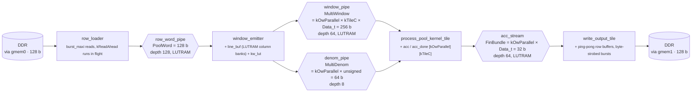
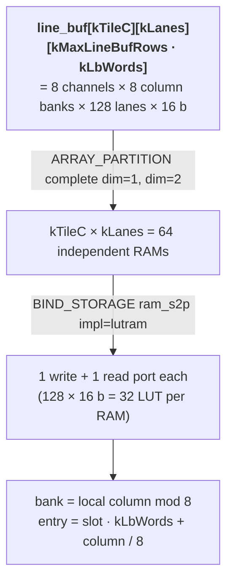
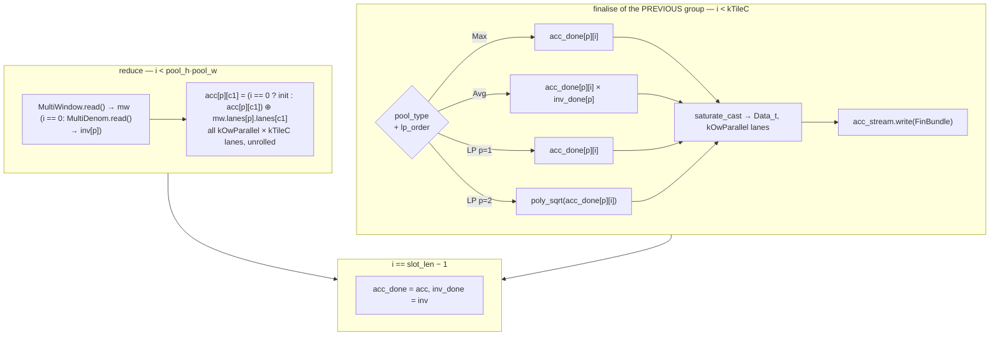
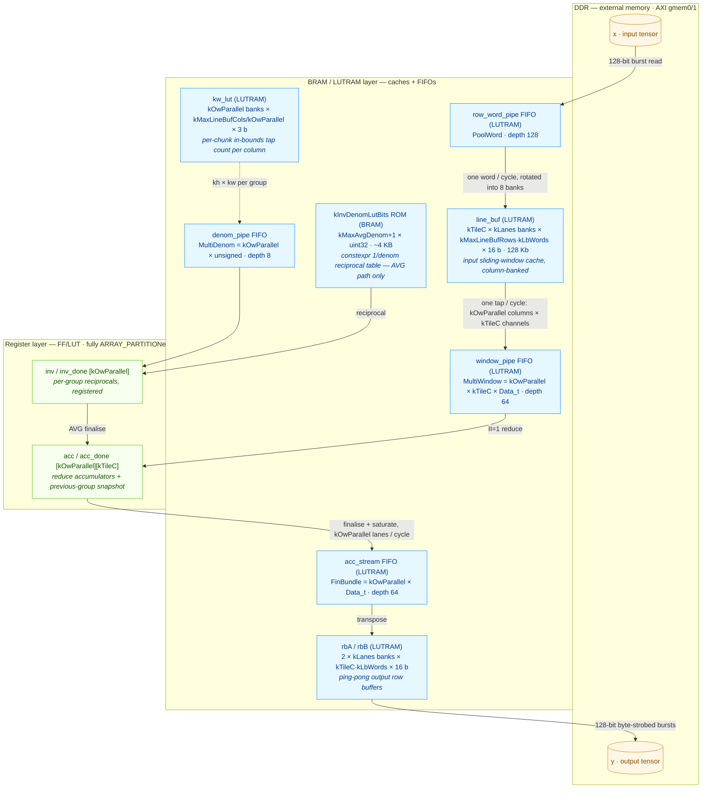

# Pooling Kernel — Detailed Implementation Description

## Overview

`PoolingKernel` is a Vitis HLS kernel implementing ONNX-compliant 2-D
spatial pooling on NCHW tensors. It is one of four hardware kernels in
the `axi_demo` project, targeting the Xilinx KV260 FPGA. The kernel
supports three pooling families (Max, Average, Lp) including their
global variants, dilation, padding, and a tunable channel/output-column
parallelism strategy for II=1 throughput.

Compared with a naïve element-at-a-time reference, the on-board kernel
combines six independent optimisations: a producer/consumer DATAFLOW
split with row caching, channel-parallel reduce, a kOwParallel-wide
output-position vector axis, cyclic-banked dual-port line buffer,
fixed-point AVG reciprocal LUT, and a polynomial fixed-point sqrt for
LP-pool. All six are folded into the architecture described below; the
full optimisation log with measured timings lives in
[POOL_OPTIMIZATION.md](POOL_OPTIMIZATION.md).

---

## 1. AXI Interface

**Memory ports (m_axi):**

| Bundle | Port | Direction | Description |
|--------|------|-----------|-------------|
| `gmem0` | `x` | Read | Input feature map (NCHW) — `hls::burst_maxi<ap_uint<128>>`, 8 elements per beat (POOL_OPTIMIZATION §2.13); base must be 16-byte aligned; the last word of a row run may extend up to 7 elements past the tensor end (bytes must be mappable) |
| `gmem1` | `y` | Write | Output feature map (NCHW) — `hls::burst_maxi<ap_uint<128>>`, 8 elements per beat (POOL_OPTIMIZATION §2.14); base must be 16-byte aligned; one burst per (output row, channel) run whose first / last words carry byte strobes for the run's own lanes only, so no tail padding of the y buffer is needed |

**AXI-Lite control registers (`s_axilite bundle=ctrl`) — 19 scalars + return:**

| Register | Type | Description |
|----------|------|-------------|
| `x`, `y` | `uint64_t` | Physical DDR base addresses |
| `batch`, `channels` | `unsigned` | Tensor outer dimensions |
| `in_h`, `in_w` | `unsigned` | Input spatial size |
| `out_h`, `out_w` | `unsigned` | Output spatial size |
| `pool_h`, `pool_w` | `unsigned` | Pool window size |
| `stride_h`, `stride_w` | `unsigned` | Stride |
| `pad_top`, `pad_left` | `unsigned` | Padding |
| `dil_h`, `dil_w` | `unsigned` | Dilation |
| `pool_type` | `unsigned` | 0=MaxPool, 1=AveragePool, 2=LpPool |
| `lp_order` | `unsigned` | 1 or 2 (only for LpPool) |
| `count_include_pad` | `unsigned` | 0 or 1 (only for AveragePool) |

64-bit AXI addressing is configured in the synthesis TCL
(`config_interface -m_axi_addr64`) and the bus data width is exposed
through `AXI_BUS_WIDTH` (CMake cache var) which also drives the m_axi
widening and base-alignment hints via `config_interface
-m_axi_max_widen_bitwidth` and `-m_axi_alignment_byte_size`.

---

## 2. Supported Operations

| `pool_type` | Name | Pad fill | Accumulation | Finalisation |
|-------------|------|----------|--------------|--------------|
| 0 | MaxPool | `kAccMin` (identity) | `acc = max(acc, x[i])` | `saturate_cast<Data_t>(acc)` |
| 1 | AveragePool | 0 | `acc += x[i]` | `acc × inv_denom_lookup(denom)` — fixed-point reciprocal LUT, then cast |
| 2 | LpPool (p=1) | 0 | `acc += abs(x[i])` | cast |
| 2 | LpPool (p=2) | 0 | `acc += x[i]²` | `poly_sqrt(acc)` — fixed-point polynomial sqrt, then cast |

Two finalisation changes vs the naïve reference:

- **AVG reciprocal is a LUT**, not a runtime divide. `denom` ranges
  over `[1 … kMaxLineBufRows × kMaxLineBufCols]`, indexes a constexpr
  ROM that stores `1/denom` as `ap_ufixed<24,1>`, and the consumer's
  finalise multiplies by it. Eliminates the FP divider unit and
  associated 35-cycle sequential latency.
- **LP-p=2 sqrt is polynomial**, not `sqrtf()`. A degree-2 Chebyshev
  approximation in `ap_fixed<32,16>` arithmetic replaces the
  HLS-instantiated FP square-root core. Saves the DSP slices and ~12-
  cycle latency that the FP unit costs.

Global variants (`GlobalMaxPool`, `GlobalAveragePool`, `GlobalLpPool`)
are handled by the caller passing `pool_h=in_h`, `pool_w=in_w`,
`stride=1`, `pad=0` — the kernel sees no special case.

---

## 3. Compile-Time Configuration

The kernel's per-platform compile-time bounds live in
`platforms/<name>.json` (e.g. `platforms/kv260.json`) under
`kernels.pool`, which is the single source of truth for both the C++
build and the Python validator in `inference-scheduler`. CMake reads
the JSON via `string(JSON …)` and emits `Config.h` from
`Config.h.in`.

**Per-platform tunables** (read from `platforms/<name>.json`):

| Constant | KV260 value | Purpose |
|----------|------------:|---------|
| `kTileC` | 8 | Channel tile width; pool_h × pool_w channel lanes updated per cycle. Power of 2. |
| `kOwParallel` | 2 | Output-column lanes per cycle; adjacent ow positions processed together. Power of 2. |
| `kMaxPoolH` | 7 | Maximum compile-time pool window height. |
| `kMaxPoolW` | 7 | Maximum compile-time pool window width. |
| `kMaxLineBufRows` | 16 | Line-buffer row capacity; power of 2; bounds `(pool_h-1)·dil_h + 1`. |
| `kMaxLineBufCols` | 64 | Line-buffer column capacity; W-tiling activates when `in_w` exceeds it. |

**Fixed kernel-level constants** (in `Config.h`):

| Constant | Default | Purpose |
|----------|---------|---------|
| `Data_t` | `ap_fixed<16,8>` | Element type (2-byte) |
| `AccData_t` | `ap_fixed<32,16>` | Accumulator type — wider range for sum/sum-of-squares |
| `InvDenom_t` | `ap_ufixed<24,1>` | Reciprocal LUT entry — 23 fractional bits |
| `kMaxAvgDenom` | `kMaxLineBufRows × kMaxLineBufCols` | Upper bound of `denom`, drives LUT size |
| `kDataMin` | `-128.0f` | `MaxPool` pad-fill / identity (Data_t min) |
| `kAccMin` | `-32768.0f` | Sentinel in `AccData_t` range |

The same JSON keys are validated by `PoolNode.from_onnx_node` in the
inference scheduler before any kernel call is emitted; any ONNX op
that would overflow `kMaxPoolH/W` or the dilated-window line-buffer
extents is rejected at codegen time with an error that names the bound
and the JSON field to bump. See
[inference-scheduler/src/\_pool\_hw\_config.py](../inference-scheduler/src/_pool_hw_config.py).

---

## 4. Loop Structure and DATAFLOW Architecture

> The kernel has been substantially restructured from a single nested
> loop into a four-stage DATAFLOW pipeline. The optimisation log with
> per-step timings lives in
> [POOL_OPTIMIZATION.md](POOL_OPTIMIZATION.md); this section describes
> the *current* architecture.

### 4.1 Top-level DATAFLOW pipeline



Each box is an HLS subfunction; each arrow is an `hls::stream` FIFO
sized by an explicit `#pragma HLS STREAM depth=…`. Single
`#pragma HLS DATAFLOW` at the top of `PoolingKernel` runs all four
stages concurrently.  Since POOL_OPTIMIZATION §2.14 every stage moves
one 128-bit word (8 elements) per cycle where it touches DDR or the
line buffer, and every stage's hot path is ONE flattened `II=1` loop
per output row — there is no per-group or per-run loop re-entry.

### 4.2 Loop nest

All four stages walk the same `(ni, ct, owt, oh, g)` nest in
lockstep so the streams stay aligned without inter-stage
synchronisation pragmas:

```
for ni  in [0, batch):                            // batch
  for ct  in [0, ceil(channels/kTileC)):          // channel tile (outer of oh)
    for owt in [0, ow_tiles_w):                   // W-tile (handles in_w > kMaxLineBufCols)
      // "chunk" = (ni, ct, owt): the loader streams its rows 0 .. rows_per_chunk-1
      for oh  in [0, out_h):                      // output row = one flattened II=1 loop per stage
        for g   in [0, ceil(ow_span/gw)):         // gw (= kOwParallel, or 1) adjacent ow positions
          // window_emitter  : pool_h·pool_w MultiWindow + 1 MultiDenom
          // process_pool... : slot_len = max(pool_h·pool_w, kTileC) iterations
          // write_output... : kTileC FinBundles into the row buffer
```

`ct` outside `oh` is what enables the line buffer to be reused across
all `oh` of a channel tile — every input pixel is read from DDR at
most once per `(ni, ct)` when `in_w ≤ kMaxLineBufCols`. Wider inputs
fall into bounded re-read territory via the `owt` W-tile loop (see
§4.7).

The per-invocation `PoolGeometry` (computed once in `PoolingKernel`)
carries, besides `c_tiles / ow_tile / ow_tiles_w`: `gw` (group width —
`kOwParallel` unless `stride_w` is a multiple of `2·8/kOwParallel`, in
which case the group's columns would share a line-buffer bank and
groups are one column wide), `rows_per_chunk`, `red_len = pool_h·pool_w`,
`slot_len = max(red_len, kTileC)` and `prefetch` (see §4.4).  A
per-chunk `ChunkGeom` (`c_valid`, `ow_lo/hi`, `n_groups`, `iw_lo`,
`run_len`) is derived identically in every stage.

### 4.3 Stage 1 — `row_loader`

Pure DDR reader.  Per chunk it walks the run sequence
`(ih = 0 .. rows_per_chunk-1, c_l = 0 .. c_valid-1)` — one run is the
contiguous range `[run_off, run_off + run_len)` of one input row of
one channel — and pushes every 128-bit **word** covering a run onto
`row_word_pipe`, one word per cycle in a single flattened `II=1` loop
(`RunCursor` advances by adds only; the run's lane shift is tracked in
3-bit arithmetic so the word count of the next run is off the 32-bit
adder).  Requests run ahead of the drain: a prologue issues the first
`kReadAhead = 12` runs' `read_request`s, then one more is issued each
time a run has been drained, so the DDR latency is paid once per chunk
rather than once per row.  The words of a run's first / last word that
lie outside the run are dropped by the emitter.

### 4.4 Stage 2 — `window_emitter`

Owns the line buffer and `kw_lut`, drains `row_word_pipe`, and emits
one `MultiWindow` per `(khi, kwi)` and one `MultiDenom` per group.

**Line buffer layout** (128 Kb of LUTRAM at default constants):



**Write path (one row word per cycle).**  A word's 8 lanes are
rotated by the run's word alignment (`shift = run_off mod 8`) so bank
`b` receives the lane whose local column ≡ `b` (mod 8); each bank's
entry is `slot · 8 + (word index, minus one for the lanes that wrapped)`;
lanes outside `[0, run_len)` are dropped by a per-bank enable; the
channel is selected by an unrolled compare, so every RAM sees exactly
one conditional store.

**Read path (one window tap per cycle).**  For each of the
`kOwParallel` positions the local column `ow_p·stride_w + kwi·dil_w −
pad_left − iw_lo` picks the bank and entry; every bank is read once at
the address of the position that maps to it, and the position's value
is muxed out of the bank vector.  Columns spaced by `stride_w` hit
distinct banks unless `stride_w` is a multiple of `2·8/kOwParallel`
(= 8 at the shipped `kOwParallel = 2`), which `PoolGeometry::gw`
handles by one-column groups.

**One flattened loop per output row.**  In *prefetch* mode (the
default: `(pool_h−1)·dil_h + 1 + stride_h ≤ kMaxLineBufRows`) the loop
for output row `oh` writes the words of the rows that row `oh+1`
needs (their slots are disjoint from the window in use) while emitting
row `oh`'s `n_groups × pool_h × pool_w` taps; a prologue instance
(`oh = −1`) loads row 0's rows.  Otherwise the same loop loads the
current row's rows first and starts emitting `kSeqGap = 8` iterations
after the last word landed.  Both sides finish at their own pace and
the loop exits when both are done.

**Denominators** are separable (§2.12): `kh(oh) × kw(ow)`.  `kw` is
tallied once per chunk into the `kMaxLineBufCols`-entry `kw_lut`
(`kOwParallel` banks, one read per bank per cycle) by a serial
`(position, tap)` pre-pass, `kh` once per row; the hot loop only
multiplies the two.

### 4.5 Stage 3 — `process_pool_kernel_tile`

One flattened `II=1` loop per output row of `n_groups × slot_len`
iterations (plus one extra slot after the very last row).  Iteration
`i` of slot `g`:



The `⊕` operator is `max` for MaxPool, `+` for AvgPool, `+ |x|` for
LP-p=1, `+ x²` for LP-p=2.  Because `slot_len ≥ kTileC`, the finalise
of group `g` (kOwParallel lanes per cycle — one channel's adjacent
positions) always completes inside slot `g+1`, so the finalise
hardware is `kOwParallel` wide instead of `kOwParallel × kTileC`
(the §6.2.3 attempt) and never stalls the reduce.  `acc`, `acc_done`,
`inv`, `inv_done` are fully partitioned registers.

### 4.6 Stage 4 — `write_output_tile`

Transposes the `(group, channel)` bundles into per-channel output-row
runs.  Two row buffers (ping-pong), each `kLanes = 8` column banks ×
`kTileC · kLbWords` LUTRAM entries: a bundle's `kOwParallel` adjacent
columns of channel `c1` go to banks `col mod 8` at entry `c1·8 +
col/8`; a DDR word of channel `c`'s run is the 8 banks read at entry
`c·8 + k` (or `k−1` for the lanes that wrap), rotated by the run's
alignment.  One flattened `II=1` loop per output row of
`max(n_groups·kTileC, c_valid·nw_max)` iterations fills buffer `r&1`
with row `r`'s bundles (masking the identity-padded lanes past `ow_hi`
and channels ≥ `c_valid`) while draining row `r−1` from the other
buffer: per channel one `write_request` of `pool_words_for(start, len)
≤ kLbWords + 1` words, the run's first / last words written with
`write(word, byte_enable)` covering only the run's own lanes (masked
lanes are also zeroed in WDATA).  At most `kWriteInFlight = 4` requests
are un-acknowledged (`< num_write_outstanding = 8`).  A final row-loop
iteration drains the last row.

### 4.7 W-tiling for wide inputs

`compute_ow_tile(out_w, pool_w, stride_w, dil_w)` returns the
W-tile size such that the dilated input span fits in
`kMaxLineBufCols`. The kernel loops over `owt ∈ [0, ow_tiles_w)`
in every stage in lockstep; when `in_w ≤ kMaxLineBufCols` the
formula collapses to `ow_tile = out_w` and `ow_tiles_w = 1`
(zero-duplication path). For wider inputs, boundary input columns
overlap between adjacent W-tiles and get re-read once per
transition — the documented bounded relaxation, accounted for by
the dup-read predictor in `TestPoolingSim.cpp`.

### 4.8 HLS pragmas applied

| Pragma | Location | Effect |
|--------|----------|--------|
| `INTERFACE m_axi … bundle=gmem0` (`max_read_burst_length=16 num_read_outstanding=16`) | top-level | 128-bit `burst_maxi` input port |
| `INTERFACE m_axi … bundle=gmem1` (`max_write_burst_length=16 num_write_outstanding=8`) | top-level | 128-bit `burst_maxi` output port, byte-strobed run edges |
| `INTERFACE s_axilite … bundle=ctrl` | every scalar | AXI-Lite control register file |
| `STABLE variable=…` | every read-only input | Suppresses synthetic DATAFLOW sync stages |
| `DATAFLOW` | top-level | Concurrent execution of the four stages |
| `STREAM variable=… depth=…` + `BIND_STORAGE type=fifo impl=lutram` | each `hls::stream` | Sizes the FIFO; the wide ones in LUTRAM (a 128-bit FIFO in BRAM costs 4 BRAM18 at any depth) |
| `ARRAY_PARTITION variable=line_buf complete dim=1` / `dim=2` | `window_emitter` | kTileC × kLanes independent column-bank RAMs |
| `BIND_STORAGE variable=line_buf type=ram_s2p impl=lutram` | `window_emitter` | 1W1R LUTRAM per bank |
| `DEPENDENCE variable=line_buf inter false` | `window_emitter` | Loads and window reads in one loop instance touch different slots (or are kSeqGap apart) |
| `ARRAY_PARTITION variable=kw_lut complete dim=1` | `window_emitter` | One denominator bank per group position |
| `ARRAY_PARTITION variable=acc / acc_done complete dim=0` | `process_pool_kernel_tile` | kOwParallel × kTileC parallel update lanes + snapshot |
| `ARRAY_PARTITION variable=rbA / rbB complete dim=1` + `ram_s2p impl=lutram` + `DEPENDENCE inter false` | `write_output_tile` | Ping-pong row buffers, 8 column banks each |
| `PIPELINE II=1` | request prologue, loader drain, denominator pre-pass, emitter row loop, consumer row loop, writer row loop | One word / tap / bundle per clock |
| `UNROLL` | per-lane `c1`/`p`/bank/lane loops | Spatial parallelism |

### 4.9 Throughput model

Per output row of a chunk (`c_valid` channels, `n_groups` ow-groups):

```
loader   ≈ new_rows × c_valid × (run_len/8 + 1)      words (one per cycle, latency hidden by kReadAhead)
emitter  ≈ max(loader words, n_groups × pool_h × pool_w)   (prefetch mode: both in one loop)
consumer ≈ n_groups × max(pool_h × pool_w, kTileC)
writer   ≈ max(n_groups × kTileC, c_valid × (ow_span/8 + 1))
```

The wall clock is the largest of the four, all overlapped.  For
ResNet-18's MaxPool 3×3 s2 on 112²×64 (W-tiled in two 63/51-column
tiles) the consumer's 9 cycles per group of 16 outputs is the bound
(≈ 2.25 cycles per 8 outputs, ~117 k cycles); for 2×2 s2 pools the
consumer's `kTileC = 8` cycles per group (2 outputs per cycle) is;
for global pools the loader's one word per cycle is.

## 5. On-Chip Memory

The kernel stages data through **three memory layers** — DDR, BRAM, and
registers — each a smaller/faster cache of the layer below it. Unlike
ConvKernel, PoolingKernel needs **no URAM**, and since POOL_OPTIMIZATION
§2.14 almost no BRAM either: the line buffer, the row buffers and the wide
FIFOs are LUTRAM (the only BRAM18s are the x port's read adapter and the
AVG reciprocal ROM).  Post-§2.14 synthesis (KV260, kv260.json constants)
reports **30 % LUT, 3 % BRAM, 7 % DSP, 8 % FF, 0 % URAM** — LUT is the
tightest layer.



**`line_buf`** is the one structural cache. Owned by `window_emitter`, it
holds the input sliding window so each input pixel is fetched from DDR at
most once per `(ni, ct)` channel tile — or once per W-tile for inputs wider
than `kMaxLineBufCols` (§4.7). Its layout — `[channel][column bank][row
slot · kLbWords + column word]`, both leading dims partitioned complete,
`BIND_STORAGE ram_s2p impl=lutram` — gives `kTileC × kLanes = 64` 1W1R
LUTRAMs: exactly what writing one 128-bit row word per cycle (8 lanes into
8 banks of one channel) and reading `kOwParallel` columns of all `kTileC`
channels per cycle need.  The full banking analysis is in §4.4.

**`rbA` / `rbB`** are the writer's ping-pong output row buffers, `[column
bank][channel · kLbWords + word]`, 8 LUTRAMs each: bundles of `kOwParallel`
adjacent columns of one channel are scattered into the banks and a
channel's 128-bit DDR word is gathered from all 8 banks at one entry (§4.6).

**`kInvDenomLutBits`** is a `constexpr`-built ROM holding `1/denom` as
`ap_ufixed<24,1>` raw bits, materialised inside `process_pool_kernel_tile`
(it backs the inlined `inv_denom_lookup`). It is read only on the
AveragePool finalise path and is sized by `kMaxAvgDenom = kMaxLineBufRows ×
kMaxLineBufCols`; see §2 and §6.

**`acc[kOwParallel][kTileC]`** is the reduce accumulator file.
`ARRAY_PARTITION complete dim=0` makes every one of the `kOwParallel ×
kTileC` cells an independent register, so the fully-unrolled reduce updates
all lanes in a single cycle. `acc_done` / `inv_done` hold the previous
group's snapshot that the overlapped finalise reads (§4.5).

The four `hls::stream` FIFOs are themselves on-chip memory. Their depths
are set by explicit `#pragma HLS STREAM` (see the §4.1 diagram) and sized
so each producer can stage the next unit of work while its consumer drains
the current one; the three wide ones are bound to LUTRAM.

Buffer declarations and their pragmas:

```cpp
// window_emitter — input sliding-window cache (128 Kb of LUTRAM at default constants).
static Lane line_buf[kTileC][kLanes][kMaxLineBufRows * kLbWords];
#pragma HLS ARRAY_PARTITION variable=line_buf complete dim=1
#pragma HLS ARRAY_PARTITION variable=line_buf complete dim=2
#pragma HLS BIND_STORAGE   variable=line_buf type=ram_s2p impl=lutram
#pragma HLS DEPENDENCE     variable=line_buf inter false
// dim=1 complete    → kTileC independent per-channel bank sets.
// dim=2 complete    → kLanes column banks per channel (column mod kLanes),
//                     so a row word's 8 lanes are 8 writes to 8 banks and
//                     kOwParallel columns spaced by stride_w read distinct
//                     banks (else PoolGeometry::gw falls back to 1).
// Circular row indexing: entry = (ih & (kMaxLineBufRows - 1)) * kLbWords + column / kLanes.

// process_pool_kernel_tile — AVG reciprocal ROM (namespace-scope constexpr,
// materialised into BRAM where inv_denom_lookup is inlined).
constexpr auto kInvDenomLutBits =
    make_inv_denom_lut_helper(
        std::make_integer_sequence<unsigned, kMaxAvgDenom + 1>{});

// process_pool_kernel_tile — reduce accumulators, snapshot, reciprocals.
AccData_t  acc[kOwParallel][kTileC], acc_done[kOwParallel][kTileC];
#pragma HLS ARRAY_PARTITION variable=acc      complete dim=0
#pragma HLS ARRAY_PARTITION variable=acc_done complete dim=0
InvDenom_t inv[kOwParallel], inv_done[kOwParallel];
// complete dim=0 → all kOwParallel × kTileC accumulators are registers,
// updated in parallel by the unrolled reduce; acc_done is the previous
// group's copy that the overlapped finalise reads one channel per cycle.

// write_output_tile — ping-pong output row buffers.
static Lane rbA[kLanes][kTileC * kLbWords], rbB[kLanes][kTileC * kLbWords];
#pragma HLS ARRAY_PARTITION variable=rbA complete dim=1   // (and rbB)
#pragma HLS BIND_STORAGE    variable=rbA type=ram_s2p impl=lutram
#pragma HLS DEPENDENCE      variable=rbA inter false
// Within one row loop each buffer is either only written (this row's
// bundles) or only read (the previous row's DDR words).
```

**Packed streams.** Like ConvKernel's `PatchVec`, the
`window_emitter → process_pool_kernel_tile` path carries a packed struct
rather than scalar beats: a `MultiWindow` bundles `kOwParallel × kTileC`
`Data_t` pixels so one FIFO beat feeds every reduce lane for one
`(khi, kwi)` position, collapsing the reduce trip count to `pool_h × pool_w`
cycles per ow-group. `MultiDenom` likewise packs the `kOwParallel`
per-position valid-pixel counts into one `denom_pipe` beat per group, and
a `FinBundle` carries the `kOwParallel` saturated outputs of one channel
from the finalise to the writer.

---

## 6. Data Types and Saturation

`saturate_cast<Data_t>(v)` converts `AccData_t` back to `Data_t` at
the finalisation boundary. For `ap_fixed`, the specialisation uses
`AP_TRN` (truncation) and `AP_SAT` (saturation clamping), matching
ONNX's fixed-point semantics. A fallback template handles `float`
builds (identity cast for C-sim debugging).

The fixed-point reciprocal LUT entries are constexpr-computed at
compile time via a `std::integer_sequence` pack expansion, so the
binary embeds the ROM directly (`kInvDenomLutBits`) and the
`inv_denom_lookup` function is a single BRAM read followed by an
`ap_uint<24>` → `ap_ufixed<24,1>` reinterpret.

---

## 7. Test Coverage (`TestPoolingSim.cpp`)

45 test cases compiled and run with GCC (no Vitis required). Tolerance:
`kTol = 0.02f`; y is handed to the kernel as a 128-bit word buffer
pre-filled with a 0xDEAD sentinel and every lane past the tensor end is
checked afterwards (the byte-strobe contract of the y port).

| Category | Cases |
|----------|-------|
| MaxPool | 2×2 s2, 3×3 s1 pad1, rect 6×10, batch=3, C=16, C=32, dilation=2, Global |
| AveragePool | no-pad, pad1 ±count_include_pad, C=12, rect, Global, batch=2 C=16 |
| LpPool | p=1 and p=2, 2×2, 3×3 pad1, GlobalLpPool (p=1 and p=2) |
| Edge cases | 1×1 output, all-padded corner (3×3 pad1 on 2×2 input) |
| Wide-W (`in_w > kMaxLineBufCols`) | MaxPool W=128 3×3 pad1, AvgPool W=96 3×3 pad1, MaxPool W=128 2×2 s2 — plus batch=2 variants |
| Word tails / alignment (§2.14) | W=7 (< 1 word), W=13 3×3 s1 (odd out_w), W=11 3×3 s2, W=9 C=1 AvgPool s2, 28×112 C=2 MaxPool 3×3 s2 (the ResNet stem shape, W-tiled), 7×7 stride 8 (one-column groups), 7×1 dil_h=2 stride_h=4 (no-prefetch mode), 1×1 pooling at W=64 and W=65, C=9 (c_valid = 1 tail tile), LpPool p=2 batch=2 C=3 W=7, GlobalAvgPool 7×7 C=16 |
| AVG-pool numerical | 5×5 pad=2 strict-equality (validates fixed-point reciprocal vs ref) |

The dup-read predictor `expected_dup_reads_for(tc)` simulates the
kernel's exact line-buffer + W-tile load schedule, so
`dup_reads=actual/predicted` always shows cache-aware expectations and
adapts when `kMaxLineBufCols`, `kTileC`, or geometry change.

The RTL behavior test (`make behavior_test_pool`) runs the same 43
geometry cases on Vivado xsim against the synthesised RTL, reporting
per-test cycle counts, and checks the poisoned y tail lanes after every
case.

---

## 8. Inference Scheduler Integration

**`PoolNode` (`nodes.py`)** maps ONNX pool ops to kernel invocations:

- Validates NCHW 4-D shapes; parses `kernel_shape`, `strides`,
  `dilations`, `auto_pad` (NOTSET/VALID/SAME_UPPER/SAME_LOWER),
  `pads`, `p`, `count_include_pad`; rejects `ceil_mode=1`.
- Normalises Global variants to `pool=in_spatial, stride=1, pad=0`.
- Validates against the per-platform JSON bounds via
  `_pool_hw_config.resolve(platform_name)` and raises
  `PoolHwConfigError` / `SchedulerError` (with the bound name and JSON
  field to bump) if `pool_h > kMaxPoolH`, `pool_w > kMaxPoolW`, or the
  vertical/horizontal dilated spans exceed the line-buffer extents.

**Code-generated `run_pool()` (`_source.py`)** sets all 19 AXI-Lite
scalar registers and calls `XPoolingkernel_Start()` — non-blocking.
The `inference_run()` body emits a `kernel_wait(KERNEL_POOL)` later,
only when a downstream op needs the Pool output or another op wants
to reuse the Pool lane, which lets work on other lanes (e.g. Conv,
VectorOP) overlap with the Pool.

**Buffer layout (`_core.py`)** packs all pool tensor buffers into a
single contiguous 64-byte-aligned DMA allocation. Slot colouring uses
event-stream liveness intervals so two tensors share a slot only when
one is fully drained before the other's producer starts.

**Reference simulation (`_simulate.py`)** implements float64
`_pool2d_ref()` matching kernel semantics for bit-accurate test
comparison.

---

## 9. Build Targets

```bash
# C simulation (GCC, no Vitis required).
make TestPoolingSim && ctest

# HLS synthesis + IP export for KV260.
make synthesize_pool_kv260

# RTL behavior test on Vivado xsim — depends on synthesize_pool_kv260.
make behavior_test_pool
```

The synthesis target reads `platforms/kv260.json` (specifies `part`,
optional `board`, `clock`, and the `kernels.pool` compile-time
constants) and invokes Vitis HLS via `Synthesis.tcl.in`, which
configures the project, adds source files, applies directives, runs
`csynth_design`, and exports an IP catalog archive. Adding a new
platform is a JSON-file-plus-cmake-rerun operation; no C++ edits
required.

The verification workflow is also packaged as a
[`pool-verify` skill](../.claude/skills/pool-verify/SKILL.md) that
runs the four gates sequentially (C-sim → synthesis → behavior test →
per-test timing diff vs the previous run) and reports a single
summary.

---

## 10. Key Source Files

| File | Purpose |
|------|---------|
| `kernels/pool/kernel/PoolingKernel.cpp` | HLS kernel implementation — all four DATAFLOW stages, `poly_sqrt`, `inv_denom_lookup` ROM |
| `kernels/pool/include/PoolingKernel.h` | Kernel declaration, `pool_type` enum, `saturate_cast<T>` |
| `kernels/pool/include/Config.h.in` | CMake template → `Config.h` (Data_t, AccData_t, all six per-platform tile constants) |
| `kernels/pool/test/TestPoolingSim.cpp` | C simulation tests (GCC) |
| `kernels/pool/scripts/Synthesis.tcl.in` | Vitis HLS TCL template |
| `kernels/pool/CMakeLists.txt` | Per-platform synthesis target generation; `pool_load_constants` reads `kernels.pool` from each platform JSON |
| `platforms/<name>.json` | Per-platform FPGA part + clock + `kernels.pool` constants (single source of truth) |
| `inference-scheduler/src/_pool_hw_config.py` | Python validator that re-reads `kernels.pool` from the same JSON |
| `inference-scheduler/src/nodes.py` | `PoolNode` (ONNX → kernel params + HW-bound validation) |
| `inference-scheduler/src/codegen/_source.py` | `run_pool()` code generation |
| `inference-scheduler/src/codegen/_core.py` | Pool node detection, buffer layout |
| `inference-scheduler/src/codegen/_simulate.py` | Float64 reference simulation |
| `inference-scheduler/test/test_pool.py` | Scheduler-level pool tests |
| `doc/POOL_OPTIMIZATION.md` | Full optimisation log with measured timings and rejected experiments |
