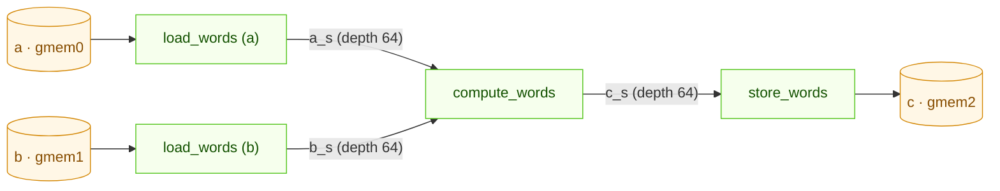

# VectorOP Kernel — Detailed Implementation Description

## Overview

`VectorOPKernel` is a Vitis HLS kernel implementing runtime-selected
element-wise vector operations on the Xilinx KV260 FPGA. It is one of four
hardware kernels in the `axi_demo` project. The kernel reads up to two
equal-length element arrays, applies one of six operations chosen by an
AXI-Lite register, and writes the results to a third array. It also supports
a broadcasting mode (`outer` / `a_inc` / `b_inc`) so a smaller operand can be
re-applied across a larger one without an explicit tile copy.

The kernel is a four-stage `#pragma HLS DATAFLOW` pipeline (load A, load B,
compute, store C) with every loop pipelined at II=1, so once the streams are
primed it sustains one element per clock.

---

## 1. AXI Interface

**Memory ports (m_axi):**

| Bundle | Port | Direction | Description |
|--------|------|-----------|-------------|
| `gmem0` | `a` | Read | First operand array (`hls::burst_maxi<VecWord>`, 128-bit) |
| `gmem1` | `b` | Read | Second operand array (128-bit; no AXI transactions for unary ops) |
| `gmem2` | `c` | Write | Result array (128-bit) |

All three ports are `hls::burst_maxi<VecWord>` with `VecWord =
ap_uint<128>` — `kVecLanes = 8` elements of `ap_fixed<16,8>` per beat
(VECTOROP_OPTIMISATION.md §2).  The DDR layout is a plain element array;
the kernel requests whole word ranges (`read_request` of ≤ 64 words on
`a` / `b`, `num_read_outstanding=16`; `write_request` of ≤ 256 words on
`c`, `num_write_outstanding=16`, ≤ 8 responses outstanding) and extracts /
packs the lanes itself.  **Alignment contract** (asserted by
`TestSimulation`, guaranteed by the scheduler): every run start of `a`,
`b` and `c` is 16-byte aligned — the base registers are 16-byte aligned and
`a_inc` / `b_inc` are 0 or a multiple of 8 elements; `size` is arbitrary.
Input lanes past the end of a run are read and masked to zero; the last
word of every output run is written whole, so `c[size .. ceil8(size))`
of a run receives `op(0, 0) = 0` and the caller's buffer (or stride gap)
must cover it.  The block-design instance widths must equal the IP defaults
(128 on all three ports).

**AXI-Lite control registers (`s_axilite bundle=ctrl`):**

| Register | Type | Description |
|----------|------|-------------|
| `a`, `b`, `c` | `uint64_t` | Physical DDR base addresses |
| `size` | `unsigned` | Elements per inner chunk |
| `op` | `unsigned` | Operation selector (`Op` enum, 0–5) |
| `outer` | `unsigned` | Number of outer broadcast iterations (1 = non-broadcast) |
| `a_inc` | `unsigned` | Element stride for `a` per outer iteration (0 = `a` repeats) |
| `b_inc` | `unsigned` | Element stride for `b` per outer iteration (0 = `b` repeats) |
| `act` | `unsigned` | Fused activation applied after the op: 0 none, 1 relu, 2 relu6 (`Act` enum; register offset 0x5C, appended last) |
| `return` | — | `ap_ctrl_hs` (start / done / idle / ready) |

The kernel processes `outer × size` elements:
`c[o·(a_inc+b_inc) + i] = act(op(a[o·a_inc + i], b[o·b_inc + i]))`.
The scheduler uses `act` to fold a following `Relu` / `Clip(0,6)` into the
producing call (one pass over the data instead of two).

---

## 2. Supported Operations

The operation is chosen at runtime by the `op` register (`Op` enum in
`VectorOP.h`):

| Code | Name | Expression | Arity |
|------|------|------------|-------|
| 0 | `OP_ADD` | `saturate_cast(a[i] + b[i])` | binary |
| 1 | `OP_SUB` | `saturate_cast(a[i] - b[i])` | binary |
| 2 | `OP_MUL` | `saturate_cast(a[i] * b[i])` | binary |
| 3 | `OP_DIV` | `saturate_cast(a[i] / b[i])`, `b[i] = 0 → 0` | binary |
| 4 | `OP_RELU` | `max(a[i], 0)` | unary |
| 5 | `OP_RELU6` | `min(max(a[i], 0), 6)` | unary |

For the two unary ops (`op ≥ OP_RELU`), the `b` loader issues **no** AXI
reads on `gmem1` and pushes nothing; the compute stage reads `b_s` only for
binary ops, and `b`'s base address is ignored.

`OP_MUL` computes the full-precision `2W`-bit product and lets
`saturate_cast` clip it back to `Data_t`. `OP_DIV` uses one iterative
fixed-point divider fed one lane per cycle (`compute_div`, II=1 per lane,
i.e. one element per cycle instead of eight — the only
op that is not II=1).

---

## 3. Compile-Time Configuration (`Config.h.in`)

CMake substitutes the data type into `Config.h`:

| Constant | Default | Purpose |
|----------|---------|---------|
| `Data_t` | `ap_fixed<16,8>` | Element type (2-byte, range \[-128, 127.996\]) |
| `kDataWidthBits` | 16 | Bit width of one element (AXI stream TDATA sizing) |
| `kSeed` | 42 | RNG seed for `TestSimulation` |

`Data_t` is set by the CMake cache variable `VA_DATA_TYPE` and may be
`float`, `double`, `half`, `uint8_t`, or any `ap_fixed<W,I>` / `ap_ufixed<W,I>`.
`VA_VECTOR_SIZE` (default 1024) is informational only — the vector length is
a pure runtime register, never a compile-time bound.

There is no accumulator type and no tiling: VectorOP is a streaming kernel,
not a reduction.

---

## 4. Loop Structure and DATAFLOW Architecture

The top-level kernel is a `#pragma HLS DATAFLOW` region with four concurrent
sub-functions connected by `hls::stream<VecWord>` FIFOs (one 128-bit word =
8 elements per token):



The three streams (`a_s`, `b_s`, `c_s`) are `static`, depth 64 in LUTRAM —
deep enough to let the loaders run a burst ahead of `compute_words` and
hide read latency behind active computation.

**Stage loops.**  Every stage is ONE flattened `PIPELINE II=1` loop over
all `outer × ceil(size / 8)` words (VECTOROP_OPTIMISATION.md §2):

- `load_words` classifies the operand: `outer == 1` or `inc == size` on
  whole words → one contiguous word range; `inc == 0` and ≤ 256 words
  (2048 elements) → read once into `rep_buf[256]` and replayed `outer`
  times; otherwise every run is its own word range at stride `inc / 8`.
  Read requests are ≤ 64 words and 8 of them are kept in flight ahead of
  the `read()` cursor; lanes past `size` in a run's last word are zeroed.
- `compute_words` applies the `switch (op)` to all 8 lanes of a word per
  cycle (`op_lane`), then `apply_act` (the `act` register).  `OP_DIV` goes
  through `compute_div`, a lane-serial loop around one divider.
- `store_words` issues a `write_request` per ≤ 256-word piece, streams the
  words, and collects `write_response()` in a sliding window of 8 (the
  CONV_OPTIMISATION.md §2.30 bound), writing every run's last word whole.

### HLS pragmas applied

| Pragma | Location | Effect |
|--------|----------|--------|
| `DATAFLOW` | top-level | Four concurrent load / compute / store stages |
| `INTERFACE m_axi … bundle=gmem0/1/2` | top-level | 128-bit `burst_maxi` ports: `max_read_burst_length=64 num_read_outstanding=16` (a, b), `max_write_burst_length=256 num_write_outstanding=16` (c) |
| `INTERFACE s_axilite … bundle=ctrl` | every scalar + `return` | AXI-Lite register file |
| `INLINE off` | each stage function | Keeps the four stages as distinct dataflow processes |
| `STREAM depth=64` + `BIND_STORAGE fifo lutram` | `a_s`, `b_s`, `c_s` | 128-bit word FIFOs between stages (LUTRAM, not 8 BRAM18 each) |
| `PIPELINE II=1` | every stage loop | One 8-lane word per clock (`OP_DIV`: one lane per clock) |
| `UNROLL` | lane loops | 8 lanes of a word in one cycle |
| `ARRAY_PARTITION complete` | `compute_div::res` | per-lane result registers |
| `LOOP_TRIPCOUNT` | every loop | Latency-report hints only — no hardware effect |

---

## 5. Broadcasting Model

`outer`, `a_inc`, and `b_inc` express NumPy-style broadcasting without
materialising a tiled copy of the smaller operand:

- **Non-broadcast:** `outer=1`, `a_inc=0`, `b_inc=0` → one pass over `size`
  elements.
- **`a` advancing, `b` repeating:** `outer=N`, `a_inc=aligned_chunk`,
  `b_inc=0` → `b`'s `size` elements are re-read on every outer iteration
  (stride 0 makes `load_b` revisit the same addresses).
- **`b` advancing, `a` repeating:** the symmetric case with `a_inc=0`.

The write stride is `c_inc = a_inc + b_inc`, so the output advances whenever
either input does. A `stride == 0` operand stays resident in DDR and is
simply re-streamed — the line-rate cost is the repeated read, traded against
not having to pre-expand the broadcast operand in memory.

---

## 6. Data Types and Saturation

`saturate_cast<Data_t>(v)` (defined in `VectorOP.h`) narrows a wider
intermediate back to `Data_t`. For `ap_fixed` it routes through
`ap_fixed<W,I,AP_TRN,AP_SAT>` — truncation toward zero, then saturation
clamping to \[-2^(I-1), 2^(I-1) − 2^-(W-I)\] — matching ONNX fixed-point
semantics. The primary template is an identity pass-through, so `float` /
`double` / integer builds carry no saturation cost. Every binary op applies
`saturate_cast` to its result; `OP_RELU` / `OP_RELU6` clamp directly.

---

## 7. Test Coverage (`TestSimulation.cpp`)

C-simulation tests compiled with GCC (no Vitis required). Each case runs the
kernel against a naive scalar reference; tolerance is exact for fixed-point /
integer types and relative `1e-5` for floating-point.

| Category | Coverage |
|----------|----------|
| All six operations | `ADD`, `SUB`, `MUL`, `DIV`, `RELU`, `RELU6` |
| Sizes | Multiple vector lengths, including non-power-of-two |
| Saturation | Positive / negative overflow boundary cases (`ap_fixed` only) |
| Broadcast | `outer > 1` with `a`- or `b`-advancing strides |

`make gen_vectorop_test_data` re-runs the test in `--dump-data` mode to emit
hex fixtures for the HDL testbench (16-bit `ap_fixed` builds only), keeping
RTL-level tests bit-identical to the C++ reference.

---

## 8. Inference Scheduler Integration

**`ScheduledNode` (`nodes.py`, `kernel_name = "VectorOPKernel"`)** maps these
ONNX operators to `XVectoropkernel` invocations:

| ONNX op | Opcode | Arity |
|---------|--------|-------|
| `Add` | `OP_ADD` | binary |
| `Sub` | `OP_SUB` | binary |
| `Mul` | `OP_MUL` | binary |
| `Div` | `OP_DIV` | binary |
| `Relu` | `OP_RELU` | unary |
| `Clip(min=0, max=6)` | `OP_RELU6` | unary (exact bounds required) |

One input of a binary op may broadcast: the broadcast dimensions must form a
contiguous leading block, and the code generator emits an `outer`-loop call
with `a_inc` / `b_inc` set from the tensor's chunk stride. The generated
`run_op()` writes the AXI-Lite registers and calls `XVectoropkernel_Start()`
non-blocking; a later `kernel_wait(KERNEL_VECTOROP)` drains the lane only
when a dependent op needs the result.

---

## 9. Build Targets

```bash
# C simulation (GCC, no Vitis)
make TestSimulation && ctest

# HLS synthesis + IP export for KV260
make synthesize_vectorop_kv260
```

The synthesis target reads a `platforms/<name>.json` (part, optional board
and clock) and invokes Vitis HLS via `Synthesis.tcl.in`, which configures the
project, sets 64-bit AXI and the bus width, runs `csynth_design`, and exports
an IP-catalog archive.

---

## 10. Key Source Files

| File | Purpose |
|------|---------|
| `kernels/vectorop/kernel/VectorOP.cpp` | HLS kernel — four DATAFLOW stages on 128-bit words |
| `kernels/vectorop/include/VectorOP.h` | Kernel declaration, `Op` / `Act` enums, `VecWord` lane helpers, alignment contract, `saturate_cast<T>` |
| `kernels/vectorop/include/Config.h.in` | CMake template → `Config.h` (`Data_t`, `kDataWidthBits`) |
| `kernels/vectorop/test/TestSimulation.cpp` | C simulation tests (GCC) |
| `kernels/vectorop/scripts/Synthesis.tcl.in` | Vitis HLS TCL template |
| `inference-scheduler/src/nodes.py` | `ScheduledNode` class (ONNX → kernel params) |
| `inference-scheduler/src/codegen/_source.py` | `run_op()` code generation |

---

## 11. Summary

| Aspect | Details |
|--------|---------|
| **Supported ONNX ops** | `Add`, `Sub`, `Mul`, `Div`, `Relu`, `Clip(0,6)` |
| **Operations** | 6, runtime-selected via the `op` AXI-Lite register |
| **Data type** | `ap_fixed<16,8>` (default; configurable via `VA_DATA_TYPE`) |
| **Architecture** | 4-stage `HLS DATAFLOW` pipeline (load A, load B, compute, store C) on 128-bit words, 8 elements per cycle |
| **Initiation interval** | II=1 on every loop; 8 elements/cycle for all ops except `OP_DIV` (1 element/cycle, one divider) |
| **Inter-stage FIFOs** | `a_s` / `b_s` / `c_s`, 128-bit, depth 64 (LUTRAM) |
| **Vector length** | Pure runtime register — no compile-time bound |
| **Broadcasting** | `outer` / `a_inc` / `b_inc` registers; stride-0 operand ≤ 2048 elements replayed from on-chip RAM, contiguous runs streamed as one range |
| **Fused activation** | `act` register: none / relu / relu6 after the op |
| **Unary ops** | `OP_RELU` / `OP_RELU6` issue no `gmem1` reads |
| **AXI master ports** | 3 × 128-bit `burst_maxi` (gmem0 `a`, gmem1 `b`, gmem2 `c`); run starts 16-byte aligned, tail word of `c` written whole |
| **AXI-Lite registers** | 9 scalars/pointers + `return` |
| **Saturation** | `saturate_cast` with `AP_TRN` + `AP_SAT` on every result |
| **AXI-Lite base address** | `0xA000_0000` |
| **Driver prefix** | `xvectoropkernel` |
| **UIO device name** | `VectorOPKernel_0` |
