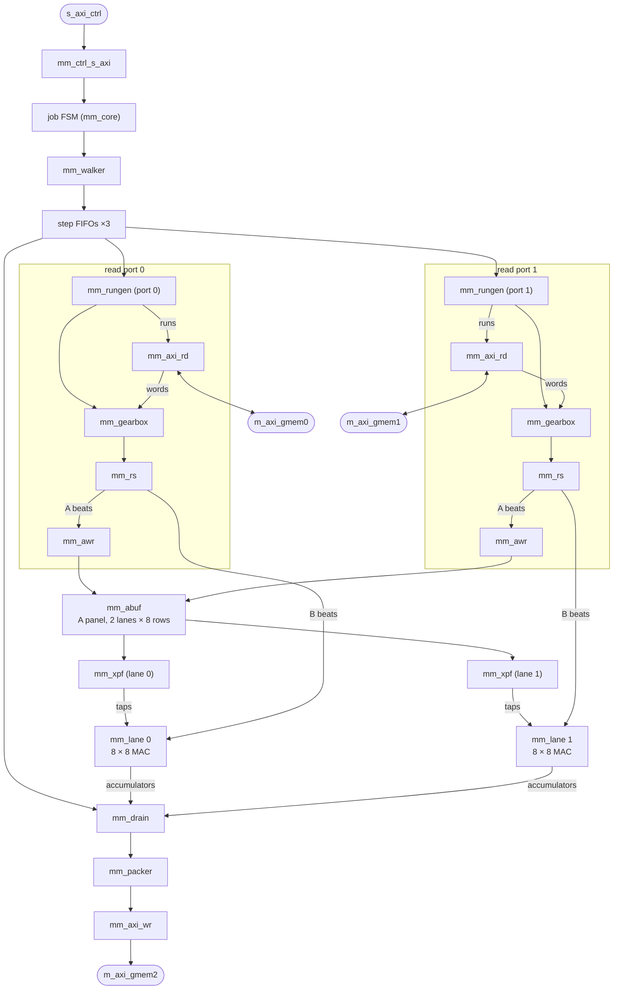

# MatmulKernel in SystemVerilog (RTL)

A SystemVerilog Q8.8 GEMM / GEMV engine for the Kria KV260
(`kernels/matmul_rtl/`).  It replaces the Vitis HLS MatmulKernel
([MATMUL_KERNEL](MATMUL_KERNEL.md), `kernels/matmul/`) without any change on
the software side: the same IP name (VLNV `xilinx.com:hls:MatmulKernel:1.0`),
the same AXI-Lite register map and driver API, the same DDR layouts and
bit-identical results.  The one deliberate interface change is the C port
(`m_axi_gmem2`): 128 bits instead of 32.  Its m_axi interfaces declare the
HLS export's kind of bus parameters (16 outstanding bursts per port; IP
revision 3, MATMUL_RTL_PLAN phase 5).

It does 128 MAC/cycle on GEMM (the HLS kernel: 32) and 16 on GEMV (port-bound,
as the HLS kernel), in fewer LUTs, FFs and BRAMs and no URAM
([Resources and timing](#resources-and-timing)).

**Status (2026-10-04):** the MatmulKernel of the KV260 hardware build and of
the board (bitstream `1d28630fbfa4`, MATMUL_RTL_PLAN phase 4; since 2026-10-04 `bbb9a37f73f8`,
the same design plus a PoolingKernel guard); the HLS
kernel's synthesis is retired, its C++ reference `ref_matmul_2d` stays and
writes the fixtures every RTL test checks against.  The bitstream meets
timing at 100 MHz and passes the test stand's matmul behaviour test
(50 / 50) and the whole-design simulation (68 / 68).  On the board it is
bit-exact everywhere (148 models, every demo and chat / TTS gate), 2–11×
faster than the HLS kernel on tiled and depthwise-shaped MatMuls and at
least as fast on GEMV (phase 2b balanced K between the lanes).  The
scheduler models it (`kernels.matmul.impl = "rtl"`, phase 3) and moves
MatMuls to it where it is faster while keeping one copy of every weight:
16-token LLM prefills 26–32 % faster, MobileNet v1 10 % —
[MATMUL_RTL_PLAN](../plans/MATMUL_RTL_PLAN.md).

Contents: [Building and testing](#building-and-testing) ·
[Software driver](#software-driver) · [Interface contract](#interface-contract) ·
[Architecture](#architecture) · [Performance](#performance) ·
[Resources and timing](#resources-and-timing) ·
[Verification status](#verification-status) · [Source files](#source-files) ·
[Limits](#limits-and-not-yet-done)

## Building and testing

The kernel is part of the top-level CMake project (see
[BUILD_TARGETS](../build-and-test/BUILD_TARGETS.md)); every target exists only
when its tool is found (Verilator 5.x: `sudo apt install verilator`;
Vivado 2025.2).

```bash
cd build && cmake ..
make TestMatmulRtl        # Verilator testbench (kernels/matmul_rtl/vl/Vtb)
ctest -R MatmulRtl        # TestMatmulRtl: 50 fixtures + 200 random cases (~50 s);
                          # MatmulRtlDriver: the driver's register table vs the RTL
make lint_matmul_rtl      # verilator --lint-only -Wall (waivers: scripts/lint_waivers.vlt)
make perf_matmul_rtl      # cycle counts / MAC per cycle of typical shapes (ideal memory)
make package_matmul_rtl   # Vivado IP -> build/rtl_ip/MatmulKernel_ip (+ .zip), ~20 s
make synth_matmul_rtl     # Vivado OOC synthesis + P&R -> kernels/matmul_rtl/synth/*.rpt
make xsim_matmul_rtl      # xvlog / xelab parse and elaboration
make neteq_matmul_rtl     # synthesised netlist vs RTL in lockstep (xsim, tools/neteq)
make sysim_matmul_rtl     # test stand's MatmulKernel block design with this IP, xsim (~4 min)
```

| CMake cache variable | Default | Meaning |
|---|---|---|
| `MM_RTL_FIXTURES` | `hw/test_data/matmul_test_data` | Fixtures `TestMatmulRtl` checks (the checked-in copy of what `make gen_matmul_test_data` writes from `ref_matmul_2d` into `build/matmul_test_data/`) |
| `MM_RTL_RANDOM_CASES` | 200 | Random cases after the fixtures in `TestMatmulRtl` |
| `MM_RTL_PERIOD` | 3.333 | `synth_matmul_rtl` clock period in ns (300 MHz) |

`synthesize_kv260` / `build_hw_kv260` / `sim_hw_kv260` /
`behavior_test_matmul` use this IP (`package_matmul_rtl`): Vivado scans
`build/ip_repo_kv260/`, which links the Conv HLS kernel, this IP and the
RTL VectorOPKernel ([VECTOROP_RTL_KERNEL](VECTOROP_RTL_KERNEL.md)) and
PoolingKernel ([POOL_RTL_KERNEL](POOL_RTL_KERNEL.md)).  After
the IP upgrade the hardware and test-stand scripts reset every kernel
instance's `C_M_AXI_*_DATA_WIDTH` to its IP's default, so `MatmulKernel_0`'s
gmem2 becomes 128 (the block designs still say 32, the HLS kernel's width).
Generated projects take the driver from `driver_matmul_rtl`
(`build/kernels/matmul_rtl/driver/MatmulKernel_v1_0/src`, the files the IP
carries).

**Testbench** (`build/kernels/matmul_rtl/vl/Vtb`, `tb/verilator/tb_main.cpp`):

```bash
Vtb --fixtures DIR [--timing rand|fast|slow]      # manifest.txt + test_NN_{a,b,c}.hex
Vtb --random N --seed S [--timing ...]            # constrained-random cases
Vtb --case "n k m batch as bs cs packed kw [data_mode]"   # one case, e.g. "4 16 8 1 64 128 32 0 0"
Vtb --perf                                        # the shapes of the performance table
# also: --max-cycles N, --quiet, --trace FILE
```

It exits non-zero if any case fails; a `FATAL` line is an AXI protocol or
handshake violation.  For waveforms build `make matmul_rtl_tb_fst` (then
`vlt/Vtb --case "..." --trace F.fst`) or `make matmul_rtl_tb_vcd` (then
`vcd/Vtb --case "..." --trace F.vcd`).  Without a waveform viewer, query a VCD
with `python3 kernels/matmul_rtl/scripts/vcdq.py F.vcd table T0 T1 <regex>...`
(times are 2 per cycle; `hist` and `at` show value changes and the values at
a time).

After changing `mm_core`'s ports or parameters, regenerate the Verilog top
level: `python3 kernels/matmul_rtl/scripts/gen_top_wrapper.py` (run it in
`kernels/matmul_rtl/`).

## Software driver

`scripts/gen_driver.py` writes the C driver into the build tree
(`build/kernels/matmul_rtl/driver/MatmulKernel_v1_0/`) and
`package_matmul_rtl` packages it into the IP, where Vivado and the Vitis BSP
flows find it as they find the HLS export's (`drivers/MatmulKernel_v1_0/`:
`src/xmatmulkernel{.h,_hw.h,.c,_linux.c,_sinit.c}`, `data/*.mdd|tcl|yaml`).
Its API and register traffic are those of the HLS-generated `xmatmulkernel`
(`XMatmulkernel_Initialize` / `_Release` / `_Start` / `_IsDone` /
`_Set_<arg>` / `_Get_<arg>` / interrupt calls, Linux UIO and bare-metal back
ends), so the inference scheduler's generated projects, the benchmarks and
`calib_runner` build against either IP unchanged.  The register table in
`gen_driver.py` is the one place the offsets are written down for C:

- `ctest -R MatmulRtlDriver` (`gen_driver.py --check`) compares it with the
  address constants of `rtl/mm_ctrl_s_axi.sv`;
- `gen_driver.py --check --hls-driver <HLS export>/drivers/MatmulKernel_v1_0`
  also compares the offsets and the function prototypes with the HLS driver;
- the `registers.MatmulKernel` fact (`facts.yaml`) runs the first check and
  compares the register names with the HLS kernel's `s_axilite` ports.

## Interface contract

The external interface (ports, register map, DDR layouts, arithmetic) matches
the HLS kernel exactly; everything inside the IP may change.

### Top-level ports

- **Module and IP:** module `MatmulKernel`, packaged as VLNV
  `xilinx.com:hls:MatmulKernel:1.0` by `syn/package_ip.tcl`, which reproduces
  the HLS bus-interface names, the `Data_m_axi_gmem*` address spaces (16E,
  64-bit) and the 64 KiB `s_axi_ctrl` block `Reg`.  The width parameters are
  read-only: the block-design instance parameters must equal the IP defaults.
- **Clock and reset:** `ap_clk`, and `ap_rst_n` (active-low, registered
  internally).  `interrupt` is a level output, active-high.
- **`s_axi_ctrl`:** AXI4-Lite with an 8-bit address and 32-bit data.
- **`m_axi_gmem0` / `m_axi_gmem1`:** read-only, 128-bit.  **Both ports read A
  and B**: port p streams lane p's K blocks and loads half the A panel, so in
  the block design both masters must reach every DDR buffer (the HLS GEMV path
  already read B through gmem0).  `a_to_b` is accepted and ignored.
- **`m_axi_gmem2` (C):** write-only, **128-bit** data with a 16-bit `WSTRB` —
  the deliberate change: the HLS export is 32-bit on this port, so the
  `MatmulKernel_0` instance's `C_M_AXI_GMEM2_DATA_WIDTH` must be 128 with
  this IP.  `upgrade_ip` from the HLS IP gives 128 (the parameter is
  read-only here); the `cormorant_hw_128` and test-stand scripts also reset
  every instance width to its IP's default after an upgrade, which matters
  for the way back (an upgrade to the HLS IP would keep 128).
- **All three `m_axi` ports:** the full AXI4 signal set, 64-bit addresses, ID
  width 1, every `*USER` width 1, `CACHE` = 3, `PROT` = 0.  Unused directions
  stay present and are tied off.
- **Bus parameters (IP revision 3, 2026-10-05):** each `m_axi` interface
  declares, as an HLS export does, `NUM_READ_OUTSTANDING` /
  `NUM_WRITE_OUTSTANDING` 16, the burst lengths (reads 64 beats, writes 64)
  and `READ_WRITE_MODE` (gmem0 / gmem1 read-only, gmem2 write-only), and the
  RTL never exceeds them (`mm_pkg` `RD_OUTS` / `WR_OUTS`; fact
  `rtl.axi_masters`).  The block design sizes each crossbar slot's
  acceptance from these; the first packages declared none, so every slot ran
  at 2 outstanding bursts (the HLS kernel's: A 4, B 16, C 16 —
  MATMUL_RTL_PLAN phase 5).

### Register map (`s_axi_ctrl`)

Identical to the HLS `ap_ctrl_hs` block; `rtl/mm_ctrl_s_axi.sv` mirrors the
HLS-generated `MatmulKernel_ctrl_s_axi.v`.

| Off | Reg | Off | Reg |
|---|---|---|---|
| 0x00 | ctrl: b0 ap_start (R/W, cleared on handshake), b1 ap_done (COR), b2 ap_idle, b3 ap_ready (COR), b7 auto_restart, b9 interrupt | 0x44 | m |
| 0x04 | GIE b0 | 0x4C | batch |
| 0x08 | IER: b0 done, b1 ready | 0x54 | a_batch_stride |
| 0x0C | ISR: b0 done, b1 ready (toggle-on-write) | 0x5C | b_batch_stride |
| 0x10/0x14 | a lo/hi (64-bit byte address) | 0x64 | c_batch_stride |
| 0x1C/0x20 | b lo/hi | 0x6C | b_packed |
| 0x28/0x2C | c lo/hi | 0x74 | gemv_kw |
| 0x34 | n | 0x7C/0x80 | a_to_b lo/hi (signed 64-bit) |
| 0x3C | k | | |

- **Interrupt:** an ISR bit latches only when its IER bit is set and the
  event fires; `interrupt` is registered as `GIE & |ISR`.
- **Argument latching:** arguments are latched at ap_start, so the host may
  reprogram registers during a run.
- **Board check:** the HLS kernel once shipped a stale control block without
  anyone noticing, so verify new registers on the board with a write-then-read.

### Operation semantics

For each `bi < batch`, the kernel computes `C_bi[n×m] = A_bi[n×k] × B_bi[k×m]`.
Every matrix starts at its base address plus `bi * *_batch_stride`
**elements**; a stride of 0 broadcasts that operand.

- **A:** row-major.  Rows can start at any 16-bit lane.
- **C:** row-major `n×m`.
- **B, `b_packed = 0`:** row-major `k×m`.
- **B, `b_packed = 1`:** tile-major,
  `B_packed[(mt*k + kk)*32 + m1] = B[kk][mt*32 + m1]`, with m padded to a
  multiple of 32 and `b_batch_stride` counted in packed elements.  The 32 is a
  DDR-layout constant (the scheduler emits it), unrelated to the internal tiling.
- **B, `gemv_kw ∈ {1,2,4,8}`:** the ConvKernel image
  `img[(c*m + p)*kw + j] = B[(c/16)*16*kw + j*16 + c%16][p]`.  `b_packed` is
  ignored and `kw = 1` is plain row-major.  The caller guarantees `k % 8 == 0`
  (`k % (16*kw) == 0` for kw > 1), `m % 8 == 0`, `m*kw >= 64` and strides that
  are multiples of 8; the RTL itself needs only the k divisibility, which the
  image layout requires.  Any other `gemv_kw` value is treated as 0.
- **Limits:** `k ≤ 4096`; a larger k is clamped (the job completes, C is
  undefined).  n = 0, m = 0 or batch = 0 finish at once; k = 0 writes zeros.
- **Addressing:** the contract says `a` and `b` are 16-byte aligned; the RTL
  also handles 2-byte-aligned bases, and the tests exercise them.  Reads may
  over-read the words around a run (buffers are padded).  **C writes touch
  only output elements.**
- **Write strobes:** each C run (a whole panel when the chunk spans all m
  columns, else one row) goes out as bursts of up to 64 beats, with partial
  strobes only on its first and last beat.  The KV260 PS was seen dropping
  beats of single-beat partial-strobe writes (2026-09-24, the HLS kernel's
  `-m_axi_min_bitwidth` experiment) — checked on the board in phase 2:
  targeted partial-strobe C writes 8 / 8.

### Arithmetic (bit-exact with `ref_matmul_2d` and the fixtures)

- **Data:** `Data_t = ap_fixed<16,8>` (Q8.8, two's complement, `1.0 = 0x0100`).
- **Products:** Q8.8 × Q8.8 is exact in 32 bits (Q16.16).
- **Accumulator:** `ap_fixed<32,16>`, **wrapping modulo 2³²** (AP_WRAP).
  Because the adds are modular, the K split across lanes, the kw-tap reduction
  and any accumulation order give the same bits.
- **Output:** `saturate(acc >>> 8)` to `[-32768, 32767]`: AP_TRN (floor) then
  AP_SAT (`ap_fixed<16,8,AP_TRN,AP_SAT>`), applied once after the full K
  reduction, in `mm_drain`.
- **DSP48E2:** `mm_mac` keeps only the low 32 bits of the 48-bit P register;
  saturating from 48 bits would diverge whenever the 32-bit sum wraps.

## Architecture



### Data flow

A job computes, for every batch slice, `C = A × B` with A `n×k` (row-major),
B `k×m` in one of three layouts, and C `n×m` (row-major).  The job is cut into
**steps**:

```
for batch slice bi:                    (element strides; stride 0 = broadcast)
  for panel of R = 8 rows of A:        (A panel held on chip, per lane)
    for column chunk (≤ 512 elements of a B row):
       step:  both lanes stream their half of K for the chunk and accumulate;
              then the drain adds the two lanes and writes the chunk of C
```

Each step streams B **once** per panel.  Every 128-bit B beat (8 elements) is
multiplied by all 8 panel rows at once, so each lane does 64 MAC/cycle and
the kernel does 128 MAC/cycle.  A B element is reused R = 8 times per fetch;
see *Performance*.

#### K split between the lanes (column-aligned access)

K is divided into blocks of 16 *planes* (a plane is one B row, or for the
GEMV image one group of `kw` taps).  Block b belongs to lane `b % 2`, and
lane p reads its blocks through read port p.  The two ports therefore stream
**neighbouring** regions of the same B matrix, not two far-apart halves.
This is the column-aligned access idea of Hummingbird (FPGA '25/'26): ports
that hit the same DRAM row and bank arbitrate far better on the Zynq PS DDR
controller.  The two lanes' partial sums are added by the drain.  All adds
wrap modulo 2³², so the split is bit-exact.

With an odd number of blocks, one port would stream a whole block more
than the other: 9 blocks (k = 576 with kw = 4, or k = 144) are 5 : 4, so
the job takes 5 / 4.5 = 1.11× the balanced time.  The last block is
therefore **split** when it has more than 8 planes (`cfg.split`): planes
0–7 stay with lane 0, planes 8– go to lane 1, which takes them after its own
last block (or alone, when there is only one block).  In an A row the split
falls on beat boundaries — beat 2j + h of the block holds planes 8h … 8h + 7
of tap j — so the A writer routes those beats by their parity, and both
lanes store their half at their next lane-local block, where the x
prefetcher's K-index formula already looks.  (1×576×1536, kw 4: 62 473 →
56 324 cycles in Verilator; the packed 64×144×576: 51 078 → 46 472.)

#### Run descriptors

`mm_rungen` turns each step into **runs**.  A run is one contiguous element
range of `rows` rows of `len` elements.

| run | rows × len | when |
|---|---|---|
| A | (panel rows of this port) × k | first chunk of a panel, unless A is reused (a_stride == 0, n ≤ 8) |
| B, packed | 16 × 32 | one per (32-column tile, K block) of the chunk; a chunk is 16 tiles |
| B, image, one chunk | 16 × (m << lk) | one per K block, when `m << lk ≤ 512` (row-major B = image with kw = 1) |
| B, image, chunked | 1 × (mcc << lk) | one per plane, for wide B |
| marker | 0 | keeps the per-panel / per-step bookkeeping uniform when a port has nothing to do |

Each run goes to three queues:

- **Read engine (`mm_axi_rd`):** takes the word range, splits it into ≤64-beat INCR bursts without 4 KiB crossings, and issues each burst only when its FIFO has room for it (credit), so RREADY is always 1; at most `RD_OUTS` (16) bursts await their data.
- **Gearbox (`mm_gearbox`):** re-aligns the word stream into row-aligned beats. It uses a two-word window and an 8-way lane rotate, and a lookahead descriptor keeps back-to-back runs bubble-free. A and B element addresses may therefore start at any lane. Beyond the contract, even A/B bases that are only 2-byte aligned work.
- **x prefetcher (`mm_xpf`):** receives B runs only.

The gearbox's beats reach the A writer and the MAC lane through a register
slice (`mm_rs`, two entries, registered in both directions), and the read
FIFO's words reach the gearbox through another, so neither the lane's
per-beat issue decision nor the gearbox's consume decision runs into the
next unit.  The gearbox keeps a beat's end offset (`off + min(row_rem, 8)`)
and its row / run end conditions in registers beside the counters, so its
window refill decision (the enable of 256 window bits) starts from
registers.

#### A panel and taps

`mm_awr` writes a port's A rows into `mm_abuf`, which holds one 128-bit × 256
BRAM per (lane, panel row): 32 BRAM36 in total.  Each beat is routed to the
lane that owns its K block.  `mm_xpf` reads the A values each B row needs and
assembles a **tap set** `tap[l][r]` into a LUTRAM FIFO:

- **Row-major and packed B:** every lane uses `A[r][kk]`.
- **GEMV image:** beat lane `l` uses tap `l % kw` of plane c, at lane-local K index `((c>>4)<<(4+lk)) | (j<<4) | (c&15)`, the inverse of `matmul_gemv_k`.

The read is pipelined so that every long wire runs between two registers:
issue (t) → registered read address and enable (t+1, the RAM's latch) →
RAM output register (t+2) → per panel row, the selected element next to
that row's RAM (t+3) → the tap set, write enable and slot copied per beat
lane (t+4) → tap FIFO write, one LUTRAM per beat lane next to that beat
lane's DSPs (t+5).  A tap set is in the FIFO 6 cycles after its row's last
read issues (3 before).  The FIFO's read pointer is copied per beat lane one
cycle late, so `tap_data` is the head of the previous cycle.

#### MAC lane

`mm_lane` holds 8 rows × 8 beat lanes of `mm_mac` (one DSP48E2 each).  The
8 MACs of a beat lane share its B element and form a group; the issue
decision (cycle t) is registered once, then copied per group, and every
operand enters the DSP's own input registers (AREG = BREG = 2):

```
t     issue decision (the tap FIFO pops)
t+1   beat x1[l] ─► B1          tap[l][r] (FIFO head at t) ─► A1     per group: v, pop, f, address
t+2   B1 ─► B2                  A1 ─► A2 (only at the row's first beat: held for the row)
t+3   MREG = A2·B2              CREG = acc[w] (LUTRAM), or 0 on the run's first row (RSTC)
t+4   PREG = C + M
t+5   acc[w] ◄─ P
```

The beat element, shared by the group's 8 MACs, goes to the 18-bit B port
(its sign bit drives 3 pins per slice; on the 27-bit A port it drove 12, a
net of about 100 pins); the tap is sign-extended to 19 bits so that it takes
the A port.

- **Accumulators:** each MAC owns `ACC_D = 64` 32-bit accumulators in LUTRAM, one per beat of a plane chunk. The accumulation happens in the DSP post-adder, so there is no fabric adder per MAC.  Their read / write addresses, write enable and the init flag are registered per group (the addresses per half of the group's rows).
- **Minimum row length:** the read → CREG → PREG → write loop is `DMIN = 3` cycles (read at t+3, write at the end of t+5). A row shorter than 3 beats (tiny m) gets bubbles.
- **GEMV kernel width:** with kw > 1, each MAC accumulates a single tap. The drain sums the kw lanes of a column, and this reduction is also exact.

#### Drain and output

After both lanes finish a step, `mm_drain` reads each valid row's
accumulator words from both lanes in lockstep (a request reaches the
accumulators through the lanes' group registers 3 cycles later; each group
selects its row's word next to its DSPs, and the word is registered again on
the drain's side) and computes:

- `sum = lane0 + lane1`
- the kw-tap reduction (a 3-level tree, selected by lk)
- `C = sat16(sum >>> 8)`: floor, then clamp to Q8.8

— 9 cycles from request to the output FIFO, with the words' element counts
and the lanes' activity flags carried along as tags.

The results go to `mm_packer`, which turns the element stream of a C run into
128-bit beats.  Only the first and last beat of a run carry partial strobes,
and a run is a whole panel (`n_valid × m` elements) whenever the chunk spans
all columns.  `mm_axi_wr` stores whole bursts before issuing their AW, keeps
at most `WR_OUTS` (16) bursts awaiting B, and the job completes only after
every B response has arrived.  On all three m_axi ports the AXI side is
registered both ways: AR / AW / W leave through register slices (`mm_rs`;
xREADY only enables the slice) and RVALID / RDATA / RLAST and BVALID are
registered before they are used.

### Synchronisation

Units run decoupled, in the style of access/execute, and hand off through
monotonic counters:

| counter | owner | meaning | waited on by |
|---|---|---|---|
| `awr_cnt[p]` | A writer p | panels whose A rows port p has written | x prefetchers (panel start) |
| `xpf_cnt[h]` | x prefetcher h | panels whose A reads lane h has issued | A writers (single A buffer) |
| `cmp_cnt[h]` | lane h | steps lane h has finished (pipeline flushed) | drain |
| `drn_cnt` | drain | steps whose accumulators have been read | lanes (next step) |

The read engines run ahead of the counters; only their FIFO space bounds how
far.  Each port's gearbox output is consumed strictly in stream order: the A
beats of panel p, then the B beats of its steps, then the A beats of panel
p+1.  No consumer waits on data that sits behind its own head, so the scheme
cannot deadlock.  A new job resets every unit (`job_start`).

## Performance

Verilator with ideal memory (`make perf_matmul_rtl`; the in-context pipelining of
2026-10-06 added 0.01–0.12 % cycles, e.g. GEMM 64×576×576 172 607 → 172 665):

| shape | MAC/cycle | bound |
|---|---|---|
| GEMV 1×576×1536, kw 1 | 15.9 | 2 ports × 8 elements/cycle = 16 |
| GEMV 1×1536×576, kw 4 / 1×512×1536, kw 8 | 15.8 / 15.4 | 16 |
| GEMV 1×576×1536, kw 4 (9 K blocks: the last one split) | 15.7 | 16 |
| GEMV 4×576×1536 (4 A rows share one B pass) | 62.6 | 64 |
| FC 1×4096×512, row-major | 15.9 | 16 |
| GEMM 64×576×576, packed / row-major | 123 | 128 |
| GEMM 128×256×2048, packed | 120 | 128 |
| GEMM 256×64×64 (A reload per 8 rows dominates) | 98 | 128 |
| GEMM 64×144×576, packed (9 K blocks: the last one split) | 114 | 128 |

The HLS kernel reaches ≤ 32 MAC/cycle on its tiled path and ≤ 16 on GEMV,
where it loops over A rows.  Per panel the kernel moves `8·k` A elements and
`k·m` B elements through two 128-bit ports.  Steady-state GEMM is therefore
compute-bound at 128 MAC/cycle when m ≥ ~64, and single-row GEMV is
port-bound at 16.

On the board the ports share the PS's HP ports with the other kernels, and a
read port needs enough bursts in flight to cover the DDR latency.  Until the
IP declared its bus parameters (phase 5) the crossbar held each port to 2
outstanding bursts; with 16, the row-major FC 1×1280×1001 runs 13 % faster,
FC 1×512×1000 3.7 %, and 90 of the 414 calibrated calls by more than 1 %
(none of the 24 benchmarks slower).

## Resources and timing

xck26-sfvc784-2LV-c, out of context (`make synth_matmul_rtl`):

| | RTL kernel (post-route) | HLS kernel in `cormorant_hw_128` |
|---|---|---|
| LUT (of which LUTRAM) | 16.3 k (6.9 k) | 26.8 k (0.1 k) |
| FF | 15.3 k | 27.0 k |
| BRAM36 | 38 (32 A panel, 6 FIFOs) | 44 |
| URAM | 0 | 8 |
| DSP48E2 | 130 (128 MACs; 1 per run generator) | 128 |
| peak MAC/cycle | 128 (GEMM), 16 (GEMV, port-bound) | 32 (tiled), 16 (GEMV) |

Timing is checked at 300 MHz and met (WNS +0.026 ns, 2026-10-06, after the
in-context pipelining below; before it +0.002 ns with 18.4 k LUT and 9.5 k
FF).  The worst paths out of context are once-per-step address updates in
the walker and run generator.  Nearly every per-cycle decision was moved off
long paths:

- **Barrier counter compares:** registered, and computed against each counter's *next* value so they can only open late, never early.
- **Burst length, credit and outstanding-burst checks:** registered in both AXI engines (the outstanding caps of phase 5 kept WNS at +0.015 ns).
- **Run generator:** a second output stage, and shift/add element counts instead of a general multiply.
- **Drain:** the kw reduction tree takes two stages.

### In the block design (the 250 MHz work)

Out of context the MAC array sits in a compact block of DSP columns; in the
full design (`cormorant_hw_128`, 688 of 1248 DSPs used) its 128 DSPs spread
over DSP columns X0–X5 and clock regions X0Y0–X0Y3 (lane 0 over Y60–Y90,
lane 1 over Y22–Y85), and its 38 BRAMs over three BRAM columns (X0–X2, clock
regions X1Y1–X2Y3).  The routed 100 MHz design (2026-10-05) had 20 535
kernel-internal paths with a data path over 3 ns; nearly all are one or two
LUTs and 80–95 % route — nets whose loads span DSP or BRAM columns, which no
placement fixes at 4 ns:

| net (100 MHz design) | fanout | load span | worst data path |
|---|---|---|---|
| gearbox `off` → rotate mux → DSP A (the `out_data` register was absorbed into every DSP's A1, so the mux output fanned out to 8 DSPs per element) | 144 | 280 RPM columns, 2 clock regions | 6.95 ns |
| `job_start` → combinational `urst` (all units) | 777 + 618 (`rst`) | 4 clock-region rows | 6.34 ns |
| DSP `CEA1` (the gearbox's output enable) | 219 | 4 clock regions | 6.29 ns |
| tap FIFO `rptr`, the tap LUTRAM → DSP B | 261 | 600 columns, 4 regions | 5.33 ns |
| `xpf` element select (`sel2`) and A-buffer BRAM output → tap LUTRAM write | 8 per bit | 568 columns, 3 regions | 6.39 ns |
| A-buffer read address / enable → 16 BRAMs | 16–39 | 656–1120 columns | 6.38 ns |
| lane `w3` / `v3` (accumulator write address / enable) | 1440 / 1280 | 600 columns | ≈ 4.6 ns net |
| lane `ra` (accumulator read address) → LUTRAM → CREG, `drow1` row select | 93 / 128 | 300–540 columns | 6.09 ns |
| read FIFO pop ← lane `count` / ready chain → gearbox window and FIFO skid (7–11 LUTs) | 128–269 | 300–580 columns | 6.47 ns |
| PS8 WREADY → W FIFO skid (`u_wr/u_wf`) | 288 | 3 regions | 5.39 ns |

The changes (cycle counts in Verilator +0.01 … +0.12 %, results unchanged):

- **DSP input registers:** `mm_mac` uses AREG = BREG = 2, CREG, MREG,
  PREG; the beat element is registered once in the lane (`x1`) and enters
  B1 / B2, the tap enters A1 / A2 (held by CEA2 for the row), the init flag
  is the C register's reset.  The beat element moved to the 18-bit B port:
  on the 27-bit A port its sign bit fanned out to 12 pins per DSP.
- **Per-group control:** the lane's issue decision is registered once, then
  copied per beat lane (valid, pop, init, accumulator addresses — the
  addresses once more per half group): no control net spans the array.
- **Drain gather:** each group selects its row's word next to its DSPs; the
  word is registered there and again on the drain's side (PIPE 6 → 9).
- **x prefetcher:** registered A-buffer address and enable, a per-row
  element-select register next to the BRAMs, the tap set copied per beat
  lane before the LUTRAM write, the read pointer copied per beat lane.
- **Read FIFO → gearbox → lane:** register slices (`mm_rs`) between the
  read FIFO and the gearbox and between the gearbox and its consumers cut
  the ready chains; the gearbox's beat size and end conditions are
  precomputed registers, and its data registers have no reset.
- **Job reset:** registered, with one copy per unit group (`urst_p`,
  `urst_l`, `urst_s`, `urst_o`); the units' `start` is one cycle later
  (`start_q`), so reset and start still never overlap.
- **AXI ports:** AR / AW / W through register slices, RVALID / RDATA /
  RLAST and BVALID registered on entry, and the AXI-Lite inputs registered
  before they are decoded (a write takes effect with BVALID, a read is
  answered one cycle later).

## Verification status

- **Unit level (Verilator, `TestMatmulRtl` in ctest):**
  - All 50 HLS-oracle fixtures (`hw/test_data/matmul_test_data`, written by `make gen_matmul_test_data`) pass bit-exact: 39 tiled plus 11 GEMV-image cases.  ctest runs them plus 200 random cases (seed 1).
  - Several thousand constrained-random cases pass across every mode. They cover strides and broadcasts, misaligned A/B/C bases, bases above 4 GiB, k up to 4096, and full-range data that wraps the accumulator.
  - Memory timing is randomised, and reset state is randomised (`+verilator+rand+reset+2`).
  - After the in-context pipelining (2026-10-06): the 50 fixtures + 200 random cases, and 3 000 random cases by hand (seed 7 random timing, seed 4711 slow, seed 2026 fast).
  - The AXI protocol is checked, including that nothing outside C is written.
- **System level (`make sysim_matmul_rtl`):**
  - This is the test stand's block design (Zynq PS VIP, AXI interconnect, DDR model, `matmul_tb.sv`) with the packaged IP upgraded in place and gmem2 widened to 128.
  - It passes 50 of 50 fixtures.
- **Full design (`sim_hw_kv260`):** the `cormorant_hw_128` block design with this IP passes 68 / 68 (Matmul 10 / 10), and the bitstream meets timing at 100 MHz with 8.6 k LUT, 17.8 k FF, 6 BRAM36 and 8 URAM fewer than with the HLS kernel ([MATMUL_RTL_PLAN](../plans/MATMUL_RTL_PLAN.md) phase 1).
- **Board (phases 2 and 2b):** registers 19 / 19, `run_remote_tests` 148 / 148, targeted partial-strobe C writes 8 / 8, every demo and chat / TTS gate bit-exact; the kernel benchmarks show no case slower than the HLS kernel's ([MATMUL_RTL_PLAN](../plans/MATMUL_RTL_PLAN.md) phases 2 and 2b).

## Source files

All in `kernels/matmul_rtl/`; read [Architecture](#architecture) before
changing the RTL.

- **Top level:** `rtl/MatmulKernel.v` is a GENERATED Verilog-2001 top (the
  exact HLS port and parameter list, `scripts/gen_top_wrapper.py`) around
  `rtl/mm_core.sv`, which holds the control FSM, the per-port instances and
  the AXI tie-offs.  `rtl/mm_pkg.sv` has the shared constants.
- **Descriptor flow:** `mm_walker` walks (batch slice → panel of R = 8 A rows
  → column chunk ≤ 512) and emits steps; `mm_rungen` (one per port) turns each
  step into runs (A rows, B blocks / tiles / planes, or markers); `mm_axi_rd`
  issues the read bursts; `mm_gearbox` realigns words into row-aligned beats.
- **Compute:** `mm_awr` → `mm_abuf` hold the A panel (32 BRAM36); `mm_xpf`
  builds per-row tap sets; `mm_lane` is 64 × `mm_mac` (DSP48E2, P = C + A·B),
  each with a 64 × 32-bit LUTRAM accumulator.
- **Output:** `mm_drain` computes lane0 + lane1, reduces the kw taps and
  saturates; `mm_packer` builds strobed 128-bit beats; `mm_axi_wr` stores
  whole bursts before AW and waits for the B responses.  `mm_ctrl_s_axi` is
  the HLS-compatible AXI-Lite block; `mm_fifo` the LUTRAM / BRAM FIFOs.
- **Verification and tooling:** `tb/verilator/tb_main.cpp` + `axi_models.h`
  (testbench), `scripts/lint_waivers.vlt`, `scripts/gen_driver.py` (C driver),
  `scripts/vcdq.py` (VCD queries), `syn/rtl_files.tcl` (the source list of the
  Vivado scripts), `syn/package_ip.tcl`, `syn/synth_ooc.tcl`, `syn/sysim.tcl`.
  The CMake source list in `CMakeLists.txt` has the same order.

**Invariants that are easy to break:**

- **Lane assignment:** K is split in interleaved blocks of 16 planes (block
  b → lane b % 2; a split last block: planes 0–7 → lane 0, 8– → lane 1), and
  both read ports load A: port p loads panel rows [4p, 4p + 4).  The A
  writer's lane / word mapping, the x prefetcher's K-index formula and the
  run generator must agree.
- **Handshake counters:** units synchronise only through `awr_cnt`,
  `xpf_cnt`, `cmp_cnt` and `drn_cnt` ([Synchronisation](#synchronisation)).  A
  panel is announced one cycle *after* its last A write lands (a race here
  broke k = 1 once).  Every panel and step must produce exactly one A run or
  marker per port and at least one B run or marker per lane.
- **Accumulator distance:** `DMIN = 3` is the LUTRAM → CREG → PREG → LUTRAM
  loop.  `mm_lane` inserts bubbles for rows shorter than that; any register
  added in that loop must raise `DMIN`.
- **Lane pipeline alignment:** in `mm_lane` the beat, the tap, the
  accumulator read address and the init flag of an issue at t meet in the
  DSP at t+3 (B2 / A2 / CREG), the write lands at the end of t+5, and a
  drain request at T is read at T+3 and in `drd_data` at T+4; `mm_drain`'s
  `PIPE = 9` and its tags count on that, and `FLUSH = 6` keeps the drain's
  first read after the last write.  A register added on one operand path
  needs its match on the others (and in these constants).
- **Tap FIFO:** `tap_data` is the head of the *previous* cycle (the read
  pointer is copied per beat lane); `mm_lane` takes B1 one cycle after the
  pop decision.  A tap set is written 5 cycles after its last read issues;
  `reserved` already counts it from the issue.
- **BRAM FIFO skid:** `mm_fifo`'s BRAM variant needs its 3-entry skid to
  sustain one pop per cycle (with 2 entries every stream ran at 2/3 rate).
- **lk shift arithmetic:** widen `lk` before adding (`{2'b0, lk} + 4'd1`); a
  2-bit `lk + 1` overflows at kw = 8.
- **Timing:** the kernel meets 300 MHz out of context with little margin (WNS +0.026 ns) and must reach 250 MHz in the block design, where the MAC array spans many DSP columns: keep every signal that reaches the array registered next to its group, keep new logic off long combinational
  handshake paths; register decisions against a counter's *next* value (see
  `mm_awr`, `mm_xpf`, `mm_lane` and the AXI engines).

**Toolchain:** Verilator 5.020 is the main simulator (it renames the
`interrupt` port to `__SYM__interrupt` in the C++ model); Vivado 2025.2 for
packaging, synthesis and xsim.

**Background:** "Hummingbird+" (FPGA '26, doi 10.1145/3748173.3779189); the
technical details are in its predecessor, arXiv 2507.03308.  Used here:
AXPY-style accumulation in the DSP post-adder with the activation held in the
second A register (A2) for a whole B row, and column-aligned DDR access through interleaved K blocks
per port.  Not used: segmented PCIN / PCOUT cascade chains — there is no adder
tree in the MAC path, and a column's kw taps are reduced once in the drain.

## Limits and not-yet-done

- **k > 4096:** out of contract. k is clamped internally, so the job completes but C is undefined.
- **Serial A load per panel:** A is single-buffered and shares the port with B. Small-k GEMMs (e.g. 256×64×64) spend ~20 % of their time reloading A. A second A bank would not help while A and B share a port; widening the effective A load (both ports per row) would.
- **K balance:** the lanes split K by blocks of 16 planes and halves of the last one, so they differ by at most 8 planes plus a partial block (an even number of blocks whose last one is short: up to 15 planes, e.g. k = 24 → 16 : 8).  Small-k jobs are therefore not perfectly balanced.
- **One clock domain:** everything runs on `ap_clk`, the block design's kernel clock — 250 MHz since FMAX_250_PLAN (an MMCM in the block design; bitstream `986cef4866a0`, 100 MHz before); out of context the kernel closes timing at ~300 MHz.
