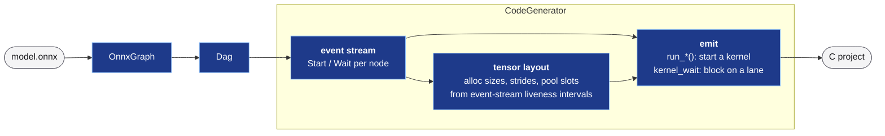
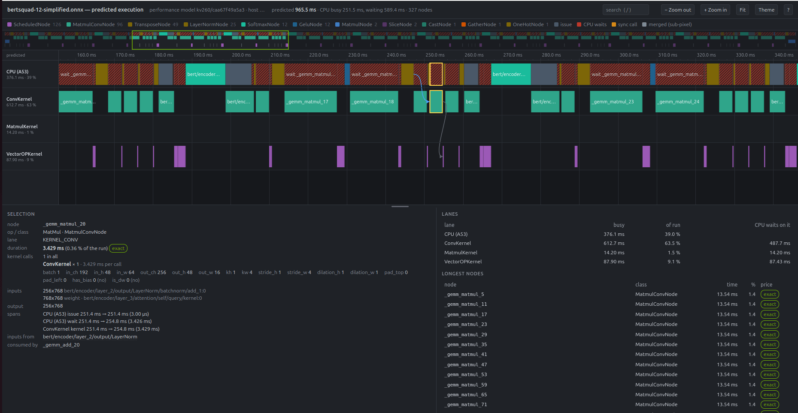

# Inference Scheduler — Technical Reference

The inference scheduler is a Python code-generator that bridges the gap between
trained neural network models (ONNX format) and the hardware accelerators running
on the KV260.  It reads an ONNX graph, validates that every operator can be
executed by one of the supported hardware kernels, and emits a self-contained C
project that drives the IP through the auto-generated Xilinx driver APIs.

> This file is the technical reference for what the scheduler supports and
> how (operator mapping, transformations, host ops, numerics, cache
> coherency, multi-entry projects, planning).  The user guide — CLI options, generated
> project layout, C API walk-through, building, `report.md` — is
> [`inference-scheduler/doc/USER_GUIDE.md`](../../inference-scheduler/doc/USER_GUIDE.md);
> codegen internals (node classes, layout engine, mixins) are in
> [`inference-scheduler/doc/ARCHITECTURE.md`](../../inference-scheduler/doc/ARCHITECTURE.md);
> the DAG / event-stream / liveness / slot-coloring algorithms in
> [`SCHEDULER_DAG.md`](../../inference-scheduler/doc/SCHEDULER_DAG.md).

---

## Hardware Kernels

| Kernel | ONNX ops handled | Notes |
|--------|-----------------|-------|
| **VectorOPKernel** | `Add`, `Sub`, `Mul`, `Div`, `Relu`, `Clip(0,6)`; `LeakyRelu`, SiLU (`x · Sigmoid(x)`), `Gelu` | 1-D element-wise, 8 elements/cycle on 128-bit ports; `act` register fuses a following `Relu` / `Clip(0,6)` / activation; LeakyReLU, SiLU and GELU run in the activation unit when the platform has it (`kernels.vectorop.activations`, `src/vectorop_act.py`, [ACTIVATIONS_PLAN](../plans/ACTIVATIONS_PLAN.md)) — a `Gelu` it cannot run stays a host op |
| **MatmulKernel** | `MatMul` | Tiled 2-D matrix multiply — the MatMuls the ConvKernel lowering does not take (batch-1 FC layers, `K % 16 ≠ 0`, `M % 8 ≠ 0`, fewer than 16 rows, 4D×3D outer loops, or not estimated faster); B in ConvKernel's image where that is faster or the weight's shared layout (on the HLS kernel of older bitstreams: single-row MatMuls) — its GEMV / image path ([§MatMul GEMV streaming](#matmul-gemv-streaming)) |
| **ConvKernel** | `Conv`; `MatMul` (lowered) | 2-D NCHW convolution with optional bias, `group = 1` or depthwise (`group = in_ch`); also runs MatMuls with swapped operand roles ([§MatMul on ConvKernel](#matmul-on-convkernel)) |
| **PoolingKernel** | `MaxPool`, `AveragePool`, `LpPool`, `GlobalMaxPool`, `GlobalAveragePool`, `GlobalLpPool` | 2-D NCHW pooling |

**Zero-cost transformations (no hardware call):**
- `Reshape`, `Squeeze`, `Unsqueeze`, `Flatten`, `Dropout`, `Identity`
  (`RESHAPE_OP_TYPES`) and a `Cast` within one storage kind — output
  pointer is aliased to the source buffer; no data copy.
- `Constant` — folded into an initializer at load time.
- `Split` / `Slice` — contiguous, 64-byte-aligned pieces become sub-buffer
  views ([§Host-CPU ops](#host-cpu-ops), "Slice views"); other pieces are
  host copies.
- `Gemm` — decomposed to `MatMul` + optional `Add` at model load time
  (`alpha=1, beta=1, transA=0` required; `transB=1` is accepted for a
  constant 2-D B, which is transposed offline into a `<B>_T` initializer).
- `Relu` / `Clip(0,6)` — and, on the activation unit, `LeakyRelu`, SiLU and
  `Gelu` — after a VectorOP node: folded into that node's call via the
  kernel's `act` register (`run_op_act()`, which also takes LeakyReLU's
  `alpha`), when the producer's output has no other consumer and is not a
  graph output, and the producer is not itself an activation op (the kernel
  ignores `act` after those) (`OnnxGraph(fuse_act=True)`, the CLI default;
  `--no-fuse-act` disables it; `OnnxGraph.act_fused_count` reports the
  number folded).  A `Relu` after a Conv / MatMul / Pool node or on a graph
  input stays a call.

**VectorOPKernel's activation unit** (`src/vectorop_act.py`,
[ACTIVATIONS_PLAN](../plans/ACTIVATIONS_PLAN.md)) — when the platform's
bitstream has it (`kernels.vectorop.activations`; `AXI_VECTOROP_ACTIVATIONS`
overrides) and the tensors are plain `ap_fixed<16,8>` DMA tensors (no
power-of-two exponent, not host memory):
- `Gelu` (native or a fused pattern) → `VECTOROP_GELU` / `VECTOROP_GELU_TANH`
  when the node's Q8.8 function equals the kernel's on all 65 536 inputs
  (the graph's float32 constants do: BERT's GELUs are bit-identical on
  either side), else the host op as before;
- `LeakyRelu` → `VECTOROP_LEAKY_RELU`, slope `round(alpha · 65536)` in the
  `alpha` register (0 ≤ alpha < 1; the simulator uses the quantised slope);
- `Mul(x, Sigmoid(x))` → SiLU (`fusion.py` fuses it to a `Silu` node only
  when the unit is there; else `Sigmoid` is rejected with a hint).

The simulator rounds these the kernel's way: the op result truncated to
Q8.8 as for every op, then the activation in double rounded to nearest-even
(`vectorop_act.apply`).  A program that uses the unit writes `alpha`
unguarded and checks at `inference_init()` that the IP has the register
(an older IP reads 0 and passes ops 6–9 through unchanged); the others write
`alpha = 0` only where the driver has it (`#ifdef
XVECTOROPKERNEL_CTRL_ADDR_ALPHA_DATA`).

**Host-CPU ops (C code inside `inference_run()`, no hardware call):**
- **Softmax, LayerNormalization, Gelu, Transpose, Slice / Split, Concat,
  Resize, Gather, OneHot, Cast** — `src/host_nodes.py`, see [§Host-CPU ops](#host-cpu-ops)
  below.  TensorFlow-style LayerNorm and GELU (tanh / erf) subgraphs are
  fused into single host nodes first ([§Pattern fusion](#pattern-fusion));
  integer tensors (token ids, masks) are supported as raw int16
  ([§Integer tensors](#integer-tensors)).  This is what makes BERT-base
  (bertsquad-12) schedulable — [`BERT_PLAN.md`](../plans/BERT_PLAN.md).
- **Llama-family decoder ops** (custom domain `axi.llm`, `src/llm_nodes.py`)
  — `LlmEmbed`, `LlmRMSNorm`, `LlmResAdd`, `LlmAttention` (RoPE + KV cache
  + causal GQA attention as one float region), `LlmSiluMul`,
  `LlmSelectRow`, `LlmDequant`, and `LlmAttnPrep` / `LlmAttnSoftmax` /
  `LlmAttnMerge` around the prefill attention's ConvKernel calls; the graphs
  come from the Llama frontend
  (`src/llama.py`, [§Llama-family decoders](#llama-family-decoders)) with
  power-of-two exponents, float / int host tensors and persistent states
  ([§Numerics beyond the element type](#numerics-beyond-the-element-type)).
  This is what runs SmolLM2-135M / 360M-Instruct — [`CHAT_PLAN.md`](../plans/CHAT_PLAN.md) §13, §20.
- **Vision-encoder ops** (domain `axi.llm`, `src/vit_nodes.py`) — `VitEmbedAdd`,
  `VitLayerNorm`, `VitResAdd`, `VitAttnPrep`, `VitAttnSoftmax`, `VitGelu`,
  `VitPixelShuffle`, `VitSumDequant`, with q·Kᵀ / P·V on ConvKernel; the
  `vision` entry comes from `src/vit.py` ([§Vision encoders](#vision-encoders)).
  This is what runs SmolVLM-256M-Instruct's image side — `CHAT_PLAN.md` §23, §24.
- **Text-to-speech ops** (domain `axi.llm`, `src/tts_nodes.py`) — `TtsPrep`,
  `TtsGate`, `TtsSum`, `TtsFlowOut`, `TtsInterleave`, `TtsPcm` around the
  flow's and the HiFi-GAN decoder's ConvKernel convs, and `TtsEmbed`,
  `TtsRowPrep`, `TtsAttnSoftmax` (or `TtsAttnRelAdd` + the softmax unit),
  `TtsAttnMerge`, `TtsResNorm`, `TtsEncOut` in the text encoder; the `chunk` and `encode_<T>` entries come from
  `src/piper.py` ([§Text to speech (Piper)](#text-to-speech-piper)).
  This is what runs Piper lessac-medium — `TTS_PLAN.md` §4–§6.
- **Stereo depth ops** (domain `axi.llm`, `src/stereo_nodes.py`) —
  `StereoVop` (one VectorOPKernel ADD / MUL / RELU / RELU6 / LEAKY_RELU call
  on exponent tensors) and `StereoSoftmax` (the softmax unit's column mode
  over channels) as kernel nodes; `StereoInstanceNorm`, `StereoPadEdge`,
  `StereoCorrelation` and `StereoUpsample` as host ops.  The graph comes
  from `src/stereo.py` ([§Stereo depth (LightStereo)](#stereo-depth-lightstereo)).
  This is what runs LightStereo-S — `STEREO_PLAN.md` §4.
- **Space-to-depth stem** — a stride-2 `Conv` whose input has
  `4·C ≤ kTileIC` channels (C ≤ 4 on the KV260; the RGB stem of ResNet-18 /
  MobileNet-style nets) is rewritten as `SpaceToDepth(blocksize=2)` +
  stride-1 `Conv` over `4·C` channels with re-indexed weights
  (`OnnxGraph(s2d_stem=True)`, the CLI default; `--no-s2d-stem` disables
  it; `OnnxGraph.s2d_stem_count` reports the number rewritten).
  ConvKernel multiplies 16 input-channel lanes per cycle, so the 3-channel
  7×7 stem ran at 3/16 lane utilisation; the rewrite gives it 12 lanes and
  16 taps instead of 49.  The reorder runs on the host CPU as a
  `SpaceToDepthNode` (a C loop inside `inference_run()`, ~150 k elements
  for 224², in place in the cacheable DMA buffers — see
  [§Cache coherency](#cache-coherency); with the non-cacheable fallback it
  is staged through cached host memory, since strided loads from a
  non-cacheable mapping measured 16.3 ms); the model's public input stays
  `[1, C, H, W]`.  Details in
  [§Space-to-depth stem](#space-to-depth-stem) below.  A model that
  already contains an ONNX `SpaceToDepth` node is accepted the same way.

---

## Usage

```bash
cd inference-scheduler

# One-time setup
python3 -m venv .venv
.venv/bin/pip install -r requirements.txt

# Generate all test ONNX models
.venv/bin/python test/gen_test_models.py
.venv/bin/python test/gen_matmul_models.py
.venv/bin/python test/gen_mixed_kernel_models.py
.venv/bin/python test/gen_conv_models.py
.venv/bin/python test/gen_pool_models.py
.venv/bin/python test/gen_reshape_gemm_models.py
.venv/bin/python test/gen_mixed_all_kernels_models.py
.venv/bin/python test/gen_parallel_models.py    # parallel + NOP corner-case fixtures
.venv/bin/python test/gen_bert_models.py        # tiny BERT-like models (host ops, fusion)
.venv/bin/python test/gen_llama_models.py       # tiny random Llama (decoder ops, exponents)
# (or all of the above at once: .venv/bin/python test/gen_all_models.py)

# Generate a complete C inference project from an ONNX model
.venv/bin/python inference_scheduler.py model.onnx --out-dir /tmp/out
# ... planned from the bitstream's performance model (§Planning)
.venv/bin/python inference_scheduler.py model.onnx --plan --out-dir /tmp/out

# A multi-entry project: one library, inference_run_<name>() per graph,
# one weight pool (weights deduplicated), shared states
.venv/bin/python inference_scheduler.py --entry decode=test/models/llama_tiny_decode.onnx \
    --entry head=test/models/llama_tiny_head.onnx --out-dir /tmp/multi

# Run the full test suite (1727 tests; test_bert_base.py downloads bertsquad-12 on its first run)
.venv/bin/python -m pytest test/ -v
```

---

## Architecture

```
inference_scheduler.py          CLI, argument parsing
└── src/
    ├── graph.py    OnnxGraph   load, shape inference, Gemm preprocessing,
    │                           tensor registry, node dispatch
    ├── dtype.py    DataType    ap_fixed<W,I> / float32 encoding, rounding modes
    ├── layout.py   TensorLayout  DMA buffer geometry (alloc, chunk, stride)
    ├── tensor.py   TensorInfo  weight encoding, C declarations
    ├── kernels.py              KERNEL_REGISTRY: driver files, UIO defaults,
    │                           inference_init() parameters per kernel
    ├── nodes.py                ScheduledNode  (VectorOPKernel)
    │                           MatmulNode     (MatmulKernel)
    │                           ConvNode       (ConvKernel)
    │                           MatmulConvNode (a MatMul on ConvKernel)
    │                           PoolNode       (PoolingKernel)
    │                           ReshapeNode    (buffer alias)
    │                           SpaceToDepthNode (host reorder)
    ├── host_nodes.py           HostNode family (Softmax, LayerNorm, Gelu,
    │                           Transpose, Slice, Gather, OneHot, Cast):
    │                           numpy reference + C helper library
    ├── llm_nodes.py            axi.llm ops of Llama decoders: host ops (Embed,
    │                           RMSNorm, ResAdd, Attention, SiluMul, AttnPrep,
    │                           AttnSoftmax, AttnMerge, ...) and the FPGA
    │                           attention ConvKernel calls (LlmAttnConvNode;
    │                           runtime key count, static for the vision encoder)
    ├── numeric.py              axi.numeric metadata: power-of-two exponents,
    │                           host tensors, states; rank-1 weight encoding
    ├── llama.py                Llama frontend: config + safetensors +
    │                           formats -> fixed-shape entry graphs
    ├── vit_nodes.py            axi.llm ops of a vision encoder (LayerNorm,
    │                           attention prep / softmax, GELU table, ...)
    ├── vit.py                  vision frontend (SigLIP ViT + connector) ->
    │                           the `vision` entry of a multi-entry project
    ├── piper.py, tts_nodes.py  Piper TTS frontend (`chunk`, `encode_<T>`
    │                           entries) and its axi.llm host ops
    ├── stereo.py, stereo_nodes.py
    │                           LightStereo-S frontend (checkpoint + formats
    │                           -> one graph) and its axi.llm ops
    ├── fusion.py               Constant folding, Split lowering, LayerNorm /
    │                           GELU fusion, constant-broadcast normalisation
    ├── matmul_lowering.py      MatMul -> ConvKernel engine choice, geometry, row split
    ├── matmul_gemv.py          MatmulKernel GEMV / image pass (single-row MatMuls
    │                           on the HLS kernel, any on the RTL kernel)
    ├── fc_conv.py              fully-connected Convs -> MatMul
    ├── llm_entries.py          Llama entry graphs sharing one image per weight
    ├── cost_model.py           ConvKernel / MatmulKernel cycle estimates
    ├── planning.py             --plan options, performance-model lookup
    ├── perf_calls.py           KernelCall (a kernel call's registers), bitstream id
    ├── perf_model.py           per-bitstream kernel model: exact calls, fitted
    │                           families, error bands
    ├── perf_fit.py             fitting it (perf_calibrate.py fit)
    ├── host_model.py           host-op timing model (host.json)
    ├── tactics.py              a MatMul's tactics (conv / tiled / GEMV-image) and calls
    ├── order_search.py         --plan issue-order search
    ├── schedule.py Dag         data-flow DAG (+ state RAW / WAR / WAW edges):
    │                           predecessors, successors, topological order,
    │                           independent pairs
    ├── report.py               report.md (model summary, transformations, layers,
    │                           planning)
    ├── timeline_html.py        timeline.html (the predicted execution)
    └── codegen/    CodeGenerator
                    _core.py    event stream, tensor layout, DMA pool sizing,
                                event-stream liveness intervals
                    _header.py  include/inference.h
                    _source.py  src/inference.c  (weights, init, run, kernel_wait)
                    _buf_impl.py  src/inference_buf.c, scripts/check_inference_setup.sh
                    _simulate.py  fixed-point forward simulation
                    _test.py    test/test_inference.c  (on-device smoke test)
                    _cmake.py   CMakeLists.txt
                    multi.py    MultiEntryGenerator (several graphs, one
                                weight pool, shared states)
                    timing.py   timed replay of the event stream (--plan)
```

### OnnxGraph loading sequence

1. `onnx.load()` (or an in-memory `onnx.ModelProto`, e.g. from
   `src/llama.py`) + `onnx.checker.check_model()` — structural validation.
2. `shape_inference.infer_shapes()` — fills intermediate tensor shapes.
   Steps 1–2 (`_checked_inferred`) run on a weightless copy: every
   initializer over 4096 elements is a graph input of the same type and
   shape there, so neither serialises the weights (they did 4–5 times, and
   a model over 2 GB cannot be serialised at all).  The graph then works on
   its own copy of the inferred model; a large initializer read only as a
   MatMul's B or by `axi.llm` nodes stays in the caller's model (a
   data-less placeholder in the copy) and the tensor registry reads it from
   there.  The `axi.numeric` metadata is parsed (`src/numeric.py`).
3. `fusion.fold_constant_nodes()` — `Constant` nodes become initializers.
4. `_preprocess_model()` — rewrites `Gemm` → `MatMul` + optional `Add`.
5. `fusion.lower_split()` — `Split` becomes one `Slice` per output.
5b. `fc_conv.lower_fc_convs()` (`fc_conv="auto"`, the default) —
   fully-connected Convs become Flatten + MatMul + Reshape (+ bias Add),
   see [§Fully-connected Convs](#fully-connected-convs).
6. `_space_to_depth_stems()` (when `s2d_stem=True`, see below).
7. `fusion.fuse_patterns()` (when `fuse_patterns=True`, the default) —
   LayerNorm / GELU fusion and VectorOP constant-broadcast normalisation.
8. Build tensor registry (weights, inputs, intermediates, outputs).
9. The numeric annotations are applied to the tensor registry
   (exponents, host tensors, states — states leave the input / weight
   lists).  Dispatch each node to `MatmulNode` / `ConvNode` / `PoolNode` /
   `ReshapeNode` / `SpaceToDepthNode` / `ScheduledNode` / a host node
   (`host_nodes.HOST_OP_FACTORIES`, or `llm_nodes.LLM_OP_FACTORIES`,
   `vit_nodes.VIT_OP_FACTORIES`, `tts_nodes.TTS_OP_FACTORIES` and
   `stereo_nodes.STEREO_OP_FACTORIES` for the `axi.llm` domain) based on
   `op_type`; kernel nodes reading an integer tensor are rejected; then
   `numeric.check` (only MatMuls, Convs, Concat / Transpose copies and the
   LLM / TTS / stereo ops touch exponent tensors, only those ops host / state
   tensors) and `numeric.encode_matmul_weights` (rank-1 weight exponents,
   before any packing or re-layout) / `numeric.encode_conv_weights`.
10. `_fuse_activations()` (when `fuse_act=True`) — folds `Relu` / `Clip(0,6)`
   and the activation-unit ops into the producing `ScheduledNode` (`act`,
   `alpha`, `fused_nodes`, output tensor re-pointed) and renumbers node
   indices.
11. `matmul_lowering.lower_matmuls()` (`matmul_on_conv="auto"`, the
   default) — MatMuls estimated faster on ConvKernel become
   `MatmulConvNode`s, their constant B re-laid out when `kw > 1`
   ([§MatMul on ConvKernel](#matmul-on-convkernel)); `matmul_conv_kw`
   ({weight: kw}) pins kernel widths (a multi-entry project's prefill
   buckets must re-lay out a shared weight identically), `matmul_conv_kws`
   limits the widths it may choose.  With `plan` enabled the performance
   model is resolved first and each MatMul's choice is re-priced
   (`_plan_matmul`, [§Planning](#planning---plan)).
12. `matmul_gemv.choose_gemv()` (`matmul_gemv="auto"`, the default) —
   MatmulNodes switch to MatmulKernel's GEMV / image path (`gemv_kw`) where
   it is estimated faster or their weight's shared layout is the image (on
   the HLS kernel only single-row ones); `matmul_gemv_kw` ({weight: kw}) reads those weights in
   ConvKernel's kw image ([§MatMul GEMV streaming](#matmul-gemv-streaming));
   planned by `_plan_gemv` under `plan`.
13. `_pack_matmul_weights()` (the remaining tiled MatmulNodes), then
   `_choose_slice_views()` (contiguous Slice pieces that may alias their
   source).
14. `order_search.plan_order()` (only with `plan` enabled) — the issue
   order from the timed simulation ([§Planning](#planning---plan)).

`_space_to_depth_stems()` (when `s2d_stem=True`) runs on the ONNX model
like the Gemm rewrite: it inserts the `SpaceToDepth`
node, appends the `<W>_s2d` initializer and replaces the Conv, so the
tensor registry, `ConvNode` validation / weight packing and the report see
an ordinary graph.

### Fully-connected Convs

A `Conv` whose kernel covers its whole unpadded input computes one output
pixel per image — a fully-connected layer (LeNet's 7×7 conv on a 7×7 map,
a 1×1 conv on a 1×1 map).  ConvKernel streams such a weight through one
128-bit port for a single pixel; `fc_conv.lower_fc_convs()` rewrites it
on the ONNX model as `Flatten(x)` → `MatMul(·, W')` → `Reshape([N, M, 1,
1])` → `Add(b)`, with `W'[(c·H + h)·W + w][m] = W[m][c][h][w]` (Flatten's
order), so a batch-1 layer runs on MatmulKernel (the GEMV path through
both read ports where it is faster).  Eligible: group 1, dilations 1, pads 0, kernel = input H × W,
constant weight / bias, C·H·W ≤ `max_k`.  `fc_conv="auto"` (library and
CLI default) rewrites where the engine cost model — ConvKernel cycles
against GEMV or tiled MatmulKernel cycles plus one VectorOP call for the
bias — estimates the MatMul ≥ 20 % faster; `"always"` / `"off"`
(`--fc-conv`).  A following `Relu` still fuses into the bias `Add`.
Bit-identical except where the sum before the bias saturates (the Conv
adds the bias inside its accumulator; the MatMul saturates first).
`OnnxGraph.fc_conv_stats` = `{lowered, kept, conv_cycles, matmul_cycles}`;
`report.md` lists the rewrite.  LeNet: 5.44 → 2.81 ms on the board
([LENET_PLAN](../plans/LENET_PLAN.md)).  MobileNet v1's 1001-way 1×1
classifier is not GEMV-eligible (m % 8 ≠ 0) but runs as a tiled MatMul: the
Conv is bound by its 1001 two-word weight requests (8.8 ms on the board,
`cost_model.conv_board_cycles` 7.7 ms) against 0.67 ms for the RTL
MatmulKernel's tiled path (MobileNet v1 81.0 → 73.0 ms on the board,
MATMUL_RTL_PLAN phase 3c; the HLS kernel's 1.5 ms is faster too).

**VectorOPKernel alignment contract** (kernel ports are 128-bit words):
every DMA buffer base is 64-byte aligned, every broadcast `CHUNK_STRIDE`
is `INFERENCE_ALIGN_UP(CHUNK)` (a multiple of 8 elements), and
`inference_buf_alloc()` rounds allocations up to 64 bytes, so the kernel's
whole-word reads and its whole last-word write per run stay inside the
buffer / stride gap (`test/test_act_fusion.py::TestAlignmentContract`).

### Key data flow



### Parallel kernel execution

Each hardware lane (`Conv`, `Pool`, `Matmul`, `VectorOP`) is a single IP
on the FPGA, and the codegen overlaps work across **different** lanes.
The `run_*()` helpers are non-blocking — they program AXI-Lite
registers, call `XKernel_Start()`, and return. Synchronisation is a
single weak-symbol primitive emitted into the generated source:

```c
typedef enum { KERNEL_VECTOROP, KERNEL_MATMUL, KERNEL_CONV, KERNEL_POOL,
               KERNEL_COUNT } kernel_id_t;
__attribute__((weak))
void kernel_wait(kernel_id_t k);   /* default: poll IsDone */
```

Override at link time to swap in IRQ-driven waiting (UIO/Linux,
GIC/bare-metal) without touching the generated code.

`inference_run()` emits a `kernel_wait` only when (a) some predecessor
is still in flight on its lane, or (b) the target lane has a different
op pending. Predecessor analysis walks **through** ReshapeNode chains
to reach the real producing kernel, so a `Pool → Squeeze → MatMul`
chain still drains the Pool lane before MatMul reads the alias.

The predicted timeline (`timeline.html`, [§Planning](#planning---plan))
draws this schedule. In BERT-base (below):
- **A single-call MatMul on ConvKernel.** The CPU starts it in 3 µs
  (`run_conv()`: the register writes and `XConvkernel_Start()`). It then
  blocks in `kernel_wait(KERNEL_CONV)`, the red hatching, until the output
  that the next node needs is ready.
- **Between the waits.** The host ops (Softmax, LayerNorm, the transposes)
  and VectorOPKernel's adds run there.
- **Over the run.** The CPU waits a predicted 589 ms of 965 ms, 488 ms of
  it on ConvKernel.

[](../images/timeline_bert.png)

### DMA buffer management

- All buffers allocated in `inference_init()` from a contiguous DMA pool.
- `Reshape` output buffers are pointer-assigned (= source), never independently allocated.
- Pool slots are coloured by **event-stream liveness intervals**: a tensor
  is live from its producer's Start event until the latest `kernel_wait`
  that drains a consumer's lane (consumers reached via Reshape aliases
  count). Two tensors share a slot only if their event intervals are
  strictly disjoint — necessary for correctness under cross-lane parallelism.
- `inference_run()` flushes all graph inputs to DDR at the top, cleans all
  graph outputs (below), drains every still-pending lane, and invalidates
  all graph outputs at the bottom.  Internal intermediate buffers are never
  synced — the PL kernels access DDR directly via their AXI master ports —
  except around a host op (`SpaceToDepthNode`, `HostNode`), which
  invalidates a kernel-written source before reading it and flushes its own
  output before the consuming kernel starts.
- Weights are synced once at init; they never change.

### Cache coherency

The PL kernels' AXI masters do not snoop the A53 caches.  On Linux every
DMA buffer is an XRT buffer object (`xclAllocBO`) and, since BERT_PLAN phase
2B, it is mapped **cacheable** (`XCL_BO_FLAGS_CACHEABLE`, what PYNQ's
`allocate(cacheable=True)` does): CPU reads of a BO run at cached speed
(sequential 2.3 GB/s vs 0.14 GB/s for the old non-cacheable write-combine
mapping, measured on the KV260) and `xclSyncBO` performs real cache
maintenance on exactly the requested range (views pass their byte offset /
size; zocl 2.13 → `dma_sync_single_for_{device,cpu}`, ~65 µs per MiB).
The generated code brackets every CPU ↔ kernel hand-off (Linux DMA-API
rules):

| hand-off | call | where |
|---|---|---|
| CPU wrote → kernel reads | `inference_buf_sync_to_device` (clean) | graph inputs at the top of `inference_run()`; weights once in `inference_init()`; every host-op output (`host_out_done`, SpaceToDepth) |
| CPU wrote → kernel **writes** | `inference_buf_sync_to_device` (clean) | graph outputs at the top of `inference_run()` — a caller's `memset` of an output buffer would otherwise leave dirty lines whose later eviction overwrites the kernel's result; freshly allocated BOs are cleaned once in `inference_buf_alloc()` |
| kernel wrote → CPU reads | `inference_buf_sync_from_device` (invalidate) **after** the lane drained | a host op's kernel-written inputs (inside its block, after the event stream's `kernel_wait`); graph outputs after the final drain |
| kernel ↔ kernel | none | intermediates never touch the CPU caches |
| CPU wrote a **DMA state** → kernel reads | `llm_cache_flush` (clean the rows the kernels read) | the KV caches of the FPGA prefill attention: `LlmAttnPrep` flushes rows `[0, keys)` of every KV head after writing its rows; decode steps write their row without a sync (it stays dirty until the next prefill flushes it) |

Pool slots are 64-byte (cache-line) aligned and never share a line, a host
op's output never shares a slot with one of its inputs (liveness), and the
CPU never touches a buffer a kernel in flight uses, so a range sync can
never write back or drop another buffer's data.  `test/test_cache_coherency.py`
checks the emitted `inference_run()` of every test model, the tiny BERT
fixtures, the SpaceToDepth stems and a kernel → host → kernel → output model
against these rules (a dirty / stale state per buffer, Slice views as
sub-ranges); removing any single required sync makes it fail.  On the board
a micro-test (`xclSyncBO` omitted → the kernel reads stale data / the CPU
reads stale lines; with it → exact) and the 148-model suite confirm the
behaviour.

**DMA states** (the KV caches, [§Numerics](#numerics-beyond-the-element-type))
persist across calls and entries, so the audit lets every run function start
with them CPU-dirty (another entry may have written rows) and requires a
flush between a host op's write and any kernel read in the same call; which
rows are flushed is a run-time range it cannot see.  That, and every other
sync, is checked dynamically by the **incoherent host emulation**
(`test/host_emu.py`, `build_and_run(incoherent=True)` / `-DEMU_INCOHERENT`):
each allocation gets a separate "DDR" copy that the software kernels read and
write, a flush copies the bytes the CPU changed since its last sync (the dirty
data of a write-back cache) and an invalidate reloads the CPU copy — a
missing or too-narrow sync then changes the outputs (the tests remove the
cache flush, a host op's output flush and an invalidate, and each fails).
The audit also walks multi-entry run functions (`run_name`) with their
`noinline` parts inlined.

`inference_buf_is_cached(buf)` (inference.h) reports the mapping; the host
ops compute in place when it is 1.  Fallback: `cmake
-DINFERENCE_BUF_CACHEABLE=OFF` (compile time) or the environment variable
`INFERENCE_BUF_CACHEABLE=0` (run time, read in `inference_init()`) maps the
BOs non-cacheable as before; the host ops then stage through cached
`malloc` memory again.  Bare-metal buffers are `malloc`'d cached DDR with
`Xil_DCacheFlushRange` / `Xil_DCacheInvalidateRange`.

### Space-to-depth stem

`OnnxGraph._space_to_depth_stems` (`src/graph.py`; maths in
`nodes._s2d_stem_geometry` / `nodes._s2d_stem_weight`).

Per axis, a stride-2 tap `t ∈ 0..k-1` of the original Conv with pad `p`
reads input row `2o + t − p`.  After a block-2 space-to-depth the same row
is `(r, ph)` with `2r + ph = 2o + t − p`.  A stride-1 Conv over the
reordered tensor with pad `P'` reads rows `o + R − P'`, hence
`t = 2R + ph + p − 2P'`.  Choosing

```
P'  = ceil(p / 2)              off = p − 2P'  (0 or −1)
K'  = (k − 1 − off) // 2 + 1   t   = 2R + ph + off
```

covers every original tap exactly once (taps outside `0..k-1` are zero
weights), so both convolutions accumulate the same products and the
scheduler's fixed-point simulation truncates once after the whole sum in
both cases — the outputs are bit-identical (`test/test_s2d_stem.py`).

| original | rewritten (per axis) |
|---|---|
| 7×7 s2 p3 (ResNet-18) | 4×4 s1 P'=2, off −1 (one zero tap row / column) |
| 5×5 s2 p2 | 3×3 s1 P'=1 |
| 3×3 s2 p1 | 2×2 s1 P'=1 |
| 3×3 s2 p0 | 2×2 s1 P'=0 |

Tensors (ONNX `SpaceToDepth` channel order, so the rewritten model is a
valid ONNX graph):

```
x'[n][(ph·2 + pw)·C + c][r][cc]  = x[n][c][2r + ph][2cc + pw]
w'[m][(ph·2 + pw)·C + c][R][Cc]  = w[m][c][2R + ph + off_h][2Cc + pw + off_w]   (0 outside kh×kw)
bias, output shape               unchanged
```

The rewritten Conv's ONNX `pads` are `[P't, P'l, Pb', Pr']` with the
bottom / right values chosen so shape inference reproduces the original
`out_h`/`out_w` (`[2, 2, 1, 1]` for 224² → 112²).  ConvKernel takes only
`pad_top` / `pad_left` and zero-pads bottom / right by its bounds check
(`ConvKernel.h`), which is exactly the implicit padding the identity
relies on; the geometry is covered by C-sim (`TestConvSim.cpp`, "s2d
stem: 12ch 4x4 s1 pad [2,2,1,1]").

Applicability (all required): `group = 1`, dilations 1, `strides = [2, 2]`,
explicit pads (`auto_pad` absent / NOTSET), constant 4-D weight, 4-D input
of known shape with **even H and W** (odd sizes are left untouched — the
ONNX op requires divisibility and the reorder loop stays branch-free; the
maths would also hold with a zero-padded odd edge), and `4·C ≤ kTileIC`
(`platforms/<name>.json kernels.conv.tile_ic`, 16 → C ≤ 4).  Any input
tensor qualifies; when the source is a kernel output the event stream
waits for that lane first.  One `SpaceToDepth` output is shared by every
rewritten Conv reading the same tensor.

Codegen: `SpaceToDepthNode` has no lane (`kernel_name == ""`), emits a
`('cpu', idx)` event (waits on its producers like a kernel start, runs
inline, never waited on), and its output is a normal pool buffer whose
liveness interval starts and ends at that event, so it never shares a
slot with its source.  Profiling brackets the loop like a synchronous
node.  The `<W>_s2d` weight goes through the normal ConvNode tile-major
packing and ROM / `.dat` emission.

With the (default) cacheable DMA mapping the loop reads the source BO and
writes the output BO in place, then `inference_buf_sync_to_device(out)`
(after `inference_buf_sync_from_device(src)` when a kernel wrote the
source) — 0.50 ms for the ResNet-18 / MobileNet stems (150 k elements) on
the board.  With the non-cacheable fallback (`INFERENCE_BUF_CACHEABLE=0`) the
strided 2-byte source loads would cost ~100 ns each (16.3 ms for the
ResNet-18 stem on the board), so `inference_init()` also mallocs one cached
staging block per node (`_s2d_stage_<out>`, 2 × source numel, freed in
`inference_deinit()`) and that case does `memcpy(BO → stage_in)`, reorders
`stage_in → stage_out` in cached memory and `memcpy(stage_out → BO)` — the
only DMA-memory traffic is two wide sequential copies (measured 2.6 ms for
ResNet-18's 300 KB, dominated by the non-cacheable read).

### Host-CPU ops

`src/host_nodes.py`.  Ops no PL kernel implements run on the A53 inside
`inference_run()`:

| ONNX op | Node | Semantics / restrictions |
|---|---|---|
| `Softmax` | `SoftmaxNode` | opset ≥ 13: last axis only; opset < 13: "coerce to 2-D", i.e. rows of `prod(shape[axis:])` (BERT's `axis = 3` on rank 4 is the last axis).  Where the platform has VectorOPKernel's softmax unit (`kernels.vectorop.softmax`) a Q8.8 Softmax of rows ≤ 2048 (16-byte aligned) is a `SoftmaxVopNode` instead (`src/smx_nodes.py`: one `OP_SOFTMAX` call, scores at 2⁻⁸, P at 2⁻⁸; the integer softmax of `src/vectorop_smx.py`, [SOFTMAX_PLAN](../plans/SOFTMAX_PLAN.md)) |
| `LayerNormalization` | `LayerNormNode` | over `prod(shape[axis:])`; scale / bias must be constants (kept float32, emitted as C arrays, never DMA weights); only the `Y` output |
| `Gelu` | `GeluNode` | `approximate = "tanh"` / `"none"` (erf) |
| `Transpose` | `TransposeNode` | any perm, ≤ 5 non-mergeable dims |
| `Slice` (and every `Split` output) | `SliceNode` | constant starts / ends / axes, positive steps; zero-cost view when possible (below) |
| `Concat` | `ConcatNode` | any axis, same rank and dims off the axis; block copies (`host_concat`): input k's `[outer][c_k · inner]` rows into the output's rows — bit-exact, dtype-agnostic (YOLOv5's channel joins, [YOLO_PLAN](../plans/YOLO_PLAN.md)) |
| `Resize` | `ResizeNode` | mode `nearest` by **integer** scales on an NCHW tensor's H and W (an upsample) with a coordinate mode whose pick is pixel `(y / s_h, x / s_w)`: `asymmetric` + `floor` (`nn.Upsample`), `half_pixel` / `pytorch_half_pixel` + `round_prefer_floor` / `round_prefer_ceil`; a strided host copy with zero strides (`host_copy_nd`) |
| `Gather` | `GatherNode` | axis 0, runtime integer indices, any table (a constant table stays a DMA weight; rows are copied straight out of it, one memcpy per row).  Negative indices count from the end; an index still outside `[0, rows)` is **clamped** (ONNX leaves it undefined) |
| `OneHot` | `OneHotNode` | axis −1, runtime integer indices, constant depth and `[off, on]`; out-of-range index → all-off row |
| `Cast` | `CastNode` | integer → Data_t, Data_t → integer (truncate toward zero), → bool; a cast within one storage kind (float → float, int → int) is a zero-cost `ReshapeNode` alias |

**Numeric contract** (the generated C and `HostNode.reference()`, which
`_simulate` runs, implement the same operations in the same order):

- inputs are read as double — Data_t via `host_ld` (`(int16_t)bits / 256.0`,
  exact), integer tensors via `host_ld_int` (raw int16);
- all arithmetic in IEEE double; reductions accumulate left to right
  (`np.cumsum` in the simulator); the host section of `inference.c` starts
  with `#pragma GCC optimize ("fp-contract=off")` (GNU C modes otherwise
  fuse `a*b + c` into an FMA on the A53) and CMake adds `-ffp-contract=off`;
- `exp` / `tanh` / `erf` come from libm; the simulator calls Python's
  `math` module — the platform's glibc — elementwise, not numpy: `np.tanh`
  differs from glibc's `tanh` by up to 3 ulp on ~26 % of inputs (numpy 2.x),
  and `np.exp` switches to SVML on AVX-512 hosts;
- outputs are written back with `host_st`: `nearbyint(v * 256)` under the
  default FE_TONEAREST mode — **round half to even**, identical to numpy's
  `np.round` — then saturation to `[-128, 127.996]`; NaN → 0.  Integer
  outputs use `host_st_int` (truncate toward zero, saturate to int16);
- formulas: Softmax `exp(x − max) / Σ exp(x − max)`; LayerNorm TF form
  (fused BERT pattern) `g = gamma / sqrt(var + eps)`,
  `y = x·g + (beta − mean·g)`, ONNX form `(x − mean)·inv·gamma + beta`, with
  `mean = Σx/n`, `var = Σ(x − mean)²/n`; GELU tanh
  `x·(0.5·(1 + tanh(c2·(x + c1·x³))))`, erf `x·(0.5·(1 + erf(x/k)))` with the
  constants found in the graph (native `Gelu`: exact `√(2/π)`, `0.044715`,
  `√2`).

Kernel ops keep their semantics (products / sums exact, AP_TRN floor +
AP_SAT on the output), so a model's data path mixes floor (kernels) and
round-half-even (host) write-backs; the BERT study's `sched` policy emulates
exactly this mix.

**Host-op performance** (BERT_PLAN phase 2B — none of it changes an output
bit; the simulator is unchanged):

- *Memory.*  With the cacheable DMA mapping ([§Cache
  coherency](#cache-coherency)) a host op computes straight from its input
  BOs into its output BO: `host_in()` returns the BO pointer,
  `host_out()` the output BO, and `host_out_done()` flushes the output
  range; a kernel-written input is invalidated first.  A non-cacheable
  buffer (`INFERENCE_BUF_CACHEABLE=0`) or an advancing-strided layout (a
  broadcast VectorOP neighbour with an unaligned chunk, e.g. BERT's
  `[256, 2]` logits, chunk 2 / stride 8) goes through `s_host_stage` — a
  malloc'd arena shared by all host ops, sized to the largest one
  (BERT-base: 3 MiB) — with one wide `memcpy` per buffer (`host_load`
  compacts, `host_store` re-expands with zeroed gaps and flushes).  Gather
  copies whole table rows straight from the (weight) BO either way.
- *Lookup tables* (element types of ≤ 16 bits, `DataType.host_lut_bits`).
  GELU's output is a function of one 16-bit input, so `host_runtime_init()`
  fills a 65 536-entry `Data_t` table per distinct (form, constants) by
  running the per-element double code (`host_gelu_tanh_f` / `_erf_f` +
  `host_st`) on every bit pattern; the op becomes `y[i] = lut[x[i]]`.
  Softmax's `x − max` is exactly `−k / 256` with
  `k = bits(max) − bits(x) ∈ [0, 65535]`, so `s_host_exp_lut[k] =
  exp((double)−k / 256.0)` (512 KiB, the same libm call) replaces the
  per-element `exp`; the max, the left-to-right sum and the division are
  unchanged.  Both are proven bit-exact exhaustively in
  `test/test_host_ops.py` (all 65 536 GELU inputs for both forms and both
  constant styles; the whole exp table against Python's `math.exp`).  A
  wider type (float32, 32-bit fixed point) keeps the per-element code.
- *Threads.*  `host_parallel(fn, arg, n, grain, align)` splits every
  helper's rows (Softmax, LayerNorm, Transpose / Slice copies, Gather,
  OneHot) or elements (GELU, Cast) into contiguous ranges: the calling
  thread runs one, `INFERENCE_HOST_THREADS − 1` pthread workers (created in
  `inference_init()`, joined in `inference_deinit()`) the others; each row
  / element runs exactly the code it ran single-threaded.  Ranges hold at
  least `INFERENCE_HOST_MIN_ELEMS` (16 K) elements, so small ops stay on the
  caller.  `cmake -DINFERENCE_HOST_THREADS=N` sets the default (4 = the
  A53 cores; 1 compiles the pool out, also on bare metal); the environment
  variable `INFERENCE_HOST_THREADS` overrides it at run time.  The unit
  tests run every helper with 1, 3 and 4 threads and even tiny ops split
  (`-DINFERENCE_HOST_MIN_ELEMS=1`); `test/host_emu.py` runs the tiny BERT
  fixtures cached / staged × 1 / 3 / 4 threads.

**Scheduling.**  Like `SpaceToDepthNode`: no lane, one synchronous
`('cpu', idx)` event that first waits for in-flight producers, liveness
interval that starts and ends at that event (so its output never shares a
pool slot with its input), profiled with `INFERENCE_PROF_BEGIN/END`.  Host
ops run in graph order; kernel work that does not depend on them is hoisted
around them only by the `--plan` issue-order search
([§Planning](#planning---plan)).

**Slice views.**  `OnnxGraph._choose_slice_views` turns a `Slice` piece
into a zero-cost `inference_buf_init_view()` of its source (set up once in
`inference_init()`, no pool slot, liveness through the root like a Reshape
alias) when the piece is contiguous, its byte offset is a multiple of 64,
the source's root buffer is an internal pool buffer (not a graph input /
weight / output and not redirected to a graph output at run time), and the
piece itself never reaches a graph output.  The codegen demotes a view to
a host copy when a broadcast consumer gives the piece or its root a strided
layout.  BERT's final `Split` feeds the graph outputs, so it is copied.

### Pattern fusion

`src/fusion.py`, `OnnxGraph(fuse_patterns=True)` — ON by default in the
library and the CLI (`--no-fuse-patterns`); it only changes graphs that
contain these patterns (all 147 generatable existing test models produce
byte-identical projects).  Matching is structural — producer / consumer
links, op types and constant values — never node names; every
intermediate of a match must have no consumer outside it and must not be a
graph output.

| Pattern | Matched arrangement | Fused to |
|---|---|---|
| TF LayerNorm (bertsquad-12, 12 nodes) | `mean = ReduceMean(x, last, keepdims)`, `d = Sub(x, mean)`, `Mul(d, d)` \| `Pow(d, 2)`, `ReduceMean`, `Add(eps)`, `Sqrt`, `Reciprocal` \| `Div(1, ·)`, `g = Mul(inv, gamma)`, `Mul(mean, g)`, `Sub(beta, ·)`, `Mul(x, g)`, `Add` — commutative operands in any order, gamma / beta constant `[n]`, eps constant scalar | `LayerNormalization` (TF form) |
| GELU tanh (BERT, 8 nodes) | `Pow(x, 3)` \| `x·(x·x)`, `Mul(c1≈0.044715)`, `Add(x)`, `Mul(c2≈√(2/π))`, `Tanh`, `Add(1)`, then `x·(0.5·a)` \| `(x·a)·0.5` \| `(x·0.5)·a` | `Gelu(approximate="tanh")` with the graph's c1 / c2 |
| GELU erf (PyTorch export) | `Div(x, k≈√2)` \| `Mul(x, k≈1/√2)`, `Erf`, `Add(1)`, then the same three tails | `Gelu(approximate="none")` with the graph's k |
| native `LayerNormalization` / `Gelu` | — | dispatched directly (ONNX form / exact constants) |
| SiLU (PyTorch's SiLU / Swish export) | `s = Sigmoid(x)` with no other consumer, `Mul(x, s)` \| `Mul(s, x)` — only where VectorOPKernel has the activation unit | `Silu` (VectorOPKernel op 7) |

Constants are compared with a relative tolerance of 1e-5 (c1, c2, k) or
exactly (0.5, 1, 2, 3).  A near miss is left alone and its `ReduceMean` /
`Pow` / `Sqrt` / `Reciprocal` / `Tanh` / `Erf` fails node dispatch with a
hint (lowering them op by op would saturate Q8.8: x² and x³ overflow at
|x| ≥ 11.3 / 5.04).  Because the fused nodes carry the graph's float32
constants and evaluate the graph's own formula in double, a fused region
computes exactly what the subgraph computes op by op in float64
(`test/test_fusion.py` checks it bit for bit).

**Constant broadcast normalisation** (same flag; values unchanged):
a scalar constant operand of a VectorOP `Add` / `Sub` / `Mul` / `Div` on a
tensor whose last dim L is a multiple of 8 and ≤ 2048 becomes an `[L]`
vector — one repeating chunk of L instead of L one-element chunks at
stride 8 (BERT's ×1/8 score scale, `1 − mask`, `× −10000`); and when the
runtime operand is itself broadcast (the kernel repeats one side only), a
constant the kernel cannot broadcast is pre-broadcast to the output shape
(BERT's `ones[1,S,1] · mask[1,1,S]`).  VectorOP's broadcast rule also
treats size-1 output dims as neutral now, so `[1,1,S,S]` onto `[1,H,S,S]`
(the attention mask) is a plain repeating chunk.

### Integer tensors

Integer / bool ONNX tensors (`TensorInfo.is_int`) — BERT's `input_ids`,
`segment_ids`, `input_mask`, `unique_ids` — are stored in `inference_buf_t`
as **raw signed integers** of the element width (`int16_t` for
ap_fixed<16,8>, i.e. `(Data_t)(int16_t)id`), not in the fixed-point
encoding; values must fit (a 30 522-entry vocabulary does).  The generated
`inference.h` lists them.  Only host ops (Gather, OneHot, Cast, data
movement) and buffer aliases may read them; a kernel node reading one is
rejected ("must go through a Cast").  `Identity` of an integer input to an
output is a copy (`unique_ids` passthrough).  The generated test harness
fills an integer input with `p[i] = i % R` — R the smallest Gather table /
OneHot depth that reads it, else 2 (a 0/1 mask) — and compares integer
outputs exactly (printed with `%d`).

### Numerics beyond the element type

`src/numeric.py` (doc/plans/CHAT_PLAN.md §10.5).  A model may carry, in its
`metadata_props` under the key `axi.numeric`, a JSON object

```json
{"exp":       {"tensor": 11, "other": [9, 10, 12, ...]},
 "chexp":     {"conv_out": [9, 12, 14, ...]},
 "host":      {"tensor": "f32" | "i32" | "i16"},
 "state":     ["kv.k.l0", "h_last", ...],
 "layout":    {"kv.k.l0": [3, 64]},
 "test_fill": {"pos": 3}}
```

Models without it are unaffected (every existing generated project is
byte-identical).

**Power-of-two exponents (`exp`).**  A fixed-point tensor stores raw int16
with value `raw · 2^-f`; `f` is an int or one int per last-axis channel
(`TensorInfo.exp`; 8 is ap_fixed<16,8> itself, the default).  The kernels
never see `f`: MatmulKernel / ConvKernel multiply raw operands, sum exactly
in ap_fixed<32,16> — an int32 raw sum that wraps — and write
`floor(acc / 2^8)` saturated.  So a MatMul keeps
`f_out[j] = f_in[i] + f_w[i][j] − 8` for every `i`, and its constant B is
encoded (round half to even, saturate) at the **rank-1 weight exponent**
`f_w[i][j] = f_out[j] + 8 − f_in[i]` (`numeric.encode_matmul_weights`,
before any packing: `TensorInfo.data` then holds `raw / 256`, so every
existing encode / pack / re-layout path emits the raw bits unchanged, and
`TensorInfo.wexp` gives the simulator the values `data · 2^(8 − wexp)`).
A Conv whose x / y carry scalar exponents (TTS_PLAN §4) is encoded the
same way by `numeric.encode_conv_weights`: weight at `f_y + 8 − f_x`, bias
at `f_y`, both raw int16, re-packed into the kernel's image; its
simulation (`_SimulateMixin._conv_exp`) sums raw products exactly, wraps to
int32 and floors (`test/test_conv_exp.py`).  Only MatMuls (constant B),
such Convs (constant weight and bias, unannotated), Concat / Transpose (raw
copies: every input and the output at one per-tensor exponent) and the LLM /
TTS / stereo host ops and kernel nodes may touch exponent tensors; a weight
read by two MatMuls with different exponents, a last-axis exponent on a
Conv, an exponent on a VectorOP / Pool tensor, or a Reshape that changes a
per-channel exponent's channels is rejected.

**Per-channel Conv exponents (`chexp`).**  One exponent per channel
(axis 1) of a 4-D Conv tensor (`TensorInfo.chexp`; `exp` is then None),
which only Convs may read or write.  A Conv writing it takes
per-output-channel weight exponents and a Conv reading it per-input-channel
ones — the rank-1 rule of a MatMul, `f_w[m][c] = f_y[m] + 8 − f_x[c]`
(depthwise `f_w[m] = f_y[m] + 8 − f_x[m]`), the bias at `f_y[m]`;
`TensorInfo.wexp` is then `[M][C][1][1]`.  A depthwise 1 × 1 Conv of weight
1.0 reading a `chexp` tensor into a scalar exponent is an exact per-channel
floor (raw weight `2^(8 − k)`): with it a Conv gets per-channel weight
precision while every other node still sees one exponent — the stereo
frontend's per-channel weights ([§Stereo depth](#stereo-depth-lightstereo);
`test/test_conv_exp.py::TestPerChannel`).  Simulation (`_SimulateMixin._matmul_exp`):
`acc = (A·B) · 2^(f_out + 8)` is an exact integer in float64 (every column's
products share one scale), the int32 wrap is applied, then
`floor(acc / 256)`, saturate, `/ 2^f_out`; host ops read `raw · 2^-f[c]`
(exact) and write `round_half_even(v · 2^f[c])` saturated, NaN → 0
(`DataType.quantize_exp`; C `llm_ld` / `llm_st` with per-channel `double`
scale arrays built at init by `ldexp` from int8 exponent tables).
`test/test_numeric.py` checks the encoding and the simulation against
explicit integer arithmetic (incl. a wrapping accumulator) and the generated
C on the host emulation.

**Host tensors (`host`).**  `f32` (float32 — a transformer's residual
stream), `i32` (token ids, positions, valid-row counts) and `i16` (raw int16
at its exponent — a KV cache only host ops read) tensors live in host
memory, never in a DMA buffer: intermediates in one malloc'd arena
(`s_host_arena`, 64-byte slots reused by the same event-stream liveness
colouring as the DMA pool, `_compute_host_layout`), graph inputs / outputs
as plain pointers in `inference_run()`'s signature (`const int32_t *ids`,
`float *logits`).  Only the LLM host ops read or write them; kernels,
syncs and `host_in` / `host_out` never see them (the coherency audit
checks it).  `TensorInfo.is_host`, `OnnxGraph.host_tensors`.

**States (`state`).**  Persistent across `inference_run()` calls and shared
by the entries of a multi-entry project: an initializer (its initial VALUE —
the C init image is the raw encoding of its non-zero prefix, e.g. a KV
cache's sink row; the rest is zeroed) or a node output written in place
(e.g. `h_last`, a prefill's last row handed to the head entry).  Host ops
also update states in place (the KV cache rows).  A state no node of the
graph produces imposes no producer edge in the DAG (like weights); the
nodes that read and update it get RAW / WAR / WAW ordering edges in list
order (`src/schedule.py`, from `state_updates()` / `state_writes()`).
States are excluded from buffer reuse (`OnnxGraph.state_tensors`),
allocated in `inference_init()` and freed in `inference_deinit()`; the
simulator keeps them in a dict it updates in place
(`_forward_pass(..., states=)`, `initial_states()`; `keep=` names the
tensors to return — lean mode: weights quantized when read, other values
dropped after their last reader — for the multi-entry test expectations and
the Llama `SimSession`).  Only host states are
supported by the host ops alone; a state **without** a host kind is a **DMA
state**: a persistent buffer in the CMA pool (after the weights, never shared
by liveness), initialised in `inference_init()` from its non-zero prefix and
flushed with the pool, that host ops read / write in place through the BO
pointer and kernels read (the FPGA prefill attention's KV caches).  Host ops
declare the DMA states they write (`state_writes()`); the rows a kernel will
read must be flushed first (`llm_cache_flush`, [§Cache
coherency](#cache-coherency)).

**Group-major layout (`layout`).**  `{"t": [G, D]}` stores a state of logical
shape `[R][G·D]` as `[G][R][D]` (`TensorInfo.group_layout`): every group's
rows are contiguous — a KV cache `[C][KV·HD]` becomes `[KV][C][HD]`, so the
first `keys` rows of one KV head are a dense ConvKernel weight / input.
`[G, D, K]` additionally stores each group's rows as the x image of a 1 × K
lowered MatMul (`TensorInfo.group_kw`; `nodes.conv_lowered_b_image`): row r,
element d at `((r / 16K)·16 + r mod 16)·D·K + d·K + (r / 16) mod K` inside
the group (`R % 16K == 0`) — the V cache, which P·V reads with kernel width K.
The first `keys` rows (keys a multiple of 16K) are still the prefix
`[0, keys·D)` of the group.  The simulator keeps the logical array; the init
image (the logical non-zero prefix, whole rows) is scattered at init
(`_state_scatter`), and the LLM ops index the physical layout
(`llm_vrow`).

**Test harness.**  Host inputs are filled with `test_fill` constants or
`i % R` (ids: R = the embedding rows), f32 as `(i % 17 − 8) · 0.25`;
exponent inputs with the raw ramp; host outputs are compared bit for bit
(`memcmp`, float literals that round-trip).

### Llama-family decoders

`src/llama.py` + `src/llm_nodes.py` (doc/plans/CHAT_PLAN.md §3.2 B1–B2, §12).
The **frontend** writes fixed-shape ONNX entry graphs directly from a
checkpoint — `config.json` (layers, hidden, heads, KV heads, head_dim, FFN,
vocab, RoPE θ, RMSNorm ε, tied embedding) + `model.safetensors` + the
calibrated formats JSON of `demo/chat/scripts/llm_study.py formats`
(exponents per `class@layer`, the sink K / V rows) — with one standard
`MatMul` per linear (weights `w.l<i>.<q|k|v|o|g|u|d>` = Wᵀ, shared by name
across entries) and `axi.llm` host ops for the rest; every tensor except
weights / states is prefixed with the entry name.  Nothing beyond
config.json is model specific (SmolLM2-360M or another Llama checkpoint is
a regeneration).  Entries (T rows, C = context incl. the sink):

| entry | inputs | outputs | |
|---|---|---|---|
| `decode` | `ids[1]`, `pos[1]` (i32) | `logits[1][V]` (f32) | one token; KV cache += 1 row |
| `prefill_<T>` | `ids[T]`, `pos[1]`, `n[1]` | state `h_last` | rows ≥ n are padding (computed, never written to the cache) |
| `head` | state `h_last` | `logits[1][V]` | final RMSNorm + LM head |

Per layer: `x = RMSNorm(h)`, `q0 / k0 / v = MatMul(x)`, attention (below)
`-> pv`, `o = MatMul(pv)`, `h1 = ResAdd(h, o)`, `x2 = RMSNorm(h1)`,
`g / u = MatMul(x2)`, `a = SiluMul(g, u)`, `d = MatMul(a)`,
`h2 = ResAdd(h1, d)`; `h` (f32) is the residual stream.  The KV caches are
logical `[C][KV·HD]` int16 states stored group-major `[KV][C][HD]` whose row
0 is the precomputed position-0 sink; `pos` ≥ 1.

**Attention** (`LlamaFrontend(prefill_attn=...)`, doc/plans/CHAT_PLAN.md §16):

* `"fpga"` (default; study policy `pow2+sink+p12+mix`): decode steps run
  `pv = LlmAttention(q0, k0, v, pos, kv.k.l, kv.v.l)` (the xattn host
  region); **prefill** runs `LlmAttnPrep` (host), then per KV head g a
  q·Kᵀ call on ConvKernel, the p12 softmax on the host and a P·V call on
  ConvKernel, then `LlmAttnMerge` — node order q·Kᵀ 0, q·Kᵀ 1, softmax 0,
  P·V 0, then softmax g, q·Kᵀ g+1, P·V g: the host issues the (one at a
  time) ConvKernel calls in order, so each softmax follows a call it hides
  behind — softmax 0 the short q·Kᵀ 1, every later one the previous group's
  long P·V.  The caches are DMA states.
* `"host"` (phase 3, `pow2+sink+p12+xattn`): `LlmAttention` in every entry,
  the caches i16 host states.

**Decode attention** (`LlamaFrontend(decode_attn=...)`, with
`prefill_attn="fpga"`; [`KV_DECODE_PLAN.md`](../plans/KV_DECODE_PLAN.md)):
`"host"` runs the xattn region above; `"fpga"` (study policy `pow2+sink+p12`)
runs the decode step through the prefill path with one row — `LlmAttnPrep`
without `n` (n = T = 1), q·Kᵀ / P·V on ConvKernel over `roundup(pos + 1, Q)`
keys, the p12 softmax, `LlmAttnMerge` — and the step's prep flushes only its
own cache rows (`llm_cache_flush_rows`), every writer of such a project
flushing what it wrote.  The chat libraries ship it (`generate_llm_project.py
--decode-attn fpga`, the default): on the board bit-exact, per token at
positions 32 / 1000 — SmolLM2-135M 52.7 / 72.5 ms (xattn 51.7 / 81.5),
SmolLM2-360M 134.8 / 170.9 (133.3 / 187.7), SmolVLM 52.5 / 72.2 (51.6 / 81.3).

**Runtime dimension.**  A prefill call attends to `pos + n` keys (sink,
earlier turns / chunks, its own causal rows), not to the C-row cache.  The
two ConvKernel calls (`LlmAttnConvNode`, one per KV head and kind) run over
`keys = roundup(pos + n, Q)` keys (n clamped like LlmAttention; ≥ Q, ≤ C;
`Q = 16·K`, attribute `key_quantum`), computed in the run function from the
entry's `pos` / `n` inputs (`llm_keys`) and written into the AXI-Lite
registers — `out_ch` of q·Kᵀ, `in_ch = keys / K` of P·V.  Everything else of
the geometry is fixed at codegen: the output split `out_h × out_w` (cost
model at C/2 keys), q·Kᵀ's kernel width (the frontend writes the q image, so
any kw with `HD % 16kw == 0` is free; cost model) and P·V's `K` (the V
cache's interleave, `LlamaFrontend(pv_kw=)`, default 4: each P row of a
weight slab is then one 8-beat request instead of four 2-beat ones — P·V
runs 2.3–2.6× faster on the board, which the cycle model, blind to request
latency, does not predict).  Buffers are sized for C keys; P's row stride
is `keys` at run time.  The simulator evaluates the same integer semantics
over the actual key count (`LlmAttnConvNode.reference`).  Key-length buckets
were the alternative: five key buckets per prefill bucket would multiply the
prefill entries (and inference.c, already 4.2 MB) by five and pad the keys
by up to 2× — the register values cost nothing.

**Host ops** (numeric contract as for the other host ops — double
arithmetic, left-to-right sums, no FMA contraction, libm exp, round half to
even on write-back, NaN → 0 — with per-channel exponents; each op's C and
`reference()` are checked against each other on the host emulation,
`test/test_llm_ops.py`):

| op | semantics |
|---|---|
| `LlmEmbed` | `h[t] = table[ids[t]]` from a host-memory table (bf16 when exact, else f32; `weights/<name>.dat` when > 64 KiB), index clamped |
| `LlmResAdd` | `h' = float32((double)h + d)` |
| `LlmRMSNorm` | `ss = Σ h²`, `r = 1 / sqrt(ss / n + ε)`, `y = (h·r)·γ` (γ float32) |
| `LlmAttention` | rows t < n: `RoPE(k0[t])` → K cache row `pos + t` at its exponent, `v[t]` re-rounded into the V cache; per (t, head): `RoPE(q)` in double, `s_j = dot8(q, k_j) · HD^-½` over keys `j ≤ pos + t` (8 lane sums over d ascending, combined `((0+1)+(2+3))+((4+5)+(6+7))`), `e_j = exp(s_j − max)`, `p_j = e_j / Σe`, `o = Σ_j p_j v_j`; rows ≥ n → 0; 4 host threads over (row, head).  A decode step (n = 1, `llm_attn_decode`) runs on all host threads in one pool dispatch, in phases separated by spin barriers — scores per (KV group, key quarter) with the group's heads sharing each K row, exp per (group, key quarter), Σe per head left to right, p per (group, key quarter), P·V per (group, lane quarter) — with the power-of-two cache scales folded out exactly (`q·2^-f` against the raw K row; P·V over raw V rows, scaled once, while p ≥ 2^-900) and NEON kernels on aarch64 (no FMA): bit-identical to the per-head code for any thread count |
| `LlmSiluMul` | `a = silu(g)·u`, silu from a 65 536-entry double table per gate exponent (libm exp, exhaustively equal to the simulator's) |
| `LlmSelectRow` | `h_last = h[n − 1]` |
| `LlmDequant` | `y = float32(raw · 2^-f[c])` |
| `LlmAttnPrep` | rows t < n: RoPE(k0) → K cache row `pos + t`, v → V cache (as LlmAttention); `RoPE(q0)` rounded at the per-head q exponent → the q·Kᵀ input image of every KV head, `x_g[c][kw·p + j] = q[t][h][(c/16)·16kw + j·16 + c%16]`, `p = (h mod G)·T + t` (rows ≥ n zero; blocks of 16 rows per head, one contiguous run per image row); then `llm_cache_flush` of rows `[0, keys)` of both caches — a decode step (no `n` input) flushes only its rows, `llm_cache_flush_rows` |
| `LlmAttnScores` (ConvKernel) | `s_g[j][p] = floor(Σ_d K_g[j][d]·q_g[d][p] / 2^8)`, j < keys: MatMul on ConvKernel ([§MatMul on ConvKernel](#matmul-on-convkernel)) with weight = the K cache rows `[keys][HD]` of KV head g (`out_ch = keys`), x = the q image (`in_ch = HD/kw`, 1×kw), output `G·T` pixels |
| `LlmAttnSoftmax` | per query column p = (h', t < n), keys j ≤ pos + t: `k = raw_max − raw`, `e = sexp_{f_s}[k]` (a 65 536-entry table per score exponent `f_s = f_q + f_k − 8`, `exp(−k·2^-f_s / √HD)`, libm), sum left to right, `P = round_half_even(e / sum · 2^f_p)` → `P_g[p][j]` (row stride keys), masked keys / rows 0.  Items of 32 columns (one line of a score row) are read once, transposed into a stack buffer, zig-zag over the threads; `e · (2^f_p / sum)` replaces the division except within 1e-7 of a rounding tie (then the exact quotient) — the same integers |
| `LlmAttnSoftmax` with `vsmx = 1` (VectorOPKernel, `LlmAttnSoftmaxVopNode`) | the prefill under policy `…+vsmx` (`LlamaFrontend(vsmx=True)`): per head h' one `OP_SOFTMAX_T` call — s_g columns `h'·T … +T` (row stride `G·T`) → P_g rows `h'·T … +T` at row stride keys, over keys = roundup(pos + n, Q), row t valid over keys `j < min(keys, pos + 1 + t)` (`smx_mask` valid0 = pos + 1, period = T); the integer softmax of `src/vectorop_smx.py` with Cm / Cs from f_s and 1/√HD.  Padded rows t ≥ n are computed too (they feed padded rows only); decode steps keep the host op |
| `LlmAttnPV` (ConvKernel) | `o_g[p][d] = floor(Σ_j P_g[p][j]·V_g[j][d] / 2^8)`: weight = P (`out_ch = G·T`), x = the V cache image of KV head g (`in_ch = keys/K`, 1×K, stride (1, K)), output HD pixels |
| `LlmAttnMerge` | `pv[t][(g·G + h')·HD + d] = o_g[h'·T + t][d]` (raw) |

RoPE uses float32 cos / sin tables `[C][HD/2]` computed by the frontend
exactly as `llm_study.rope_tables` (host tables).  The ops are the numeric
policy `pow2+sink+p12+mix` of the study (`pow2+sink+p12+xattn` with
`prefill_attn="host"`, `pow2+sink+p12` with `decode_attn="fpga"`); `demo/chat/scripts/llm_sched_check.py` shows the
scheduler's simulation of SmolLM2-135M equal to the study's emulation bit
for bit, over a first prefill, decode steps and a second turn.

### Vision encoders

`src/vit.py` writes SmolVLM-256M-Instruct's vision encoder (a SigLIP-style
ViT, 12 layers of 768, 1024 patch tokens) and its connector (pixel shuffle
×4 + one linear) as the `vision` entry of the text model's multi-entry
project (`CHAT_PLAN.md` §23; the numerics are `demo/chat/scripts/vlm_study.py`'s
policy pow2+p12, which the simulation reproduces bit for bit):

- **Input:** `vision.patches` [1024][768], the raw uint8 pixel values at
  exponent 0.  The (x − 0.5) / 0.5 normalisation is folded into the
  patch-embedding weights and a float32 bias table [tokens][768], which
  `VitEmbedAdd` adds to the patch embedding.  `llm_image()` in
  `demo/chat/src/llm_api.c` fills it from an RGB image.
- **Per layer, host ops:** LayerNorm (`VitLayerNorm`), the bias adds,
  GELU (`VitGelu`) and the float32 residual adds (`VitResAdd`, which adds
  the projection's bias too).
  - GELU reads a 65 536-entry int16 table of the rounded outputs per
    (input, output) exponent pair (the bias added as an integer first),
    filled with libm exp in the tanh form.
  - Where the GELU's output is at 2^-8 on every channel (11 of SmolVLM's 12
    layers) and the platform's VectorOPKernel has the activation unit, it
    runs there instead (`VitGeluVopNode`, [`OFFLOAD_PLAN.md`](../plans/OFFLOAD_PLAN.md)
    §2.1): `ADD` of the bias row `ba` (at the input's exponents, plus half
    a Q8.8 LSB), then in place `MUL` by the row `sc` = 2^(8 − f) with act
    `GELU_TANH` — the input rounded to 2^-8 before the exact GELU (policy
    `pow2+p12+vgelu` of `vlm_study.py`; `AXI_VECTOROP_ACTIVATIONS=0`: the
    host op, policy `pow2+p12`).
- **Per layer, kernels:** MatMuls with per-channel power-of-two exponents,
  and attention per head.
  - `VitAttnPrep` writes the q.Kᵀ input image and the K / V "caches": one
    pair of raw (exponent 0) DMA states for every layer, with the real
    exponents as the op's attributes.
  - Then per head: `LlmAttnScores` (ConvKernel, static key count),
    `VitAttnSoftmax` (every key, P at 2⁻¹²) and `LlmAttnPV` (ConvKernel).
    The softmax's exp is two 256-entry tables per score exponent,
    e(k) = T_hi[k >> 8] · T_lo[k & 255], which stay in L1.  The nodes go
    qk0, qk1, then per head softmax(g), pv(g), qk(g + 2): qk(g + 1) runs
    on ConvKernel under softmax(g), and the CPU waits only for the short
    P.V before issuing the next qk.
  - `VitFrontend(vsmx=True)` (policy `pow2+p12+vgelu+vsmx`): every
    `VitAttnSoftmax` carries `vsmx = 1` and runs as one `OP_SOFTMAX_T` call on
    VectorOPKernel's softmax unit (`VitAttnSoftmaxVopNode`, every key valid) —
    the platform must have the unit.
  - `VitFrontend(attn_split=R)` (default 1) splits every head's softmax and
    P.V into R query-row parts (`VitAttnSoftmax` attribute `cols`,
    `LlmAttnMerge` `row_splits`).  Bit-identical, but it simulates no
    faster, and `--plan` does not use it (TACTICS_PLAN §9, T4).
  - `LlmAttnMerge` joins the heads.
- **Connector:** K = 12 288 exceeds every kernel, so it runs as three
  K-chunk MatMuls (`VitPixelShuffle` writes each chunk's columns) summed by
  `VitSumDequant`.  The sum goes into the float32 host state `vlm.img`
  [64][576].
- **The text model:** `LlamaFrontend(image_rows=64)` gives the prefill
  entries' `LlmEmbed` a third input, that state; ids V .. V + 63 select its
  rows.

The ops' C helpers (`VIT_C`) are emitted only when a project uses them.
Their element loops take 4 rows or elements per step without a branch in
between: the KV260's in-order A53 otherwise waits out every convert,
multiply and add.  Where a reciprocal replaces a divide (LayerNorm's
`1 / sd`, the softmax's `2^f_p / sum`), an element near a rounding tie is
redone exactly, so the int16 results are unchanged.  On AArch64 the
softmax's transposes, max and rounding use NEON (CHAT_PLAN §24).
`test/test_vit.py` covers them on a tiny random ViT: simulation == study
emulation, the generated C == the simulation, and a vision + text project.

### Text to speech (Piper)

`src/piper.py` writes Piper's (VITS) flow and HiFi-GAN decoder as one
fixed-size `chunk` entry (TTS_PLAN §4).
- **Input:** z_p [192][256] frames (float32, host) plus the utterance's
  frames lo / hi in chunk coordinates.
- **Output:** pcm, 192 × 256 int16 samples, of which frames [64, 192)
  are valid.  Stitched chunks equal one long pass bit for bit.
- **Convs:** every conv is a ConvKernel `Conv` with power-of-two exponents.
  - 1-D convs run as time-folded images: `TtsPrep` writes
    [C][rows][w0 + halo], w0 · roundup16(O) ≤ 65 536.
  - Transposed convs are polyphase kernel-3 convs followed by
    `TtsInterleave`.
  - The k7 dilation-12 conv is split into tap groups summed by `TtsSum`.
- **Residual sums on VectorOPKernel** ([`OFFLOAD_PLAN.md`](../plans/OFFLOAD_PLAN.md)
  §2.2): the decoder keeps one exponent per stage (`piper.vop_exponents`),
  so each residual sum, and each split conv's tap-group sum, adds two whole
  tensors at one exponent — `TtsAddVopNode`, one `ADD` (the exact sum
  saturated: the host op's bits).  The stage averages and the flows' sums
  stay host ops.
- **Host ops** (`src/tts_nodes.py`, domain `axi.llm`): `TtsPrep`,
  `TtsGate`, `TtsSum`, `TtsFlowOut`, `TtsInterleave`, `TtsPcm`.  Each has
  a numpy reference and a C helper.  tanh / exp come from libm on both
  sides.
- **The C helpers (`TTS_C`)** avoid per-element tests on the in-order A53;
  every fast path is bit-identical (`test/test_tts_ops.py`):
  - two-input sums with power-of-two scales, and the three-input average
    (/ 3), run in integers with round half to even;
  - the gates read per-exponent tanh / sigmoid tables.
- **Tests:** `test/test_piper.py` checks the simulation against the
  specification `demo/tts/scripts/piper_vits.py` (`chunk_forward`),
  stitching, the node census and kernel bounds, and the generated C on the
  host emulation.
- **The text encoder:** `PiperEncoderFrontend` builds `encode_<T>`
  entries (TTS_PLAN §6).
  - **Buckets:** ids are padded to T ∈ {32, 64, 128, 256, 400}, with n
    valid; padding rows and keys never reach a valid row.
  - **Kernel work:** every projection and the FFN's kernel-3 convs
    (unrolled by `TtsRowPrep`) are MatMuls with power-of-two exponents,
    and each MatMul input is written at a searched exponent.
  - **Attention:** q·Kᵀ and P·V use the ViT's static-key ConvKernel calls
    (`VitAttnPrep`, `LlmAttnScores`, `LlmAttnPV`).
  - **Host ops:** `TtsAttnSoftmax` adds the relative-position keys and masks
    the padding; `TtsAttnMerge` adds the relative-position values; also
    `TtsResNorm`, `TtsEmbed`, `TtsEncOut`.
  - **The softmax on VectorOPKernel** (`PiperEncoderFrontend(vsmx=True)`,
    `generate_tts_project.py --vsmx`, default where the platform has the
    unit; `doc/plans/SOFTMAX_PLAN.md` §5).
    - `TtsAttnRelAdd` (host) copies the scores and adds the relative-position
      keys to their band (rounded to the score grid).
    - `TtsAttnSoftmaxVopNode` then takes the softmax: one column-mode call
      per head, keys j < n at run time.
    - The specification is `piper_vits.encoder_forward(vsmx_unit=True)`.
      `project.json` records `vsmx`, and `tts_board.py` / `tts_host_emu.py`
      check against the matching specification.
  - **One weight copy:** the largest bucket plans the MatMul kernel widths
    and the others pin them (`matmul_conv_kw`).
- **Tests:** `test/test_piper.py` also checks the encode entries against
  `encoder_forward` for several buckets and lengths.
- **The library** `libpiper_tts.so` (`demo/tts/`) drives the chunk entry
  chunk by chunk and the encode entries per utterance (`tts_encode`) for
  the chat server's `/v1/audio/speech`.

### Stereo depth (LightStereo)

`src/stereo.py` compiles OpenStereo's LightStereo-S (a rectified pair →
a disparity map; `doc/plans/STEREO_PLAN.md`) from its PyTorch checkpoint,
read with the standard library (`load_checkpoint`: zipfile + pickle, no
torch), into one graph with `axi.numeric` exponents
(`LightStereoFrontend(state, formats, H, W, per_channel=0.05).build()`;
inputs `left` / `right` `[1][3][H][W]` at `2^-12`, output `disparity`
`[H][W]` float32 on the host).

- **Convs** (ConvKernel) are the BatchNorm-folded weights.
  - A stride-2 `ConvTranspose` (4 × 4, or 3 × 3 with output padding) is
    its polyphase conv: the four output phases as 4C channels of one 3 × 3
    / 2 × 2 conv (`polyphase`).  A pixel shuffle (Reshape / Transpose /
    Reshape, a host copy) interleaves them.
  - A depthwise stripe longer than 7 taps (1 × 11, 1 × 21 and their
    transposes) is the fewest dilated pieces of ≤ 7 taps
    (`stripe_pieces`), summed by adds.  Each piece straddles the centre
    tap, because ConvKernel programs only top / left padding, and fits
    the line buffer (16 rows, 64 columns).  The 21 × 1 stripe takes six
    pieces, the 1 × 21 three.
- **VectorOPKernel.**
  - `StereoVop` runs ReLU6, LeakyReLU, ReLU, the residual / stripe adds
    and the attention product.
  - `StereoSoftmax` runs both softmaxes in column mode, with P at `2^-15`:
    - the 48 disparities per pixel, keys-major from the aggregation's NCHW
      output;
    - the 9 upsampling weights, padded to 16 keys with 9 valid, one call
      per output phase of the last polyphase deconv (no full-resolution
      pixel shuffle).
- **Host ops** (`src/stereo_nodes.py`).
  - The four instance norms, the replicate pad and the correlation volume.
    The volume is an exact int64 dot product per pixel and disparity,
    then double: 19 MMAC at 640 × 480, threaded by rows.
  - `StereoUpsample`: the disparity regression Σ P·d, kept exact in int64
    (a single-column MatMul took 52 ms on the board).  Then the context
    upsampling: the 3 × 3 neighbourhood of the 1/4-resolution disparity,
    weighted by the per-phase softmax, written as float32.
  - Each C helper performs the same integer sums and the same double
    operations as its numpy reference.
- **Exponents** come from the checked-in calibration
  (`demo/stereo_depth/lightstereo_s_formats.json`): a site's range with one
  bit of headroom.  Constraints:
  - Tensors an add, a concat, a copy or an activation ties share the
    smallest exponent of their group (union-find).
  - A ReLU6's input and output stay at `2^-8`: the kernel clamps at raw
    6.0 in Q8.8.
  - The attention product's conv3 takes the exponent that puts
    `f_a + f_cost − 8` at the product's group.
  - With `per_channel=T` a standard conv whose per-tensor weights lose more
    than T of their norm to rounding writes a `chexp` tensor (per-channel
    weight exponents), followed by an identity depthwise 1 × 1 rescale
    ([§Numerics beyond the element type](#numerics-beyond-the-element-type)).
    At T = 0.05 that is 28 calls at 640 × 480, and the simulated quality
    equals float (STEREO_PLAN §4).
- **Tests.**
  - `test/test_stereo_nodes.py`: every op against an independent formula,
    the exponent rules, and a small graph with every op on host_emu.
  - `test/test_stereo.py`: the stripe covers, the polyphase deconvs
    against a numpy ConvTranspose, the checkpoint reader on a synthetic
    torch zip, and the whole network with random weights of the real
    shapes, with and without per-channel weights, on host_emu.

### Multi-entry projects

`src/codegen/multi.py` (`MultiEntryGenerator`; CLI `--entry NAME=MODEL.onnx`
repeated).  One `inference.c` with `inference_run_<name>()` per entry graph:

* **pool** = the weights, then the DMA states (shared by name), then one
  intermediates region;
* **weights deduplicated** by name AND emitted image: entries that read an
  initializer in the same layout share one DMA buffer; an entry that needs
  another layout (the MatmulKernel packed image vs a MatMul-on-ConvKernel
  image) gets its own copy renamed `<name>@<k>` — `src/llm_entries.py`
  schedules the Llama entries so that decode reads the prefill image
  through the GEMV path and no copy is needed
  ([§MatMul GEMV streaming](#matmul-gemv-streaming));
* **states shared by name** (shape, host kind and exponents must agree);
* entries never run concurrently, so the **intermediates of all entries
  overlap** in one pool region (each entry keeps its own liveness-coloured
  slots inside it) — likewise the host arena and the host-op staging arena;
* **node indices are global** (entry after entry): the per-layer profiler and
  `inference_layer_names_ptr()` cover every entry
  (`INFERENCE_ENTRY_<NAME>_FIRST_LAYER`);
* `inference_deinit()` also releases the kernel drivers (UIO `munmap` /
  `close` via `X*_Release()` on Linux), so init / deinit can cycle (the
  generated test runs every entry once over shared states, then deinit,
  init and the first entry again).

**Compact form** (every multi-entry project and every project with numeric
metadata; existing models keep the straight-line form byte for byte): the
pool views of `inference_init()` / `inference_deinit()` and the host-op
runtime objects (exponent-scale arrays, silu tables) are set up from
constant descriptor tables by one loop each, silu tables are indexed by the
gate exponent at run time, and run functions are split into `noinline`
parts of 40 nodes.  Straight-line init code taking the addresses of
thousands of statics that the run functions read drove GCC's integrated
register allocator past 3 GB for SmolLM2 (the KV260's gcc 11 at -O2 starved
the board; aarch64 gcc 13 -O1 on the host: 2.59 GB); the compact form
peaks at 124 / 196 MB (aarch64 -O1 / -O2).

The union-level parts (weights, kernel instances, run helpers, host-op
helpers and tables, init / deinit) come from a `CodeGenerator` over a
`CombinedGraph` facade (the entries' node lists concatenated), each run
function from its entry's own `CodeGenerator` — its event stream, waits,
liveness and cache maintenance are exactly those of a single-entry project
of that graph.  `test/test_llama.py` builds a four-entry tiny-Llama project
and runs it on the host emulation.

### MatMul on ConvKernel

[`BERT_PLAN.md`](../plans/BERT_PLAN.md) §2 2A.  ConvKernel's 16 × 16 MAC grid runs
two output pixels per cycle (512 MACs, CONV_OPTIMISATION §2.42) against
MatmulKernel's 128 (the retired HLS kernel's: 32); a MatMul runs on it with
**swapped operand roles**.  For
`C[N][M] = A[N][K] · B[K][M]` (per batch item) one ConvKernel call has

| conv | = |
|---|---|
| `out_ch` | `N` (tokens, for a transformer linear) |
| `in_ch`, kernel, stride | `K / kw`, `1 × kw`, `(1, kw)`; no padding, dilation 1, no bias |
| output `out_h × out_w` | `M`; `in_h = out_h`, `in_w = kw · out_w` |
| weight | **A** — row-major `[N][K]` *is* the packed tile-major `[N][K/(16 kw)][1][kw][16]` when `K % (16 kw) == 0`: no packing, no copy |
| x | **B** — `x[c][kw·p + j] = B[(c/16)·16·kw + j·16 + c%16][p]` (`p = h·out_w + ow`); for `kw = 1` that is B's own row-major `[K][M]` |
| y | **C** row-major `[N][M]` |

A Gemm's bias stays the VectorOP Add.  Both kernels multiply Q8.8 operands
exactly, sum in `ap_fixed<32,16>` and floor + saturate, so the result is
**bit-identical** to MatmulKernel's: `_simulate` runs a `MatmulConvNode`
exactly like a `MatmulNode` (`np.matmul`, truncate), and
`test/test_matmul_on_conv.py` proves the mapping (A read through
ConvKernel.h's packed-weight formula and B's image read as NCHW `x` give
`A · B` through the conv reference; the generated C run on the host
against a software ConvKernel reproduces the simulation bit for bit —
also for BERT-base, `test/test_bert_base.py`).  The kernel side is
covered by `TestConvSim.cpp`'s `mm-on-conv` cases (C-sim and RTL: 1×2 /
1×3 / 1×4 with stride = kw, 1×1 with out_h > 1, M-groups and oh-chunks,
in_ch 1024, weights read at offsets inside a shared buffer).

**Eligibility** (`matmul_lowering.ineligible_reason`): ap_fixed<16,8>;
`outer_count == 1`; `N > 1`; `K % 16 == 0` (no pad lanes in the weight
tile) and `M % 8 == 0` (every row / batch slice of B and C starts on a
16-byte word, so no broadcast consumer can give A, B or C a gapped
layout — `_compute_tensor_layouts` still checks); ConvKernel's bounds
(`out_ch ≤ max_out_ch`, `K/kw ≤ max_in_ch`, `out_w · ceil(N/16)·16 ≤
max_acc_persist_entries`, `kw ≤ max_kw`).

**Kernel width.**  B is used as is (`kw = 1`) when it is an activation or
a constant something else also reads.  A constant B read only by this
MatMul is emitted in the `kw` layout above (`nodes.conv_lowered_b_image`
→ `TensorInfo.packed_data`, the `.dat` / ROM image; `data` stays logical)
and every `kw` with `K % (16 kw) == 0` is a candidate: the §2.42 sweep
spends `max(kh·kw, 2)` cycles per pixel pair, so `kw ≥ 2` halves a 1×1's
sweep (which pays a dummy second position).

**Engine choice** (`--matmul-on-conv auto`, the default): every
`(kw, out_w | M)` geometry is ranked with `cost_model.conv_cycles` plus
`CALL_OVERHEAD` (431 cycles: the cheapest measured call at 250 MHz) per call, and the cheapest is priced on the
board with `cost_model.conv_board_cycles`.  Both follow the ConvKernel of
`kernels.conv.impl` (env `AXI_CONV_IMPL`):

- **`"rtl"`** (the KV260's since CONV_RTL_PLAN phase 3,
  doc/kernels/CONV_RTL_KERNEL.md): `cost_model.rtl_conv_walk`, the
  kernel's sweeps as a pipeline recurrence — weight loader with its FIFO
  run-ahead, the two weight-cache banks, the patch producer and x loader,
  the sweep (one grid instant per cycle, `G · max(kh·kw, 2)` instants per
  pixel pair), the drain of chunk n beside chunk n + 1 — with one parameter
  set tuned to the Verilator testbench (`RTL_CONV_SIM`; median error 0.65 %,
  p90 5.3 % over 1 042 calls) and one to the board (`RTL_CONV_BOARD`:
  DDR latency, x and weight runs; median 18.3 %, p90 45.8 % over the
  1 190 ConvKernel calls of the 250 MHz campaign `6436623029f7` — the
  100 MHz set fitted `c2b2a6e5e50e` to 3.1 / 14.6 %, but at 250 MHz a DDR
  wait costs 2.5× the cycles and the recurrence fits less well).  The
  board terms (`RTL_CONV_BOARD`, `RTL_COEF`, `CALL_OVERHEAD`) are refitted by
  `tools/fit_cost_model.py`, which also lists the shipped models' engine
  choices a new set would move ([`OFFLOAD_PLAN.md`](../plans/OFFLOAD_PLAN.md)
  §2.3, §4.3).  BERT's per-head attention P·V conv: 30 576 cycles on the
  board (0.12 ms at 250 MHz), 34 924 predicted.
- **`"hls"`** (bitstreams `dbb320fb7297` and older): the standard path of
  the conv-cycle-model skill (§2.42, `--arch 42`), kept equal to the skill
  script by a test; `conv_board_cycles` adds what the RTL simulation hides:
  a weight slab is fetched with one request per output channel (`kh·kw·16`
  elements, 2 words for a 1×1 kernel, 8 in flight), ~12 cycles each,
  overlapped with the sweep one word per iteration — fitted to the 962
  measured ConvKernel calls, it moves BERT's per-head attention P·V conv
  from 0.23 to 0.55 ms (board 0.61).

That price is compared with `cost_model.matmul_cycles` (the MatmulKernel of
`kernels.matmul.impl`: the RTL kernel's structural model, or the HLS
kernel's board-calibrated block model).  The MatMul is lowered when the
conv estimate is below
0.9 × MatmulKernel's and the conv has at least one full 16-row output tile
(`out_ch ≥ kTileM`; below that both kernels are dominated by fixed
per-call costs).  `--matmul-on-conv always` lowers every eligible MatMul
(tests), `--no-matmul-on-conv` / `off` none.  The CNN models' only
MatMuls are batch-1 classifier FCs (`N = 1`), so their generated projects
are byte-identical with and without the pass.

**Batches** (`matmul_lowering._batch_mode`, always `outer_count == 1`):
A shared and B batched → one call with ConvKernel's `batch` (its batch
shares the weights); B shared and A batched → the batch folds into the rows
(`out_ch = batch·N`, one call); both batched (attention, one weight matrix
per head) → one call per item, `run_conv_at()` with element offsets, each
waiting on `KERNEL_CONV` for the previous one; the last call is left in
flight like any other start, so the event stream / liveness are unchanged.

**Row split** (`matmul_lowering.conv_plans`).  The accumulator holds
`max_acc_persist_entries` outputs, so a call with many rows (`out_ch`)
covers fewer output rows per chunk than the line buffer holds
(`max_line_buf_rows`, 16).  At 1024 rows and `out_w = 8` a chunk has only
8 rows, and each chunk fetches its weight slabs again.  The board runs such
a plan 1.3× slower than the cycle model says; plans with full chunks land
within 0.8–1.0×.  When **every** one-call plan of a MatMul with contiguous
rows (one call, ConvKernel batch 1) is limited that way, the rows go to
several calls instead.  Call `i` reads A rows and writes C rows
`[i·r, (i+1)·r)` (`a_call_stride = r·K`, `c_call_stride = r·M`), B is
shared (`b_call_stride = 0`), and the cheapest split plan whose chunks are
full is taken.  Only SmolVLM's 1024-token vision linears qualify (BERT,
SmolLM2 and the SmolVLM text entries keep their plans).  They run as 2 × 512
rows, 1.7–1.9× faster on the board (CHAT_PLAN §24).  Under `--plan` every
row split of a contiguous-rows MatMul is a candidate
(`conv_plans(splits="all")`, [§Planning](#planning---plan)).

BERT-base (bertsquad-12, 386 nodes): 96 of the 98 MatMuls run on ConvKernel
— the 72 encoder linears (the 48 768×768 ones as 1×4 convs, `in_ch` 192,
output 96×8; the 24 FFN ones as 1×6 convs, `in_ch` 128 / 512, output 384×8
or 96×8) and the 24 attention MatMuls as 12 per-head 1×1 calls each — in
360 ConvKernel calls; the K = 2 token-type MatMul and the M = 2 span head
stay on MatmulKernel.  (On the HLS ConvKernel's bitstreams the 12 P·V
MatMuls, weight-request bound there, ran on MatmulKernel: 84 on ConvKernel
in 216 calls, the linears as 1×4 convs.)  Phase 2A, cost model at 100 MHz: 0.62 s of MatMul per
inference against 8.37 s on MatmulKernel (the phase-1 board measured
8.41 s).  On the board the MatMuls take 0.63 s (linears 0.49 s at
~44 GMAC/s, attention 0.14 s) and BERT-base 4.34 s per inference instead
of 12.13 s, logits
bit-exact — BERT_PLAN §3 "Phase 2A".

### MatMul GEMV streaming

MatmulKernel's second datapath (MATMUL_KERNEL.md §1, MATMUL_OPTIMISATION
§8b): `gemv_kw != 0` streams B once per A row through both of the kernel's
read ports (port `a` reaches its half of B through the `a_to_b` register)
at one 128-bit word per port per cycle, accumulating every output column
on chip; the HLS kernel's tiled path takes one B word per cycle (the RTL
kernel streams B once per panel of 8 A rows on either path, below).  B is read in the
image ConvKernel reads for a MatMul lowered with kernel width `kw`
(`conv_lowered_b_image`; `kw = 1` is row-major B), so the prefill and
decode graphs of a Llama project read the same buffer.

`src/matmul_gemv.py` (`OnnxGraph(matmul_gemv=...)`, CLI `--matmul-gemv
{auto,always,off}`) runs after the ConvKernel lowering.  A MatmulNode takes
the path when the platform's kernel has it (`kernels.matmul.gemv_max_m >
0`), the element type is `ap_fixed<16,8>`, `outer_count == 1`, `n == 1` (on
the HLS kernel; any `n` on the RTL one, below),
`k % 8 == 0` and `k ≤ max_k` (`k % (16 kw) == 0` for `kw > 1`), `m % 8 == 0`,
`m · kw ≥ 64`, the batch strides are multiples of 8 and — in `auto` —
`cost_model.gemv_cycles` is below the tiled `matmul_cycles`.  The kernel
width comes from `matmul_gemv_kw` ({constant B: kw}) when that B is read by
this MatMul only; a B this graph's ConvKernel lowering already re-imaged is
read in that image; everything else uses `kw = 1`.  A B read by a GEMV node
is never packed.  `run_matmul()` / `run_matmul_at()` write `gemv_kw` and
`a_to_b` on every call (the registers persist), which is also why a project
generated before the registers existed must be regenerated to run after a
GEMV one.

**Llama projects** (`src/llm_entries.entry_graphs`, used by
`demo/chat/scripts/generate_llm_project.py`): the largest prefill bucket
chooses power-of-two kernel widths (`matmul_conv_kws = (1, 2, 4, 8)`), the
smaller buckets reuse them, and decode / head read the same images with
`matmul_gemv_kw`.  SmolLM2-135M: all 211 decode MatMuls on the GEMV path
(210 in the prefill's `kw = 4` image, the LM head row-major), 421 → 211
weight buffers, CMA pool 488.2 → 285.8 MiB, weight files 538 → 326 MB.
`entry_graphs` also consumes the entry models one at a time and points
equal weight arrays of the entries at one copy (and `OnnxGraph` keeps
detached NodeProto copies, which do not pin their ModelProto): generating
SmolLM2-360M no longer runs out of 46 GB of host memory; with the other
savings of CHAT_PLAN §25 it peaks at 7.7 GiB.
`test/test_matmul_gemv.py` covers the pass; `test/test_llama.py` builds
the four-entry tiny project this way and runs it on the host emulation,
whose software MatmulKernel reads the GEMV image and checks `a_to_b`.

**On the RTL MatmulKernel** (`platforms/<name>.json` `kernels.matmul.impl
== "rtl"`, the KV260's since MATMUL_RTL_PLAN phase 4;
doc/kernels/MATMUL_RTL_KERNEL.md; `AXI_MATMUL_IMPL=hls` models the HLS
kernel of older bitstreams) the
cost model is `cost_model.rtl_matmul_cycles`, and the image is just a B
layout: the kernel streams B once per panel of 8 A rows on either path, at
about the packed layout's speed.  So the `n == 1` rule does not apply there,
and a multi-entry project keeps one copy of every weight whatever kernel
each entry runs it on: the first prefill bucket pins every weight's layout
(`matmul_lowering.shared_weight_layouts`: its ConvKernel width, the image a
MatMul kept on MatmulKernel reads, or 0 for the tiled path's layout), the
other entries get the pins as `matmul_conv_kw` — which on RTL is also their
`matmul_gemv_kw` — and a pinned weight is read in its layout (a MatMul
kept on MatmulKernel reads the ConvKernel image with any row count; a width
only ConvKernel reads, like Piper's kw 6, keeps the MatMul on ConvKernel).
With the RTL model the 16-token prefill buckets of the Llama projects run
their linears on MatmulKernel (ConvKernel is bound by streaming the weights
at 16 rows: 217k cycles for a 576×1536 linear against MatmulKernel's 124k),
the larger buckets stay on ConvKernel, and every pool is unchanged
(MATMUL_RTL_PLAN phase 3).

---

### Planning (`--plan`)

Optional ([`TACTICS_PLAN.md`](../plans/TACTICS_PLAN.md)).  Without `--plan`
every choice is the one described above; with it the scheduler prices the
alternatives with the target bitstream's **performance model** and changes
a choice only where the model says it is faster.  Results never change:
every alternative is bit-identical.

**Performance models** (`perf_models/<platform>/`, versioned):
- `<bitstream-id>.json`, the kernels (`src/perf_model.py`):
  - the measured µs of every calibrated call (exact entries);
  - per kernel family, a fitted model for other calls, with its calibrated
    register ranges and held-out error.
- `host.json`, the host ops (`src/host_model.py`): measured µs per op
  signature from board profiles, plus a per-kind fit.
- `<bitstream-id>.cases.json` / `.calib.json`, the campaign's call list and
  measurements (`perf_models/README.md`).

The bitstream id is the first 12 hex digits of the SHA-256 of the flat
bitstream the board loads, computed from the `.bit` that
`bitstream_config_kv260.json` names (`perf_calls.bitstream_id`);
`--perf-model FILE` overrides the default lookup.  The models are keyed on
a call's register values: every kernel node lists its calls with
`kernel_calls()` (`perf_calls.KernelCall`; `test/test_perf_calls.py`
checks them against the emitted C).

**Calibration**, once per bitstream (`perf_calibrate.py`, board, chat
server stopped):

```bash
.venv/bin/python perf_calibrate.py cases                     # the case list (shipped models + grid)
.venv/bin/python perf_calibrate.py run --config CFG --stop-server
.venv/bin/python perf_calibrate.py fit                       # the kernel models + validation report
.venv/bin/python perf_calibrate.py cases --refine            # measure what the models rank near the best
.venv/bin/python perf_calibrate.py run --config CFG --stop-server --resume && \
    .venv/bin/python perf_calibrate.py fit
# host ops and validation, from llm_board.py --profile --out / the demos' results.json
.venv/bin/python perf_calibrate.py host     --profile smolvlm-256m-instruct=R.json bert=results.json ...
.venv/bin/python perf_calibrate.py simulate --profile ...    # predicted vs measured per phase
```

(`perf_calibrate.py all --config CFG --stop-server` runs cases, run and fit
in one go.)

**What `--plan` decides:**
- **MatMul tactics** (`matmul_lowering._plan_matmul`,
  `matmul_gemv._plan_gemv`; `src/tactics.py` lists every MatMul's tactics
  and their calls for the calibration): the engine, the ConvKernel
  geometry, row splits and MatmulKernel's layout — its tiled path, or its
  GEMV / image path at kw 1 / 2 / 4 / 8 (a re-imaged B only where the B may
  be re-imaged; on the RTL kernel for any number of rows, on the HLS kernel
  for one).  A weight pinned by another entry is priced on MatmulKernel only
  in its pinned layout, so it keeps one copy; the unplanned choice is priced
  in the layout the GEMV pass would give it.  A MatMul the lowering's
  planner keeps on MatmulKernel carries its layout to the GEMV pass
  (`MatmulNode.plan_kw`).  A tactic replaces the unplanned choice only
  when (`perf_model.clearly_faster`):
  - it is priced at least 3 % below it (`PLAN_MIN_GAIN`) even with both at
    the unfavourable end of their error bands (an exact entry has error 0,
    a family prediction its family's held-out p90);
  - the tactic is measured, or priced by a family whose held-out p90 is
    within 5 % (`MAX_MODEL_ERROR`).
  
  A choice the model cannot price is kept.  Each decision is in
  `OnnxGraph.plan_log`.
- **Shared weights** (`llm_entries.plan_shared_kw`, Llama projects built
  by `entry_graphs`): the kernel width of each weight shared by the prefill
  buckets and decode, by predicted time weighted per entry
  (`--entry-weights`; default decode 64, head 64, prefill 1).  A bucket's
  price at a width is its best tactic reading that image — ConvKernel, and
  on the RTL kernel also MatmulKernel's image path — and on the RTL kernel
  width 0 (the tiled path's packed layout in every entry) is a candidate
  too.
- **Issue order** (`src/order_search.py`), when every node is priced (the
  kernels by the kernel model, the host ops by `host.json`):
  - a local search over the order, priced by the timed replay of the event
    stream (`src/codegen/timing.py`);
  - moves respect the DAG of the original order, whose state edges fix
    every state access;
  - kept only if the simulated total drops by 0.5 % or more and the
    intermediates' pool stays within `--pool-budget-mib` (default: the
    unplanned pool).

The generated banner and `report.md` say what was planned.
`--plan-report` adds the report's "Planning" section (predicted time,
lane busy times, where the CPU waits) without changing anything.

**Timeline.**  With `--plan` or `--plan-report`, `inference_scheduler.py`
also writes `timeline.html`.  It is the predicted execution, drawn in the
style of a GPU profiler (Nsight Systems); the figure in
[§Parallel kernel execution](#parallel-kernel-execution) shows BERT-base:
- **What it shows:** one row per lane (the CPU and each kernel), every
  node's span, the CPU's waits and synchronous calls, and for a selected
  node its dependency arrows and details.
- **Navigation:** wheel zoom, drag to pan, an overview strip of the whole
  run, search, and a shareable view in the URL.
- **Scale:** it draws on a canvas, searches only the visible window and
  merges spans narrower than a pixel. It stays smooth on any shipped
  model: 100 000 synthetic nodes render in 13 ms per frame.
- **The spans** come from `codegen/timing.simulate`, in its
  `Timeline.spans`.  The page is `src/timeline_html.py`.
- **Against the board:** `perf_calibrate.py simulate --html FILE` draws
  the simulated phases of the shipped models, with the measured time
  beside each prediction.  `--timeline-profile FILE` (or a results file
  with a per-layer profile, for `simulate --html`) adds every node's
  measured time from the board's profiler, in three places: the selection,
  a "Measured vs predicted" table and an error coloring.  Each is compared
  with the interval the profiler brackets in the simulation
  (`Timeline.windows`): a kernel from its issue to the CPU passing its
  wait, a host op its own span.

The same options (`planning.add_plan_args`) are taken by
`inference_scheduler.py`, `demo/chat/scripts/generate_llm_project.py` and
the four demo `generate_project.py` scripts (or `"plan"` in their config
JSON); `demo/chat/deploy.py --regenerate --plan` plans the BERT project.

The simulator predicts SmolVLM, SmolLM2, BERT and the CNN demos within 2 %
of the board, except SmolLM2-360M (−2.6 … −6.0 %, MATMUL_RTL_PLAN phase
3a).  Planned builds measured: SmolVLM `llm_image` −1.1 % (vision
fc1 geometry) and BERT −1.1 % (issue order), all bit-exact
(TACTICS_PLAN §9).

## Weight layouts

Constant weights are emitted in the layout the target kernel reads
fastest, not in ONNX row-major order; `TensorInfo.packed_data` holds the
image and `numel` / the `.dat` file / the DMA buffer follow it, while
`data` / `shape` stay logical for the simulator:

| Kernel | Tensor | Layout |
|---|---|---|
| ConvKernel | weight, bias | tile-major `[M][ceil(C/16)][kH][kW][lanes]` (depthwise `[M][roundup(kH·kW, 8)]`), bias padded to 8 (CONV_OPTIMISATION §2.32 / §2.34); a space-to-depth stem's re-indexed `<W>_s2d` initializer is packed the same way |
| MatmulKernel | B (constant only) | tile-major `[ceil(M/32)][K][32]`, `b_packed = 1` on every consumer (MATMUL_OPTIMISATION §3b, §8) |
| MatmulKernel GEMV (`gemv_kw`) | B | row-major for `kw = 1`; for `kw > 1` (a constant named in `matmul_gemv_kw`) the ConvKernel x image of the row below — the same buffer ([§MatMul GEMV streaming](#matmul-gemv-streaming)) |
| ConvKernel (MatMul on ConvKernel) | B (constant, read only by that MatMul, `kw > 1`) | `x[c][kw·p + j] = B[(c/16)·16·kw + j·16 + c%16][p]` per batch slice ([§MatMul on ConvKernel](#matmul-on-convkernel)); A needs none |

A MatMul B is packed only when every reader of the tensor is a tiled
MatMul using it as B with the same `(k, m)` (`OnnxGraph._pack_matmul_weights`);
activations and shared constants stay row-major and the kernel reads them
through its per-row path.

## Data Type

Default: `ap_fixed<16,8>` — 16-bit two's complement, 8 integer bits, 8
fractional bits. Encoding: `1.0 = 0x0100`, `0.5 = 0x0080`, range `[-128, 127.996]`.

The `DataType` abstraction in `src/dtype.py` allows other types (e.g. `float32`)
to be plugged in without changing any other source file.

---

## Generated C API

```c
// inference.h
typedef uint16_t Data_t;              // ap_fixed<16,8>
#define INFERENCE_BYTES_PER_ELEM  2u
#define INFERENCE_ALIGN_BYTES     16u
#define INFERENCE_BUF_POOL_SIZE_BYTES  N   // advisory upper bound: every buffer incl. I/O,
                                           // no slot reuse, 4 KiB-rounded
#define INFERENCE_<TENSOR>_SIZE        N   // per graph input / output (alloc elements)

// One per active kernel (only present kernels appear):
int  inference_init(const char *vectoropkernel_instance
                    [, const char *matmulkernel_instance]
                    [, const char *convkernel_instance]
                    [, const char *poolkernel_instance]);

// All graph inputs, then all graph outputs (integer tensors hold raw int16;
// host-memory tensors are plain pointers: const int32_t *ids, float *logits):
void inference_run(inference_buf_t *<input...>, inference_buf_t *<output...>);
// multi-entry project: one per entry instead
void inference_run_<entry>(...);
void inference_deinit(void);

// DMA buffers (inference_buf.c): XRT buffer objects on Linux
inference_buf_t *inference_buf_alloc(unsigned n_elem);
Data_t  *inference_buf_ptr(inference_buf_t *buf);
int      inference_buf_is_cached(const inference_buf_t *buf);  // 1: cacheable mapping
void     inference_buf_sync_to_device(inference_buf_t *buf);    // clean (before a kernel reads / writes)
void     inference_buf_sync_from_device(inference_buf_t *buf);  // invalidate (after a kernel wrote)
```

Build / run-time knobs of the generated project:

| CMake | environment (read in `inference_init()`) | default | effect |
|---|---|---|---|
| `-DINFERENCE_BUF_CACHEABLE=ON/OFF` | `INFERENCE_BUF_CACHEABLE=1/0` | ON | cacheable vs non-cacheable XRT BO mapping ([§Cache coherency](#cache-coherency)) |
| `-DINFERENCE_HOST_THREADS=N` | `INFERENCE_HOST_THREADS=N` (1–64) | 4 | threads per host op (caller + N − 1 workers); models with host ops only |
| `-DINFERENCE_PROFILING=ON` | — | OFF | per-layer wall-clock profile (`inference_prof.h`) |

BERT-base (`bertsquad-12-simplified.onnx`, CLI defaults — 96 MatMuls on
ConvKernel, 2 on MatmulKernel) for example:

```c
int  inference_init(const char *vectoropkernel_instance,
                    const char *matmulkernel_instance,
                    const char *convkernel_instance);
void inference_run(inference_buf_t *unique_ids_raw_output_9_0,   /* int64 [1]      */
                   inference_buf_t *segment_ids_0,               /* int64 [1, 256] */
                   inference_buf_t *input_mask_0,                /* int64 [1, 256] */
                   inference_buf_t *input_ids_0,                 /* int64 [1, 256] */
                   inference_buf_t *unstack_1,                   /* end logits   [1, 256] */
                   inference_buf_t *unstack_0,                   /* start logits [1, 256] */
                   inference_buf_t *unique_ids_0);               /* int64 [1]      */
```
