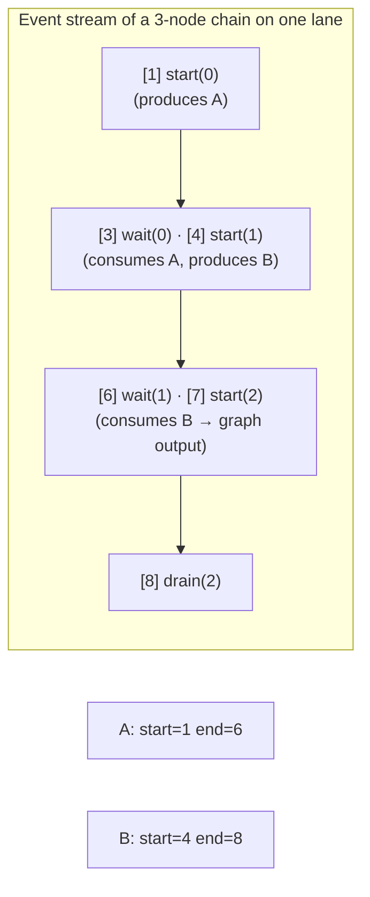
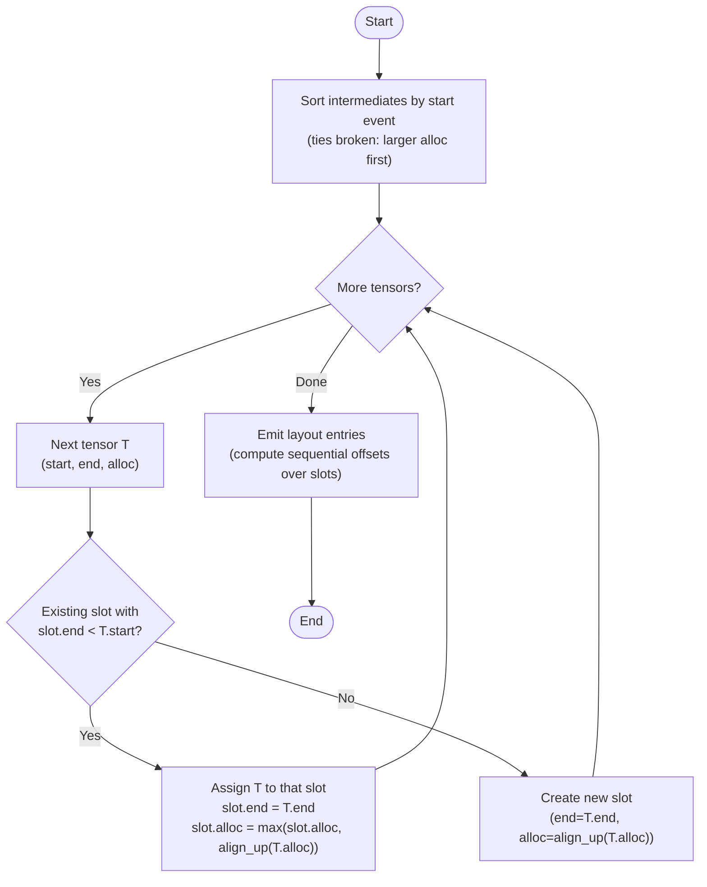

# Intermediate Buffer Reuse — Live-Interval Optimisation

The inference scheduler allocates a single contiguous DMA pool for all weights
and intermediate activation tensors.  Before this optimisation every intermediate
tensor occupied its own permanent slot in that pool.  The live-interval pass
analyses when each tensor is first written and last read, then uses **greedy
interval-graph colouring** to pack non-overlapping tensors into the same slot —
reducing the pool without any change to the generated kernel calls.

> **Status (2026-09-27).** When kernel starts became non-blocking
> (`kernel_wait()`, cross-lane overlap) the live intervals moved from
> node indices to **event-stream indices**; the colouring, slot sizing and
> alignment rules below are unchanged.  The authoritative description of
> the intervals is [SCHEDULER_DAG.md](SCHEDULER_DAG.md) §5–§6; this
> document keeps the background, the pool-layout arithmetic and the
> MobileNetV1 illustration.

---

## Table of Contents

1. [Background](#1-background)
2. [Tensor Lifetime Categories](#2-tensor-lifetime-categories)
3. [Live Interval Analysis](#3-live-interval-analysis)
4. [Greedy Interval Colouring](#4-greedy-interval-colouring)
5. [Worked Example — gemm\_chain](#5-worked-example--gemm_chain)
6. [Pool Layout Before and After](#6-pool-layout-before-and-after)
7. [Alignment Rules](#7-alignment-rules)
8. [Implementation Reference](#8-implementation-reference)
9. [Correctness Properties and Tests](#9-correctness-properties-and-tests)
10. [Real-World Example — MobileNetV1](#10-real-world-example--mobilenetv1)

---

## 1. Background

The scheduler emits a single `inference_buf_alloc(N)` call that allocates the
entire DMA pool upfront.  Every weight, DMA state and intermediate tensor is
carved out of this pool via `inference_buf_init_view()` — a zero-copy view
that sets a base pointer and element count without any additional allocation.

```
 Physical DDR
 ┌────────────┬────────────┬────────────┬─────────────────────────┐
 │  W1        │  B1        │  W2 …      │  intermediate tensors … │
 └────────────┴────────────┴────────────┴─────────────────────────┘
 ▲                                      ▲
 pool base                              weights end / intermediates start
```

Before the live-interval pass, each intermediate was placed sequentially
regardless of whether its slot was still in use.  This wastes memory proportional
to the depth of the inference graph: a linear chain of *n* layers allocates *n*
intermediate slots even though at most two need to coexist.

---

## 2. Tensor Lifetime Categories

Not all tensors are candidates for reuse:

| Category | Lifetime | Reuse eligible? |
|----------|----------|-----------------|
| **Weight** (`is_weight=True`) | Entire `inference_init()` → `inference_deinit()` | No — always live |
| **DMA state** (`axi.numeric` state without a host kind, e.g. a KV cache) | Persistent across `inference_run()` calls | No — placed after the weights |
| **Graph input / output** | Passed in by the caller per `inference_run()` call | No — not in pool |
| **Reshape alias / Slice view** | Points to (part of) the memory of its source | No — no backing storage |
| **Host-memory tensor** (`axi.numeric` `host`) | Intermediate in host memory | Yes — in a separate malloc'd arena, same colouring |
| **Intermediate** | Produced by one node, consumed by one or more later nodes | **Yes** |

Only intermediates are candidates.  Reshape aliases and Slice views are
already zero-cost (they alias an existing buffer and own no slot), so they
are excluded from the interval analysis; their consumers extend the interval
of the buffer they alias.

---

## 3. Live Interval Analysis

A tensor's **live interval** is the closed range `[start, end]` of positions
in the `inference_run()` **event stream** (the sequence of kernel starts,
`kernel_wait()` calls and host-op blocks, `_compute_event_stream`) during
which the tensor must exist in memory:

- **`start`** — the event index of the Start (or host-op `cpu` event) of the
  node whose output _is_ this tensor.
- **`end`** — the latest event index at which a consumer is known to be
  finished: the `kernel_wait()` / final drain that drains the consumer's lane
  (for a host-op consumer, its own `cpu` event).

The original implementation used node indices (`[produce_idx,
last_consume_idx]`), which was correct only while every `run_*()` helper
polled `IsDone` before returning.  With non-blocking starts a consumer may
still be reading a buffer after later nodes have started on other lanes, so
the interval has to extend to the drain of the consumer's lane.



In code (`src/codegen/_core.py : _compute_live_intervals`, full derivation in
[SCHEDULER_DAG.md](SCHEDULER_DAG.md) §5.2):

```python
for ei, ev in enumerate(events):
    if ev[0] in ('start', 'start_sync', 'cpu'):
        start_event[ev[1]] = ei
    if ev[0] in ('start_sync', 'cpu'):
        drain_event[ev[1]] = ei           # completes at its own event
    elif ev[0] in ('wait', 'drain'):
        drain_event[ev[2]] = ei           # lane of node ev[2] drained here

intervals[name] = (start_event[producer],
                   max(drain_event[c] for c in consumers))   # through aliases
```

Two tensors **conflict** (cannot share a slot) when their intervals overlap:

```
  interval A: ─────[========]──────
  interval B: ──────────[========]─
                        ↑ overlap → conflict

  interval A: ─────[======]────────
  interval B: ───────────────[====]
                             ↑ no overlap → can share
```

The event stream follows the node list.  With `--plan` the issue-order
search (`src/order_search.py`) may reorder that list, which changes the
intervals and therefore the slots; a new order is kept only if the
intermediates' pool stays within `--pool-budget-mib` (default: the pool of
the unplanned order).

---

## 4. Greedy Interval Colouring

Finding the minimum number of slots for a set of intervals is equivalent to
**interval graph colouring**, which the greedy earliest-start algorithm solves
optimally in O(*n* log *n*):



**Tie-breaking on alloc size** (largest first) ensures the biggest buffer claims
the slot so smaller reusers do not dictate an unnecessarily large slot footprint.

**Slot alloc** is the maximum of `align_up(tenant.alloc)` across all tenants —
so the slot is always large enough for whichever tensor occupies it at runtime.

---

## 5. Worked Example — gemm\_chain

`gemm_chain.onnx` is a two-layer fully-connected network (two `Gemm`s,
`X[1,32]` → 16 → `Y[1,8]`):

```
X ──► MatMul0 ──► Add0 ──► MatMul1 ──► Add1 ──► Y
```

After Gemm decomposition the scheduler sees four nodes (indices 0–3):

| Node | Op | Inputs | Output |
|------|----|--------|--------|
| 0 | MatMul | `X`, `W1` | `_gemm_mm_out_1` |
| 1 | Add | `_gemm_mm_out_1`, `B1` | `H` |
| 2 | MatMul | `H`, `W2` | `_gemm_mm_out_2` |
| 3 | Add | `_gemm_mm_out_2`, `B2` | `Y` (graph output) |

Weights `W1`, `B1`, `W2`, `B2` and `Y` are excluded from interval analysis.
`_gemm_mm_out_1`, `H`, and `_gemm_mm_out_2` are the three intermediates.

### Computed live intervals

The event stream alternates the Matmul and VectorOP lanes:
`[1] start(0)`, `[3] wait(Matmul,0)`, `[4] start(1)`, `[6] wait(VectorOP,1)`,
`[7] start(2)`, `[9] wait(Matmul,2)`, `[10] start(3)`, `[11] drain(VectorOP,3)`
(the even-numbered events in between are node comments).

```mermaid
gantt
    title Intermediate tensor live intervals (event index = time unit)
    dateFormat  X
    axisFormat  %s

    section Slot 0  (shared)
    _gemm_mm_out_1  :done,    1, 6
    _gemm_mm_out_2  :done,    7, 11

    section Slot 1
    H               :active,  4, 9
```



- `_gemm_mm_out_1` starts with node 0 (event 1) and is held until node 1's lane drains (event 6) → **[1, 6]**.
- `H` starts with node 1 (event 4), held until node 2 drains (event 9) → **[4, 9]**.
- `_gemm_mm_out_2` starts with node 2 (event 7), held until the final drain (event 11) → **[7, 11]**.

### Greedy colouring trace

Sorted by start (sizes 16, 16, 8 elements respectively):

| Step | Tensor | Interval | Free slot? | Action |
|------|--------|----------|-----------|--------|
| 1 | `_gemm_mm_out_1` | [1, 6] | none | **create slot 0** (alloc=32) |
| 2 | `H` | [4, 9] | slot 0: end=6, not < 4 | **create slot 1** (alloc=32) |
| 3 | `_gemm_mm_out_2` | [7, 11] | slot 0: end=6 < 7 ✓ | **reuse slot 0** (alloc=max(32,32)=32) |

Result: **2 slots** instead of 3.

---

## 6. Pool Layout Before and After

For `ap_fixed<16,8>` (2 bytes/element), the 64-byte alignment boundary is
32 elements.  The MatMul weights are stored in MatmulKernel's packed
tile-major layout `[ceil(M/32)][K][32]`, so `W1 [32,16]` occupies
1 × 32 × 32 = 1024 elements and `W2 [16,8]` 1 × 16 × 32 = 512.

### Before (sequential, no reuse)

```
offset     0 → 1024  : W1          (1024 elems, packed)
offset  1024 → 1040  : B1          (16 elems, padded to 32)
offset  1056 → 1568  : W2          (512 elems, packed)
offset  1568 → 1576  : B2          (8 elems, padded to 32)
offset  1600 → 1616  : _gemm_mm_out_1  (16 elems, padded to 32)
offset  1632 → 1648  : H               (16 elems, padded to 32)
offset  1664 → 1672  : _gemm_mm_out_2  (8 elems,  padded to 32)
                                                                ────────────────
Total: 1696 elements (3392 bytes)
```

### After (live-interval reuse)

```
offset     0 → 1024  : W1          (1024 elems, packed)
offset  1024 → 1040  : B1          (16 elems, padded to 32)
offset  1056 → 1568  : W2          (512 elems, packed)
offset  1568 → 1576  : B2          (8 elems, padded to 32)
                                                                ── slot 0 ──
offset  1600 → 1632  : _gemm_mm_out_1  (alloc=16)  ┐ share
                       _gemm_mm_out_2  (alloc=8)   ┘ slot 0 (slot_alloc=32)
                                                                ── slot 1 ──
offset  1632 → 1664  : H               (alloc=16)     slot 1 (slot_alloc=32)
                                                                ────────────────
Total: 1664 elements (3328 bytes) — saving 32 elements (64 bytes, 2%)
```

(`report.md` of this model: "Pool slots after coloring 2", "Pool size
(total incl. weights) 1 664 elem".)

At runtime only one of `_gemm_mm_out_1` or `_gemm_mm_out_2` is live at any
given node boundary, so the hardware never reads stale data from the shared slot.

---

## 7. Alignment Rules

Every slot is sized and placed on a **64-byte boundary** to maintain DMA
cache-line alignment between adjacent buffers.  For `ap_fixed<16,8>`:

```
align_to  = 64 bytes / 2 bytes per element = 32 elements
align_up(n) = (n + 31) & ~31
```

A slot's footprint is `max(align_up(tenant.alloc))` (the same as `align_up`
of the largest tenant): the slot must fit the **largest** tenant, and that
padded footprint is what advances the pool offset.

---

## 8. Implementation Reference

### `_compute_live_intervals(names=None) → dict`

```
src/codegen/_core.py — _CoreMixin._compute_live_intervals
```

**Returns** `{onnx_name: (start_event_idx, end_event_idx)}` for every
non-alias intermediate tensor (or for the tensors `names`, e.g. the
host-memory intermediates).  The dictionary is keyed by ONNX tensor name.

Tensors excluded:
- Weight tensors (`t.is_weight`) and states
- Graph inputs and outputs
- Reshape aliases and Slice views (keys of `_alias_source_map()`)

Edge case: if a tensor is produced but never consumed (dead code), its
end is the drain event of its producer.

### `_compute_pool_layout() → (layout, total_elems)`

```
src/codegen/_core.py — _CoreMixin._compute_pool_layout
                        (slots: _CoreMixin._compute_intermediate_layout)
```

**Returns**
- `layout` — `list[(onnx_name, offset_in_elems, alloc_in_elems)]`
  One entry per weight, per DMA state and per non-alias intermediate.
  Shared-slot tenants appear consecutively and have the **same** `offset`.
  `alloc_in_elems` is the individual tensor's allocation (passed to
  `inference_buf_init_view`), not the slot's padded footprint.
- `total_elems` — total pool size in elements.

Layout order: all weights first (graph order), then DMA states, then
intermediates grouped by slot (slot 0 tenants first, then slot 1, …).

`INFERENCE_BUF_POOL_SIZE_BYTES` in the generated header is **not** this
total: `_compute_pool_bytes()` sums every buffer without reuse (see
ARCHITECTURE.md §7).  `report.md` "Activation memory" shows the reused size.

### `_reshape_aliases`

Reshape outputs continue to be excluded from the pool layout entirely.  Their
pointer is assigned directly in `inference_init()`:

```c
flat_view = mm_out;   // zero-cost alias
```

---

## 9. Correctness Properties and Tests

### Invariants guaranteed by the implementation

| Property | Guarantee |
|----------|-----------|
| **No live-interval overlap for shared slots** | The greedy loop only assigns a slot when `slot.end < tensor.start`, so intervals never overlap within a slot |
| **Slot alloc fits all tenants** | `slot.alloc = max(align_up(tenant.alloc))` across all tenants |
| **All offsets 64-byte aligned** | `offset` advances by `align_up(slot_alloc)` after each slot |
| **Weights never shared** | Weights are emitted sequentially before interval analysis runs |
| **Aliases have no layout entry** | Reshape aliases and Slice views (`_reshape_aliases`, `_view_aliases`) are filtered out before colouring |
| **Pool never larger than sequential baseline** | Fewer or equal slots → smaller or equal total |

### Test coverage

`test/test_pool_alloc.py` — updated `_assert_no_overlap`:

Previously asserted that **no two layout entries share any pool range**.  Now
asserts that any pair with overlapping pool ranges must have non-overlapping live
intervals, allowing intentional sharing while still catching erroneous overlap.

`test/test_live_intervals.py` — 12 tests (the event-stream intervals are
additionally covered by `test_parallel_waits.py::TestEventTimelineLiveness`
and `test_nop_corner_cases.py::TestNopFixturesNoSlotAliasing`):

| Test | What it checks |
|------|---------------|
| `test_intervals_produce_le_consume` | `start ≤ end` for all intermediates |
| `test_no_weights_in_intervals` | Weight tensors absent from interval dict |
| `test_no_reshape_aliases_in_intervals` | Reshape aliases absent |
| `test_intervals_cover_all_non_alias_intermediates` | Every eligible tensor has an entry |
| `test_gemm_chain_ordered_intervals` | Start indices are strictly increasing in a linear chain |
| `test_reuse_occurs_in_gemm_chain` | At least one shared slot exists |
| `test_reuse_occurs_in_conv_relu_chain` | Reuse in conv model |
| `test_no_spurious_reuse_in_single_intermediate` | No sharing when only one intermediate |
| `test_pool_size_not_larger_than_sequential` | Optimised ≤ baseline for all models |
| `test_pool_size_strictly_smaller_for_gemm_chain` | Verified reduction for gemm\_chain |
| `test_shared_slots_have_disjoint_intervals` | Live intervals of slot-mates never overlap |
| `test_slot_alloc_fits_all_tenors` | Gap to next offset ≥ max aligned tenant alloc |

---

## 10. Real-World Example — MobileNetV1

MobileNetV1 (1.0, 224×224, 1001 classes) is a representative deployment model
for the KV260: it fits entirely within the supported operator set (Conv, Clip(0,6),
AveragePool, Reshape, Squeeze) and its strict linear-chain topology makes the
ping-pong reuse pattern immediately visible.

All measurements use `ap_fixed<16,8>` (2 bytes per element), which is the
production data type for the Cormorant accelerator.

Source model: `mobilenet_v1_1.0_224_no_softmax.onnx`
(MobileNetV1 v1 TensorFlow checkpoint, Softmax removed, weights frozen).

### Model Structure

The graph is a pure linear pipeline of 58 nodes: a first standard convolution
followed by 13 depthwise-separable blocks and a final 7×7 average pool,
1×1 classifier Conv and Reshape + Squeeze to the 1 001-class logit vector.
Figures below use the library defaults (`OnnxGraph()`; the CLI's
space-to-depth stem rewrite adds one intermediate and leaves the two slots
unchanged).

```
input [N×3×224×224]
  │
  ▼
Conv2d_0  ──Relu6──►  DWConv2d_1  ──Relu6──►  PWConv2d_1  ──Relu6──►
  ▼
DWConv2d_2  ──Relu6──►  PWConv2d_2  ──Relu6──►  …  (13 DW-sep blocks)
  ▼
AvgPool 7×7  ──►  Conv2d_logits  ──►  Reshape + Squeeze  ──►  output [N×1001]
```

| Property | Value |
|----------|-------|
| ONNX nodes (ops) | 58 |
| Intermediate tensors | 57 (56 pool buffers + 1 Reshape alias) |
| Weight tensors | 56 (one filter + one bias per conv layer) |
| Graph inputs | 1 (`input`) |
| Graph outputs | 1 (`output`) |

### Why Ping-Pong Emerges

Because the graph is a pure linear chain — every node reads exactly one
intermediate and writes exactly one intermediate — each tensor is alive for
precisely two consecutive nodes:

```
node:   0     1     2     3     4     5     6     7  …
        Conv  Relu6 DWConv Relu6 PWConv Relu6 DWConv Relu6

A  =  ──[0,1]
B  =        ──[1,2]
C  =              ──[2,3]
D  =                    ──[3,4]
E  =                          ──[4,5]
F  =                                ──[5,6]
G  =                                      ──[6,7]
H  =                                            ──[7,8]
```

Odd-start tensors (A, C, E, G, …) never overlap → they collapse into **slot 0**.
Even-start tensors (B, D, F, H, …) never overlap → they collapse into **slot 1**.
The entire 56-tensor pipeline is reduced to exactly **2 slots**.

```mermaid
gantt
    title Live intervals — first 8 nodes of MobileNetV1 (node index = time unit)
    dateFormat  X
    axisFormat  %s

    section Slot 0  (Conv outputs)
    Conv2d_0 → [1,32,112,112]   :done,    0, 2
    DWConv2d_1 → [1,32,112,112] :done,    2, 4
    PWConv2d_1 → [1,64,112,112] :done,    4, 6
    DWConv2d_2 → [1,64,56,56]   :done,    6, 8

    section Slot 1  (Relu6 outputs)
    Relu6@Conv2d_0 → [1,32,112,112]   :active,  1, 3
    Relu6@DWConv2d_1 → [1,32,112,112] :active,  3, 5
    Relu6@PWConv2d_1 → [1,64,112,112] :active,  5, 7
    Relu6@DWConv2d_2 → [1,64,56,56]   :active,  7, 9
```



### Slot Sizing

Each slot's allocation is the **maximum** of all its tenants' `align_up(alloc)`
values.  The largest feature map in MobileNetV1 is the pointwise output of
block 1: `[N, 64, 112, 112]`, which comes from doubling the channel count before
the first spatial downsampling step.

| Slot | Tenants | Largest tenant shape | Slot alloc (batch=1) | Slot alloc (batch=16) |
|------|---------|---------------------|---------------------|-----------------------|
| 0 | 28 (Conv, DWConv, AveragePool outputs) | [N, 64, 112, 112] | 802 816 elem = 1 568 KiB | 12 845 056 elem = 24.5 MiB |
| 1 | 28 (Relu6, final Conv outputs)            | [N, 64, 112, 112] | 802 816 elem = 1 568 KiB | 12 845 056 elem = 24.5 MiB |

The slot size is the same for both slots because both happen to accommodate the
same largest feature map (one slot holds the raw convolution output, the other
holds the post-activation output of the same spatial resolution).

### Memory Savings

#### Batch = 1

| Region | Naive (sequential) | Optimised (2 slots) | Saving |
|--------|-------------------|---------------------|--------|
| Weights | 8.12 MiB | 8.12 MiB | — |
| Intermediates | **19.24 MiB** | **3.06 MiB** | **16.18 MiB (84.1 %)** |
| **Total pool** | **27.36 MiB** | **11.18 MiB** | **16.18 MiB (59.1 %)** |

Pool layout (batch=1, weights at offset 0):

```
 offset 0                  4.3 M                  5.1 M        5.9 M
 │──────────────────────────│────────────────────────│──────────────│
 │        Weights           │       Slot 0            │   Slot 1    │
 │  56 weight tensors       │  28 conv outputs        │ 28 post-act │
 │  8.12 MiB                │  802 816 elem / 1.5 MiB │ 1.5 MiB     │
 └──────────────────────────┴─────────────────────────┴─────────────┘
```

#### Batch = 16

| Region | Naive (sequential) | Optimised (2 slots) | Saving |
|--------|-------------------|---------------------|--------|
| Weights | 8.12 MiB | 8.12 MiB | — |
| Intermediates | **307.8 MiB** | **49.0 MiB** | **258.8 MiB (84.1 %)** |
| **Total pool** | **316.0 MiB** | **57.1 MiB** | **258.8 MiB (81.9 %)** |

Pool layout (batch=16, weights at offset 0):

```
 offset 0                  4.3 M               17.1 M          29.9 M
 │──────────────────────────│───────────────────────│─────────────────│
 │        Weights           │       Slot 0           │    Slot 1       │
 │  56 weight tensors       │  28 conv outputs       │  28 post-act    │
 │  8.12 MiB                │  12 845 056 elem        │  12 845 056 elem │
 │                          │  24.5 MiB               │  24.5 MiB       │
 └──────────────────────────┴────────────────────────┴─────────────────┘
```

The weights are batch-independent (model parameters do not scale with batch
size), so a larger batch means a proportionally larger saving as a fraction of
the total pool.

### Why Exactly 84.1 % Regardless of Batch Size

The intermediate saving percentage is identical for batch=1 and batch=16 because
both the naive total and the optimised total scale linearly with batch size (all
activation shapes share the same batch dimension).  The ratio of
`max_feature_map / sum_of_all_feature_maps` is a property of the network
topology, not the batch size.

For MobileNetV1 the naive intermediate pool is the sum of all 56 activation
sizes (dominated by the early, spatially large feature maps):

```
naive_total = Σ align_up(alloc_i)   for i = 0..55
```

The optimised pool is just the two largest tenants (one per slot), both equal to
`align_up([N, 64, 112, 112])`:

```
opt_total = 2 × align_up(N × 64 × 112 × 112)
```

The ratio `opt_total / naive_total ≈ 0.159` is independent of N, giving the
consistent 84.1 % saving across all batch sizes.

### Context: KV260 DMA-pool sizing

The KV260 has 4 GiB of PS-side DDR, so total DRAM is never the binding
constraint.  What matters is the size of the **physically-contiguous**
region from which the framework's DMA pool is carved — kernels access
DDR by physical address through their AXI master ports and cannot
follow Linux page tables.

On Linux the generated `inference_buf.c` allocates DMA-capable memory as
XRT buffer objects (`xclAllocBO` through the zocl driver, the path PYNQ's
`allocate()` uses), which are physically contiguous and come from the
kernel's
[Contiguous Memory Allocator](https://www.kernel.org/doc/html/latest/admin-guide/mm/cma_debugfs.html)
(CMA).  The CMA pool size is set at boot via the
[`cma=N`](https://www.kernel.org/doc/html/latest/admin-guide/kernel-parameters.html)
kernel parameter (or the `CONFIG_CMA_SIZE_MBYTES` build default); lifting
the cap only requires a kernel-cmdline change and a reboot.  Bare-metal
builds `malloc()` the buffers from the standalone heap instead.

The CMA can be sized to whatever the model needs — there is no
hardware-imposed cap of "16 MiB" or "256 MiB".  What pool reuse buys
is **portability**: a smaller pool fits within typical default CMA
sizes without anyone having to change boot parameters.

| Scenario | Naive pool | Reused pool | Practical implication |
|----------|-----------:|------------:|-----------------------|
| batch=1   | 27.4 MiB  | 11.2 MiB    | reused fits within a 16 MiB region; reuse is convenient but not strictly required |
| batch=16  | 316.0 MiB | 57.1 MiB    | naive needs the CMA enlarged past common defaults; reused fits within ~256 MiB |

The numbers above are not a hardware ceiling — they describe how much
*reconfiguration* the deployer would otherwise need to do.  Reuse is
still worth it (it cuts DDR bandwidth pressure too, since there are
fewer cache lines for the kernel's AXI master to chase), but the
framing is "ergonomics" rather than "must fit or fails to allocate".
