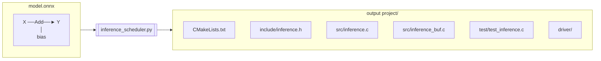
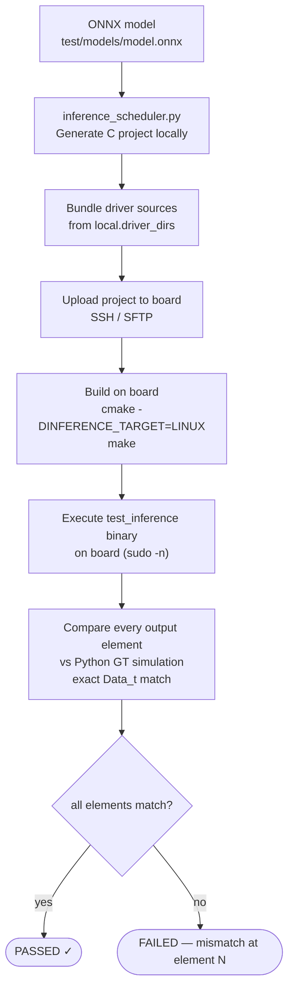

# Inference Scheduler — Technical Reference

The inference scheduler is a Python tool that reads an ONNX neural network model
and emits a complete, self-contained C project that runs inference on the
**Xilinx KV260 FPGA** using the **VectorOPKernel** IP core. The generated code
handles weight loading, DMA buffer management, cache coherency, and the full
per-layer execution loop — all without any Python or ONNX runtime on the target.

---

## Table of Contents

1. [What It Does](#1-what-it-does)
2. [Supported ONNX Operators](#2-supported-onnx-operators)
3. [Installation and Setup](#3-installation-and-setup)
4. [Command-Line Interface](#4-command-line-interface)
5. [Generated Project Layout](#5-generated-project-layout)
6. [Generated C API Reference](#6-generated-c-api-reference)
7. [Usage Examples](#7-usage-examples)
8. [Large Tensor Handling](#8-large-tensor-handling)
9. [Building the Generated Project](#9-building-the-generated-project)
10. [Running Tests](#10-running-tests)
11. [Generated Report (`report.md`)](#11-generated-report-reportmd)

**Related:** [Model Preparation — Pre-Scheduler ONNX Normalisation](MODEL_PREPARATION.md) ·
[Buffer Reuse — Live-Interval Optimisation](BUFFER_REUSE.md) ·
[Scheduler DAG — Algorithm Reference](SCHEDULER_DAG.md)

---

## 1. What It Does

Consider a simple ONNX graph: `X + bias → Y` where `bias` is a constant weight
tensor. The scheduler turns this into:



The generated `inference.c` contains:

```c
// Constant weight embedded as a C ROM array
static const uint16_t _rom_bias[256] = { 0x0080, 0x0080, ... };
static inference_buf_t *bias = NULL;

int inference_init(const char *instance_name) {
    // Allocate DMA-capable buffer and copy ROM data into it
    bias = inference_buf_alloc(256u);
    memcpy(inference_buf_ptr(bias), _rom_bias, sizeof(_rom_bias));
    inference_buf_sync_to_device(bias);  // flush to DDR once
    // ... open kernel driver ...
}

void inference_run(inference_buf_t *X, inference_buf_t *Y) {
    inference_buf_sync_to_device(X);     // flush user input
    run_op(X, bias, Y, 256u, VECTOROP_ADD);  // invoke FPGA kernel
    inference_buf_sync_from_device(Y);   // invalidate output cache
}
```

The FPGA kernel reads `X` and `bias` from DDR, computes element-wise addition,
and writes the result to `Y` — all via AXI DMA master ports. The CPU only needs
to program the AXI-Lite control registers and poll for completion.

---

## 2. Supported ONNX Operators

The scheduler maps ONNX operators to one of four hardware kernels, or handles
them as zero-cost CPU-side transformations:

### VectorOPKernel (element-wise, 1-D)

| ONNX op | Op code | Arity | Expression |
|---------|---------|-------|------------|
| `Add` | `VECTOROP_ADD` (0) | binary | `c[i] = saturate(a[i] + b[i])` |
| `Sub` | `VECTOROP_SUB` (1) | binary | `c[i] = saturate(a[i] - b[i])` |
| `Mul` | `VECTOROP_MUL` (2) | binary | `c[i] = saturate(a[i] * b[i])` |
| `Div` | `VECTOROP_DIV` (3) | binary | `c[i] = saturate(a[i] / b[i])` |
| `Relu` | `VECTOROP_RELU` (4) | unary | `c[i] = max(a[i], 0)` |
| `Clip(min=0, max=6)` | `VECTOROP_RELU6` (5) | unary | `c[i] = min(max(a[i], 0), 6)` |

**Broadcasting**: Binary ops support partial ONNX multidirectional broadcasting.
One input may be smaller than the output — see
[Architecture: Broadcasting Algorithm](ARCHITECTURE.md#6-broadcasting-algorithm).

### MatmulKernel (matrix multiply, tiled)

| ONNX op | Notes |
|---------|-------|
| `MatMul` | `C[n,m] = A[n,k] @ B[k,m]`; supports batched matmul and broadcast weight |

### ConvKernel (2-D convolution, NCHW)

| ONNX op | Notes |
|---------|-------|
| `Conv` | NCHW layout; `groups=1`; configurable kernel, stride, pad, dilation |

Bias (`Conv` with three inputs) is supported: the bias add is fused into the
`run_conv()` dispatch call alongside the convolution.

### PoolingKernel (2-D pooling, NCHW)

| ONNX op | Pool type | Notes |
|---------|-----------|-------|
| `MaxPool` | `POOL_MAX` (0) | Sliding-window maximum |
| `AveragePool` | `POOL_AVG` (1) | Sliding-window average; `count_include_pad` supported |
| `LpPool` (p=1 or 2) | `POOL_LP` (2) | Lp-norm pooling |
| `GlobalMaxPool` | `POOL_MAX` (0) | Equivalent to `MaxPool` with `kernel = input spatial dims` |
| `GlobalAveragePool` | `POOL_AVG` (1) | Equivalent to `AveragePool` with `kernel = input spatial dims` |
| `GlobalLpPool` (p=1 or 2) | `POOL_LP` (2) | Equivalent to `LpPool` with `kernel = input spatial dims` |

All pool variants support configurable stride, padding, and dilation.
`ceil_mode=1` is not supported.

### Zero-Cost Transformations (CPU-side only)

| ONNX op | Handling | Notes |
|---------|----------|-------|
| `Reshape` | Buffer alias | Output pointer is assigned `= source pointer`; no hardware call, no data copy |
| `Gemm` | Decomposed at load time | `Gemm(A, B, C)` → `MatMul(A, B) → tmp` + `Add(tmp, C) → Y`; `Gemm(A, B)` → `MatMul(A, B) → Y`. Requires `alpha=1, beta=1, transA=0, transB=0`. |

Any other ONNX op causes the scheduler to exit with a `SchedulerError`.
See [MODEL_PREPARATION.md](MODEL_PREPARATION.md) for the standard pipeline
(`simplify_onnx.py` + BN fusion + tail trimming) that converts stock ONNX
Model Zoo / torchvision exports into a form the scheduler accepts.

**Data types**: The ONNX model's weights and activations may be any numeric type
(float32, int8, etc.); the scheduler quantizes all values to the target element
type (default: `ap_fixed<16,8>`) during code generation and simulation.

---

## 3. Installation and Setup

```bash
cd inference-scheduler

# Create a virtual environment and install dependencies
python3 -m venv .venv
.venv/bin/pip install -r requirements.txt

# Generate all test ONNX models (needed before running the test suite)
.venv/bin/python test/gen_test_models.py              # VectorOPKernel models
.venv/bin/python test/gen_mixed_kernel_models.py      # MatMul + VectorOP
.venv/bin/python test/gen_matmul_models.py            # MatMul-only models
.venv/bin/python test/gen_conv_models.py              # Conv models
.venv/bin/python test/gen_pool_models.py              # Pooling models
.venv/bin/python test/gen_reshape_gemm_models.py      # Reshape + Gemm models
.venv/bin/python test/gen_mixed_all_kernels_models.py # All-kernel combination models
.venv/bin/python test/gen_parallel_models.py          # Parallel + NOP corner cases
.venv/bin/python test/gen_bert_models.py              # Tiny BERT-like models (host ops)
```

Dependencies (from `requirements.txt`): `onnx`, `numpy`, `paramiko`
(remote-test runners), plus `onnxsim`, `onnxoptimizer`, `onnxruntime`
(used by [`simplify_onnx.py`](../simplify_onnx.py) — see
[MODEL_PREPARATION.md](MODEL_PREPARATION.md)).

---

## 4. Command-Line Interface

```
python inference_scheduler.py <model.onnx> [options]
```

### Options

| Flag | Default | Description |
|------|---------|-------------|
| `--out-dir DIR` | `./<stem>_inference/` | Output project directory. Created if absent; existing files are overwritten. |
| `--driver-dir DIR` | *(none)* | Copy XVectoropkernel driver sources from this path into `driver/`. If omitted, `driver/` is left empty with a README. |
| `--embed-large-weights` | off | Inline all weight tensors as C arrays, even those exceeding the 4096-element threshold that would normally be written to external `.dat` files. |
| `--embed-large-expected` | off | Inline all GT expected arrays in `test_inference.c` instead of writing them to `expected/*.dat` files. |
| `--no-report` | off | Skip writing `report.md`. Default is to always emit a human-readable model summary alongside the C project — see [§11](#11-generated-report-reportmd). |
| `--no-fuse-patterns` | off | Do not fuse TensorFlow-style LayerNorm / GELU (tanh, erf) subgraphs into host-CPU ops and do not reshape constant VectorOP operands for the kernel's broadcast (`src/fusion.py`, [`doc/INFERENCE_SCHEDULER.md` §Pattern fusion](../../doc/INFERENCE_SCHEDULER.md#pattern-fusion)). Fusion only changes graphs that contain these patterns. |

### Examples

```bash
# Minimal: generate a project in ./single_add_inference/
python inference_scheduler.py test/models/single_add.onnx

# Specify output directory
python inference_scheduler.py model.onnx --out-dir /tmp/my_project

# Copy driver sources from Vitis HLS synthesis output
python inference_scheduler.py model.onnx --out-dir /tmp/my_project \
    --driver-dir ../build/kv260/vadd_kv260/solution1/impl/ip/drivers/VectorOPKernel_v1_0/src

# Embed everything inline (no external files, larger C sources)
python inference_scheduler.py model.onnx --embed-large-weights --embed-large-expected
```

### Console Output

The scheduler prints a summary to stderr:

```
Model      : test/models/single_add.onnx
Inputs     : ['X[1, 256]']
Outputs    : ['Y[1, 256]']
Nodes      : 1
  [  0] Add          [1, 256] x [1, 256] -> [1, 256]
Output dir : /tmp/single_add_inference
Driver     : driver/ is empty — see driver/README.md

Generated project:
  /tmp/single_add_inference/CMakeLists.txt
  /tmp/single_add_inference/include/inference.h
  /tmp/single_add_inference/src/inference.c
  /tmp/single_add_inference/src/inference_buf.c
  /tmp/single_add_inference/test/test_inference.c
  /tmp/single_add_inference/scripts/check_inference_setup.sh
  /tmp/single_add_inference/driver/
  /tmp/single_add_inference/report.md
```

---

## 5. Generated Project Layout

```
<out_dir>/
│
├── CMakeLists.txt
│     Cross-platform build system. Selects bare-metal or Linux target via
│     -DINFERENCE_TARGET=BARE_METAL|LINUX at cmake configure time.
│     Produces static library libinference.a and test executable test_inference.
│
├── include/
│   └── inference.h
│         Public API: Data_t typedef, array-size macros, DMA buffer API,
│         inference_init() / inference_run() / inference_deinit() declarations.
│
├── src/
│   ├── inference.c
│   │     Core implementation. Contains weight ROM arrays, DMA buffer pointers,
│   │     run_op() dispatch helper, and the generated inference_init() and
│   │     inference_run() function bodies.
│   │
│   └── inference_buf.c
│         Platform-specific DMA buffer allocator and cache sync.
│         Two implementations selected by #ifdef __linux__:
│           Linux:      XRT (xclAllocBO / xclSyncBO / xclGetBOProperties)
│           Bare-metal: malloc() + Xil_DCacheFlushRange / Xil_DCacheInvalidateRange
│
├── test/
│   └── test_inference.c
│         On-device smoke test. Fills inputs with a deterministic ramp pattern,
│         runs inference_run(), prints the first 8 output elements, and compares
│         every output element against gold-standard values pre-computed by the
│         Python fixed-point simulator.
│
├── scripts/
│   └── check_inference_setup.sh
│         Preflight checker for the Linux/XRT path. Verifies that xrt.h,
│         libxrt_core.so, and /dev/dri/renderD* are accessible before a build.
│
├── driver/
│   │   Hardware kernel driver sources for every active kernel, copied
│   │   verbatim (flat layout, no per-kernel sub-directories) from the
│   │   --driver-dir argument.  When --driver-dir is omitted the
│   │   directory contains a stub README listing the files that would
│   │   be needed for the kernels this model uses.
│   ├── xvectoropkernel.h / .c / _hw.h / _sinit.c / _linux.c
│   ├── xmatmulkernel.h   / .c / _hw.h / _sinit.c / _linux.c
│   ├── xconvkernel.h     / .c / _hw.h / _sinit.c / _linux.c
│   └── xpoolingkernel.h  / .c / _hw.h / _sinit.c / _linux.c
│
├── weights/                      (only when model has large weight tensors)
│   └── <name>.dat                Raw little-endian binary weight data; loaded
│                                 at runtime by fread() in inference_init().
│
└── expected/                     (only when model has large output tensors)
    └── <name>.dat                Raw little-endian binary GT expected data;
                                  loaded at runtime by fread() in test_inference.c.
```

---

## 6. Generated C API Reference

### Data Type and Size Macros (inference.h)

```c
/* Element type — ap_fixed<16,8>: 16-bit two's-complement, value = (int16_t)bits / 256.0 */
typedef uint16_t Data_t;
#define INFERENCE_BYTES_PER_ELEM  2u

/* AXI burst alignment — all broadcast chunk strides are multiples of this */
#define INFERENCE_ALIGN_BYTES  16u
#define INFERENCE_ALIGN_ELEMS  (INFERENCE_ALIGN_BYTES / INFERENCE_BYTES_PER_ELEM)
#define INFERENCE_ALIGN_UP(n)  (((n) + INFERENCE_ALIGN_ELEMS - 1u) & ~(INFERENCE_ALIGN_ELEMS - 1u))

/* DMA buffer sizes for model inputs and outputs */
#define INFERENCE_X_SIZE  256u   /* shape=[1, 256] */
#define INFERENCE_Y_SIZE  256u   /* shape=[1, 256] */

/* For broadcast models, chunk macros are also emitted: */
#define INFERENCE_Y_CHUNK         64u    /* data elements per kernel call */
#define INFERENCE_Y_CHUNK_STRIDE  INFERENCE_ALIGN_UP(INFERENCE_Y_CHUNK)

/* Minimum contiguous DMA pool required (Linux only) */
#define INFERENCE_BUF_POOL_SIZE_BYTES  8192u
```

> **Pool sizing note:** intermediate tensors with non-overlapping execution
> lifetimes share the same pool slot, so `INFERENCE_BUF_POOL_SIZE_BYTES` can be
> significantly smaller than the sum of all individual tensor sizes.  See
> **[doc/BUFFER_REUSE.md](BUFFER_REUSE.md)** for the full analysis.

### DMA Buffer API (inference.h)

The `inference_buf_t` type abstracts DMA-capable memory. The same type works on
both Linux (XRT) and bare-metal (malloc with identity mapping).

```c
typedef struct inference_buf inference_buf_t;

/* Allocate a buffer for n_elem Data_t elements */
inference_buf_t *inference_buf_alloc(unsigned n_elem);

/* Release a buffer */
void inference_buf_free(inference_buf_t *buf);

/* CPU-accessible virtual pointer (for reading/writing from the CPU) */
Data_t  *inference_buf_ptr(inference_buf_t *buf);

/* Physical DDR address — programmed into AXI-Lite DMA registers */
uint64_t inference_buf_phys(const inference_buf_t *buf);

/* Number of Data_t elements allocated */
unsigned inference_buf_count(const inference_buf_t *buf);

/* Cache sync — usually called automatically by inference_run() */
void inference_buf_sync_to_device(inference_buf_t *buf);   /* CPU → DDR */
void inference_buf_sync_from_device(inference_buf_t *buf); /* DDR → CPU */

/* Convenience helpers for float input/output */
void inference_buf_fill_float(inference_buf_t *buf, const float *src, unsigned n);
void inference_buf_read_float(const inference_buf_t *buf, float *dst, unsigned n);
```

### Inference API (inference.h)

```c
/*
 * inference_init() — open the hardware kernel(s), allocate DMA buffers for all
 * internal weights and intermediate tensors, load weight data, and flush to DDR.
 *
 * One const char * parameter per hardware kernel active in the model, in
 * registry order: VectorOPKernel, MatmulKernel, ConvKernel, PoolKernel.
 * Only kernels actually used by the model appear in the signature.
 *
 * Each instance name:
 *   Linux:      UIO sysfs name, e.g. "VectorOPKernel_0"
 *   Bare-metal: device name from xparameters.h, e.g. "VectorOPKernel"
 *
 * Returns 0 on success, non-zero on failure.
 * On failure, inference_deinit() is called internally — do not call it again.
 */

/* VectorOP only (element-wise models): */
int inference_init(const char *vectoropkernel_instance);

/* VectorOP + MatmulKernel (FC / dense layers with activations): */
int inference_init(const char *vectoropkernel_instance,
                   const char *matmulkernel_instance);

/* Full CNN — all four kernels (actual signature is model-specific): */
int inference_init(const char *vectoropkernel_instance,
                   const char *matmulkernel_instance,
                   const char *convkernel_instance,
                   const char *poolkernel_instance);

/*
 * inference_run() — execute the full inference graph.
 *
 * Signature varies by model: all graph inputs first, then all graph outputs.
 * Examples:
 *   Single input, single output: inference_run(X, Y)
 *   Two inputs, one output:      inference_run(X1, X2, Y)
 *   One input, two outputs:      inference_run(X, Yadd, Yrelu)
 *   Two inputs, two outputs:     inference_run(X1, X2, Yadd, Yrelu)
 *
 * The caller allocates input and output buffers with inference_buf_alloc() and
 * fills inputs via inference_buf_ptr() before calling this function.
 * After the call, results are available at inference_buf_ptr(output).
 *
 * Flushes all graph inputs to DDR, executes the full kernel sequence, then
 * invalidates all graph outputs.
 */
void inference_run(inference_buf_t *<inputs...>, inference_buf_t *<outputs...>);

/*
 * inference_deinit() — release all DMA buffers and close the pool.
 * Call once when done. Safe to call even if inference_init() partially failed.
 */
void inference_deinit(void);
```

---

## 7. Usage Examples

### Minimal Usage (C application)

```c
#include "inference.h"
#include <stdio.h>

int main(void)
{
    inference_buf_t *X, *Y;
    Data_t          *x_ptr, *y_ptr;
    unsigned         i;

    /* 1. Initialise: open UIO device, allocate weight buffers, load weights */
    if (inference_init("/dev/uio0") != 0) {
        fprintf(stderr, "init failed\n");
        return 1;
    }

    /* 2. Allocate I/O buffers from the DMA pool */
    X = inference_buf_alloc(INFERENCE_X_SIZE);
    Y = inference_buf_alloc(INFERENCE_Y_SIZE);

    /* 3. Fill input (e.g., 1.0 for all elements) */
    x_ptr = inference_buf_ptr(X);
    for (i = 0; i < INFERENCE_X_SIZE; i++)
        x_ptr[i] = (Data_t)0x0100;   /* ap_fixed<16,8>: 1.0 = 0x0100 */

    /* 4. Run inference — handles all DMA sync internally */
    inference_run(X, Y);

    /* 5. Read results via the CPU virtual pointer */
    y_ptr = inference_buf_ptr(Y);
    printf("Y[0] = %.4f\n",
           (double)(int16_t)y_ptr[0] / 256.0);  /* ap_fixed<16,8> decode */

    /* 6. Cleanup */
    inference_buf_free(X);
    inference_buf_free(Y);
    inference_deinit();
    return 0;
}
```

### Using the Float Helpers

When working from application code that uses `float` rather than raw `Data_t`
bit patterns, use the built-in conversion helpers:

```c
float input_data[256];
float output_data[256];

/* fill input_data with whatever values you have... */
for (i = 0; i < 256; i++)
    input_data[i] = (float)i * 0.01f;

/* Convert float → Data_t and write into the DMA buffer */
inference_buf_fill_float(X, input_data, 256);

/* Run */
inference_run(X, Y);

/* Convert Data_t → float and read back */
inference_buf_read_float(Y, output_data, 256);
printf("Y[0] = %.4f\n", output_data[0]);
```

> **Note**: `inference_buf_fill_float` uses C's built-in `(Data_t)src[i]`
> conversion. For `ap_fixed<16,8>`, this truncates to the representable range
> [-128, 127.99609375] and rounds toward zero, which matches the hardware
> saturation behavior.

### Repeated Inference (streaming use case)

Weights are loaded once in `inference_init()`. Calling `inference_run()` in a
loop just updates the input buffer and fetches a new output — no re-initialization:

```c
inference_init("/dev/uio0");
X = inference_buf_alloc(INFERENCE_X_SIZE);
Y = inference_buf_alloc(INFERENCE_Y_SIZE);

for (frame = 0; frame < n_frames; frame++) {
    load_frame(frame, inference_buf_ptr(X));
    inference_run(X, Y);
    process_result(inference_buf_ptr(Y));
}

inference_buf_free(X);
inference_buf_free(Y);
inference_deinit();
```

---

## 8. Large Tensor Handling

For models with large weight tensors or large output tensors, embedding them
directly as C array literals would produce megabyte-sized source files that
are slow to compile and hard to read. The scheduler splits them into external
binary files instead.

### Large Weights (> 4096 elements)

Weight tensors exceeding 4096 elements are written to `weights/<name>.dat`
instead of being embedded in `inference.c`:

```
# Small weight — embedded inline:
static const uint16_t _rom_bias[64] = { 0x0100, 0x0100, ... };

# Large weight — external file:
/* External weight 'kernel'  shape=[64,64,3,3]  numel=36864
 * Loaded at inference_init() from weights/kernel.dat */
static inference_buf_t *kernel = NULL;
```

At runtime, `inference_init()` calls `_load_weight("kernel", 36864)`, which
opens `weights/kernel.dat` and `fread()`s the binary data directly into the
DMA buffer.

The `.dat` file format is raw little-endian `uint16_t` values (for `ap_fixed<16,8>`),
in the same encoding as the inline ROM arrays. No header or metadata.

**Threshold**: `LARGE_WEIGHT_THRESHOLD = 4096` (in `src/tensor.py`)

**Override**: `--embed-large-weights` forces all weights inline regardless of size.

### Large Expected GT Arrays (> 4096 elements)

The same approach is applied to the expected output arrays in `test_inference.c`:

```c
/* Small expected — embedded inline: */
static const uint16_t expected_Y[256] = { 0x0200, 0x0200, ... };

/* Large expected — loaded from file: */
static uint16_t *expected_Y = NULL;  /* 8192 elem — loaded from expected/Y.dat */
```

The test program loads large expected arrays with `_load_expected()` before the
comparison loop, and frees them in the cleanup section.

**Threshold**: `LARGE_EXPECTED_THRESHOLD = 4096` (in `src/codegen/_simulate.py`)

**Override**: `--embed-large-expected` forces all GT arrays inline.

### Runtime Path Configuration

Both `_load_weight()` and `_load_expected()` accept a compile-time path override:

```cmake
# CMake: point to wherever the .dat files live on target
cmake -DINFERENCE_WEIGHTS_DIR=/mnt/sd/my_model \
      -DINFERENCE_EXPECTED_DIR=/mnt/sd/my_model
```

Without the override, both helpers look for files relative to the current
working directory (i.e., `./weights/<name>.dat` and `./expected/<name>.dat`).

---

## 9. Building the Generated Project

### Bare-Metal (Xilinx Vitis / SDK)

```bash
cd <out_dir>
mkdir build && cd build
cmake .. \
    -DINFERENCE_TARGET=BARE_METAL \
    -DCMAKE_TOOLCHAIN_FILE=/path/to/arm-xilinx-eabi-toolchain.cmake
make
```

CMake selects `driver/xvectoropkernel_sinit.c` and links against the Xilinx
standalone BSP (xil_cache, xparameters).

### Linux (KV260 Ubuntu / PetaLinux)

```bash
# On target or with sysroot:
cd <out_dir>
sh scripts/check_inference_setup.sh   # verify XRT prerequisites
mkdir build && cd build
cmake .. -DINFERENCE_TARGET=LINUX
make
```

CMake selects `driver/xvectoropkernel_linux.c` and links against `libxrt_core`.

### Driver Sources

If `--driver-dir` was not supplied, copy the driver sources before building:

```bash
cp /path/to/VectorOPKernel_v1_0/src/*.{c,h} <out_dir>/driver/
```

The driver is generated by Vitis HLS synthesis. See `driver/README.md`.

---

## 10. Running Tests

### Python Unit Tests (development)

```bash
cd inference-scheduler

# Run the full test suite
.venv/bin/python -m pytest test/ -v

# Run a specific test module
.venv/bin/python -m pytest test/test_source.py -v

# Run tests matching a keyword
.venv/bin/python -m pytest test/ -k "broadcast" -v
```

Most test classes require the test models. Run all model generators before running
the test suite (see [Installation and Setup](#3-installation-and-setup)).

### On-Device Test (C)

After building the generated project:

```bash
# On Linux target (instance name is the UIO sysfs name, not a /dev path):
./build/test_inference fabric

# Expected output:
inference_init OK ("fabric")
Output 'Y' (256 elem, first 8):
  [0] (0.5000)
  [1] (0.5078)
  ...
test_inference PASSED
```

The test passes when every output element matches the gold-standard value
computed by the Python fixed-point simulator (exact integer comparison on
`Data_t` values).

To override the hardware instance at runtime:

```bash
./build/test_inference my_instance_name
```

Or at compile time:

```bash
cmake .. -DINFERENCE_TEST_INSTANCE=my_instance_name
```

### Automated Remote Testing



`run_remote_tests.py` automates the full generate → upload → build → run cycle
for a list of models on a physical KV260. It handles SSH connectivity, driver
bundling, CMake build, and result comparison, reporting a PASSED/FAILED summary
for each model.

See **[doc/REMOTE_TESTING.md](REMOTE_TESTING.md)** for full setup and usage.

---

## 11. Generated Report (`report.md`)

Every generated project includes a `report.md` file — a self-contained,
human-readable summary of what the scheduler did with the input model.
Disable with `--no-report`.

The report opens with a metadata table (model basename, full path,
SHA-256, timestamp, output directory, active dtype, hardware lanes
used) followed by these sections:

| Section | Contents |
|---------|----------|
| Inputs and outputs | Per-tensor shape, element count, byte count |
| Parameters | Total weight tensors / parameters / bytes; inline-vs-external `.dat` split |
| Weight quantization error *(fixed-point only)* | Per-weight `Max \|abs\|` / `NRMSE` / `SQNR (dB)`, with a "Used by" column linking each tensor to the consuming layer and role |
| Activation memory | Pool slot count after coloring, total pool size, naive baseline, saving in elements/bytes/percent |
| Hardware lanes | Per-lane usage check (`✓` / `–`) and node count |
| Applied transformations | Gemm decomposition count, ReshapeNode folding count, buffer-pool reuse summary, cross-lane parallelism (overlapping starts / total starts) |
| Layers | One row per `ScheduledNode` with op-specific notes (Conv: `k=⋯·s=⋯·p=⋯`, Pool: type+window, Matmul: shape sizes) plus, for fixed-point dtypes, per-layer truncation `Max \|abs\|` / `NRMSE` / `SQNR (dB)` |
| Generated artifacts | Every file written for this run |

### Quantization metrics

For fixed-point dtypes (`ap_fixed<W,I>`), the report measures encoding
quality with three magnitude-weighted residual statistics on each
constant tensor and each kernel-bearing layer's output:

- **`Max |abs|`** — absolute upper bound on the residual `r` between the
  full-precision (float64) value and the value the kernel actually
  reads/writes. Round-to-nearest weights are bounded by ½ LSB; floor-
  truncation activations by 1 LSB.
- **`NRMSE`** — normalised RMS error, `‖r‖₂ / ‖signal‖₂`, expressed as
  a percentage. Magnitude-weighted, so a single near-zero element
  rounding across zero cannot inflate it the way per-element max-
  relative error does. This is the metric to track for end-to-end
  accuracy impact.
- **`SQNR (dB)`** — signal-to-quantisation-noise ratio,
  `20·log₁₀(‖signal‖₂ / ‖r‖₂)`. Standard fixed-point quality metric;
  higher is better. Round-to-nearest 16-bit on roughly-Gaussian
  weights typically yields ≥ 60 dB; values below ~30 dB indicate
  quantisation is starting to hurt accuracy.

The Layers table includes the same three columns for activations.
Layers whose output stays on the fixed-point grid (`Relu`, `MaxPool`,
integer `Add`/`Sub`) report `0` residual and `∞` SQNR.

For Float32 dtypes the quantisation columns and the weight-quant
sub-section are omitted entirely.

### Applied-transformations summary

The transformations section enumerates everything the scheduler did to
reshape the input graph before code generation:

- **Gemm decomposition** count — Gemm nodes rewritten to `MatMul + Add`
  by `OnnxGraph._preprocess_model`.
- **Reshape folding** count — `ReshapeNode` outputs aliased to their
  source buffer (no kernel call, no allocation).
- **Buffer-pool reuse** — number of intermediates packed into how many
  pool slots, with shared-slot pair count. See
  [`BUFFER_REUSE.md`](BUFFER_REUSE.md) for the algorithm.
- **Cross-lane parallelism** — `<X> of <N> kernel starts dispatched
  while another lane was still in flight (overlap windows)`. Pulls
  directly from the event stream computed by
  `CodeGenerator._compute_event_stream`. See
  [`SCHEDULER_DAG.md`](SCHEDULER_DAG.md) for what counts as overlap.

### Sample

A truncated fragment from the report for `parallel_two_chains.onnx`:

```markdown
| Field             | Value                                |
|-------------------|--------------------------------------|
| Model             | `parallel_two_chains.onnx`           |
| Data type         | `ap_fixed<16,8>` (2 byte/elem)       |
| Hardware lanes    | VectorOPKernel, ConvKernel, PoolKernel |

…

### Weight quantization error (vs original float32)

| Tensor | Shape     | Elements | Used by           | Max |abs|  | NRMSE    | SQNR (dB) |
|--------|-----------|----------|-------------------|------------|----------|-----------|
| **All weights (worst)**       | -                 |`1.905e-03` | `0.417%` | `47.6 dB` |
| `Wa`   | [4,4,1,1] | 16       | [0] Conv (weight) |`1.905e-03` | `0.417%` | `47.6 dB` |
| `Wb`   | [4,4,1,1] | 16       | [3] Conv (weight) |`1.786e-03` | `0.408%` | `47.8 dB` |

…

| # | Op       | Lane             | Inputs     | Output | Notes | Out max |abs|| NRMSE    | SQNR (dB) |
|---|----------|------------------|------------|--------|-------|--------------|----------|-----------|
| 0 | `Conv`   | `ConvKernel`     | …          | `ca0`  | …     | `3.891e-03`  | `0.738%` | `42.6 dB` |
| 1 | `Relu`   | `VectorOPKernel` | …          | `ca1`  | …     | `0.000e+00`  | `0.000%` | `∞`       |
| 2 | `MaxPool`| `PoolKernel`     | …          | `ca2`  | …     | `0.000e+00`  | `0.000%` | `∞`       |
```

The report is regenerated on every scheduler run — there is no need
to delete `report.md` before re-running. It can also be inspected
without checking out the project: it's just markdown, viewable in any
editor or git web UI.
