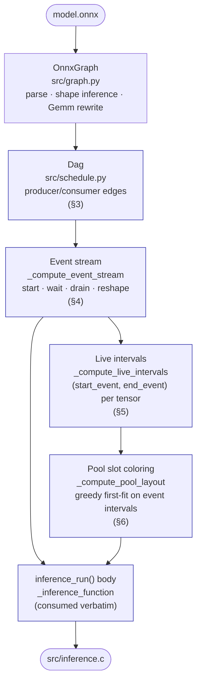
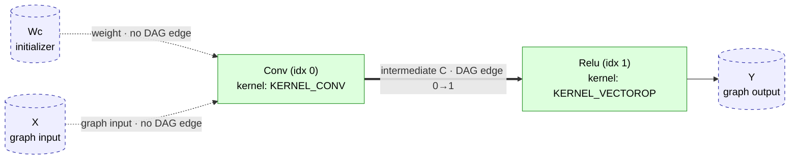
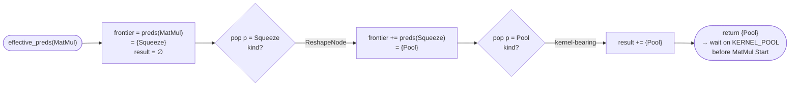
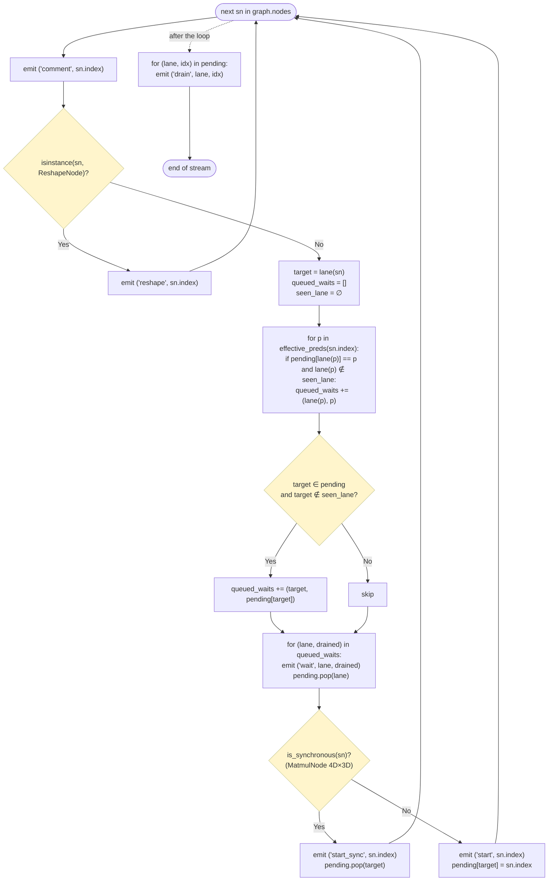
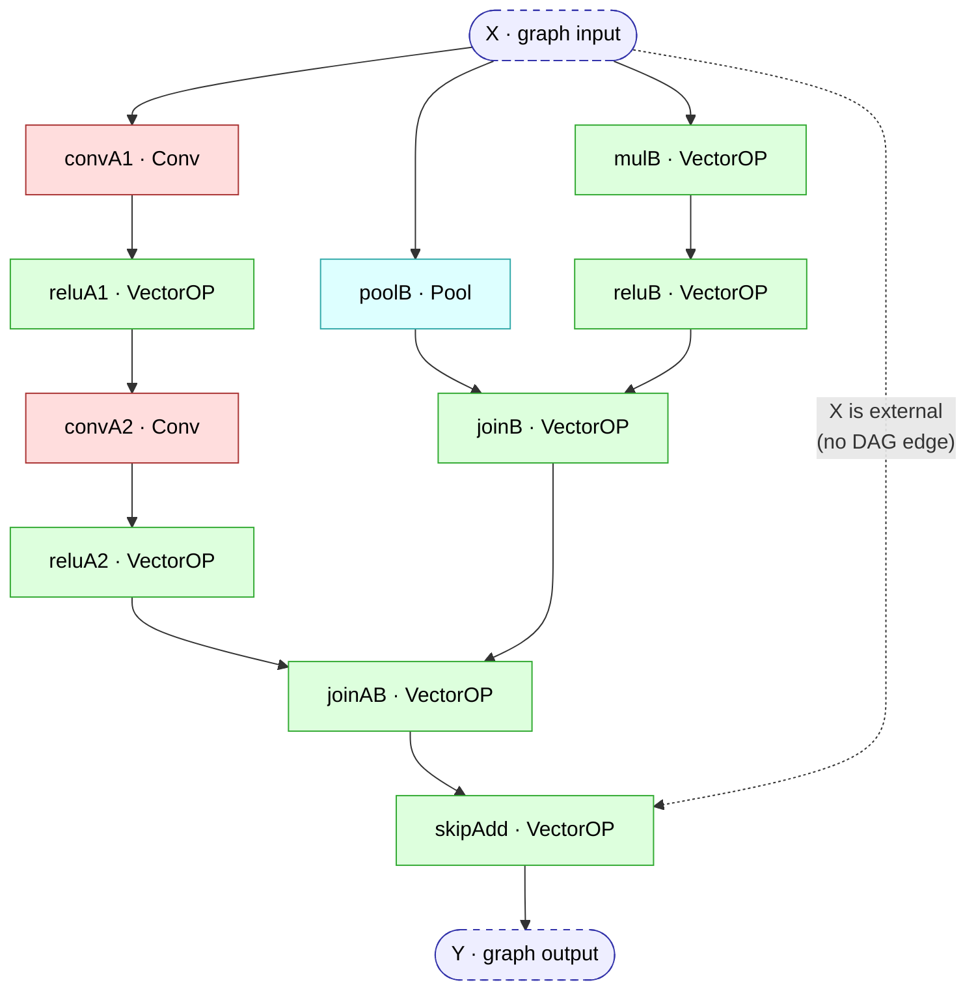

# Scheduler DAG — Algorithm Reference

This document describes the data-flow DAG used by `inference-scheduler` and
the algorithms that derive the parallel-execution schedule from it. It
is the single technical reference for anyone modifying:

- `src/schedule.py`            (the DAG itself)
- `src/codegen/_core.py`       (event stream + live intervals)
- `src/codegen/_source.py`     (body emission consuming the events)

For a higher-level orientation see the sibling
[`INFERENCE_SCHEDULER.md`](INFERENCE_SCHEDULER.md) and
[`ARCHITECTURE.md`](ARCHITECTURE.md); for the profiler that piggybacks
on the same brackets see [`PROFILER.md`](../../doc/PROFILER.md).

## Pipeline overview

The DAG sits between the parsed graph and the code emitter.  Once
built, it drives a single event-stream walk that both the live-interval
analyser and the body emitter consume verbatim — so they cannot
disagree about what is in flight on each lane at any point.



Sections §1–§6 walk through each box; §7 puts them together on real
fixtures; §8–§10 cover edge cases, invariants, and future work.

---

## 1. Why a DAG?

The current scheduler models **one lane per kernel type** —
VectorOPKernel, MatmulKernel, ConvKernel, PoolKernel (the
`KERNEL_REGISTRY` key in `src/kernels.py`; the C++ kernel class is
PoolingKernel) — and assumes exactly one driver instance per lane. This is a framework limitation, not a hardware
constraint: a bitstream could in principle provide several Conv IPs at
distinct AXI-Lite base addresses, and reflecting that would require a
per-instance `pending` map and a node→instance assignment policy (see
§10). The KV260 reference bitstream happens to ship one of each, which
matches the framework today.

Under this model, two ops on the **same** lane must serialize, but two
ops on **different** lanes (e.g. Conv ‖ Pool) can run concurrently.

To overlap correctly we need answers to:

1. **Data dependencies.** When can node `v` start? *When every tensor
   it reads has been fully written.*
2. **Resource dependencies.** When can node `v` reuse a lane? *When the
   previous op on that lane has been waited on.*
3. **Memory aliasing.** When can buffer slot `s` be reassigned to a new
   tensor? *When every kernel currently reading or writing `s` has
   drained.*

A producer/consumer DAG is the natural representation of (1). (2) and
(3) fall out by walking that DAG with a small state machine — the
event stream described in §3.

---

## 2. Domain model

### 2.1 Nodes

Every ONNX op becomes one of five `ScheduledNode` subclasses, each with
a `kernel_name: ClassVar[str]`:

| Subclass        | `kernel_name`        | Lane                |
|-----------------|----------------------|---------------------|
| `ScheduledNode` | `"VectorOPKernel"`   | `KERNEL_VECTOROP`   |
| `MatmulNode`    | `"MatmulKernel"`     | `KERNEL_MATMUL`     |
| `ConvNode`      | `"ConvKernel"`       | `KERNEL_CONV`       |
| `PoolNode`      | `"PoolKernel"`       | `KERNEL_POOL`       |
| `ReshapeNode`   | `""` (none)          | —                   |

`ReshapeNode` covers `Reshape` / `Squeeze` / `Unsqueeze` / `Dropout` /
`Flatten` (collectively `RESHAPE_OP_TYPES`). It emits no kernel call;
its output buffer is a pointer alias of its input.

### 2.2 Tensors

Three flavours, distinguished at DAG construction:

- **External** — graph inputs and constant initializers. They have no
  producing node and impose no edges.
- **Intermediate** — produced by some node, consumed by zero or more.
  Candidates for buffer-pool reuse.
- **Alias** — output of a `ReshapeNode`. Excluded from the buffer pool
  (it shares its source's slot). Its onnx-name is in
  `_reshape_aliases`.

### 2.3 Lanes and events

The codegen emits a linear stream of events into `inference_run()`:

```
('comment',    node_idx)            # textual header for the node
('start',      node_idx)            # XKernel_Start(...)  — non-blocking
('start_sync', node_idx)            # blocking helper (run_matmul_at loop)
('wait',       kid, drained_idx)    # kernel_wait(KERNEL_*) drains a node
('drain',      kid, drained_idx)    # final drain before output cache sync
('reshape',    node_idx)            # ReshapeNode (no kernel work)
('cpu',        node_idx)            # SpaceToDepthNode: host loop, synchronous
```

The walker keeps `pending: dict[lane → node_idx]`: which node has been
*started* on each lane but not yet been *waited on*.

---

## 3. Building the DAG (`Dag.from_graph`)

### 3.1 Edges

Edge `u → v` iff some intermediate tensor produced by `u` is consumed
by `v`. Construction is one pass:

```python
producer:   dict[onnx_name → producing_node_idx]
externals:  set[onnx_name]   = graph_inputs ∪ initializers

for sn in graph.nodes:
    producer[sn.output.onnx_name] = sn.index

for sn in graph.nodes:
    for t in sn.inputs:
        if t.onnx_name in externals or t.is_weight:
            continue
        prod = producer[t.onnx_name]
        if prod != sn.index:
            edge(prod → sn)
```

Two consequences worth flagging:

- A `Conv` reading its constant weight has zero predecessors *from the
  weight*: weights are external. The Conv is still ordered after any
  upstream node that produces its activation input.
- ReshapeNodes participate as ordinary DAG nodes. Consumers of an
  alias are correctly ordered after the producer of the underlying
  source by transitivity through the ReshapeNode.

A two-node example illustrates both rules:



Solid arrow = DAG edge (drives wait emission and liveness). Dashed
arrow = data flow whose source is **external** (graph input / weight)
and therefore imposes no edge.

### 3.2 Public surface

`Dag` exposes only the queries the schedulers need:

```
predecessors(idx) → set[int]
successors(idx)   → set[int]
roots()           → list[int]   # no DAG predecessors
leaves()          → list[int]   # no DAG successors
topological_order() → list[int] # deterministic Kahn (ties by graph idx)
ancestors()       → dict[int → frozenset[int]]
independent_pairs() → list[(u, v)]   # quadratic; for tests
```

`topological_order()` breaks ties by the original graph index, so a
strict chain comes out exactly as the source ONNX laid it out.

---

## 4. The event-stream algorithm (`_compute_event_stream`)

This is the only place where the parallel schedule is decided. Both
the body emitter (`_inference_function`) and the live-interval
analyser (`_compute_live_intervals`) consume the events verbatim, so
they cannot disagree about which lanes are in flight at any point.

### 4.1 Effective predecessors (Reshape pass-through)

A direct DAG predecessor on a `ReshapeNode` carries no kernel
information. The walker traverses through Reshape chains until it
lands on a kernel-bearing producer:

```python
def effective_preds(idx):
    seen, out = set(), set()
    stack = list(dag.predecessors(idx))
    while stack:
        p = stack.pop()
        if p in seen: continue
        seen.add(p)
        if isinstance(dag.by_index[p].sched, ReshapeNode):
            stack.extend(dag.predecessors(p))
        else:
            out.add(p)
    return out
```

Without this pass-through, a `Pool → Squeeze → MatMul` chain would
leave the Pool lane unwaited when MatMul starts — exactly the
`squeeze_then_matmul` bug found on hardware.

Visualised as a small BFS state machine for the `Pool → Squeeze →
MatMul` example:



The same machine handles arbitrarily-deep alias chains
(`Conv → Squeeze → Unsqueeze → Reshape → MatMul`) — see
`nop_chain_dropout_fork.onnx` for a 3-deep test case.

### 4.2 Per-node procedure

For each `sn` in `graph.nodes` (graph order):

```
emit ('comment', sn.index)
if sn is ReshapeNode:
    emit ('reshape', sn.index)
    continue                                 # no kernel work, no events

target = lane(sn)

# 1. Wait on each effective predecessor whose lane is still in flight.
waits = []
seen_lane = set()
for p in sorted(effective_preds(sn.index)):
    p_lane = lane(dag.by_index[p].sched)
    if p_lane is None: continue
    if pending.get(p_lane) == p and p_lane not in seen_lane:
        waits.append((p_lane, p))
        seen_lane.add(p_lane)

# 2. Wait on the target lane if a different op is still pending there.
if target in pending and target not in seen_lane:
    waits.append((target, pending[target]))

for (lane_, drained) in waits:
    emit ('wait', lane_, drained)
    pending.pop(lane_, None)

# 3. Start the kernel.
if is_synchronous(sn):                       # MatmulNode 4D×3D outer loop
    emit ('start_sync', sn.index)
    pending.pop(target, None)
else:
    emit ('start', sn.index)
    pending[target] = sn.index

# (after the loop)
for lane_, drained in pending.items():       # final drain
    emit ('drain', lane_, drained)
```

As a flowchart:



Properties of this scheme worth internalising:

- A wait for predecessor `p` is emitted only if `pending[p_lane] == p`
  — that is, `p` is still the most recently *started, not yet waited
  on* op on its lane. If the lane was already drained for some other
  reason (e.g. an earlier consumer's wait), no extra wait fires. This
  is what makes a single shared producer's lane drain *once* even
  when many parallel consumers depend on it.
- Walking `graph.nodes` in source order is sufficient — the order is
  already a valid topological order (ONNX requires it). We do not
  reorder for parallelism gain; we only refrain from inserting waits
  that aren't required. Adding a list-scheduling reorder would
  strictly only lengthen overlap windows; it has not been needed for
  correctness on any model so far.

### 4.3 Synchronous nodes

`MatmulNode` with `outer_count > 1` emits a `for` loop calling
`run_matmul_at()` repeatedly. Each iteration reuses the same Matmul
registers, so iterations cannot be in flight simultaneously — the
helper itself polls `IsDone`. The walker treats such nodes as
self-draining: it emits `start_sync`, then immediately removes the
target lane from `pending` (it is never observed in flight).

`run_matmul_at` is the **only** synchronous helper today.

A `SpaceToDepthNode` (the space-to-depth stem's host-side reorder) is
synchronous in the same sense but occupies no lane: it waits on its
effective predecessors like a kernel start would, emits `('cpu', idx)`,
runs inline, and is never waited on.  Its `start_event` and `drain_event`
are the same index (§5), so the tensor it reads is held until the loop
runs and the tensor it writes becomes live at the same event — the two
never share a pool slot.

---

## 5. Live intervals (`_compute_live_intervals`)

### 5.1 Why event indices, not node indices

The pre-parallel codegen colored buffer slots using *node-index*
intervals: tensor `T` was live from `produce_idx` to `last_consume_idx`
in `graph.nodes` order. That assumes each node's interval ends when
the node's call returns — which was true while every helper polled
`IsDone` synchronously.

Under non-blocking starts, a tensor's slot is occupied from the moment
its producer's `Start` fires until the moment its consumers' lanes
have all been drained. This is naturally expressed in the event
stream's index space.

### 5.2 Derivation

```python
events     = compute_event_stream()
start_event[node_idx]    = index of ('start' | 'start_sync', node_idx)
drain_event[drained_idx] = index of the corresponding ('wait' | 'drain' | 'start_sync')

intermediates = { t for t in graph.intermediate_tensors
                  if t.onnx_name not in reshape_aliases }

# Walk producers/consumers; resolve consumer reads through alias chains.
producer_of[name]   = idx that wrote the tensor
consumers_of[name]  = []   # nodes that read the tensor (or one of its aliases)
for sn in graph.nodes:
    if isinstance(sn, ReshapeNode): continue
    for inp in sn.inputs:
        src = resolve_alias_chain(inp.onnx_name)   # walks through ReshapeNodes
        if src in intermediates and src != sn.output.onnx_name:
            consumers_of[src].append(sn.index)

for name in intermediates:
    p = producer_of[name]
    start_ei = start_event[p]
    ends = [drain_event[c] for c in consumers_of[name]]
    end_ei = max(ends) if ends else drain_event.get(p, start_ei)
    intervals[name] = (start_ei, end_ei)
```

Three details that matter:

- **Alias resolution for consumers.** A node reading an alias must
  contribute to the *underlying* tensor's interval, not the alias's
  (the alias is excluded from `intermediates`). Without this step, a
  long Reshape chain would orphan the source's interval and break the
  consumer's lane wait.
- **Synchronous nodes** have `start_event == drain_event` (the
  `start_sync` event itself), giving them a degenerate interval and
  preventing any cross-lane reuse during the call.
- **No-consumer tensors** fall back to `drain_event[producer]`, which
  is set by the final drain sweep. That covers the niche case of a
  result that flows only into a graph-output reshape chain.

---

## 6. Pool-slot coloring (`_compute_pool_layout`)

Standard interval-graph greedy first-fit with one twist: the input
intervals are the event-stream-based ones from §5.

```python
slots = []   # each: [end_event, allocated_elems, [tensor_name, ...]]

for name, (start_ei, end_ei) in sort_by_start_then_neg_alloc(intervals):
    placed = False
    for slot in slots:
        if slot.end_event < start_ei:           # slot is free before start
            slot.end_event = end_ei
            slot.alloc     = max(slot.alloc, align_up_64(alloc[name]))
            slot.tensors.append(name)
            placed = True
            break
    if not placed:
        slots.append([end_ei, align_up_64(alloc[name]), [name]])

# Lay slots end-to-end in the contiguous DMA pool.
```

Each slot is padded up to a 64-byte boundary so every sub-buffer is
cache-line aligned. Weights are placed before the slot region in
declaration order (they live for the entire call and never share).

---

## 7. Worked examples

### 7.1 Linear chain — control case

`relu_chain.onnx`: X → Relu → a → Relu → b → Relu → Y.

- Three nodes, all on `KERNEL_VECTOROP`.
- Each predecessor is on the same lane as its consumer, so each step
  emits one wait, one start.
- Final drain handles the last node.
- All intervals are short and disjoint; one slot suffices.

```
Start(0)              pending {V:0}
Wait(V,0); Start(1)   pending {V:1}
Wait(V,1); Start(2)   pending {V:2}
Drain(V,2)
```

This is the strict-chain baseline that any future scheduler change
must preserve.

### 7.2 `parallel_two_chains.onnx` — the bug that motivated event-stream liveness

```
       Conv ─ Relu ─ Pool ──┐
   X ──┤                    ├── Add → Y
       Conv ─ Relu  ────────┘
```

Old node-index liveness gave `ca1` (read by Pool) the interval
`[1, 2]` and `cb0` (written by Conv-B) the interval `[3, 4]`.
Disjoint → coloring assigned them the same slot. On hardware Pool
was still reading slot 320 when Conv-B started writing it.

Event stream actually emitted (event index in brackets):

```
[0]  comment(0=convA)
[1]  start(0)                                 pending {Conv: 0}
[2]  comment(1=reluA)
[3]  wait(Conv, drained=0)                    pending {}
[4]  start(1)                                 pending {V: 1}
[5]  comment(2=poolA)
[6]  wait(V, drained=1)                       pending {}
[7]  start(2)                                 pending {Pool: 2}
[8]  comment(3=convB)
[9]  start(3)                                 pending {Pool: 2, Conv: 3}
[10] comment(4=reluB)
[11] wait(Conv, drained=3)                    pending {Pool: 2}
[12] start(4)                                 pending {Pool: 2, V: 4}
[13] comment(5=joinAdd)
[14] wait(Pool, drained=2)                    pending {V: 4}
[15] wait(V, drained=4)                       pending {}
[16] start(5)                                 pending {V: 5}
[17] drain(V, drained=5)                      pending {}
```

Event-stream intervals:

| Tensor | Producer | start | end | Slot |
|--------|----------|-------|-----|------|
| ca0    | convA    |   1   |  3  |  0   |
| ca1    | reluA    |   4   | 14  |  1   |
| ca2    | poolA    |   7   | 17  |  0   |
| cb0    | convB    |   9   | 15  |  2   |
| cb1    | reluB    |  12   | 17  |  3   |

`ca1 [4,14]` and `cb0 [9,15]` overlap — distinct slots. `ca0 [1,3]`
ends before `ca2 [7,17]` starts → reuse slot 0. Correct on hardware
and locked in by `TestEventTimelineLiveness`.

The parallel structure is easier to see laid out by lane:

```mermaid
gantt
    title parallel_two_chains — execution timeline (event-stream index = unit)
    dateFormat X
    axisFormat %s

    section Conv lane
    convA #0  :crit,   1, 3
    convB #3  :crit,   9, 11

    section VectorOP lane
    reluA #1  :active, 4, 6
    reluB #4  :active, 12, 15
    join  #5  :active, 16, 17

    section Pool lane
    poolA #2  :done,   7, 14
```



Each bar spans `[start_event_idx, drain_event_idx)` — the window in
which that node is in flight on its lane. Pool #2 overlaps Conv #3
(events 9-11) and reluB #4 (events 12-14): three lanes are
simultaneously in flight at event 12. The join Add at event 16 only
fires after waits drain Pool and VectorOP at events 14 and 15.

The slot view is the same x-axis but coloured by pool slot:

```mermaid
gantt
    title parallel_two_chains — tensor lifetimes & pool slots
    dateFormat X
    axisFormat %s

    section Slot 0 (shared)
    ca0   :done,   1, 3
    ca2   :done,   7, 17

    section Slot 1
    ca1   :active, 4, 14

    section Slot 2
    cb0   :crit,   9, 15

    section Slot 3
    cb1   :crit,   12, 17
```



Slot 0 reuse is safe (`ca0` ends at 3, `ca2` starts at 7). Every
other tensor needs its own slot because its interval overlaps with at
least one already-placed tenant.

### 7.3 `squeeze_then_matmul.onnx` — Reshape pass-through

```
X → GlobalAveragePool → P → Squeeze → F → MatMul → Y
```

`MatMul` has only one direct DAG predecessor: the `ReshapeNode`. With
`kernel_name == ""`, no wait would fire — MatMul would read the alias
buffer while Pool was still writing it. `effective_preds(MatMul)`
walks through the Reshape and returns Pool, so the emitter inserts
`kernel_wait(KERNEL_POOL)` before MatMul's Start. Locked in by
`TestReshapeAliasWaitPassThrough`.

### 7.4 `asymmetric_nested_branches.onnx` — multi-root, multi-lane

Three roots on three different lanes (Conv, Pool, VectorOP). Branch B
contains its own internal sub-fork that joins before contributing to
the top-level join.



Three roots (`convA1`, `poolB`, `mulB`), two join points (`joinB`,
`joinAB`), and a skip-add at the end whose access to `X` is *not* a
DAG edge (X is external). The algorithm handles the nesting uniformly:
at no point does it reason about "branches" or "sub-branches" — it
only asks "is some predecessor still pending?" and "is the target
lane still busy?". Tested against
`TestDagOnParallelModels::test_asymmetric_branch_a_independent_of_branch_b`.

---

## 8. Edge cases and design notes

- **Same-lane parallel branches.** If two ops at the root target the
  same lane (e.g. `parallel_same_kernel_branches.onnx` with two
  Convs), the DAG marks them concurrency-independent but the walker
  serialises them on rule (2) of §1: the second Start emits a
  `kernel_wait(target)` because the lane is still pending.
- **Graph-input alias.** When a `ReshapeNode` source is a graph input,
  the alias's underlying buffer is the user-supplied input — no pool
  slot is needed. The emitter inserts `X1 = X;` at the top of
  `inference_run()` (`_run_reshape_aliases`) and clears it at the
  bottom. Parallel branches that read the alias still emit no
  producer wait (no producer exists). See `nop_graph_input_fork`.
- **Terminal Reshape alias to a graph output.** Output redirection in
  `_output_aliases` rewrites the kernel's output pointer to the
  user-supplied buffer before kernels run. Liveness still computes a
  slot for the producer's output; that slot is simply never used at
  runtime.
- **Dead intermediates.** Any tensor with no consumers (uncommon for
  well-formed graphs) gets `end_ei = drain_event[producer]`, which is
  set by the final drain. The slot is held until the run ends — safe
  but conservative.
- **Non-deterministic graph orders.** ONNX guarantees nodes are
  topologically ordered. The codegen does **not** reorder; it only
  inserts waits. A future list-scheduling extension should preserve
  this property (or document any divergence).

---

## 9. Invariants and where they are tested

| Invariant | Enforced by | Test |
|-----------|-------------|------|
| Edge `u→v` exists ⇒ `start_event[u] < start_event[v]` | per-node procedure §4.2 step 1 | `test_dag.py` topological order |
| `u, v` independent ⇒ neither's `wait` precedes the other's `start` | rules (1)+(2) | `test_parallel_waits.py::test_pool_start_precedes_second_conv_with_no_pool_wait_between` |
| Two tensors share a slot ⇒ their event-stream intervals are disjoint | greedy first-fit on event-index intervals | `test_nop_corner_cases.py::TestNopFixturesNoSlotAliasing` |
| Reshape chains do not break wait emission | `effective_preds` BFS | `test_parallel_waits.py::TestReshapeAliasWaitPassThrough` |
| ReshapeNode chains do not orphan the source's interval | `resolve_alias_chain` in §5.2 | `test_nop_corner_cases.py::TestNopChainDropoutFork::test_walk_traverses_full_chain` |
| Profiler brackets recorded correctly under overlap | per-layer `begin_ns` slot | `test_profiler_overlap.py` |
| Synchronous nodes self-drain their lane | `start_sync` removes target from `pending` | covered indirectly by every Matmul-only model in the fixture set |

---

## 10. Future work

- **List-scheduling reorder.** The current walk is non-reordering: it
  preserves graph order and only refrains from inserting unnecessary
  waits. A genuine list scheduler that hoists ready ops earlier could
  open longer overlap windows on models like Inception. Any such
  extension must preserve all invariants in §9.
- **Multiple instances per kernel.** If the bitstream ever provides
  two ConvKernels, the walker would need a per-instance `pending` map
  and a node→instance assignment policy. The DAG itself would not
  change.
- **Cross-iteration overlap.** For models invoked many times in a
  loop, the input cache flush and the output cache invalidate could
  themselves be pipelined with kernel work. Out of scope for this
  iteration.
