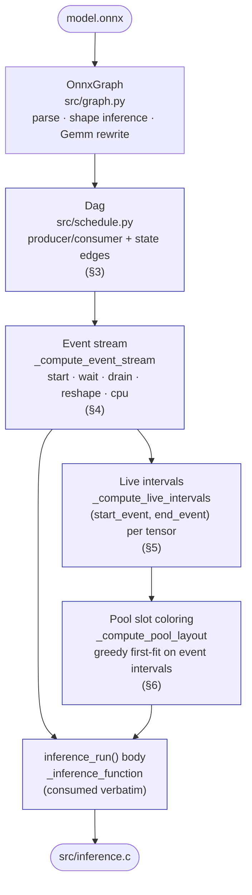
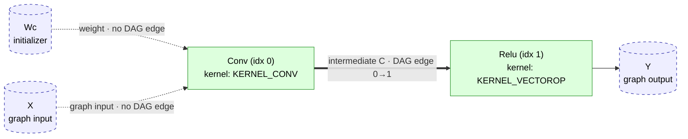
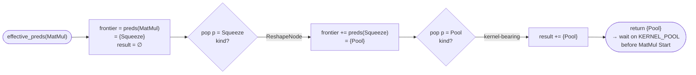
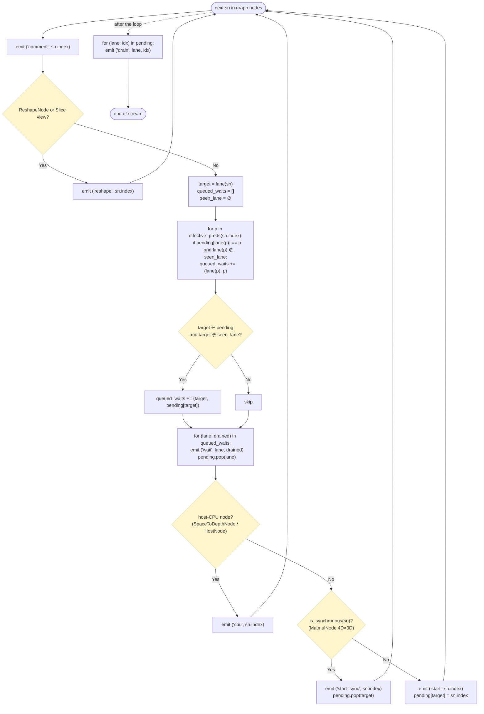
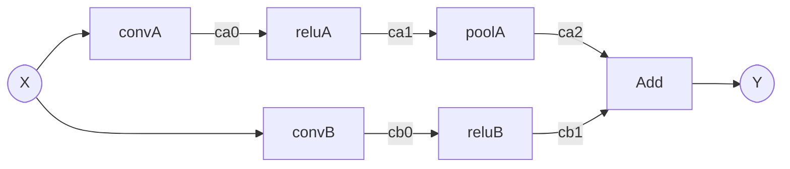
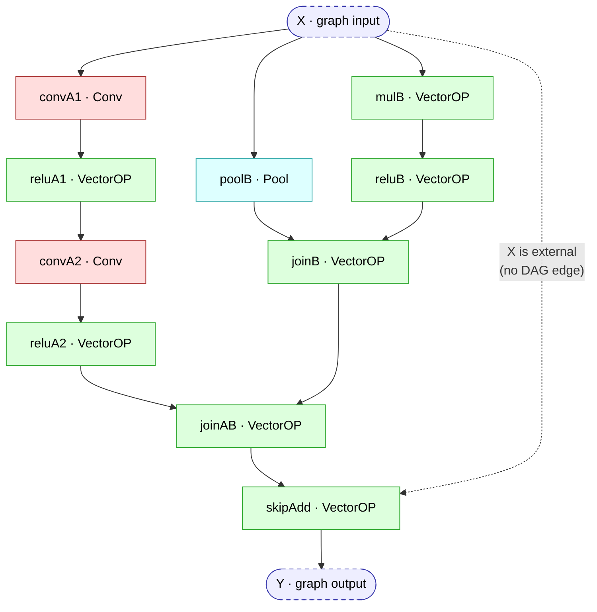

# Scheduler DAG — Algorithm Reference

This document describes the data-flow DAG used by `inference-scheduler` and
the algorithms that derive the parallel-execution schedule from it. It
is the single technical reference for anyone modifying:

- `src/schedule.py`            (the DAG itself)
- `src/codegen/_core.py`       (event stream + live intervals)
- `src/codegen/_source.py`     (body emission consuming the events)

For a higher-level orientation see the sibling
[`USER_GUIDE.md`](USER_GUIDE.md) (user guide),
[`ARCHITECTURE.md`](ARCHITECTURE.md) and the technical reference
[`doc/scheduler/INFERENCE_SCHEDULER.md`](../../doc/scheduler/INFERENCE_SCHEDULER.md); for the
profiler that piggybacks on the same brackets see
[`PROFILER.md`](../../doc/scheduler/PROFILER.md).

## Pipeline overview

The DAG sits between the parsed graph and the code emitter.  Once
built, it drives a single event-stream walk that both the live-interval
analyser and the body emitter consume verbatim — so they cannot
disagree about what is in flight on each lane at any point.


```mermaid
flowchart TD
    M([model.onnx]) --> OG["OnnxGraph<br/>src/graph.py<br/>parse · shape inference · Gemm rewrite"]
    OG --> DAG["Dag<br/>src/schedule.py<br/>producer/consumer + state edges<br/>(§3)"]
    DAG --> EVS["Event stream<br/>_compute_event_stream<br/>start · wait · drain · reshape · cpu<br/>(§4)"]
    EVS --> LI["Live intervals<br/>_compute_live_intervals<br/>(start_event, end_event) per tensor<br/>(§5)"]
    EVS --> EM["inference_run() body<br/>_inference_function<br/>(consumed verbatim)"]
    LI --> POOL["Pool slot coloring<br/>_compute_pool_layout<br/>greedy first-fit on event intervals<br/>(§6)"]
    POOL --> EM
    EM --> OUT([src/inference.c])

    classDef stage fill:#eef,stroke:#33a
    class DAG,EVS,LI,POOL,EM stage
```

Sections §1–§6 walk through each box; §7 puts them together on real
fixtures; §8–§10 cover edge cases, invariants, and future work.

---

## 1. Why a DAG?

The current scheduler models **one lane per kernel type** —
VectorOPKernel, MatmulKernel, ConvKernel, PoolKernel (the
`KERNEL_REGISTRY` key in `src/kernels.py`; the C++ kernel class is
PoolingKernel) — and assumes exactly one driver instance per lane. This is a framework limitation, not a hardware
constraint: a bitstream could in principle provide several Conv IPs at
distinct AXI-Lite base addresses, and reflecting that would require a
per-instance `pending` map and a node→instance assignment policy (see
§10). The KV260 reference bitstream happens to ship one of each, which
matches the framework today.

Under this model, two ops on the **same** lane must serialize, but two
ops on **different** lanes (e.g. Conv ‖ Pool) can run concurrently.

To overlap correctly we need answers to:

1. **Data dependencies.** When can node `v` start? *When every tensor
   it reads has been fully written.*
2. **Resource dependencies.** When can node `v` reuse a lane? *When the
   previous op on that lane has been waited on.*
3. **Memory aliasing.** When can buffer slot `s` be reassigned to a new
   tensor? *When every kernel currently reading or writing `s` has
   drained.*

A producer/consumer DAG is the natural representation of (1). (2) and
(3) fall out by walking that DAG with a small state machine — the
event stream described in §4.

---

## 2. Domain model

### 2.1 Nodes

Every ONNX op becomes one node object; the node classes are independent
dataclasses (not subclasses of `ScheduledNode`) that share a
`kernel_name: ClassVar[str]`:

| Class           | `kernel_name`        | Lane                |
|-----------------|----------------------|---------------------|
| `ScheduledNode` | `"VectorOPKernel"`   | `KERNEL_VECTOROP`   |
| `MatmulNode`    | `"MatmulKernel"`     | `KERNEL_MATMUL`     |
| `ConvNode`, `MatmulConvNode`, `LlmAttnConvNode` | `"ConvKernel"` | `KERNEL_CONV` |
| `PoolNode`      | `"PoolKernel"`       | `KERNEL_POOL`       |
| `ReshapeNode`   | `""` (none)          | —                   |
| `SpaceToDepthNode`, `HostNode` family (incl. the `axi.llm` `LlmNode`s and `VitNode`s) | `""` (none) | — (host CPU) |

`ReshapeNode` covers `Reshape` / `Squeeze` / `Unsqueeze` / `Dropout` /
`Flatten` / `Identity` (collectively `RESHAPE_OP_TYPES`) and a `Cast`
within one storage kind. It emits no kernel call; its output buffer is a
pointer alias of its input.  A `SliceNode` chosen as a sub-buffer view
behaves the same way (`_is_alias_node`).

### 2.2 Tensors

Three flavours, distinguished at DAG construction:

- **External** — graph inputs, constant initializers, and persistent
  states (`src/numeric.py`) that no node of the graph produces. They have
  no producing node and impose no producer edges (a state's accesses are
  ordered by the state edges of §3.1).
- **Intermediate** — produced by some node, consumed by zero or more.
  Candidates for buffer-pool reuse.
- **Alias** — output of a `ReshapeNode` or a Slice view. Excluded from the
  buffer pool (it shares its source's slot). Its onnx-name is in
  `_alias_source_map()` (`_reshape_aliases` / `_view_aliases`).

### 2.3 Lanes and events

The codegen emits a linear stream of events into `inference_run()`:

```
('comment',    node_idx)            # textual header for the node
('start',      node_idx)            # XKernel_Start(...)  — non-blocking
('start_sync', node_idx)            # blocking helper (run_matmul_at loop)
('wait',       kid, drained_idx)    # kernel_wait(KERNEL_*) drains a node
('drain',      kid, drained_idx)    # final drain before output cache sync
('reshape',    node_idx)            # ReshapeNode / Slice view (no work)
('cpu',        node_idx)            # SpaceToDepthNode / HostNode: host code, synchronous
```

The walker keeps `pending: dict[lane → node_idx]`: which node has been
*started* on each lane but not yet been *waited on*.

---

## 3. Building the DAG (`Dag.from_graph`)

### 3.1 Edges

Edge `u → v` iff some intermediate tensor produced by `u` is consumed
by `v`, plus the state edges below. Construction
(`Dag.from_graph(graph, state_edges=True)`) is one pass:

```python
producer:   dict[onnx_name → producing_node_idx]
externals:  set[onnx_name]   = graph_inputs ∪ initializers
                               ∪ (states not produced by any node)

for sn in graph.nodes:
    producer[sn.output.onnx_name] = sn.index

for sn in graph.nodes:
    for t in sn.inputs:
        if t.onnx_name in externals or t.is_weight:
            continue
        prod = producer[t.onnx_name]
        if prod != sn.index:
            edge(prod → sn)

if state_edges:
    _add_state_edges(graph, by_index)
```

**State edges.** A persistent state (`src/numeric.py`, e.g. a KV cache)
is read by some nodes and updated in place by others (`state_updates()`,
e.g. the attention-prep ops that write the K / V caches, or a node whose
output is the state).  `_add_state_edges` walks `graph.nodes` in list order
and, per state, adds a **RAW** edge from the last writer to each later
reader, a **WAR** edge from each reader since the last write to the next
writer, and a **WAW** edge between consecutive writers.  So any order that
respects the DAG keeps every state access where the list put it — which is
what lets the `--plan` order search (§4.2) move nodes.  The frontends'
list orders already respect every state edge, so the edges add no wait to
the generated code (`test_planning.py::TestStateEdges`, which checks the
edges on the tiny Llama / ViT graphs and the unchanged event stream);
`state_edges=False` gives the data-flow edges only.

Two consequences of the producer edges worth flagging:

- A `Conv` reading its constant weight has zero predecessors *from the
  weight*: weights are external. The Conv is still ordered after any
  upstream node that produces its activation input.
- ReshapeNodes participate as ordinary DAG nodes. Consumers of an
  alias are correctly ordered after the producer of the underlying
  source by transitivity through the ReshapeNode.

A two-node example illustrates both rules:


```mermaid
flowchart LR
    Win[(Wc<br/>initializer)]:::ext
    Xin[(X<br/>graph input)]:::ext

    Conv["Conv (idx 0)<br/>kernel: KERNEL_CONV"]:::kernel
    Relu["Relu (idx 1)<br/>kernel: KERNEL_VECTOROP"]:::kernel
    Yout[(Y<br/>graph output)]:::ext

    Win -.->|"weight · no DAG edge"| Conv
    Xin -.->|"graph input · no DAG edge"| Conv
    Conv ==>|"intermediate C · DAG edge 0→1"| Relu
    Relu --> Yout

    classDef ext fill:#eef,stroke:#33a,stroke-dasharray:5,color:#000
    classDef kernel fill:#dfd,stroke:#393,color:#000
```

Solid arrow = DAG edge (drives wait emission and liveness). Dashed
arrow = data flow whose source is **external** (graph input / weight)
and therefore imposes no edge.

### 3.2 Public surface

`Dag` exposes only the queries the schedulers need:

```
predecessors(idx) → set[int]
successors(idx)   → set[int]
roots()           → list[int]   # no DAG predecessors
leaves()          → list[int]   # no DAG successors
topological_order() → list[int] # deterministic Kahn (ties by graph idx)
ancestors()       → dict[int → frozenset[int]]
independent_pairs() → list[(u, v)]   # quadratic; for tests
```

`topological_order()` breaks ties by the original graph index, so a
strict chain comes out exactly as the source ONNX laid it out.

---

## 4. The event-stream algorithm (`_compute_event_stream`)

This is the only place where the parallel schedule is decided. Both
the body emitter (`_inference_function`) and the live-interval
analyser (`_compute_live_intervals`) consume the events verbatim, so
they cannot disagree about which lanes are in flight at any point; the
report's cross-lane count and the planner's timed replay
(`src/codegen/timing.py`) read the same stream.

`_compute_event_stream(order=None, dag=None)` walks `graph.nodes` by
default.  The `--plan` order search (`src/order_search.py`) passes a
candidate `order` (node indices) and the `dag` of the original list, so it
can price an order before applying it.

### 4.1 Effective predecessors (Reshape pass-through)

A direct DAG predecessor on a `ReshapeNode` (or a Slice view) carries no
kernel information. The walker traverses through alias chains until it
lands on a producer that is not an alias:

```python
def effective_preds(idx):
    seen, out = set(), set()
    stack = list(dag.predecessors(idx))
    while stack:
        p = stack.pop()
        if p in seen: continue
        seen.add(p)
        if _is_alias_node(dag.by_index[p].sched):   # ReshapeNode or Slice view
            stack.extend(dag.predecessors(p))
        else:
            out.add(p)
    return out
```

A host-CPU producer is returned too, but has no lane, so it never
generates a wait (it completed inline).

Without this pass-through, a `Pool → Squeeze → MatMul` chain would
leave the Pool lane unwaited when MatMul starts — exactly the
`squeeze_then_matmul` bug found on hardware.

Visualised as a small BFS state machine for the `Pool → Squeeze →
MatMul` example:


```mermaid
flowchart LR
    S(["effective_preds(MatMul)"]) --> I["frontier = preds(MatMul)<br/>= {Squeeze}<br/>result = ∅"]
    I --> P1{"pop p = Squeeze<br/>kind?"}
    P1 -->|ReshapeNode| Push["frontier += preds(Squeeze)<br/>= {Pool}"]
    Push --> P2{"pop p = Pool<br/>kind?"}
    P2 -->|"kernel-bearing"| Add["result += {Pool}"]
    Add --> Done(["return {Pool}<br/>→ wait on KERNEL_POOL<br/>before MatMul Start"])
```

The same machine handles arbitrarily-deep alias chains
(e.g. `Conv → Squeeze → Unsqueeze → Reshape → MatMul`) — see
`nop_chain_dropout_fork.onnx` (`Conv → Dropout → Dropout → Dropout`,
then MaxPool and Mul on the alias) for a 3-deep test case.

### 4.2 Per-node procedure

For each `sn` in `graph.nodes` (list order, or `order` when given):

```
emit ('comment', sn.index)
if sn is ReshapeNode or a Slice view:
    emit ('reshape', sn.index)
    continue                                 # no kernel work, no events

target = lane(sn)                            # None for host-CPU nodes

# 1. Wait on each effective predecessor whose lane is still in flight.
waits = []
seen_lane = set()
for p in sorted(effective_preds(sn.index)):
    p_lane = lane(dag.by_index[p].sched)
    if p_lane is None: continue
    if pending.get(p_lane) == p and p_lane not in seen_lane:
        waits.append((p_lane, p))
        seen_lane.add(p_lane)

# 2. Wait on the target lane if a different op is still pending there.
if target in pending and target not in seen_lane:
    waits.append((target, pending[target]))

for (lane_, drained) in waits:
    emit ('wait', lane_, drained)
    pending.pop(lane_, None)

# 3. Start the kernel (or run the host code).
if sn is SpaceToDepthNode or HostNode:       # §4.3
    emit ('cpu', sn.index)
elif is_synchronous(sn):                     # MatmulNode 4D×3D outer loop
    emit ('start_sync', sn.index)
    pending.pop(target, None)
else:
    emit ('start', sn.index)
    pending[target] = sn.index

# (after the loop)
for lane_ in sorted(pending):                # final drain
    emit ('drain', lane_, pending[lane_])
```

As a flowchart:


```mermaid
flowchart TD
    A([next sn in graph.nodes]) --> EMC["emit ('comment', sn.index)"]
    EMC --> RX{"ReshapeNode or Slice view?"}
    RX -->|Yes| RXemit["emit ('reshape', sn.index)"]
    RXemit --> A

    RX -->|No| TG["target = lane(sn)<br/>queued_waits = []<br/>seen_lane = ∅"]

    TG --> P1["for p in effective_preds(sn.index):<br/>  if pending[lane(p)] == p<br/>     and lane(p) ∉ seen_lane:<br/>    queued_waits += (lane(p), p)"]

    P1 --> TW{"target ∈ pending<br/>and target ∉ seen_lane?"}
    TW -->|Yes| TWadd["queued_waits += (target, pending[target])"]
    TW -->|No| Skip[skip]
    TWadd --> EmitW
    Skip --> EmitW

    EmitW["for (lane, drained) in queued_waits:<br/>  emit ('wait', lane, drained)<br/>  pending.pop(lane)"]

    EmitW --> Cpu{"host-CPU node?<br/>(SpaceToDepthNode / HostNode)"}
    Cpu -->|Yes| CpuEmit["emit ('cpu', sn.index)"]
    Cpu -->|No| Sync{"is_synchronous(sn)?<br/>(MatmulNode 4D×3D)"}
    Sync -->|Yes| StartSync["emit ('start_sync', sn.index)<br/>pending.pop(target)"]
    Sync -->|No| StartReg["emit ('start', sn.index)<br/>pending[target] = sn.index"]

    CpuEmit --> A
    StartSync --> A
    StartReg --> A

    A -.->|"after the loop"| Drain["for (lane, idx) in pending:<br/>  emit ('drain', lane, idx)"]
    Drain --> END([end of stream])

    classDef decision fill:#fff5cc,stroke:#cc9
    class RX,TW,Cpu,Sync decision
```

Properties of this scheme worth internalising:

- A wait for predecessor `p` is emitted only if `pending[p_lane] == p`
  — that is, `p` is still the most recently *started, not yet waited
  on* op on its lane. If the lane was already drained for some other
  reason (e.g. an earlier consumer's wait), no extra wait fires. This
  is what makes a single shared producer's lane drain *once* even
  when many parallel consumers depend on it.
- Walking `graph.nodes` in list order is sufficient — the order is
  already a valid topological order (ONNX requires it). The walk never
  reorders; it only refrains from inserting waits that aren't required.
  By default the list is the model's node order.  With `--plan`,
  `order_search.plan_order` may replace it before code generation: a
  local search moves kernel starts earlier past nodes they do not depend
  on (the DAG of the original order, state edges included), priced by the
  timed replay of this event stream; the new order is kept only if the
  simulated total drops by at least 0.5 % and the intermediates' pool stays
  within `--pool-budget-mib` (default: the unplanned pool).  An applied
  order renumbers the nodes 0..n-1 in the new order
  (`order_search.apply_order`), so generated names and the profiler's
  layer table follow it.

### 4.3 Synchronous nodes

`MatmulNode` with `outer_count > 1` emits a `for` loop calling
`run_matmul_at()` repeatedly. Each iteration reuses the same Matmul
registers, so iterations cannot be in flight simultaneously — the
helper itself polls `IsDone`. The walker treats such nodes as
self-draining: it emits `start_sync`, then immediately removes the
target lane from `pending` (it is never observed in flight).

`run_matmul_at` is the **only** synchronous helper today.  A MatMul on
ConvKernel with several calls (per batch item, or a row split) is an
ordinary `start`: its `run_conv_at()` loop waits on `KERNEL_CONV` before
each call after the first and leaves the last one in flight.

A `SpaceToDepthNode` (the space-to-depth stem's host-side reorder) is
synchronous in the same sense but occupies no lane: it waits on its
effective predecessors like a kernel start would, emits `('cpu', idx)`,
runs inline, and is never waited on.  Its `start_event` and `drain_event`
are the same index (§5), so the tensor it reads is held until the loop
runs and the tensor it writes becomes live at the same event — the two
never share a pool slot.

Every other host-CPU node (`HostNode`: Softmax, LayerNorm, Gelu,
Transpose, Slice copies, Gather, OneHot, Cast — `src/host_nodes.py`) is
treated exactly the same way.  A `SliceNode` emitted as a zero-cost
sub-buffer view instead behaves like a `ReshapeNode`: a `('reshape', idx)`
event, and predecessor analysis / liveness walk through it to the buffer
that owns the memory (`_alias_source_map`), so the view's consumers keep
that root buffer alive.

---

## 5. Live intervals (`_compute_live_intervals`)

### 5.1 Why event indices, not node indices

The pre-parallel codegen colored buffer slots using *node-index*
intervals: tensor `T` was live from `produce_idx` to `last_consume_idx`
in `graph.nodes` order. That assumes each node's interval ends when
the node's call returns — which was true while every helper polled
`IsDone` synchronously.

Under non-blocking starts, a tensor's slot is occupied from the moment
its producer's `Start` fires until the moment its consumers' lanes
have all been drained. This is naturally expressed in the event
stream's index space.

### 5.2 Derivation

```python
events     = compute_event_stream()
start_event[node_idx]    = index of ('start' | 'start_sync' | 'cpu', node_idx)
drain_event[drained_idx] = index of the corresponding ('wait' | 'drain' | 'start_sync' | 'cpu')

intermediates = { t for t in graph.intermediate_tensors
                  if t.onnx_name not in alias_source_map }   # Reshape aliases, Slice views

# Walk producers/consumers; resolve consumer reads through alias chains.
producer_of[name]   = idx that wrote the tensor
consumers_of[name]  = []   # nodes that read the tensor (or one of its aliases)
for sn in graph.nodes:
    if is_alias_node(sn): continue
    for inp in sn.inputs:
        src = resolve_alias_chain(inp.onnx_name)   # walks through Reshape aliases / Slice views
        if src in intermediates and src != sn.output.onnx_name:
            consumers_of[src].append(sn.index)

for name in intermediates:
    p = producer_of[name]
    start_ei = start_event[p]
    ends = [drain_event[c] for c in consumers_of[name]]
    end_ei = max(ends) if ends else drain_event.get(p, start_ei)
    intervals[name] = (start_ei, end_ei)
```

Three details that matter:

- **Alias resolution for consumers.** A node reading an alias must
  contribute to the *underlying* tensor's interval, not the alias's
  (the alias is excluded from `intermediates`). Without this step, a
  long Reshape chain would orphan the source's interval and break the
  consumer's lane wait.
- **Synchronous nodes** have `start_event == drain_event` (the
  `start_sync` or `cpu` event itself), giving them a degenerate interval and
  preventing any cross-lane reuse during the call.
- **No-consumer tensors** fall back to `drain_event[producer]`, which
  is set by the final drain sweep. That covers the niche case of a
  result that flows only into a graph-output reshape chain.

---

## 6. Pool-slot coloring (`_compute_pool_layout`)

Standard interval-graph greedy first-fit with one twist: the input
intervals are the event-stream-based ones from §5.  The colouring itself
lives in `_compute_intermediate_layout()`; `_compute_pool_layout()` places
its slot region after the weights and the DMA states.

```python
slots = []   # each: [end_event, allocated_elems, [tensor_name, ...]]

for name, (start_ei, end_ei) in sort_by_start_then_neg_alloc(intervals):
    placed = False
    for slot in slots:
        if slot.end_event < start_ei:           # slot is free before start
            slot.end_event = end_ei
            slot.alloc     = max(slot.alloc, align_up_64(alloc[name]))
            slot.tensors.append(name)
            placed = True
            break
    if not placed:
        slots.append([end_ei, align_up_64(alloc[name]), [name]])

# Lay slots end-to-end in the contiguous DMA pool.
```

Each slot is padded up to a 64-byte boundary so every sub-buffer is
cache-line aligned. Weights are placed before the slot region in
declaration order (they live for the entire call and never share),
followed by the DMA states (persistent across calls, never shared).
Host-memory intermediates (`axi.numeric` `host` tensors) are coloured the
same way into a separate malloc'd arena (`_compute_host_layout`, 64-byte
slots).  In a multi-entry project each entry is coloured on its own and
all entries' slot regions overlap in one pool region.

Tensors are sorted by start event, ties broken largest-alloc first, so the
biggest buffer claims a slot and smaller ones only reuse it.

---

## 7. Worked examples

### 7.1 Linear chain — control case

`relu_chain.onnx`: X + bias → Add → add_Y → Relu → relu_Y.

- Two nodes, both on `KERNEL_VECTOROP` (with `OnnxGraph(fuse_act=False)`,
  the library default; the CLI folds the Relu into the Add's `act`).
- The predecessor is on the same lane as its consumer, so the step
  emits one wait, one start.
- Final drain handles the last node.
- The only intermediate, `add_Y`, has interval `[1, 5]`; one slot.

```
Start(0)              pending {V:0}
Wait(V,0); Start(1)   pending {V:1}
Drain(V,1)
```

This is the strict-chain baseline that any future scheduler change
must preserve.

### 7.2 `parallel_two_chains.onnx` — the bug that motivated event-stream liveness


```mermaid
flowchart LR
    X(["X"]) --> convA["convA"] -- ca0 --> reluA["reluA"] -- ca1 --> poolA["poolA"] -- ca2 --> join["Add"] --> Y(["Y"])
    X --> convB["convB"] -- cb0 --> reluB["reluB"] -- cb1 --> join
```

Old node-index liveness gave `ca1` (read by Pool) the interval
`[1, 2]` and `cb0` (written by Conv-B) the interval `[3, 4]`.
Disjoint → coloring assigned them the same slot. On hardware Pool
was still reading slot 320 when Conv-B started writing it.

Event stream actually emitted (event index in brackets):

```
[0]  comment(0=convA)
[1]  start(0)                                 pending {Conv: 0}
[2]  comment(1=reluA)
[3]  wait(Conv, drained=0)                    pending {}
[4]  start(1)                                 pending {V: 1}
[5]  comment(2=poolA)
[6]  wait(V, drained=1)                       pending {}
[7]  start(2)                                 pending {Pool: 2}
[8]  comment(3=convB)
[9]  start(3)                                 pending {Pool: 2, Conv: 3}
[10] comment(4=reluB)
[11] wait(Conv, drained=3)                    pending {Pool: 2}
[12] start(4)                                 pending {Pool: 2, V: 4}
[13] comment(5=joinAdd)
[14] wait(Pool, drained=2)                    pending {V: 4}
[15] wait(V, drained=4)                       pending {}
[16] start(5)                                 pending {V: 5}
[17] drain(V, drained=5)                      pending {}
```

Event-stream intervals:

| Tensor | Producer | start | end | Slot |
|--------|----------|-------|-----|------|
| ca0    | convA    |   1   |  6  |  0   |
| ca1    | reluA    |   4   | 14  |  1   |
| ca2    | poolA    |   7   | 17  |  0   |
| cb0    | convB    |   9   | 15  |  2   |
| cb1    | reluB    |  12   | 17  |  3   |

`ca0` is held until its consumer reluA drains (the wait at event 6).
`ca1 [4,14]` and `cb0 [9,15]` overlap — distinct slots. `ca0 [1,6]`
ends before `ca2 [7,17]` starts → reuse slot 0. Correct on hardware
and locked in by `TestEventTimelineLiveness`.

The parallel structure is easier to see laid out by lane:


```mermaid
gantt
    title parallel_two_chains — execution timeline (event-stream index = unit)
    dateFormat X
    axisFormat %s

    section Conv lane
    convA #0  :crit,   1, 3
    convB #3  :crit,   9, 11

    section VectorOP lane
    reluA #1  :active, 4, 6
    reluB #4  :active, 12, 15
    join  #5  :active, 16, 17

    section Pool lane
    poolA #2  :done,   7, 14
```

Each bar spans `[start_event_idx, drain_event_idx)` — the window in
which that node is in flight on its lane. Pool #2 overlaps Conv #3
(events 9-11) and reluB #4 (events 12-14): two lanes are
simultaneously in flight at events 9 and 12. The join Add at event 16 only
fires after waits drain Pool and VectorOP at events 14 and 15.

The slot view is the same x-axis but coloured by pool slot:


```mermaid
gantt
    title parallel_two_chains — tensor lifetimes & pool slots
    dateFormat X
    axisFormat %s

    section Slot 0 (shared)
    ca0   :done,   1, 6
    ca2   :done,   7, 17

    section Slot 1
    ca1   :active, 4, 14

    section Slot 2
    cb0   :crit,   9, 15

    section Slot 3
    cb1   :crit,   12, 17
```

Slot 0 reuse is safe (`ca0` ends at 6, `ca2` starts at 7). Every
other tensor needs its own slot because its interval overlaps with at
least one already-placed tenant.

### 7.3 `squeeze_then_matmul.onnx` — Reshape pass-through

```
X → GlobalAveragePool → P → Squeeze → F → MatMul → Y
```

`MatMul` has only one direct DAG predecessor: the `ReshapeNode`. With
`kernel_name == ""`, no wait would fire — MatMul would read the alias
buffer while Pool was still writing it. `effective_preds(MatMul)`
walks through the Reshape and returns Pool, so the emitter inserts
`kernel_wait(KERNEL_POOL)` before MatMul's Start. Locked in by
`TestReshapeAliasWaitPassThrough`.

### 7.4 `asymmetric_nested_branches.onnx` — multi-root, multi-lane

Three roots on three different lanes (Conv, Pool, VectorOP). Branch B
contains its own internal sub-fork that joins before contributing to
the top-level join.


```mermaid
flowchart TB
    X([X · graph input]):::ext

    %% Branch A — deep Conv chain
    X --> CA1["convA1 · Conv"]:::conv
    CA1 --> RA1["reluA1 · VectorOP"]:::vec
    RA1 --> CA2["convA2 · Conv"]:::conv
    CA2 --> RA2["reluA2 · VectorOP"]:::vec

    %% Branch B sub-branch 1 — Pool
    X --> P["poolB · Pool"]:::pool

    %% Branch B sub-branch 2 — Mul → Relu
    X --> M["mulB · VectorOP"]:::vec
    M --> RB["reluB · VectorOP"]:::vec

    %% Branch B sub-join
    P --> JB["joinB · VectorOP"]:::vec
    RB --> JB

    %% Top-level A ⊕ B join
    RA2 --> JAB["joinAB · VectorOP"]:::vec
    JB --> JAB

    %% Skip-add via graph input
    JAB --> SK["skipAdd · VectorOP"]:::vec
    X -. "X is external<br/>(no DAG edge)" .-> SK

    SK --> Y([Y · graph output]):::ext

    classDef ext fill:#eef,stroke:#33a,color:#000,stroke-dasharray:5
    classDef conv fill:#fdd,stroke:#a33,color:#000
    classDef pool fill:#dff,stroke:#3aa,color:#000
    classDef vec fill:#dfd,stroke:#3a3,color:#000
```

Three roots (`convA1`, `poolB`, `mulB`), two join points (`joinB`,
`joinAB`), and a skip-add at the end whose access to `X` is *not* a
DAG edge (X is external). The algorithm handles the nesting uniformly:
at no point does it reason about "branches" or "sub-branches" — it
only asks "is some predecessor still pending?" and "is the target
lane still busy?". Tested against
`TestDagOnParallelModels::test_asymmetric_branch_a_independent_of_branch_b`.

---

## 8. Edge cases and design notes

- **Same-lane parallel branches.** If two ops at the root target the
  same lane (e.g. `parallel_same_kernel_branches.onnx` with two
  Convs), the DAG marks them concurrency-independent but the walker
  serialises them on rule (2) of §1: the second Start emits a
  `kernel_wait(target)` because the lane is still pending.
- **Graph-input alias.** When a `ReshapeNode` source is a graph input,
  the alias's underlying buffer is the user-supplied input — no pool
  slot is needed. The emitter inserts `X1 = X;` at the top of
  `inference_run()` (`_run_reshape_aliases`) and clears it at the
  bottom. Parallel branches that read the alias still emit no
  producer wait (no producer exists). See `nop_graph_input_fork`.
- **Terminal Reshape alias to a graph output.** Output redirection in
  `_output_aliases` rewrites the kernel's output pointer to the
  user-supplied buffer before kernels run. Liveness still computes a
  slot for the producer's output; that slot is simply never used at
  runtime.
- **Dead intermediates.** Any tensor with no consumers (uncommon for
  well-formed graphs) gets `end_ei = drain_event[producer]`, which is
  set by the final drain. The slot is held until the run ends — safe
  but conservative.
- **Graph orders.** ONNX guarantees nodes are topologically ordered.
  The codegen does **not** reorder; it only inserts waits.  The one
  reordering is the opt-in `--plan` issue-order search (§4.2), which
  replaces the node list before code generation with another
  topological order of the DAG (state edges included), so every
  invariant of §9 holds for it too.

---

## 9. Invariants and where they are tested

| Invariant | Enforced by | Test |
|-----------|-------------|------|
| Edge `u→v` exists ⇒ `start_event[u] < start_event[v]` | per-node procedure §4.2 step 1 | `test_dag.py` topological order |
| `u, v` independent ⇒ neither's `wait` precedes the other's `start` | rules (1)+(2) | `test_parallel_waits.py::test_pool_start_precedes_second_conv_with_no_pool_wait_between` |
| Two tensors share a slot ⇒ their event-stream intervals are disjoint | greedy first-fit on event-index intervals | `test_nop_corner_cases.py::TestNopFixturesNoSlotAliasing` |
| Reshape chains do not break wait emission | `effective_preds` BFS | `test_parallel_waits.py::TestReshapeAliasWaitPassThrough` |
| ReshapeNode chains do not orphan the source's interval | `resolve_alias_chain` in §5.2 | `test_nop_corner_cases.py::TestNopChainDropoutFork::test_walk_traverses_full_chain` |
| Profiler brackets recorded correctly under overlap | per-layer `begin_ns` slot | `test_profiler_overlap.py` |
| Synchronous nodes self-drain their lane | `start_sync` removes target from `pending` | covered indirectly by every Matmul-only model in the fixture set |
| State accesses keep their list order in any DAG order | RAW / WAR / WAW state edges (`_add_state_edges`) | `test_planning.py::TestStateEdges` |
| Any DAG-respecting order computes the same bits | event stream + liveness recomputed for the new list | `test_planning.py::TestReorderedCode::test_random_orders_bit_exact` (host emulation) |

---

## 10. Future work

- **List-scheduling reorder.** The walk itself is non-reordering.  The
  opt-in `--plan` mode already searches the issue order locally
  (`src/order_search.py`, §4.2, priced by the performance model); a
  default-on list scheduler that hoists ready ops earlier could open
  longer overlap windows on models like Inception. Any such extension
  must preserve all invariants in §9.
- **Multiple instances per kernel.** If the bitstream ever provides
  two ConvKernels, the walker would need a per-instance `pending` map
  and a node→instance assignment policy. The DAG itself would not
  change.
- **Cross-iteration overlap.** For models invoked many times in a
  loop, the input cache flush and the output cache invalidate could
  themselves be pipelined with kernel work. Out of scope for this
  iteration.
