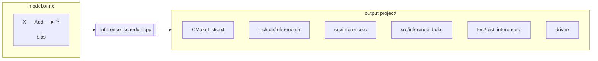
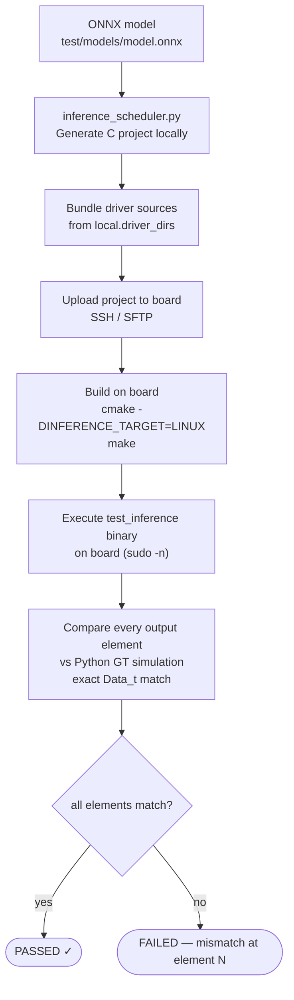

# Inference Scheduler — User Guide

The inference scheduler is a Python tool that reads an ONNX neural network model
and emits a complete, self-contained C project that runs inference on the
**Xilinx KV260 FPGA** using up to four PL kernels — **VectorOPKernel**,
**MatmulKernel**, **ConvKernel** and **PoolingKernel** — plus host-CPU code for
the ops no kernel implements. The generated code handles weight loading, DMA
buffer management, cache coherency, and the full per-layer execution loop — all
without any Python or ONNX runtime on the target.

This document is the user guide (CLI, generated project, C API, building,
testing, `report.md`).  What each operator maps to, the graph
transformations, host ops, numerics, cache coherency and multi-entry projects
are specified in the technical reference
[`doc/INFERENCE_SCHEDULER.md`](../../doc/INFERENCE_SCHEDULER.md).

---

## Table of Contents

1. [What It Does](#1-what-it-does)
2. [Supported ONNX Operators](#2-supported-onnx-operators)
3. [Installation and Setup](#3-installation-and-setup)
4. [Command-Line Interface](#4-command-line-interface)
5. [Generated Project Layout](#5-generated-project-layout)
6. [Generated C API Reference](#6-generated-c-api-reference)
7. [Usage Examples](#7-usage-examples)
8. [Large Tensor Handling](#8-large-tensor-handling)
9. [Building the Generated Project](#9-building-the-generated-project)
10. [Running Tests](#10-running-tests)
11. [Generated Report (`report.md`)](#11-generated-report-reportmd)

**Related:** [Technical reference](../../doc/INFERENCE_SCHEDULER.md) ·
[Internal Architecture](ARCHITECTURE.md) ·
[Model Preparation — Pre-Scheduler ONNX Normalisation](MODEL_PREPARATION.md) ·
[Scheduler DAG — Algorithm Reference](SCHEDULER_DAG.md) ·
[Buffer Reuse — Live-Interval Optimisation](BUFFER_REUSE.md) ·
[Remote Hardware Testing](REMOTE_TESTING.md)

---

## 1. What It Does

Consider a simple ONNX graph: `X + bias → Y` where `bias` is a constant weight
tensor. The scheduler turns this into:



The generated `inference.c` contains (abridged):

```c
// Constant weight embedded as a C ROM array
static const uint16_t _rom_bias[256] = { 0x0080, 0x0080, ... };
static inference_buf_t *bias = NULL;

int inference_init(const char *vectoropkernel_instance) {
    inference_buf_pool_init();
    // One contiguous DMA allocation; every weight / intermediate is a view
    s_alloc_pool = inference_buf_alloc(256u);
    inference_buf_init_view(&_s_buf_bias, s_alloc_pool, 0u, 256u);
    bias = &_s_buf_bias;
    memcpy(inference_buf_ptr(bias), _rom_bias, sizeof(_rom_bias));
    inference_buf_sync_to_device(s_alloc_pool);   // flush weights once
    return XVectoropkernel_Initialize(&s_vectoropkernel, vectoropkernel_instance);
}

void inference_run(inference_buf_t *X, inference_buf_t *Y) {
    inference_buf_sync_to_device(X);     // flush user input
    inference_buf_sync_to_device(Y);     // clean the output (no dirty line may be
                                         // evicted over the kernel's result)
    run_op(X, bias, Y, 256u, VECTOROP_ADD, 1u, 0u, 0u);  // start the kernel
    kernel_wait(KERNEL_VECTOROP);        // drain the lane
    inference_buf_sync_from_device(Y);   // invalidate output cache
}
```

The FPGA kernel reads `X` and `bias` from DDR, computes element-wise addition,
and writes the result to `Y` — all via AXI DMA master ports. The CPU only needs
to program the AXI-Lite control registers, start the kernel and wait for it
(`kernel_wait()` polls by default; kernels on different lanes run
concurrently).

---

## 2. Supported ONNX Operators

The scheduler maps ONNX operators to one of four hardware kernels, handles
them as zero-cost CPU-side transformations, or runs them as host-CPU code
inside `inference_run()`.  Full semantics and restrictions:
[technical reference](../../doc/INFERENCE_SCHEDULER.md).

### VectorOPKernel (element-wise, 1-D)

| ONNX op | Op code | Arity | Expression |
|---------|---------|-------|------------|
| `Add` | `VECTOROP_ADD` (0) | binary | `c[i] = saturate(a[i] + b[i])` |
| `Sub` | `VECTOROP_SUB` (1) | binary | `c[i] = saturate(a[i] - b[i])` |
| `Mul` | `VECTOROP_MUL` (2) | binary | `c[i] = saturate(a[i] * b[i])` |
| `Div` | `VECTOROP_DIV` (3) | binary | `c[i] = saturate(a[i] / b[i])` |
| `Relu` | `VECTOROP_RELU` (4) | unary | `c[i] = max(a[i], 0)` |
| `Clip(min=0, max=6)` | `VECTOROP_RELU6` (5) | unary | `c[i] = min(max(a[i], 0), 6)` |

**Broadcasting**: Binary ops support partial ONNX multidirectional broadcasting.
One input may be smaller than the output — see
[Architecture: Broadcasting Algorithm](ARCHITECTURE.md#6-broadcasting-algorithm).

**Activation fusion**: a `Relu` / `Clip(0,6)` whose input is produced by a
VectorOP node (and read by nothing else, and not a graph output) is folded
into that node's call through the kernel's `act` register (CLI default;
`--no-fuse-act` disables it).

### MatmulKernel (matrix multiply, tiled)

| ONNX op | Notes |
|---------|-------|
| `MatMul` | `C[n,m] = A[n,k] @ B[k,m]`; supports batched matmul and broadcast weight. MatMuls the cost model estimates faster on ConvKernel are lowered there instead (`--matmul-on-conv`, below) |

### ConvKernel (2-D convolution, NCHW)

| ONNX op | Notes |
|---------|-------|
| `Conv` | NCHW layout; `group=1` or depthwise (`group=in_channels`); configurable kernel, stride, pad (incl. `auto_pad`), dilation |
| `MatMul` | Lowered with swapped operand roles (A = conv weight, B = conv input, 1×kw kernel) — bit-identical to MatmulKernel |

Bias (`Conv` with three inputs) is supported: the bias add is fused into the
`run_conv()` dispatch call alongside the convolution.  A stride-2 `Conv` on
≤ 4 input channels is rewritten as a host-side `SpaceToDepth(2)` plus a
stride-1 `Conv` (CLI default; `--no-s2d-stem` disables it).

### PoolingKernel (2-D pooling, NCHW)

| ONNX op | Pool type | Notes |
|---------|-----------|-------|
| `MaxPool` | `POOL_MAX` (0) | Sliding-window maximum |
| `AveragePool` | `POOL_AVG` (1) | Sliding-window average; `count_include_pad` supported |
| `LpPool` (p=1 or 2) | `POOL_LP` (2) | Lp-norm pooling |
| `GlobalMaxPool` | `POOL_MAX` (0) | Equivalent to `MaxPool` with `kernel = input spatial dims` |
| `GlobalAveragePool` | `POOL_AVG` (1) | Equivalent to `AveragePool` with `kernel = input spatial dims` |
| `GlobalLpPool` (p=1 or 2) | `POOL_LP` (2) | Equivalent to `LpPool` with `kernel = input spatial dims` |

All pool variants support configurable stride, padding, and dilation.
`ceil_mode=1` is not supported.

### Zero-Cost Transformations (CPU-side only)

| ONNX op | Handling | Notes |
|---------|----------|-------|
| `Reshape`, `Squeeze`, `Unsqueeze`, `Flatten`, `Dropout`, `Identity` | Buffer alias | Output pointer is assigned `= source pointer`; no hardware call, no data copy |
| `Cast` within one storage kind | Buffer alias | float → float, int → int |
| `Constant` | Folded at load time | Becomes an initializer |
| `Split`, `Slice` | Sub-buffer view | Contiguous pieces at a 64-byte offset of an internal buffer; other pieces are host copies (below) |
| `Gemm` | Decomposed at load time | `Gemm(A, B, C)` → `MatMul(A, B) → tmp` + `Add(tmp, C) → Y`; `Gemm(A, B)` → `MatMul(A, B) → Y`. Requires `alpha=1, beta=1, transA=0`; `transB=1` only with a constant 2-D B (transposed offline). |

### Host-CPU ops

Run on the A53 inside `inference_run()` (double arithmetic, round-half-even
write-back, multi-threaded): `Softmax` (last axis), `LayerNormalization`,
`Gelu`, `Transpose`, `Slice` / `Split` copies, `Gather` (axis 0), `OneHot`,
`Cast` (integer ↔ `Data_t`), `SpaceToDepth`, and the Llama decoder ops of the
custom domain `axi.llm`.  TensorFlow-style LayerNorm and GELU (tanh / erf)
subgraphs are fused into single host ops first (`--no-fuse-patterns`
disables it); an unmatched `ReduceMean` / `Pow` / `Sqrt` / `Reciprocal` /
`Tanh` / `Erf` is rejected.

Any other ONNX op causes the scheduler to exit with a `SchedulerError`.
See [MODEL_PREPARATION.md](MODEL_PREPARATION.md) for the standard pipeline
(`simplify_onnx.py` + BN fusion + tail trimming) that converts stock ONNX
Model Zoo / torchvision exports into a form the scheduler accepts.

**Data types**: The ONNX model's float weights and activations are quantized
to the target element type (default: `ap_fixed<16,8>`) during code generation
and simulation.  Integer / bool tensors (token ids, masks) are kept as raw
int16 values in the same buffers and may only be read by host ops and
aliases.

---

## 3. Installation and Setup

```bash
cd inference-scheduler

# Create a virtual environment and install dependencies
python3 -m venv .venv
.venv/bin/pip install -r requirements.txt

# Generate all test ONNX models (needed before running the test suite)
.venv/bin/python test/gen_test_models.py              # VectorOPKernel models
.venv/bin/python test/gen_mixed_kernel_models.py      # MatMul + VectorOP
.venv/bin/python test/gen_matmul_models.py            # MatMul-only models
.venv/bin/python test/gen_conv_models.py              # Conv models
.venv/bin/python test/gen_pool_models.py              # Pooling models
.venv/bin/python test/gen_reshape_gemm_models.py      # Reshape + Gemm models
.venv/bin/python test/gen_mixed_all_kernels_models.py # All-kernel combination models
.venv/bin/python test/gen_parallel_models.py          # Parallel + NOP corner cases
.venv/bin/python test/gen_bert_models.py              # Tiny BERT-like models (host ops)
.venv/bin/python test/gen_llama_models.py             # Tiny random Llama (axi.llm ops)
# or all of them at once:
.venv/bin/python test/gen_all_models.py
```

Dependencies (from `requirements.txt`): `onnx`, `numpy`, `paramiko`
(remote-test runners), plus `onnxsim`, `onnxoptimizer`, `onnxruntime`
(used by [`simplify_onnx.py`](../simplify_onnx.py) — see
[MODEL_PREPARATION.md](MODEL_PREPARATION.md)).

---

## 4. Command-Line Interface

```
python inference_scheduler.py <model.onnx> [options]
python inference_scheduler.py --entry NAME=MODEL.onnx [--entry ...] [options]
```

### Options

| Flag | Default | Description |
|------|---------|-------------|
| `--entry NAME=MODEL.onnx` | *(none)* | Multi-entry project (`src/codegen/multi.py`): one library with `inference_run_NAME()` per graph over one weight pool (weights deduplicated by name and image, states shared by name). Repeat per entry; replaces the positional model. Default output dir `./multi_inference/`; no `report.md`. See [technical reference §Multi-entry projects](../../doc/INFERENCE_SCHEDULER.md#multi-entry-projects). |
| `--out-dir DIR` | `./<stem>_inference/` | Output project directory. Created if absent; existing files are overwritten. |
| `--driver-dir DIR` | *(none)* | Copy the driver sources of every kernel the model uses (`x<kernel>.h / .c / _hw.h / _sinit.c / _linux.c`) from this directory into `driver/`. If omitted, `driver/` is left empty with a README. |
| `--embed-large-weights` | off | Inline all weight tensors as C arrays, even those exceeding the 4096-element threshold that would normally be written to external `.dat` files. |
| `--embed-large-expected` | off | Inline all GT expected arrays in `test_inference.c` instead of writing them to `expected/*.dat` files. |
| `--no-report` | off | Skip writing `report.md`. Default is to always emit a human-readable model summary alongside the C project — see [§11](#11-generated-report-reportmd). |
| `--no-fuse-act` | off | Do not fold `Relu` / `Clip(0,6)` into the VectorOP call that produces their input (the kernel's `act` register). |
| `--no-s2d-stem` | off | Do not rewrite stride-2 `Conv` layers with ≤ 4 input channels as host `SpaceToDepth(2)` + stride-1 `Conv` ([§Space-to-depth stem](../../doc/INFERENCE_SCHEDULER.md#space-to-depth-stem)). |
| `--no-fuse-patterns` | off | Do not fuse TensorFlow-style LayerNorm / GELU (tanh, erf) subgraphs into host-CPU ops and do not reshape constant VectorOP operands for the kernel's broadcast (`src/fusion.py`, [`doc/INFERENCE_SCHEDULER.md` §Pattern fusion](../../doc/INFERENCE_SCHEDULER.md#pattern-fusion)). Fusion only changes graphs that contain these patterns. |
| `--matmul-on-conv {auto,always,off}` | `auto` | Run MatMuls on ConvKernel with swapped operand roles: `auto` where the cost model estimates it faster, `always` for every eligible MatMul, `off` for none ([§MatMul on ConvKernel](../../doc/INFERENCE_SCHEDULER.md#matmul-on-convkernel)). Bit-identical either way. |
| `--no-matmul-on-conv` | off | Same as `--matmul-on-conv off`. |

### Examples

```bash
# Minimal: generate a project in ./single_add_inference/
python inference_scheduler.py test/models/single_add.onnx

# Specify output directory
python inference_scheduler.py model.onnx --out-dir /tmp/my_project

# Copy driver sources from Vitis HLS synthesis output (one directory holding
# the files of every kernel the model uses)
python inference_scheduler.py model.onnx --out-dir /tmp/my_project \
    --driver-dir ../build/kernels/vectorop/kv260/vadd_kv260/solution1/impl/ip/drivers/VectorOPKernel_v1_0/src

# Embed everything inline (no external files, larger C sources)
python inference_scheduler.py model.onnx --embed-large-weights --embed-large-expected

# Multi-entry project (e.g. an LLM's decode step and LM head)
python inference_scheduler.py --entry decode=test/models/llama_tiny_decode.onnx \
    --entry head=test/models/llama_tiny_head.onnx --out-dir /tmp/multi
```

### Console Output

The scheduler prints a summary to stderr:

```
Model      : test/models/single_add.onnx
Inputs     : ['X[1, 256]']
Outputs    : ['Y[1, 256]']
Nodes      : 1
  [  0] Add          [1, 256] x [1, 256] -> [1, 256]
Output dir : /tmp/single_add_inference
Driver     : driver/ is empty — see driver/README.md

Generated project:
  /tmp/single_add_inference/CMakeLists.txt
  /tmp/single_add_inference/include/inference.h
  /tmp/single_add_inference/include/inference_prof.h
  /tmp/single_add_inference/include/inference_ddr.h
  /tmp/single_add_inference/src/inference.c
  /tmp/single_add_inference/src/inference_buf.c
  /tmp/single_add_inference/src/inference_prof.c
  /tmp/single_add_inference/src/inference_ddr.c
  /tmp/single_add_inference/src/ddr/
  /tmp/single_add_inference/test/test_inference.c
  /tmp/single_add_inference/scripts/check_inference_setup.sh
  /tmp/single_add_inference/driver/
  /tmp/single_add_inference/report.md
```

When MatMuls are lowered onto ConvKernel the summary adds a
`MatMul->Conv:` line (MatMuls moved, ConvKernel calls, estimated ms on both
engines at 100 MHz); large weights / host tables / GT arrays add
`Weights :`, `Host tables:` and `Expected :` lines.

---

## 5. Generated Project Layout

```
<out_dir>/
│
├── CMakeLists.txt
│     Cross-platform build system. Selects bare-metal or Linux target via
│     -DINFERENCE_TARGET=BARE_METAL|LINUX at cmake configure time.
│     Produces static library libinference.a and test executable test_inference.
│
├── include/
│   ├── inference.h
│   │     Public API: Data_t typedef, array-size macros, DMA buffer API,
│   │     inference_init() / inference_run() / inference_deinit() declarations,
│   │     UIO instance-name defaults, per-layer name table accessors.
│   ├── inference_prof.h          Per-layer profiler (no-ops unless
│   │                             -DINFERENCE_PROFILING=ON; doc/PROFILER.md)
│   └── inference_ddr.h           DDR-traffic counters used by the profiler
│
├── src/
│   ├── inference.c
│   │     Core implementation. Contains weight ROM arrays, DMA buffer views,
│   │     the run_*() kernel dispatch helpers, kernel_wait(), host-op helpers
│   │     (when the model has host ops), and the generated inference_init() /
│   │     inference_deinit() and inference_run() function bodies.
│   │
│   ├── inference_buf.c
│   │     Platform-specific DMA buffer allocator and cache sync.
│   │     Two implementations selected by #ifdef __linux__:
│   │       Linux:      XRT buffer objects (xclAllocBO / xclMapBO / xclSyncBO),
│   │                   mapped cacheable by default
│   │       Bare-metal: malloc() + Xil_DCacheFlushRange / Xil_DCacheInvalidateRange
│   │
│   ├── inference_prof.c, inference_ddr.c, inference_ddr_backend.h
│   └── ddr/zuplus_apm.c          ZynqMP APM DDR-counter backend
│
├── test/
│   └── test_inference.c
│         On-device smoke test. Fills inputs with a deterministic ramp pattern,
│         runs inference_run(), prints the first 8 output elements, and compares
│         every output element against gold-standard values pre-computed by the
│         Python fixed-point simulator.
│
├── scripts/
│   └── check_inference_setup.sh
│         Preflight checker for the Linux/XRT path. Verifies that xrt.h,
│         libxrt_core.so, and /dev/dri/renderD* are accessible before a build.
│
├── driver/
│   │   Hardware kernel driver sources for every active kernel, copied
│   │   verbatim (flat layout, no per-kernel sub-directories) from the
│   │   --driver-dir argument.  When --driver-dir is omitted the
│   │   directory contains a stub README listing the files that would
│   │   be needed for the kernels this model uses.
│   ├── xvectoropkernel.h / .c / _hw.h / _sinit.c / _linux.c
│   ├── xmatmulkernel.h   / .c / _hw.h / _sinit.c / _linux.c
│   ├── xconvkernel.h     / .c / _hw.h / _sinit.c / _linux.c
│   └── xpoolingkernel.h  / .c / _hw.h / _sinit.c / _linux.c
│
├── weights/                      (only when model has large weight tensors
│   │                              or large host tables)
│   └── <name>.dat                Raw little-endian binary weight data; loaded
│                                 at runtime by fread() in inference_init().
│
├── expected/                     (only when model has large output tensors)
│   └── <name>.dat                Raw little-endian binary GT expected data;
│                                 loaded at runtime by fread() in test_inference.c.
│
└── report.md                     Model summary (unless --no-report; §11)
```

---

## 6. Generated C API Reference

### Data Type and Size Macros (inference.h)

```c
/* Element type — ap_fixed<16,8>: 16-bit two's-complement, value = (int16_t)bits / 256.0 */
typedef uint16_t Data_t;
#define INFERENCE_BYTES_PER_ELEM  2u

/* AXI burst alignment — all broadcast chunk strides are multiples of this */
#define INFERENCE_ALIGN_BYTES  16u
#define INFERENCE_ALIGN_ELEMS  (INFERENCE_ALIGN_BYTES / INFERENCE_BYTES_PER_ELEM)
#define INFERENCE_ALIGN_UP(n)  (((n) + INFERENCE_ALIGN_ELEMS - 1u) & ~(INFERENCE_ALIGN_ELEMS - 1u))

/* DMA buffer sizes for model inputs and outputs */
#define INFERENCE_X_SIZE  256u   /* shape=[1, 256] */
#define INFERENCE_Y_SIZE  256u   /* shape=[1, 256] */

/* For broadcast models, chunk macros are also emitted: */
#define INFERENCE_Y_CHUNK         64u    /* data elements per kernel call */
#define INFERENCE_Y_CHUNK_STRIDE  INFERENCE_ALIGN_UP(INFERENCE_Y_CHUNK)

/* Advisory DMA size (Linux; printed by scripts/check_inference_setup.sh) */
#define INFERENCE_BUF_POOL_SIZE_BYTES  4096u
```

> **Pool sizing note:** `INFERENCE_BUF_POOL_SIZE_BYTES` is a conservative
> upper bound — every weight, intermediate and graph I/O buffer 64-byte
> aligned, **without** slot reuse, rounded up to 4 KiB.  The pool that
> `inference_init()` actually allocates is smaller: intermediate tensors with
> non-overlapping execution lifetimes share a slot (event-stream liveness,
> [SCHEDULER_DAG.md](SCHEDULER_DAG.md) §5–§6); `report.md` lists the real
> pool size under "Activation memory".

### DMA Buffer API (inference.h)

The `inference_buf_t` type abstracts DMA-capable memory. The same type works on
both Linux (XRT buffer objects) and bare-metal (malloc with identity mapping).

```c
/* Defined in the header (not opaque) so inference.c can declare static views */
struct inference_buf { void *virt; uint64_t phys; unsigned count; ... };
typedef struct inference_buf inference_buf_t;

/* Allocate a buffer for n_elem Data_t elements (Linux: one XRT BO, 64-byte
 * rounded, cleaned once) */
inference_buf_t *inference_buf_alloc(unsigned n_elem);

/* Reference counting; inference_buf_free() == inference_buf_release() */
void inference_buf_retain(inference_buf_t *buf);
void inference_buf_release(inference_buf_t *buf);
void inference_buf_free(inference_buf_t *buf);

/* Sub-buffer view of base (no allocation; never freed) */
void inference_buf_init_view(inference_buf_t *view, inference_buf_t *base,
                             unsigned offset_elems, unsigned count_elems);

/* CPU-accessible virtual pointer (for reading/writing from the CPU) */
Data_t  *inference_buf_ptr(inference_buf_t *buf);

/* Physical DDR address — programmed into AXI-Lite DMA registers */
uint64_t inference_buf_phys(const inference_buf_t *buf);

/* Number of Data_t elements allocated */
unsigned inference_buf_count(const inference_buf_t *buf);

/* 1 when the CPU mapping is cacheable (Linux default; -DINFERENCE_BUF_CACHEABLE=OFF
 * or env INFERENCE_BUF_CACHEABLE=0 selects the non-cacheable mapping) */
static inline int inference_buf_is_cached(const inference_buf_t *buf);

/* Cache sync — called automatically by inference_run() */
void inference_buf_sync_to_device(inference_buf_t *buf);   /* clean: before a kernel reads OR writes */
void inference_buf_sync_from_device(inference_buf_t *buf); /* invalidate: after a kernel wrote */

/* Plain C casts between float and Data_t (see the note in §7) */
void inference_buf_fill_float(inference_buf_t *buf, const float *src, unsigned n);
void inference_buf_read_float(const inference_buf_t *buf, float *dst, unsigned n);
```

### Inference API (inference.h)

```c
/*
 * inference_init() — open the hardware kernel(s), allocate DMA buffers for all
 * internal weights and intermediate tensors, load weight data, and flush to DDR.
 *
 * One const char * parameter per hardware kernel active in the model, in
 * registry order: VectorOPKernel, MatmulKernel, ConvKernel, PoolKernel.
 * Only kernels actually used by the model appear in the signature.
 *
 * Each instance name:
 *   Linux:      UIO sysfs name (the DT node label, e.g. "fabric_vecop" for
 *               dts/kv260/cormorant.dts; `cat /sys/class/uio/uio*/name`)
 *   Bare-metal: device name from xparameters.h, e.g. "VectorOPKernel"
 * inference.h provides defaults as INFERENCE_<KERNEL>_INSTANCE macros
 * ("VectorOPKernel_0", "MatmulKernel_0", "ConvKernel_0", "PoolKernel_0"),
 * overridable with -DINFERENCE_<KERNEL>_INSTANCE=... at CMake configure time.
 *
 * Returns 0 on success, non-zero on failure.
 * On failure, inference_deinit() is called internally — do not call it again.
 */

/* VectorOP only (element-wise models): */
int inference_init(const char *vectoropkernel_instance);

/* VectorOP + MatmulKernel (FC / dense layers with activations): */
int inference_init(const char *vectoropkernel_instance,
                   const char *matmulkernel_instance);

/* Full CNN — all four kernels (actual signature is model-specific): */
int inference_init(const char *vectoropkernel_instance,
                   const char *matmulkernel_instance,
                   const char *convkernel_instance,
                   const char *poolkernel_instance);

/*
 * inference_run() — execute the full inference graph.
 *
 * Signature varies by model: all graph inputs first, then all graph outputs.
 * Examples:
 *   Single input, single output: inference_run(X, Y)
 *   Two inputs, one output:      inference_run(X1, X2, Y)
 *   One input, two outputs:      inference_run(X, Yadd, Yrelu)
 *   Two inputs, two outputs:     inference_run(X1, X2, Yadd, Yrelu)
 *
 * The caller allocates input and output buffers with inference_buf_alloc() and
 * fills inputs via inference_buf_ptr() before calling this function.
 * After the call, results are available at inference_buf_ptr(output).
 *
 * Flushes all graph inputs and cleans all graph outputs, executes the full
 * kernel / host-op sequence, drains every lane, then invalidates all graph
 * outputs.
 *
 * Integer inputs / outputs (token ids, masks) hold raw int16 values; tensors
 * the model's axi.numeric metadata places in host memory are plain pointers
 * (const int32_t *ids, float *logits).  A multi-entry project (--entry)
 * declares one inference_run_<entry>() per graph instead.
 */
void inference_run(inference_buf_t *<inputs...>, inference_buf_t *<outputs...>);

/*
 * inference_deinit() — release all DMA buffers and close the pool.
 * Call once when done. Safe to call even if inference_init() partially failed.
 */
void inference_deinit(void);

/* Per-layer names (one entry per scheduled node) for the profiler */
#define INFERENCE_NUM_LAYERS  N
unsigned            inference_num_layers(void);
const char *const  *inference_layer_names_ptr(void);
```

Build / run-time knobs of the generated library (`INFERENCE_BUF_CACHEABLE`,
`INFERENCE_HOST_THREADS`, `INFERENCE_PROFILING`) are listed in the technical
reference, [§Generated C API](../../doc/INFERENCE_SCHEDULER.md#generated-c-api).

---

## 7. Usage Examples

### Minimal Usage (C application)

```c
#include "inference.h"
#include <stdio.h>

int main(void)
{
    inference_buf_t *X, *Y;
    Data_t          *x_ptr, *y_ptr;
    unsigned         i;

    /* 1. Initialise: open UIO device, allocate weight buffers, load weights.
     *    The argument is the UIO sysfs name, not a /dev path. */
    if (inference_init(INFERENCE_VECTOROPKERNEL_INSTANCE) != 0) {
        fprintf(stderr, "init failed\n");
        return 1;
    }

    /* 2. Allocate I/O buffers from the DMA pool */
    X = inference_buf_alloc(INFERENCE_X_SIZE);
    Y = inference_buf_alloc(INFERENCE_Y_SIZE);

    /* 3. Fill input (e.g., 1.0 for all elements) */
    x_ptr = inference_buf_ptr(X);
    for (i = 0; i < INFERENCE_X_SIZE; i++)
        x_ptr[i] = (Data_t)0x0100;   /* ap_fixed<16,8>: 1.0 = 0x0100 */

    /* 4. Run inference — handles all DMA sync internally */
    inference_run(X, Y);

    /* 5. Read results via the CPU virtual pointer */
    y_ptr = inference_buf_ptr(Y);
    printf("Y[0] = %.4f\n",
           (double)(int16_t)y_ptr[0] / 256.0);  /* ap_fixed<16,8> decode */

    /* 6. Cleanup */
    inference_buf_free(X);
    inference_buf_free(Y);
    inference_deinit();
    return 0;
}
```

### Converting Floats

For the default `ap_fixed<16,8>` element type `Data_t` is `uint16_t` holding
the raw two's-complement bits (`value = (int16_t)bits / 256.0`).
`inference_buf_fill_float` / `inference_buf_read_float` convert values in
`Data_t`'s own number format: `fill_float` scales by 2^F, rounds half to
even and saturates (the same encoding the scheduler uses for weights, NaN
→ 0); `read_float` returns `bits / 2^F`.  With a `float32` build they are
plain casts.

```c
float xin[INFERENCE_X_SIZE], yout[INFERENCE_Y_SIZE];
for (i = 0; i < INFERENCE_X_SIZE; i++)
    xin[i] = (float)i * 0.01f;
inference_buf_fill_float(X, xin, INFERENCE_X_SIZE);

inference_run(X, Y);

inference_buf_read_float(Y, yout, INFERENCE_Y_SIZE);
printf("Y[0] = %.4f\n", yout[0]);
```

### Repeated Inference (streaming use case)

Weights are loaded once in `inference_init()`. Calling `inference_run()` in a
loop just updates the input buffer and fetches a new output — no re-initialization:

```c
inference_init(INFERENCE_VECTOROPKERNEL_INSTANCE);
X = inference_buf_alloc(INFERENCE_X_SIZE);
Y = inference_buf_alloc(INFERENCE_Y_SIZE);

for (frame = 0; frame < n_frames; frame++) {
    load_frame(frame, inference_buf_ptr(X));
    inference_run(X, Y);
    process_result(inference_buf_ptr(Y));
}

inference_buf_free(X);
inference_buf_free(Y);
inference_deinit();
```

---

## 8. Large Tensor Handling

For models with large weight tensors or large output tensors, embedding them
directly as C array literals would produce megabyte-sized source files that
are slow to compile and hard to read. The scheduler splits them into external
binary files instead.

### Large Weights (> 4096 elements)

Weight tensors exceeding 4096 elements are written to `weights/<name>.dat`
instead of being embedded in `inference.c`:

```
# Small weight — embedded inline:
static const uint16_t _rom_bias[64] = { 0x0100, 0x0100, ... };

# Large weight — external file:
/* External weight 'kernel'  shape=[64,64,3,3]  numel=36864
 * Loaded at inference_init() from weights/kernel.dat */
static inference_buf_t *kernel = NULL;
```

At runtime, `inference_init()` calls `_load_weight(kernel, "kernel", 36864u)`,
which opens `weights/kernel.dat` and `fread()`s the binary data directly into
the DMA buffer.

The `.dat` file format is raw little-endian `uint16_t` values (for `ap_fixed<16,8>`),
in the same encoding and layout as the inline ROM arrays (the kernel's packed
image for Conv weights and constant MatMul B). No header or metadata.  Host
tables of the Llama ops (an `LlmEmbed` table > 64 KiB) are written to
`weights/<name>.dat` the same way.

**Threshold**: `LARGE_WEIGHT_THRESHOLD = 4096` (in `src/tensor.py`)

**Override**: `--embed-large-weights` forces all weights inline regardless of size.

### Large Expected GT Arrays (> 4096 elements)

The same approach is applied to the expected output arrays in `test_inference.c`:

```c
/* Small expected — embedded inline: */
static const uint16_t expected_Y[256] = { 0x0200, 0x0200, ... };

/* Large expected — loaded from file: */
static uint16_t *expected_Y = NULL;  /* 8192 elem — loaded from expected/Y.dat */
```

The test program loads large expected arrays with `_load_expected()` before the
comparison loop, and frees them in the cleanup section.

**Threshold**: `LARGE_EXPECTED_THRESHOLD = 4096` (in `src/codegen/_simulate.py`)

**Override**: `--embed-large-expected` forces all GT arrays inline.

### Runtime Path Configuration

Both helpers take their directory from a compile-time macro:

```cmake
# CMake cache variable: the directory that contains weights/ on the target
# (default: the generated project's source directory)
cmake -DINFERENCE_WEIGHTS_DIR=/mnt/sd/my_model
```

`_load_expected()` reads `INFERENCE_EXPECTED_DIR "/expected/<name>.dat"`;
that macro defaults to `"."` (the current working directory) and is not a
CMake option — pass it as a compile definition
(`-DCMAKE_C_FLAGS='-DINFERENCE_EXPECTED_DIR=\"/mnt/sd/my_model\"'`) or run
`test_inference` from the project directory.

---

## 9. Building the Generated Project

### Bare-Metal (Xilinx Vitis / SDK)

```bash
cd <out_dir>
mkdir build && cd build
cmake .. \
    -DINFERENCE_TARGET=BARE_METAL \
    -DCMAKE_TOOLCHAIN_FILE=/path/to/toolchain-aarch64-none-elf.cmake \
    -DBSP_INCLUDE_DIR=<bsp>/psu_cortexa53_0/include
make
```

`BARE_METAL` is the default `INFERENCE_TARGET`.  CMake selects each active
kernel's `driver/x<kernel>_sinit.c` and compiles against the Xilinx
standalone BSP headers (xil_cache, xparameters).

### Linux (KV260 Ubuntu / PetaLinux)

```bash
# On target or with sysroot:
cd <out_dir>
sh scripts/check_inference_setup.sh   # verify XRT prerequisites
mkdir build && cd build
cmake .. -DINFERENCE_TARGET=LINUX
make
```

CMake selects each active kernel's `driver/x<kernel>_linux.c` and links
against XRT (`pkg-config xrt`, else `-DXRT_DIR=<prefix>`, default
`/opt/xilinx/xrt`, for `libxrt_core.so`).  Kernel instance names can be
fixed at configure time with `-DINFERENCE_<KERNEL>_INSTANCE=<uio name>`
(e.g. `-DINFERENCE_VECTOROPKERNEL_INSTANCE=\"fabric_vecop\"`); they are used
by `test_inference` (`-DINFERENCE_BUILD_TEST=OFF` skips building it).

### Driver Sources

If `--driver-dir` was not supplied, copy the driver sources of every kernel
the model uses before building (flat, no per-kernel sub-directories):

```bash
cp <axi_demo>/build/kernels/vectorop/kv260/vadd_kv260/solution1/impl/ip/drivers/VectorOPKernel_v1_0/src/*.{c,h} <out_dir>/driver/
cp <axi_demo>/build/kernels/conv/kv260/conv_kv260/hls/impl/ip/drivers/ConvKernel_v1_0/src/*.{c,h} <out_dir>/driver/
# ... MatmulKernel_v1_0, PoolingKernel_v1_0 likewise (under hls/impl/ip)
```

The drivers are generated by Vitis HLS synthesis. See `driver/README.md`.

---

## 10. Running Tests

### Python Unit Tests (development)

```bash
cd inference-scheduler

# Run the full test suite (1497 tests collected; test_bert_base.py is opt-in
# via BERT_SQUAD_MODEL and skips otherwise)
.venv/bin/python -m pytest test/ -v

# Run a specific test module
.venv/bin/python -m pytest test/test_source.py -v

# Run tests matching a keyword
.venv/bin/python -m pytest test/ -k "broadcast" -v
```

Most test classes require the test models. Run all model generators before running
the test suite (see [Installation and Setup](#3-installation-and-setup)).

### On-Device Test (C)

After building the generated project:

```bash
# On Linux target (run from the project directory so ./expected/ resolves):
sudo ./build/test_inference

# Expected output:
inference_init OK
Output 'Y' (256 elem, first 8):
  [0] (0.5000)
  [1] (0.5039)
  ...
test_inference PASSED
```

The test passes when every output element matches the gold-standard value
computed by the Python fixed-point simulator (exact integer comparison on
`Data_t` values; host-memory outputs are compared bit for bit).

`test_inference` takes no arguments: the UIO instance names are the
`INFERENCE_<KERNEL>_INSTANCE` macros, fixed at configure time:

```bash
cmake .. -DINFERENCE_TARGET=LINUX \
    -DINFERENCE_VECTOROPKERNEL_INSTANCE=\"fabric_vecop\"
```

### Automated Remote Testing



`run_remote_tests.py` automates the full generate → upload → build → run cycle
for a list of models on a physical KV260. It handles SSH connectivity, driver
bundling, CMake build, and result comparison, reporting a PASSED/FAILED summary
for each model.

See **[doc/REMOTE_TESTING.md](REMOTE_TESTING.md)** for full setup and usage.

---

## 11. Generated Report (`report.md`)

Every generated project includes a `report.md` file — a self-contained,
human-readable summary of what the scheduler did with the input model.
Disable with `--no-report`.

The report opens with a metadata table (model basename, full path,
SHA-256, timestamp, output directory, active dtype, hardware lanes
used) followed by these sections:

| Section | Contents |
|---------|----------|
| Inputs and outputs | Per-tensor shape, element count, byte count |
| Parameters | Total weight tensors / parameters / bytes; inline-vs-external `.dat` split |
| Weight quantization error *(fixed-point only)* | Per-weight `Max \|abs\|` / `NRMSE` / `SQNR (dB)`, with a "Used by" column linking each tensor to the consuming layer and role |
| Activation memory | Pool slot count after coloring, total pool size, naive baseline, saving in elements/bytes/percent |
| Hardware lanes | Per-lane usage check (`✓` / `–`) and node count |
| Applied transformations | Gemm decomposition, activation fusion, MatMul on ConvKernel, space-to-depth stem, pattern fusion, constant-broadcast normalisation, host-CPU ops, ReshapeNode folding, buffer-pool reuse summary, cross-lane parallelism (overlapping starts / total starts) — each line only when it applies |
| Layers | One row per `ScheduledNode` with op-specific notes (Conv: `k=⋯·s=⋯·p=⋯`, Pool: type+window, Matmul: shape sizes) plus, for fixed-point dtypes, per-layer truncation `Max \|abs\|` / `NRMSE` / `SQNR (dB)` |
| Generated artifacts | Every file written for this run |

### Quantization metrics

For fixed-point dtypes (`ap_fixed<W,I>`), the report measures encoding
quality with three magnitude-weighted residual statistics on each
constant tensor and each kernel-bearing layer's output:

- **`Max |abs|`** — absolute upper bound on the residual `r` between the
  full-precision (float64) value and the value the kernel actually
  reads/writes. Round-to-nearest weights are bounded by ½ LSB; floor-
  truncation activations by 1 LSB.
- **`NRMSE`** — normalised RMS error, `‖r‖₂ / ‖signal‖₂`, expressed as
  a percentage. Magnitude-weighted, so a single near-zero element
  rounding across zero cannot inflate it the way per-element max-
  relative error does. This is the metric to track for end-to-end
  accuracy impact.
- **`SQNR (dB)`** — signal-to-quantisation-noise ratio,
  `20·log₁₀(‖signal‖₂ / ‖r‖₂)`. Standard fixed-point quality metric;
  higher is better. Round-to-nearest 16-bit on roughly-Gaussian
  weights typically yields ≥ 60 dB; values below ~30 dB indicate
  quantisation is starting to hurt accuracy.

The Layers table includes the same three columns for activations.
Layers whose output stays on the fixed-point grid (`Relu`, `MaxPool`,
integer `Add`/`Sub`) report `0` residual and `∞` SQNR.

For Float32 dtypes the quantisation columns and the weight-quant
sub-section are omitted entirely.

### Applied-transformations summary

The transformations section enumerates everything the scheduler did to
reshape the input graph before code generation:

- **Gemm decomposition** count — Gemm nodes rewritten to `MatMul + Add`
  by `OnnxGraph._preprocess_model`.
- **Activation fusion**, **MatMul on ConvKernel**, **Space-to-depth stem**,
  **Pattern fusion**, **Constant broadcast normalisation**, **Host-CPU ops**
  — counts of the load-time rewrites described in the
  [technical reference](../../doc/INFERENCE_SCHEDULER.md) (listed only when
  non-zero).
- **Reshape folding** count — `ReshapeNode` outputs aliased to their
  source buffer (no kernel call, no allocation).
- **Buffer-pool reuse** — number of intermediates packed into how many
  pool slots, with shared-slot pair count. See
  [`SCHEDULER_DAG.md`](SCHEDULER_DAG.md) §5–§6 for the algorithm
  (event-stream liveness intervals, greedy slot colouring).
- **Cross-lane parallelism** — `<X> of <N> kernel starts dispatched
  while another lane was still in flight (overlap windows)`. Pulls
  directly from the event stream computed by
  `CodeGenerator._compute_event_stream`. See
  [`SCHEDULER_DAG.md`](SCHEDULER_DAG.md) for what counts as overlap.

### Sample

A truncated fragment from the report for `parallel_two_chains.onnx`:

```markdown
| Field             | Value                                |
|-------------------|--------------------------------------|
| Model             | `parallel_two_chains.onnx`           |
| Data type         | `ap_fixed<16,8>` (2 byte/elem)       |
| Hardware lanes    | VectorOPKernel, ConvKernel, PoolKernel |

…

### Weight quantization error (vs original float32)

| Tensor | Shape     | Elements | Used by           | Max |abs|  | NRMSE    | SQNR (dB) |
|--------|-----------|----------|-------------------|------------|----------|-----------|
| **All weights (worst)**       | -                 |`1.905e-03` | `0.417%` | `47.6 dB` |
| `Wa`   | [4,4,1,1] | 32       | [0] Conv (weight) |`1.905e-03` | `0.417%` | `47.6 dB` |
| `Wb`   | [4,4,1,1] | 32       | [3] Conv (weight) |`1.786e-03` | `0.408%` | `47.8 dB` |

…

| # | Op       | Lane             | Inputs     | Output | Notes | Out max |abs|| NRMSE    | SQNR (dB) |
|---|----------|------------------|------------|--------|-------|--------------|----------|-----------|
| 0 | `Conv`   | `ConvKernel`     | …          | `ca0`  | …     | `3.891e-03`  | `0.738%` | `42.6 dB` |
| 1 | `Relu`   | `VectorOPKernel` | …          | `ca1`  | …     | `0.000e+00`  | `0.000%` | `∞`       |
| 2 | `MaxPool`| `PoolKernel`     | …          | `ca2`  | …     | `0.000e+00`  | `0.000%` | `∞`       |
```

The report is regenerated on every scheduler run — there is no need
to delete `report.md` before re-running. It can also be inspected
without checking out the project: it's just markdown, viewable in any
editor or git web UI.
